# Application Health

## Overview

Application Health in Argo CD indicates the **operational status** of an application's Kubernetes resources. It helps determine whether an application is running correctly after deployment.

Argo CD continuously evaluates the health of Kubernetes resources such as Deployments, Pods, Services, StatefulSets, and Jobs.

> **Interview Tip**
>
> **Health Status** answers **"Is the application running correctly?"**
>
> **Sync Status** answers **"Does the cluster match Git?"**
>
> These are two different concepts and are commonly asked in interviews.

---

## Why It Is Used

Application Health helps to:

- Monitor application status
- Detect deployment failures
- Identify unhealthy resources
- Support automated operations
- Simplify troubleshooting
- Improve production visibility

---

## Architecture / Working

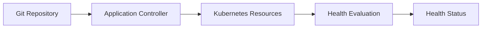

---

## Key Components

| Component | Purpose |
|-----------|----------|
| Application Controller | Evaluates application health |
| Kubernetes API | Provides resource status |
| Health Assessment Engine | Determines health state |
| Application | Displays health information |
| UI / CLI | Shows current health |

---

## Types (if applicable)

| Health Status | Meaning |
|---------------|---------|
| Healthy | Application is running correctly |
| Progressing | Deployment is still in progress |
| Degraded | Resource failure detected |
| Missing | Resource is missing |
| Suspended | Resource is intentionally paused *(less common)* |
| Unknown | Health cannot be determined *(less common)* |

---

## Lifecycle / Workflow (if applicable)

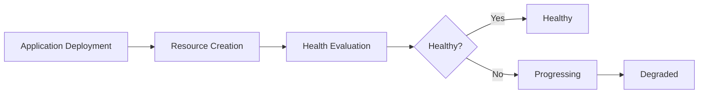

---

## Configuration / Syntax (if applicable)

Health status is automatically calculated by Argo CD.

No manual configuration is required.

---

## Important Commands (if applicable)

```bash
argocd app get <application>

argocd app list

argocd app wait <application>

kubectl get pods

kubectl describe pod
```

---

## Important Files (if applicable)

```
application.yaml

deployment.yaml

service.yaml

statefulset.yaml
```

---

## Real-World Use Cases

- Production monitoring
- Kubernetes deployment validation
- CI/CD verification
- Incident response
- Automated rollback decisions
- Health monitoring dashboards

---

## Advantages

- Continuous health monitoring
- Early failure detection
- Easy troubleshooting
- Supports automated GitOps workflows
- Improves deployment reliability

---

## Limitations

- Depends on Kubernetes resource health
- Custom resources may require custom health checks
- Misconfigured probes can produce misleading health status

---

## Common Interview Questions (Concept Only)

- What is Application Health?
- How is Health different from Sync Status?
- Which component calculates Health?
- Can an application be Synced but Degraded?
- Can an application be Healthy but OutOfSync?

---

## Common Mistakes

- Confusing Health Status with Sync Status
- Ignoring degraded applications
- Missing readiness or liveness probes
- Assuming Synced always means Healthy

---

## Troubleshooting

| Problem | Possible Cause | Solution |
|----------|----------------|----------|
| Application Degraded | Pod failures | Inspect Pods and Events |
| Progressing for long time | Deployment not completing | Check rollout status |
| Missing resources | Resources deleted manually | Synchronize application |
| Healthy but OutOfSync | Git changed after deployment | Synchronize application |
| Synced but Degraded | Runtime failure | Troubleshoot Kubernetes resources |

---

## Summary

Application Health reflects the runtime condition of Kubernetes resources managed by Argo CD. It is continuously evaluated and displayed alongside Sync Status to provide complete visibility into application deployments.

> **Interview Tip**
>
> Health = Runtime status
>
> Sync = Configuration status

---

# Healthy

## Overview

Healthy indicates that all managed Kubernetes resources are running as expected.

The application is fully operational.

---

## Why It Is Used

Healthy status confirms:

- Successful deployment
- Running Pods
- Ready containers
- Successful rollout

---

## Architecture / Working

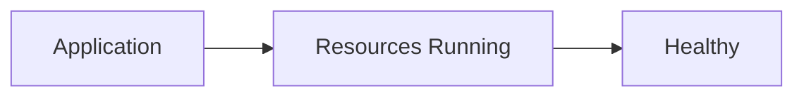

---

## Key Components

| Resource | Expected State |
|----------|----------------|
| Deployment | Available |
| Pod | Running |
| Service | Active |
| StatefulSet | Ready |

---

## Types (if applicable)

None

---

## Lifecycle / Workflow (if applicable)

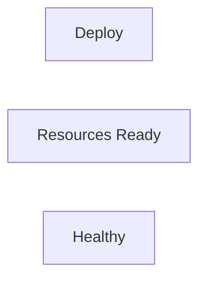

---

## Configuration / Syntax (if applicable)

Automatically calculated.

---

## Important Commands (if applicable)

```bash
argocd app get myapp

kubectl get pods
```

---

## Important Files (if applicable)

Deployment manifests

---

## Real-World Use Cases

- Production deployment verification
- Release validation

---

## Advantages

- Indicates stable deployment

---

## Limitations

- Does not indicate application performance

---

## Common Interview Questions (Concept Only)

- What does Healthy mean?

---

## Common Mistakes

- Assuming Healthy means Synced

---

## Troubleshooting

- Verify resource readiness

---

## Summary

Healthy means the application is running successfully.

---

# Progressing

## Overview

Progressing indicates that Kubernetes resources are still being deployed or updated.

The deployment has not yet completed.

---

## Why It Is Used

Progressing helps identify:

- Rolling updates
- Pod scheduling
- Deployment rollout
- Resource initialization

---

## Architecture / Working

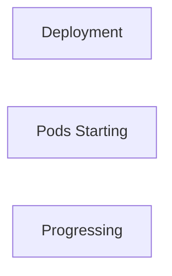

---

## Key Components

| Resource | Activity |
|----------|----------|
| Deployment | Rolling update |
| Pod | Starting |
| Job | Running |

---

## Types (if applicable)

None

---

## Lifecycle / Workflow (if applicable)

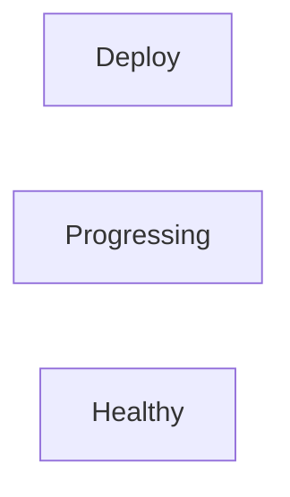

---

## Configuration / Syntax (if applicable)

Automatic

---

## Important Commands (if applicable)

```bash
kubectl rollout status deployment/app
```

---

## Important Files (if applicable)

Deployment YAML

---

## Real-World Use Cases

- Rolling updates
- Blue/Green deployment

---

## Advantages

- Shows deployment progress

---

## Limitations

- Long Progressing state indicates problems

---

## Common Interview Questions (Concept Only)

- What causes Progressing?

---

## Common Mistakes

- Waiting indefinitely without investigating

---

## Troubleshooting

- Check rollout status
- Inspect Pods

---

## Summary

Progressing indicates deployment is still underway.

---

# Degraded

## Overview

Degraded indicates one or more Kubernetes resources have failed or are unhealthy.

The application requires investigation.

---

## Why It Is Used

It helps detect:

- Failed Pods
- CrashLoopBackOff
- Failed Deployments
- Image pull failures

---

## Architecture / Working

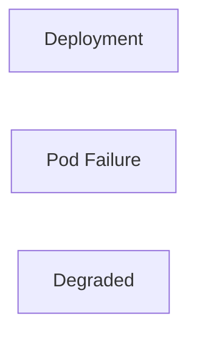

---

## Key Components

| Cause | Example |
|--------|---------|
| Pod failure | CrashLoopBackOff |
| Image error | ImagePullBackOff |
| Deployment failure | Replica unavailable |

---

## Types (if applicable)

Common causes

- CrashLoopBackOff
- ImagePullBackOff
- Failed readiness probes

---

## Lifecycle / Workflow (if applicable)

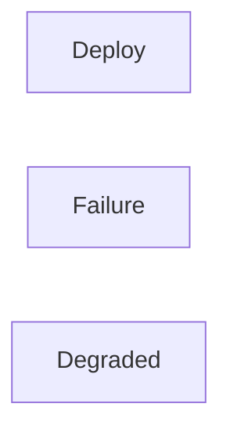

---

## Configuration / Syntax (if applicable)

Automatic

---

## Important Commands (if applicable)

```bash
kubectl describe pod

kubectl logs

argocd app get
```

---

## Important Files (if applicable)

Deployment manifests

---

## Real-World Use Cases

- Production incident response

---

## Advantages

- Immediate failure detection

---

## Limitations

- Requires Kubernetes troubleshooting

---

## Common Interview Questions (Concept Only)

- What causes Degraded status?

---

## Common Mistakes

- Ignoring pod logs

---

## Troubleshooting

- Inspect events
- Verify container image
- Check probes

---

## Summary

Degraded means application resources are unhealthy.

---

# Missing

## Overview

Missing indicates that one or more expected Kubernetes resources do not exist in the cluster.

---

## Why It Is Used

Missing helps detect:

- Deleted resources
- Failed deployments
- Incomplete synchronization

---

## Architecture / Working

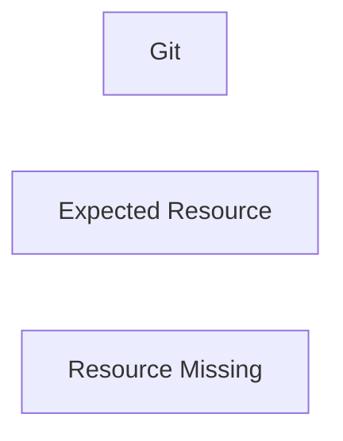

---

## Key Components

| Missing Resource | Example |
|-----------------|---------|
| Deployment | Deleted |
| Service | Missing |
| ConfigMap | Removed |

---

## Types (if applicable)

None

---

## Lifecycle / Workflow (if applicable)

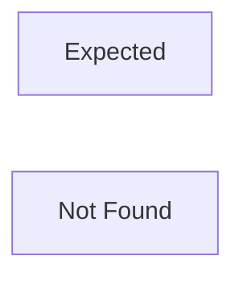

---

## Configuration / Syntax (if applicable)

Automatic

---

## Important Commands (if applicable)

```bash
kubectl get all
```

---

## Important Files (if applicable)

Application manifests

---

## Real-World Use Cases

- Resource recovery

---

## Advantages

- Detects accidental deletions

---

## Limitations

- Requires synchronization

---

## Common Interview Questions (Concept Only)

- What causes Missing status?

---

## Common Mistakes

- Manual deletion of resources

---

## Troubleshooting

- Synchronize application

---

## Summary

Missing means Kubernetes resources expected by Argo CD are absent.

---

# OutOfSync

## Overview

OutOfSync is a **Sync Status**, not a Health Status.

It indicates that the Kubernetes cluster differs from the desired state stored in Git.

> **Interview Tip**
>
> Many interview candidates incorrectly classify OutOfSync as a Health Status. It is actually a **Synchronization Status**.

---

## Why It Is Used

OutOfSync detects:

- Configuration drift
- New Git commits
- Manual cluster modifications
- Deleted resources

---

## Architecture / Working

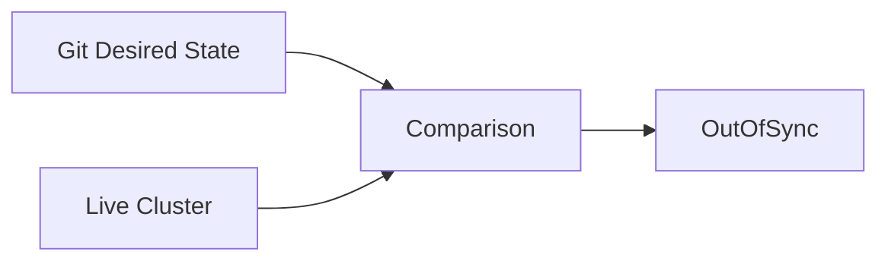

---

## Key Components

| State | Meaning |
|--------|---------|
| Desired | Git |
| Live | Kubernetes |
| Comparison | Detects differences |

---

## Types (if applicable)

None

---

## Lifecycle / Workflow (if applicable)

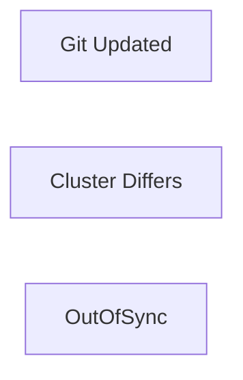

---

## Configuration / Syntax (if applicable)

Automatic

---

## Important Commands (if applicable)

```bash
argocd app diff

argocd app sync
```

---

## Important Files (if applicable)

Application manifests

---

## Real-World Use Cases

- Drift detection
- Continuous Delivery

---

## Advantages

- Detects unauthorized changes

---

## Limitations

- Does not indicate runtime health

---

## Common Interview Questions (Concept Only)

- What is OutOfSync?
- Is OutOfSync a Health Status?

---

## Common Mistakes

- Confusing OutOfSync with Degraded

---

## Troubleshooting

- Run synchronization

---

## Summary

OutOfSync means Git and Kubernetes differ.

---

# Synced

## Overview

Synced is a **Sync Status**, indicating that the live Kubernetes cluster matches the desired configuration stored in Git.

It does **not** guarantee that the application is healthy.

---

## Why It Is Used

Synced confirms:

- Successful synchronization
- No configuration drift
- Git and cluster match

---

## Architecture / Working

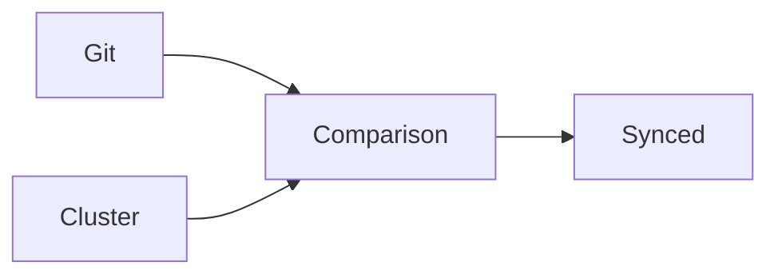

---

## Key Components

| State | Meaning |
|--------|---------|
| Desired | Git |
| Live | Kubernetes |
| Result | Synced |

---

## Types (if applicable)

None

---

## Lifecycle / Workflow (if applicable)

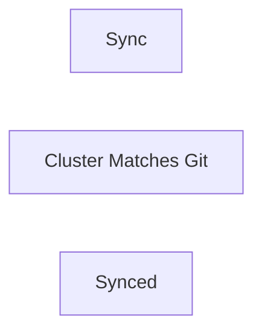

---

## Configuration / Syntax (if applicable)

Automatic

---

## Important Commands (if applicable)

```bash
argocd app get

argocd app diff
```

---

## Important Files (if applicable)

Application manifests

---

## Real-World Use Cases

- Deployment verification
- GitOps monitoring

---

## Advantages

- Confirms configuration consistency

---

## Limitations

- Does not indicate application health

---

## Common Interview Questions (Concept Only)

- Does Synced mean Healthy?
- Can an application be Synced but Degraded?

---

## Common Mistakes

- Assuming Synced guarantees successful application execution

---

## Troubleshooting

- If Synced but Degraded, inspect Kubernetes resources rather than synchronization.

---

## Summary

Synced indicates that the Kubernetes cluster configuration matches Git, but runtime issues may still exist.

> **Interview Tip (Very Important)**
>
> Health Status and Sync Status are independent:
>
> | Health Status | Sync Status | Meaning |
> |--------------|-------------|---------|
> | Healthy | Synced | Ideal state |
> | Healthy | OutOfSync | Application is running, but Git has newer changes or the cluster has drifted |
> | Degraded | Synced | Configuration matches Git, but the application has runtime failures |
> | Progressing | Synced | Deployment is still rolling out |
> | Missing | OutOfSync | Required resources are absent from the cluster |
>
> **One-line Interview Answer:**  
> **Application Health shows whether the application is running correctly, while Sync Status shows whether the live Kubernetes cluster matches the desired state stored in Git.**
