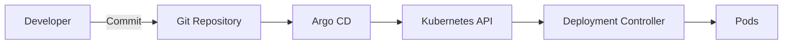
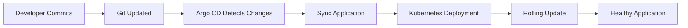
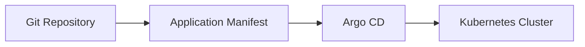
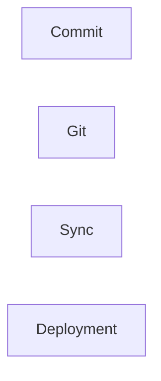
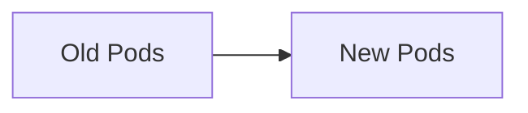
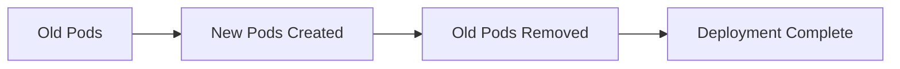
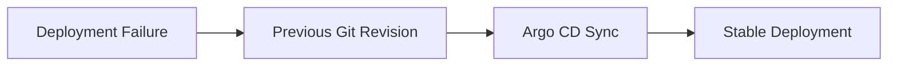
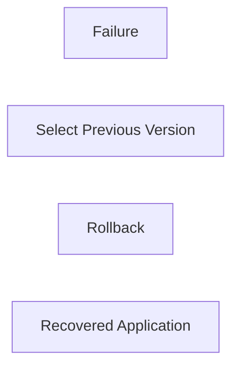
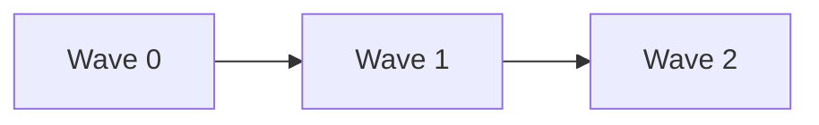
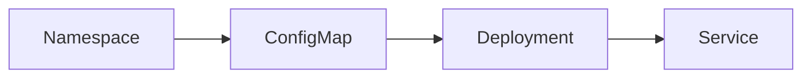

# Deployment Strategies

## Overview

Deployment Strategies in Argo CD define **how applications are deployed, updated, and rolled back** in Kubernetes using GitOps principles.

Unlike traditional CI/CD tools that push changes directly to Kubernetes, Argo CD continuously synchronizes the desired state stored in Git with the Kubernetes cluster.

Argo CD works alongside Kubernetes deployment strategies such as **Rolling Updates** while providing Git-based deployment management.

> **Interview Tip**
>
> Argo CD **does not replace Kubernetes deployment strategies**. Kubernetes performs the actual rollout, while Argo CD manages the desired state and synchronization.

---

## Why It Is Used

Deployment strategies help to:

- Perform safe application deployments
- Minimize downtime
- Automate deployments
- Roll back failed releases
- Maintain version-controlled deployments
- Support GitOps workflows

---

## Architecture / Working



---

## Key Components

| Component | Purpose |
|-----------|----------|
| Git Repository | Stores desired state |
| Argo CD | Synchronizes Git with Kubernetes |
| Kubernetes Deployment | Performs rollout |
| ReplicaSet | Manages pod versions |
| Pods | Run application containers |
| Sync Policy | Controls deployment behavior |

---

## Types (if applicable)

Common deployment approaches used with Argo CD

| Strategy | Description |
|----------|-------------|
| Declarative Deployment | Deploy from Git manifests |
| Rolling Update | Gradually replace Pods |
| Rollback | Restore previous version |
| Sync Waves | Deploy resources in a defined order |

---

## Lifecycle / Workflow (if applicable)



---

## Configuration / Syntax (if applicable)

Application with automatic synchronization

```yaml
spec:
  syncPolicy:
    automated:
      prune: true
      selfHeal: true
```

---

## Important Commands (if applicable)

```bash
argocd app sync

argocd app rollback

argocd app history

argocd app get

kubectl rollout status deployment

kubectl rollout undo deployment
```

---

## Important Files (if applicable)

```
application.yaml

deployment.yaml

service.yaml

kustomization.yaml

Chart.yaml
```

---

## Real-World Use Cases

- Production deployments
- Microservices deployment
- GitOps automation
- Zero-downtime updates
- Multi-environment deployments
- Disaster recovery

---

## Advantages

- Git becomes the source of truth
- Safe deployments
- Easy rollback
- Reduced downtime
- Automated synchronization
- Version-controlled deployments

---

## Limitations

- Invalid Git commits may trigger deployments
- Kubernetes rollout failures still require troubleshooting
- Proper Git workflow is essential

---

## Common Interview Questions (Concept Only)

- What deployment strategies are commonly used with Argo CD?
- Does Argo CD perform rolling updates?
- How does rollback work in Argo CD?
- What are Sync Waves?
- Why is declarative deployment important?

---

## Common Mistakes

- Editing Kubernetes resources manually
- Not testing manifests before committing
- Forgetting rollback procedures
- Deploying directly to Kubernetes instead of Git

---

## Troubleshooting

| Problem | Possible Cause | Solution |
|----------|----------------|----------|
| Deployment failed | Invalid manifest | Validate YAML |
| Pods unavailable | Kubernetes rollout issue | Check Deployment events |
| Rollback unsuccessful | Git version incorrect | Verify previous revision |
| Resources deployed in wrong order | Missing Sync Waves | Configure sync-wave annotations |
| Application stuck in Progressing | Pods not becoming Ready | Check readiness probes |

---

## Summary

Deployment Strategies in Argo CD combine GitOps principles with Kubernetes deployment mechanisms to deliver reliable, automated, and version-controlled application deployments.

> **Interview Tip**
>
> **Git → Argo CD → Kubernetes → Rolling Update → Healthy Application**

---

# Declarative Deployment

## Overview

Declarative Deployment means defining the desired application state in configuration files stored in Git instead of executing imperative deployment commands.

Argo CD continuously compares the desired state with the live Kubernetes cluster and synchronizes differences.

---

## Why It Is Used

Declarative deployments provide:

- Version control
- Repeatable deployments
- GitOps automation
- Easy rollback
- Consistent environments

---

## Architecture / Working



---

## Key Components

| Component | Purpose |
|-----------|----------|
| Git | Source of truth |
| YAML Manifests | Desired state |
| Argo CD | Synchronization |
| Kubernetes | Runtime environment |

---

## Types (if applicable)

Common manifest types

- Kubernetes YAML
- Helm Charts
- Kustomize

---

## Lifecycle / Workflow (if applicable)



---

## Configuration / Syntax (if applicable)

```yaml
apiVersion: apps/v1
kind: Deployment
```

---

## Important Commands (if applicable)

```bash
argocd app sync
```

---

## Important Files (if applicable)

```
deployment.yaml

service.yaml

application.yaml
```

---

## Real-World Use Cases

- GitOps
- Infrastructure as Code
- CI/CD

---

## Advantages

- Reproducible deployments
- Easy auditing
- Version control

---

## Limitations

- Requires proper Git workflow

---

## Common Interview Questions (Concept Only)

- What is Declarative Deployment?
- Why is Git called the source of truth?

---

## Common Mistakes

- Editing live resources manually

---

## Troubleshooting

- Compare Git with cluster state

---

## Summary

Declarative Deployment ensures Kubernetes resources are managed from Git rather than manual commands.

---

# Rolling Updates

## Overview

Rolling Update is the default Kubernetes deployment strategy used by Argo CD when updating Deployments.

Pods are replaced gradually instead of stopping the entire application.

This minimizes downtime during deployments.

> **Interview Tip**
>
> Rolling Updates are performed by **Kubernetes Deployment Controller**, not by Argo CD itself.

---

## Why It Is Used

Rolling Updates provide:

- Zero or minimal downtime
- Safe application upgrades
- Gradual replacement of Pods
- Easy monitoring during deployment

---

## Architecture / Working



---

## Key Components

| Component | Purpose |
|-----------|----------|
| Deployment | Controls rollout |
| ReplicaSet | Manages Pod versions |
| Pods | Old and new application instances |

---

## Types (if applicable)

Default Kubernetes strategy

- RollingUpdate

---

## Lifecycle / Workflow (if applicable)



---

## Configuration / Syntax (if applicable)

```yaml
strategy:
  type: RollingUpdate
```

---

## Important Commands (if applicable)

```bash
kubectl rollout status deployment

kubectl rollout history deployment
```

---

## Important Files (if applicable)

```
deployment.yaml
```

---

## Real-World Use Cases

- Production application upgrades
- API deployments
- Web applications

---

## Advantages

- Minimal downtime
- Safe deployments

---

## Limitations

- Application must support multiple versions temporarily

---

## Common Interview Questions (Concept Only)

- What is Rolling Update?
- Who performs Rolling Updates?

---

## Common Mistakes

- Misconfigured readiness probes

---

## Troubleshooting

- Verify rollout status
- Inspect Deployment events

---

## Summary

Rolling Updates gradually replace old Pods with new Pods to ensure high availability during deployments.

---

# Rollback

## Overview

Rollback restores a previously deployed application version when a deployment fails or introduces issues.

In Argo CD, rollbacks are typically achieved by reverting Git changes or syncing to a previous application revision.

---

## Why It Is Used

Rollback helps to:

- Recover from failed deployments
- Restore stable versions
- Reduce downtime
- Minimize production impact

---

## Architecture / Working



---

## Key Components

| Component | Purpose |
|-----------|----------|
| Git History | Previous versions |
| Application History | Deployment history |
| Sync | Restore previous revision |

---

## Types (if applicable)

Rollback methods

- Git revert
- Previous application revision
- Kubernetes rollout undo

---

## Lifecycle / Workflow (if applicable)



---

## Configuration / Syntax (if applicable)

Rollback using Argo CD

```bash
argocd app rollback myapp <ID>
```

---

## Important Commands (if applicable)

```bash
argocd app history

argocd app rollback

kubectl rollout undo deployment
```

---

## Important Files (if applicable)

Git repository

---

## Real-World Use Cases

- Production failures
- Bad releases
- Emergency recovery

---

## Advantages

- Fast recovery
- Reduced downtime
- Version-controlled rollback

---

## Limitations

- Previous revision must be available
- Database schema changes may require separate rollback procedures

---

## Common Interview Questions (Concept Only)

- How does rollback work in Argo CD?
- What is the safest rollback method?

---

## Common Mistakes

- Rolling back only Kubernetes resources without reverting Git

---

## Troubleshooting

- Verify Git history
- Check application revision history

---

## Summary

Rollback restores a known good application version using Git history or previous deployment revisions.

---

# Sync Waves

## Overview

Sync Waves control the **order** in which Argo CD synchronizes Kubernetes resources.

Resources with lower wave numbers are deployed before resources with higher wave numbers.

This ensures dependencies are created in the correct sequence.

> **Interview Tip**
>
> Sync Waves are one of the most frequently asked intermediate Argo CD interview topics.

---

## Why It Is Used

Sync Waves help to:

- Deploy dependent resources correctly
- Avoid deployment failures
- Control application startup order
- Simplify complex Kubernetes deployments

---

## Architecture / Working



---

## Key Components

| Wave | Example Resources |
|------|--------------------|
| Wave 0 | Namespace, CRDs |
| Wave 1 | ConfigMaps, Secrets |
| Wave 2 | Deployments |
| Wave 3 | Services, Ingress |

---

## Types (if applicable)

Common synchronization order

1. Namespace
2. CRDs
3. ConfigMaps
4. Secrets
5. Deployments
6. Services
7. Ingress

---

## Lifecycle / Workflow (if applicable)



---

## Configuration / Syntax (if applicable)

Example annotation

```yaml
metadata:
  annotations:
    argocd.argoproj.io/sync-wave: "1"
```

Another resource

```yaml
metadata:
  annotations:
    argocd.argoproj.io/sync-wave: "2"
```

---

## Important Commands (if applicable)

```bash
argocd app sync

argocd app get
```

---

## Important Files (if applicable)

```
deployment.yaml

service.yaml

configmap.yaml

secret.yaml
```

---

## Real-World Use Cases

- Deploy CRDs before Custom Resources
- Deploy ConfigMaps before Deployments
- Create Namespaces before workloads
- Deploy Secrets before Pods

---

## Advantages

- Predictable deployment order
- Reduces dependency failures
- Improves deployment reliability

---

## Limitations

- Requires careful planning
- Incorrect wave numbers can delay deployments

---

## Common Interview Questions (Concept Only)

- What are Sync Waves?
- Why are Sync Waves used?
- How are Sync Waves configured?
- Which resources should typically have the lowest sync wave?

---

## Common Mistakes

- Assigning incorrect wave numbers
- Forgetting to deploy CRDs before Custom Resources
- Ignoring resource dependencies

---

## Troubleshooting

| Problem | Solution |
|----------|----------|
| Deployment fails due to missing ConfigMap | Assign ConfigMap to a lower sync wave |
| Custom Resource creation fails | Deploy CRD in an earlier wave |
| Pods start before Secrets exist | Place Secrets in an earlier sync wave |
| Resources deploy in incorrect order | Review `argocd.argoproj.io/sync-wave` annotations |

---

## Summary

Sync Waves provide fine-grained control over the deployment order of Kubernetes resources. By assigning wave numbers, Argo CD ensures dependent resources are created in the correct sequence, improving deployment reliability.

> **Interview Tip (Very Important)**
>
> Remember the relationship between Argo CD and Kubernetes deployment strategies:
>
> | Feature | Responsibility |
> |---------|----------------|
> | Declarative Deployment | Argo CD (GitOps) |
> | Synchronization | Argo CD |
> | Rolling Update | Kubernetes Deployment Controller |
> | Rollback | Argo CD (Git) / Kubernetes |
> | Sync Waves | Argo CD |
>
> **One-line Interview Answer:**  
> **Argo CD manages declarative GitOps deployments and synchronization, while Kubernetes performs the actual rollout. Features like Sync Waves ensure resources are deployed in the correct order, enabling reliable and automated application delivery.**
