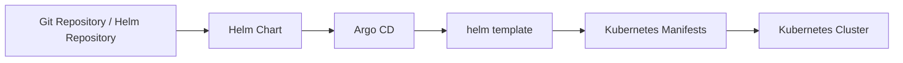
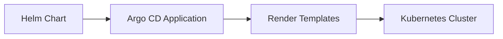
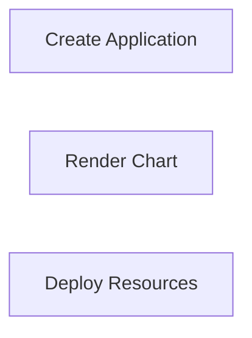
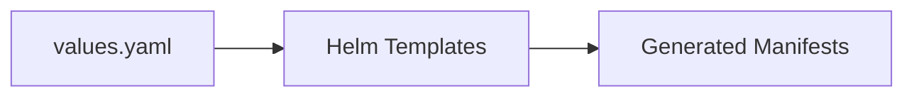
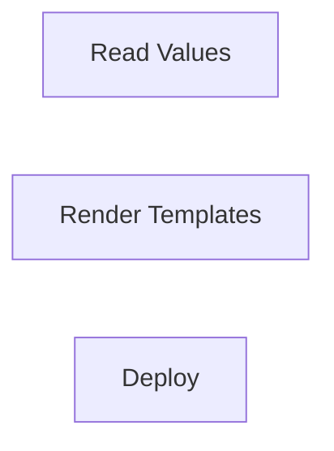
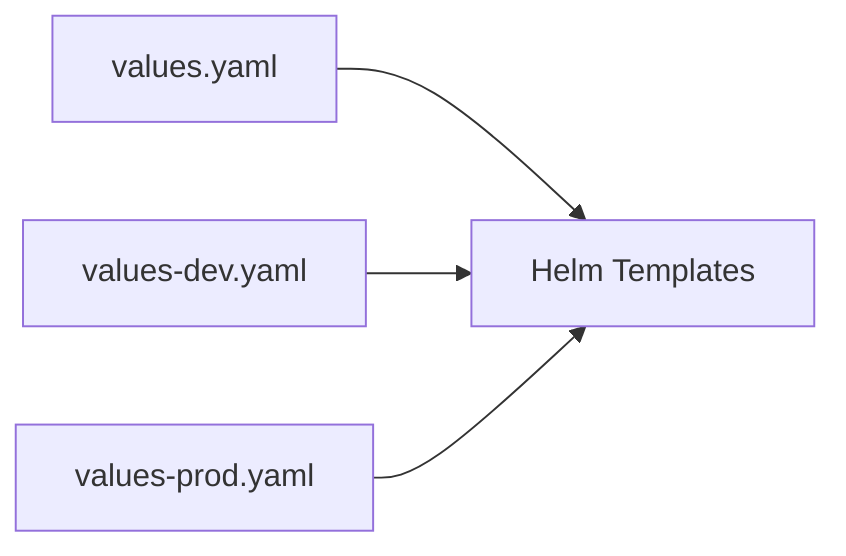
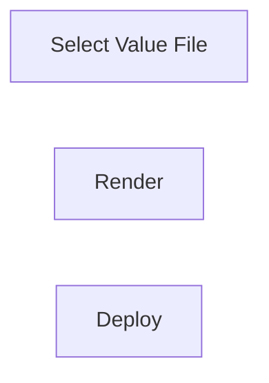
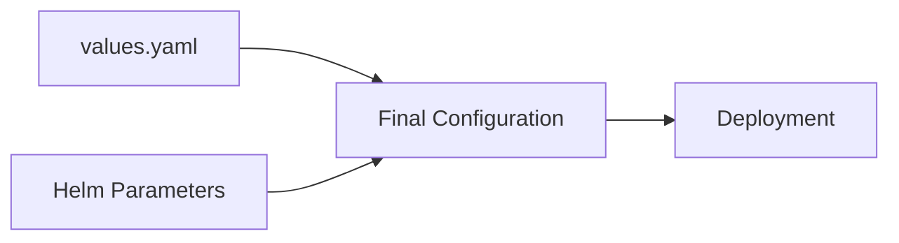
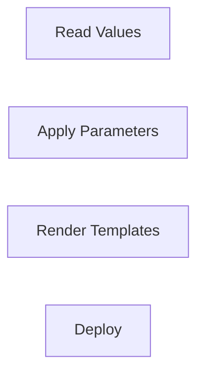

# Helm Integration

## Overview

Argo CD has built-in support for **Helm**, allowing applications to be deployed directly from Helm charts stored in Git repositories or Helm repositories.

Unlike the Helm CLI, **Argo CD does not install Helm releases**. Instead, it uses Helm as a **template engine** to render Kubernetes manifests and then applies those manifests to the cluster.

> **Interview Tip**
>
> A very common interview question is:
>
> **Does Argo CD use `helm install`?**
>
> **Answer:** No. Argo CD runs `helm template` internally to generate Kubernetes YAML and then applies it using Kubernetes APIs.

---

## Why It Is Used

Helm Integration helps to:

- Deploy applications using Helm Charts
- Simplify Kubernetes deployments
- Manage application configuration
- Support environment-specific values
- Version Helm releases using Git
- Integrate Helm into GitOps workflows

---

## Architecture / Working



---

## Key Components

| Component | Purpose |
|-----------|----------|
| Helm Chart | Application package |
| Chart.yaml | Chart metadata |
| values.yaml | Default configuration |
| Value Files | Environment-specific configuration |
| Helm Parameters | Override values |
| Argo CD Application | Deploys the Helm chart |

---

## Types (if applicable)

Common Helm sources

| Source | Description |
|----------|-------------|
| Git Repository | Helm chart stored in Git |
| Helm Repository | Remote Helm repository |
| OCI Registry | Helm chart stored as OCI artifact |

---

## Lifecycle / Workflow (if applicable)


---

## Configuration / Syntax (if applicable)

Example Application

```yaml
spec:
  source:
    repoURL: https://github.com/company/helm-charts
    path: nginx
    targetRevision: main
```

Using Helm

```yaml
spec:
  source:
    helm:
      valueFiles:
        - values.yaml
```

---

## Important Commands (if applicable)

```bash
argocd app create

argocd app sync

argocd app get

argocd app history

helm template

helm lint
```

---

## Important Files (if applicable)

```
Chart.yaml

values.yaml

templates/

application.yaml
```

---

## Real-World Use Cases

- Deploy NGINX
- Deploy Prometheus
- Deploy Grafana
- Deploy Argo CD itself
- Environment-specific Kubernetes deployments

---

## Advantages

- Reusable application packaging
- Easy configuration management
- GitOps compatible
- Version-controlled deployments
- Supports multiple environments

---

## Limitations

- Helm template errors prevent deployment
- Large charts can become complex
- Incorrect values may generate invalid manifests

---

## Common Interview Questions (Concept Only)

- Does Argo CD execute `helm install`?
- How does Argo CD deploy Helm charts?
- What is `values.yaml`?
- What are Value Files?
- What are Helm Parameters?

---

## Common Mistakes

- Assuming Helm manages releases after deployment
- Forgetting to commit updated values files
- Incorrect value overrides
- Using invalid Helm chart paths

---

## Troubleshooting

| Problem | Possible Cause | Solution |
|----------|----------------|----------|
| Chart not found | Wrong repository or path | Verify `repoURL` and `path` |
| Template rendering failed | Invalid Helm templates | Run `helm template` locally |
| Deployment failed | Invalid values | Validate `values.yaml` |
| Application OutOfSync | Git changes not synced | Perform application sync |
| Incorrect configuration | Wrong value overrides | Review value files and parameters |

---

## Summary

Helm Integration enables Argo CD to deploy applications using Helm charts while maintaining GitOps principles. Argo CD renders Helm templates into Kubernetes manifests and applies them to the cluster, without using Helm release management.

> **Interview Tip**
>
> **Argo CD = GitOps Controller**
>
> **Helm = Template Engine**

---

# Deploy Helm Charts

## Overview

Deploying Helm Charts with Argo CD means creating an Application resource that references a Helm chart stored in Git or a Helm repository.

Argo CD automatically renders the chart and deploys the generated Kubernetes resources.

---

## Why It Is Used

Deploy Helm Charts to:

- Simplify Kubernetes deployments
- Reuse existing Helm charts
- Automate deployments
- Support GitOps

---

## Architecture / Working



---

## Key Components

| Component | Purpose |
|-----------|----------|
| Helm Chart | Application package |
| Application | Deployment configuration |
| Kubernetes | Deployment target |

---

## Types (if applicable)

Supported chart sources

- Git Repository
- Helm Repository
- OCI Registry

---

## Lifecycle / Workflow (if applicable)



---

## Configuration / Syntax (if applicable)

```yaml
source:
  chart: nginx
  repoURL: https://charts.bitnami.com/bitnami
  targetRevision: 15.0.0
```

---

## Important Commands (if applicable)

```bash
argocd app create

argocd app sync
```

---

## Important Files (if applicable)

```
application.yaml

Chart.yaml
```

---

## Real-World Use Cases

- Deploy Prometheus
- Deploy Grafana
- Deploy Ingress Controller

---

## Advantages

- Fast deployments
- Reusable charts

---

## Limitations

- Depends on valid Helm charts

---

## Common Interview Questions (Concept Only)

- How do you deploy a Helm chart using Argo CD?
- Can Argo CD deploy charts directly from Helm repositories?

---

## Common Mistakes

- Incorrect repository URL

---

## Troubleshooting

- Verify chart version
- Check chart path

---

## Summary

Argo CD can deploy Helm charts from Git repositories, Helm repositories, and OCI registries.

---

# Helm Values

## Overview

Helm Values are configuration settings used to customize a Helm chart without modifying its templates.

The default configuration is stored in `values.yaml`.

---

## Why It Is Used

Values allow:

- Environment-specific configuration
- Reusable charts
- Simplified deployments

---

## Architecture / Working



---

## Key Components

| Component | Purpose |
|-----------|----------|
| values.yaml | Default values |
| Templates | Use values |
| Manifest | Generated output |

---

## Types (if applicable)

Common values

- Image
- Replica count
- Resources
- Service type
- Ports

---

## Lifecycle / Workflow (if applicable)



---

## Configuration / Syntax (if applicable)

Example

```yaml
replicaCount: 3

image:
  repository: nginx
  tag: latest
```

---

## Important Commands (if applicable)

```bash
helm template
```

---

## Important Files (if applicable)

```
values.yaml
```

---

## Real-World Use Cases

- Different replica counts
- Different images
- Production configuration

---

## Advantages

- Highly customizable
- Reusable

---

## Limitations

- Incorrect values can break deployments

---

## Common Interview Questions (Concept Only)

- What is `values.yaml`?
- Why are Helm Values important?

---

## Common Mistakes

- Editing templates instead of values

---

## Troubleshooting

- Validate values

---

## Summary

Helm Values customize chart behavior without modifying templates.

---

# Value Files

## Overview

Value Files are additional YAML files that override or extend the default `values.yaml`.

They are commonly used to manage different environments such as Development, Testing, and Production.

---

## Why It Is Used

They help:

- Separate environment configurations
- Reduce duplication
- Improve maintainability

---

## Architecture / Working



---

## Key Components

| File | Purpose |
|------|----------|
| values.yaml | Default values |
| values-dev.yaml | Development |
| values-test.yaml | Testing |
| values-prod.yaml | Production |

---

## Types (if applicable)

Common files

- values-dev.yaml
- values-stage.yaml
- values-prod.yaml

---

## Lifecycle /Workflow (if applicable)



---

## Configuration / Syntax (if applicable)

```yaml
helm:
  valueFiles:
    - values-prod.yaml
```

---

## Important Commands (if applicable)

```bash
helm template -f values-prod.yaml
```

---

## Important Files (if applicable)

```
values-dev.yaml

values-stage.yaml

values-prod.yaml
```

---

## Real-World Use Cases

- Multi-environment deployments
- Customer-specific deployments

---

## Advantages

- Easy configuration management

---

## Limitations

- Too many value files become difficult to manage

---

## Common Interview Questions (Concept Only)

- Why use multiple value files?
- Which value has higher priority?

---

## Common Mistakes

- Wrong file ordering

---

## Troubleshooting

- Verify selected value file

---

## Summary

Value Files make Helm deployments flexible and environment-specific.

---

# Helm Parameters

## Overview

Helm Parameters are command-line or Argo CD configuration overrides that replace values defined in `values.yaml` or additional value files.

They provide a quick way to customize deployments without modifying YAML files.

---

## Why It Is Used

Helm Parameters are useful for:

- Temporary configuration changes
- CI/CD pipelines
- Runtime overrides
- Environment-specific deployments

---

## Architecture / Working



---

## Key Components

| Component | Purpose |
|-----------|----------|
| Parameter Name | Configuration key |
| Parameter Value | Override value |
| Argo CD | Applies override |

---

## Types (if applicable)

Common parameters

- Image tag
- Replica count
- Service type
- Resource limits

---

## Lifecycle / Workflow (if applicable)



---

## Configuration / Syntax (if applicable)

Example

```yaml
source:
  helm:
    parameters:
      - name: image.tag
        value: "1.28"
```

---

## Important Commands (if applicable)

```bash
helm template --set image.tag=1.28
```

---

## Important Files (if applicable)

```
application.yaml
```

---

## Real-World Use Cases

- Deploy new application versions
- Change replica count
- Update service type
- Override environment values

---

## Advantages

- Quick overrides
- CI/CD friendly
- No file modifications required

---

## Limitations

- Excessive parameter usage reduces readability
- Complex configurations are better managed with value files

---

## Common Interview Questions (Concept Only)

- What are Helm Parameters?
- Which has higher priority: Values or Parameters?
- When should you use Parameters instead of Value Files?

---

## Common Mistakes

- Overusing parameters instead of structured value files
- Using incorrect parameter names
- Forgetting parameter precedence

---

## Troubleshooting

| Problem | Solution |
|----------|----------|
| Parameter not applied | Verify parameter name |
| Incorrect configuration | Check parameter precedence |
| Deployment failed | Validate parameter values |
| Unexpected output | Compare rendered manifests using `helm template` |

---

## Summary

Helm Parameters provide runtime overrides for Helm chart values, making deployments flexible and automation-friendly. They take precedence over values defined in `values.yaml` and Value Files, making them ideal for CI/CD pipelines and environment-specific overrides.

> **Interview Tip (Very Important)**
>
> **Order of precedence in Helm (highest to lowest):**
>
> 1. Helm Parameters (`--set` / Argo CD parameters)
> 2. Value Files (`values-prod.yaml`)
> 3. Default `values.yaml`
> 4. Chart defaults
>
> **One-line Interview Answer:**  
> **Argo CD uses Helm as a template engine. It renders Helm charts with `values.yaml`, Value Files, and Helm Parameters to generate Kubernetes manifests, then synchronizes those manifests with the target cluster following GitOps principles.**
