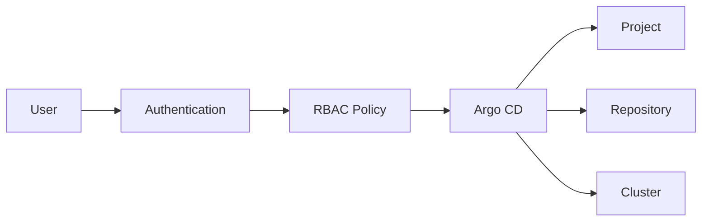
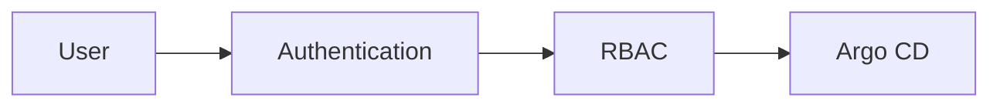
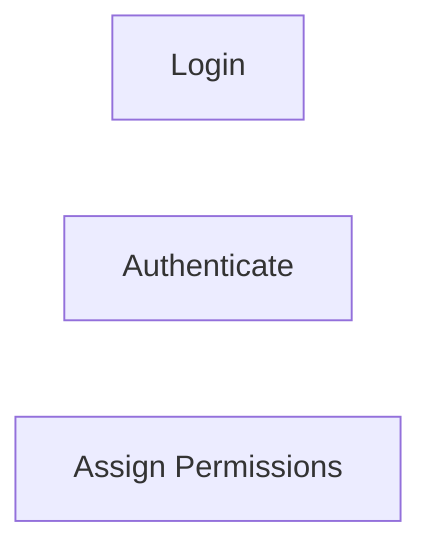
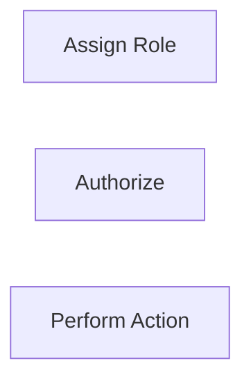
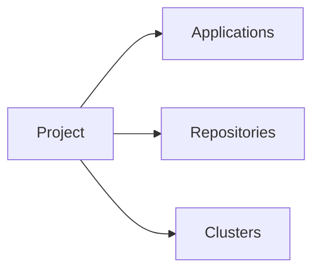
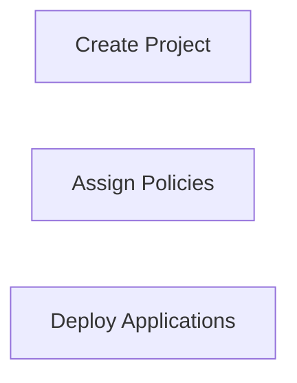
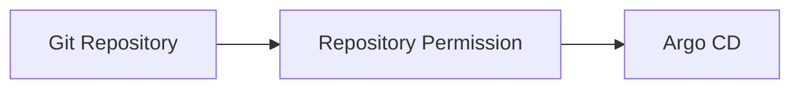
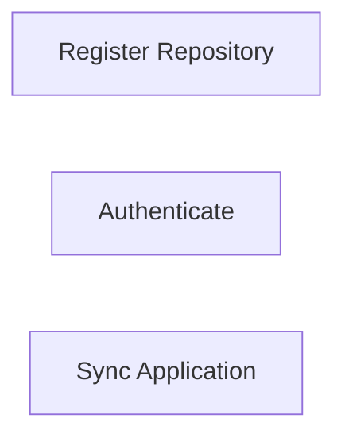
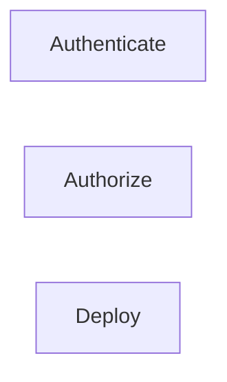

# RBAC & Security

## Overview

Role-Based Access Control (RBAC) in Argo CD controls **who can access Argo CD resources and what actions they can perform**. Combined with Projects, Repository Permissions, and Cluster Permissions, RBAC provides secure, multi-user management of GitOps deployments.

Argo CD supports authentication through local users and external Identity Providers (IdPs) such as LDAP, OAuth, OIDC, GitHub, GitLab, Azure AD, and Okta.

> **Interview Tip**
>
> RBAC is one of the most frequently asked Argo CD interview topics. Be prepared to explain the relationship between **Users, Roles, Projects, Repositories, and Clusters**.

---

## Why It Is Used

RBAC & Security help to:

- Restrict unauthorized access
- Implement least-privilege access
- Protect production environments
- Secure Git repositories
- Control deployment permissions
- Support enterprise authentication

---

## Architecture / Working



---

## Key Components

| Component | Purpose |
|-----------|----------|
| User | Authenticated identity |
| Role | Defines permissions |
| Project | Controls deployment scope |
| Repository | Source code access |
| Cluster | Deployment target |
| RBAC Policy | Authorization rules |

---

## Types (if applicable)

Common authentication methods

| Method | Description |
|--------|-------------|
| Local User | Built-in Argo CD user |
| LDAP | Enterprise directory |
| OIDC | OpenID Connect |
| GitHub OAuth | GitHub authentication |
| Azure AD | Microsoft Entra ID integration |
| SAML | Enterprise SSO |

---

## Lifecycle / Workflow (if applicable)


---

## Configuration / Syntax (if applicable)

Example RBAC policy

```ini
p, role:developer, applications, get, *, allow
p, role:developer, applications, sync, *, allow
g, alice, role:developer
```

---

## Important Commands (if applicable)

```bash
argocd account list

argocd account get-user-info

argocd proj list

argocd cluster list

argocd repo list
```

---

## Important Files (if applicable)

```
argocd-rbac-cm

argocd-cm

argocd-secret

appproject.yaml
```

---

## Real-World Use Cases

- Production access control
- Development team isolation
- Multi-team GitOps
- Enterprise Single Sign-On (SSO)
- Secure multi-cluster deployments

---

## Advantages

- Fine-grained access control
- Centralized authorization
- Supports enterprise identity providers
- Improves security
- Enables multi-team management

---

## Limitations

- Complex policies require careful planning
- Incorrect RBAC rules may block legitimate users
- Requires ongoing permission management

---

## Common Interview Questions (Concept Only)

- What is RBAC in Argo CD?
- How are users authenticated?
- Where are RBAC policies stored?
- What is the relationship between RBAC and Projects?
- How do repository and cluster permissions work?

---

## Common Mistakes

- Granting excessive permissions
- Using the admin account for daily operations
- Ignoring project restrictions
- Forgetting to rotate credentials
- Misconfiguring RBAC policies

---

## Troubleshooting

| Problem | Possible Cause | Solution |
|----------|----------------|----------|
| Permission denied | Missing RBAC policy | Review `argocd-rbac-cm` |
| Cannot access project | Project restriction | Verify project permissions |
| Repository inaccessible | Repository permission issue | Check repository configuration |
| Deployment denied | Cluster permission issue | Verify destination permissions |
| Login failed | Authentication problem | Check IdP configuration |

---

## Summary

RBAC & Security protect Argo CD by controlling who can authenticate, what resources they can access, and where applications can be deployed.

> **Interview Tip**
>
> **Authentication = Who are you?**
>
> **Authorization (RBAC) = What can you do?**

---

# Users

## Overview

A User represents an identity that can authenticate to Argo CD and perform operations based on assigned permissions.

Users can be local or authenticated through external identity providers.

---

## Why It Is Used

Users provide:

- Authentication
- User accountability
- Access control
- Auditability

---

## Architecture / Working



---

## Key Components

| Component | Purpose |
|-----------|----------|
| Username | User identity |
| Authentication | Login validation |
| Assigned Role | Determines permissions |

---

## Types (if applicable)

- Local Users
- LDAP Users
- OIDC Users
- GitHub Users
- Azure AD Users

---

## Lifecycle / Workflow (if applicable)



---

## Configuration / Syntax (if applicable)

Configured through authentication provider and RBAC.

---

## Important Commands (if applicable)

```bash
argocd account list

argocd account get-user-info
```

---

## Important Files (if applicable)

```
argocd-cm

argocd-rbac-cm
```

---

## Real-World Use Cases

- Developer access
- Operations teams
- Platform engineers

---

## Advantages

- Centralized identity
- Supports SSO

---

## Limitations

- Requires identity management

---

## Common Interview Questions (Concept Only)

- Which authentication methods are supported?
- Can Argo CD integrate with Azure AD?

---

## Common Mistakes

- Sharing admin accounts

---

## Troubleshooting

- Verify authentication provider
- Check user mapping

---

## Summary

Users authenticate to Argo CD and receive permissions through RBAC roles.

---

# Roles

## Overview

Roles define **what actions a user or group is allowed to perform** within Argo CD.

Roles are assigned using RBAC policies.

---

## Why It Is Used

Roles help to:

- Restrict access
- Implement least privilege
- Separate responsibilities

---

## Architecture / Working


---

## Key Components

| Component | Purpose |
|-----------|----------|
| Role | Permission set |
| Policy | Access rules |
| Group Mapping | Assigns users to roles |

---

## Types (if applicable)

Common roles

- Admin
- Developer
- Read-only
- Project Admin

---

## Lifecycle / Workflow (if applicable)



---

## Configuration / Syntax (if applicable)

Example

```ini
p, role:readonly, applications, get, *, allow
```

---

## Important Commands (if applicable)

```bash
argocd account can-i
```

---

## Important Files (if applicable)

```
argocd-rbac-cm
```

---

## Real-World Use Cases

- Read-only dashboards
- Developer deployments
- Production administrators

---

## Advantages

- Fine-grained permissions
- Secure access

---

## Limitations

- Requires policy maintenance

---

## Common Interview Questions (Concept Only)

- What are Roles?
- Where are RBAC roles configured?

---

## Common Mistakes

- Overusing admin roles

---

## Troubleshooting

- Review RBAC policies

---

## Summary

Roles define what authenticated users can do within Argo CD.

---

# Projects

## Overview

Projects (AppProjects) define deployment boundaries by restricting repositories, destinations, resources, and RBAC policies.

Projects complement RBAC by limiting where applications can be deployed.

---

## Why It Is Used

Projects help:

- Separate environments
- Isolate teams
- Improve security
- Enforce deployment policies

---

## Architecture / Working



---

## Key Components

| Component | Purpose |
|-----------|----------|
| Source Repositories | Allowed Git repositories |
| Destinations | Allowed clusters |
| Resources | Allowed Kubernetes resources |
| Roles | Project-specific permissions |

---

## Types (if applicable)

- Development
- Testing
- Production

---

## Lifecycle / Workflow (if applicable)



---

## Configuration / Syntax (if applicable)

```yaml
kind: AppProject
```

---

## Important Commands (if applicable)

```bash
argocd proj create

argocd proj get

argocd proj list
```

---

## Important Files (if applicable)

```
appproject.yaml
```

---

## Real-World Use Cases

- Team isolation
- Production protection

---

## Advantages

- Strong security boundaries
- Centralized policy management

---

## Limitations

- Requires planning

---

## Common Interview Questions (Concept Only)

- What is an AppProject?
- How do Projects improve security?

---

## Common Mistakes

- Using the default project for everything

---

## Troubleshooting

- Verify project restrictions

---

## Summary

Projects define deployment boundaries and enforce application-level security.

---

# Repository Permissions

## Overview

Repository Permissions determine which Git repositories Argo CD can access and which repositories an application is allowed to use.

Only authorized repositories should be registered.

---

## Why It Is Used

Repository permissions help:

- Protect source code
- Prevent unauthorized deployments
- Control Git access

---

## Architecture / Working



---

## Key Components

| Component | Purpose |
|-----------|----------|
| Repository | Source code |
| Credentials | Authentication |
| Project Policy | Repository restrictions |

---

## Types (if applicable)

Supported authentication

- HTTPS
- SSH
- Personal Access Token (PAT)

---

## Lifecycle / Workflow (if applicable)



---

## Configuration / Syntax (if applicable)

Repository registration

```bash
argocd repo add https://github.com/company/repo.git
```

---

## Important Commands (if applicable)

```bash
argocd repo add

argocd repo list

argocd repo rm
```

---

## Important Files (if applicable)

```
repository-secret.yaml
```

---

## Real-World Use Cases

- Private GitHub repositories
- Azure Repos
- GitLab repositories

---

## Advantages

- Secure Git integration
- Controlled repository access

---

## Limitations

- Credential rotation required

---

## Common Interview Questions (Concept Only)

- How are repositories secured?
- Which authentication methods are supported?

---

## Common Mistakes

- Using expired tokens
- Incorrect SSH keys

---

## Troubleshooting

| Problem | Solution |
|----------|----------|
| Authentication failed | Verify credentials |
| Repository unavailable | Check repository URL |
| Sync failed | Verify repository permissions |

---

## Summary

Repository permissions ensure Argo CD accesses only authorized Git repositories.

---

# Cluster Permissions

## Overview

Cluster Permissions determine **which Kubernetes clusters and namespaces** Argo CD is allowed to manage.

Permissions are controlled using Kubernetes RBAC and AppProject destination restrictions.

---

## Why It Is Used

Cluster permissions help to:

- Secure Kubernetes clusters
- Restrict production access
- Prevent unauthorized deployments
- Support multi-cluster environments

---

## Architecture / Working


---

## Key Components

| Component | Purpose |
|-----------|----------|
| Kubernetes RBAC | Cluster authorization |
| Service Account | Authentication |
| Cluster Role | Permissions |
| Destination Rules | Deployment restrictions |

---

## Types (if applicable)

Common permissions

- Read-only
- Namespace administrator
- Cluster administrator

---

## Lifecycle / Workflow (if applicable)



---

## Configuration / Syntax (if applicable)

Cluster registration

```bash
argocd cluster add <context>
```

---

## Important Commands (if applicable)

```bash
argocd cluster list

argocd cluster get

kubectl auth can-i
```

---

## Important Files (if applicable)

```
cluster-secret.yaml

appproject.yaml
```

---

## Real-World Use Cases

- Production cluster protection
- Multi-cluster GitOps
- Namespace isolation

---

## Advantages

- Improved security
- Fine-grained deployment control
- Supports least-privilege access

---

## Limitations

- Incorrect RBAC can block deployments
- Requires Kubernetes RBAC knowledge

---

## Common Interview Questions (Concept Only)

- How does Argo CD authenticate to Kubernetes?
- What controls deployment permissions?
- How are cluster permissions managed?

---

## Common Mistakes

- Granting cluster-admin unnecessarily
- Ignoring namespace restrictions
- Misconfigured service accounts

---

## Troubleshooting

| Problem | Solution |
|----------|----------|
| Deployment denied | Check Kubernetes RBAC |
| Namespace access denied | Verify AppProject destinations |
| Authentication failed | Review cluster credentials |
| Cluster unavailable | Verify cluster registration |

---

## Summary

Cluster Permissions define what Argo CD can do within a Kubernetes cluster by combining Kubernetes RBAC with Argo CD project restrictions, ensuring secure and controlled deployments.

> **Interview Tip (Very Important)**
>
> **Argo CD Security Layers**
>
> | Security Layer | Purpose |
> |---------------|---------|
> | Authentication | Verifies user identity (LDAP, OIDC, GitHub, Azure AD, etc.) |
> | RBAC Roles | Defines allowed actions |
> | AppProjects | Restrict repositories, destinations, and resources |
> | Repository Permissions | Control access to Git repositories |
> | Cluster Permissions | Control deployments to Kubernetes clusters |
>
> **Authentication vs Authorization**
>
> | Authentication | Authorization |
> |---------------|---------------|
> | Who are you? | What can you do? |
> | Login process | Permission checking |
> | LDAP, OIDC, Azure AD | RBAC Policies |
>
> **One-line Interview Answer:**  
> **Argo CD secures GitOps deployments through authentication, RBAC authorization, AppProjects, repository permissions, and Kubernetes cluster permissions, enabling fine-grained and least-privilege access control for users and applications.**
