# Argo CD CLI

## Overview

The **Argo CD CLI (`argocd`)** is the command-line interface used to interact with the Argo CD API Server. It allows administrators and DevOps engineers to manage applications, repositories, clusters, projects, and synchronization directly from the terminal.

The CLI is widely used in:

- Daily DevOps operations
- CI/CD pipelines
- GitOps automation
- Troubleshooting
- Managing Argo CD without the Web UI

> **Interview Tip**
>
> The CLI communicates with the **Argo CD API Server**, not directly with Kubernetes.

---

## Why It Is Used

The Argo CD CLI helps to:

- Manage applications from the terminal
- Automate deployments
- Perform GitOps operations
- Register repositories and clusters
- Synchronize applications
- Troubleshoot deployments
- Integrate with CI/CD pipelines

---

## Architecture / Working

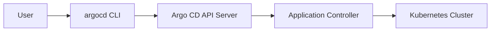

---

## Key Components

| Component | Purpose |
|-----------|----------|
| argocd CLI | Command-line client |
| API Server | Receives CLI requests |
| Application Controller | Performs synchronization |
| Git Repository | Source of truth |
| Kubernetes Cluster | Deployment target |

---

## Types (if applicable)

Common CLI operations

| Category | Commands |
|----------|----------|
| Authentication | login, logout |
| Application | create, get, sync, delete |
| Repository | add, list, remove |
| Cluster | add, list, remove |
| Projects | create, list |
| Account | get-user-info |

---

## Lifecycle / Workflow (if applicable)

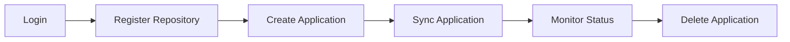

---

## Configuration / Syntax (if applicable)

General syntax

```bash
argocd <resource> <command> [options]
```

Example

```bash
argocd app list
```

---

## Important Commands (if applicable)

```bash
argocd login

argocd app create

argocd app sync

argocd app get

argocd app delete

argocd repo add

argocd repo list

argocd cluster list

argocd proj list
```

---

## Important Files (if applicable)

```
application.yaml

argocd-cm

argocd-rbac-cm
```

---

## Real-World Use Cases

- GitOps automation
- CI/CD deployment pipelines
- Managing production applications
- Repository registration
- Application troubleshooting

---

## Advantages

- Easy automation
- Script-friendly
- Fast operations
- No UI required
- Ideal for CI/CD pipelines

---

## Limitations

- Requires API Server connectivity
- Authentication required
- Some administrative operations require elevated permissions

---

## Common Interview Questions (Concept Only)

- What is the Argo CD CLI?
- Does the CLI communicate with Kubernetes directly?
- Which command synchronizes an application?
- How do you create an application?
- Which command lists registered repositories?

---

## Common Mistakes

- Forgetting to log in before running commands
- Using the wrong server URL
- Incorrect repository path
- Wrong application name
- Running commands with insufficient permissions

---

## Troubleshooting

| Problem | Possible Cause | Solution |
|----------|----------------|----------|
| Login failed | Incorrect server or credentials | Verify API Server URL and credentials |
| Permission denied | RBAC restrictions | Review user permissions |
| Repository not found | Incorrect repository URL | Verify repository registration |
| Application sync failed | Invalid manifests | Validate Git repository |
| Connection refused | API Server unavailable | Verify Argo CD Server status |

---

## Summary

The Argo CD CLI provides a powerful interface for managing GitOps deployments through automation and scripting. It communicates with the Argo CD API Server and is commonly used in CI/CD pipelines and production environments.

> **Interview Tip**
>
> CLI → API Server → Application Controller → Kubernetes Cluster

---

# Login

## Overview

Before using the Argo CD CLI, users must authenticate with the Argo CD API Server.

Successful authentication creates a local session that allows subsequent CLI commands to interact with Argo CD.

---

## Why It Is Used

Login is required to:

- Authenticate users
- Establish CLI session
- Execute management commands
- Access protected resources

---

## Architecture / Working

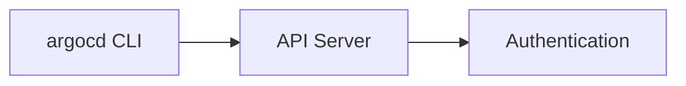

---

## Key Components

| Component | Purpose |
|-----------|----------|
| API Server | Authentication endpoint |
| Username | User identity |
| Password / Token | Credentials |

---

## Types (if applicable)

Authentication methods

- Username & Password
- SSO
- Authentication Token

---

## Lifecycle / Workflow (if applicable)

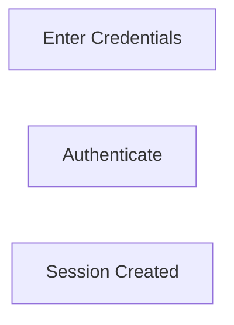

---

## Configuration / Syntax (if applicable)

```bash
argocd login <SERVER>

argocd login argocd.example.com
```

Using insecure mode

```bash
argocd login argocd.example.com --insecure
```

---

## Important Commands (if applicable)

```bash
argocd login

argocd logout

argocd account get-user-info
```

---

## Important Files (if applicable)

CLI configuration

---

## Real-World Use Cases

- Daily administration
- CI/CD authentication

---

## Advantages

- Secure authentication
- Supports SSO

---

## Limitations

- API Server must be reachable

---

## Common Interview Questions (Concept Only)

- How do you log in to Argo CD?
- Which component authenticates CLI users?

---

## Common Mistakes

- Wrong server URL
- Certificate validation issues

---

## Troubleshooting

- Verify API Server
- Check credentials

---

## Summary

Login authenticates the CLI with the Argo CD API Server.

---

# Add Repository

## Overview

Repositories must be registered before Argo CD can deploy applications from them.

Supported repositories include GitHub, GitLab, Azure Repos, Bitbucket, and Helm repositories.

---

## Why It Is Used

Repository registration allows Argo CD to:

- Access application manifests
- Synchronize Git changes
- Deploy applications

---

## Architecture / Working

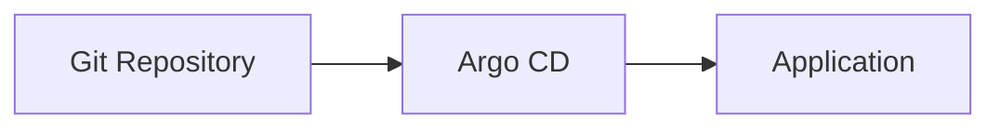

---

## Key Components

| Component | Purpose |
|-----------|----------|
| Repository URL | Git source |
| Credentials | Authentication |
| Repository Secret | Stores credentials |

---

## Types (if applicable)

Authentication

- HTTPS
- SSH
- Personal Access Token

---

## Lifecycle / Workflow (if applicable)

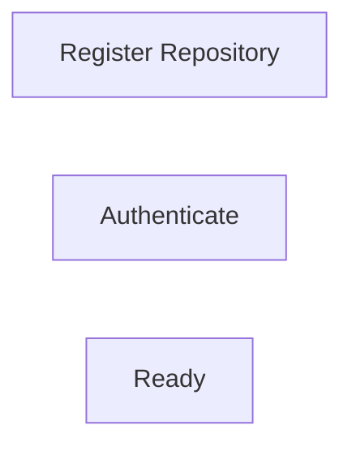

---

## Configuration / Syntax (if applicable)

```bash
argocd repo add https://github.com/company/repo.git
```

SSH

```bash
argocd repo add git@github.com:company/repo.git
```

---

## Important Commands (if applicable)

```bash
argocd repo add

argocd repo list

argocd repo rm
```

---

## Important Files (if applicable)

```
repository-secret.yaml
```

---

## Real-World Use Cases

- GitHub
- Azure Repos
- GitLab

---

## Advantages

- Secure Git integration

---

## Limitations

- Repository credentials required

---

## Common Interview Questions (Concept Only)

- How do you register a repository?
- Which authentication methods are supported?

---

## Common Mistakes

- Incorrect SSH keys
- Wrong repository URL

---

## Troubleshooting

- Verify repository credentials

---

## Summary

Repositories must be registered before applications can be deployed.

---

# Create Application

## Overview

An Application represents a GitOps deployment managed by Argo CD.

Creating an application defines:

- Source repository
- Target cluster
- Namespace
- Synchronization policy

---

## Why It Is Used

Applications allow Argo CD to manage Kubernetes deployments.

---

## Architecture / Working


---

## Key Components

| Component | Purpose |
|-----------|----------|
| Repository | Source |
| Destination | Target cluster |
| Namespace | Deployment location |

---

## Types (if applicable)

Application sources

- Directory
- Helm
- Kustomize

---

## Lifecycle / Workflow (if applicable)

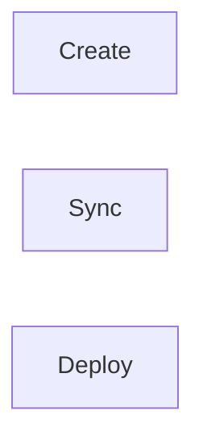

---

## Configuration / Syntax (if applicable)

```bash
argocd app create myapp \
  --repo https://github.com/company/app.git \
  --path manifests \
  --dest-server https://kubernetes.default.svc \
  --dest-namespace production
```

---

## Important Commands (if applicable)

```bash
argocd app create
```

---

## Important Files (if applicable)

```
application.yaml
```

---

## Real-World Use Cases

- Deploy web applications
- Deploy microservices

---

## Advantages

- GitOps deployment
- Version-controlled

---

## Limitations

- Repository must exist

---

## Common Interview Questions (Concept Only)

- Which command creates an application?

---

## Common Mistakes

- Incorrect repository path

---

## Troubleshooting

- Verify application configuration

---

## Summary

Applications define GitOps deployments.

---

# Sync Application

## Overview

Synchronization updates the Kubernetes cluster to match the desired state stored in Git.

---

## Why It Is Used

Sync ensures:

- Git and cluster remain consistent
- Latest changes are deployed
- Drift is corrected

---

## Architecture / Working

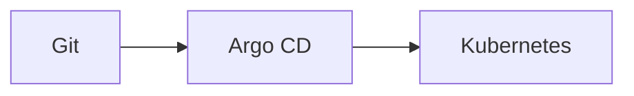

---

## Key Components

| Component | Purpose |
|-----------|----------|
| Desired State | Git |
| Live State | Kubernetes |
| Sync | Reconciliation |

---

## Types (if applicable)

- Manual Sync
- Automatic Sync

---

## Lifecycle / Workflow (if applicable)

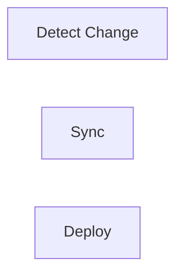

---

## Configuration / Syntax (if applicable)

```bash
argocd app sync myapp
```

---

## Important Commands (if applicable)

```bash
argocd app sync

argocd app wait
```

---

## Important Files (if applicable)

```
application.yaml
```

---

## Real-World Use Cases

- Production deployment
- Drift correction

---

## Advantages

- Automated GitOps

---

## Limitations

- Invalid manifests stop synchronization

---

## Common Interview Questions (Concept Only)

- What does Sync do?
- What is Self-Heal?

---

## Common Mistakes

- Forgetting manual sync

---

## Troubleshooting

- Verify application status

---

## Summary

Sync reconciles Kubernetes with Git.

---

# Get Application

## Overview

The `get` command retrieves detailed information about an application.

It displays:

- Health
- Sync status
- Repository
- Target cluster
- History

---

## Why It Is Used

Used for:

- Monitoring
- Troubleshooting
- Verification

---

## Architecture / Working

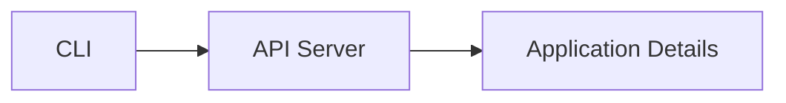

---

## Key Components

| Information | Description |
|------------|-------------|
| Health | Application health |
| Sync | Synchronization status |
| Repository | Source |
| Destination | Cluster |

---

## Types (if applicable)

Information views

- Summary
- Detailed

---

## Lifecycle / Workflow (if applicable)

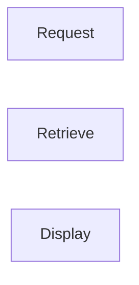

---

## Configuration / Syntax (if applicable)

```bash
argocd app get myapp
```

---

## Important Commands (if applicable)

```bash
argocd app get

argocd app history
```

---

## Important Files (if applicable)

Application resource

---

## Real-World Use Cases

- Verify deployment
- Check sync status

---

## Advantages

- Detailed application information

---

## Limitations

- Read-only operation

---

## Common Interview Questions (Concept Only)

- Which command displays application details?

---

## Common Mistakes

- Incorrect application name

---

## Troubleshooting

- Verify application exists

---

## Summary

The `get` command displays detailed application information.

---

# Delete Application

## Overview

Deleting an application removes it from Argo CD management.

Depending on the deletion options, Kubernetes resources may also be removed.

---

## Why It Is Used

Application deletion is used to:

- Remove obsolete applications
- Clean environments
- Decommission workloads

---

## Architecture / Working

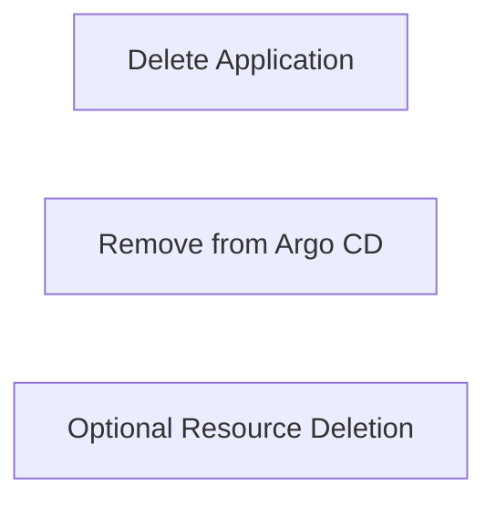

---

## Key Components

| Component | Purpose |
|-----------|----------|
| Application | GitOps resource |
| Finalizer | Controls resource cleanup |
| Kubernetes Resources | Optional deletion |

---

## Types (if applicable)

Deletion methods

- Delete application only
- Cascade delete

---

## Lifecycle / Workflow (if applicable)

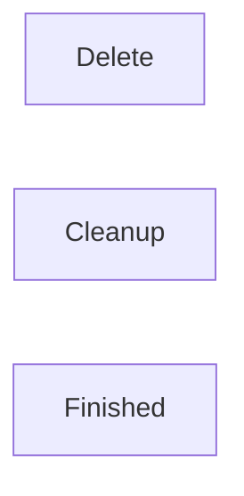

---

## Configuration / Syntax (if applicable)

```bash
argocd app delete myapp
```

Cascade deletion

```bash
argocd app delete myapp --cascade
```

---

## Important Commands (if applicable)

```bash
argocd app delete
```

---

## Important Files (if applicable)

Application resource

---

## Real-World Use Cases

- Remove deprecated applications
- Environment cleanup

---

## Advantages

- Easy cleanup
- Supports cascading deletion

---

## Limitations

- Cascade deletion removes Kubernetes resources

---

## Common Interview Questions (Concept Only)

- What happens when an application is deleted?
- What does `--cascade` do?

---

## Common Mistakes

- Accidentally deleting production applications
- Using cascade unintentionally

---

## Troubleshooting

| Problem | Solution |
|----------|----------|
| Application stuck deleting | Remove finalizer if necessary |
| Resources remain | Verify cascade option |
| Deletion denied | Check RBAC permissions |

---

## Summary

Deleting an application removes it from Argo CD and, if configured, also removes its Kubernetes resources.

> **Interview Tip (Very Important)**
>
> **Common Argo CD CLI Commands**
>
> | Operation | Command |
> |-----------|---------|
> | Login | `argocd login <server>` |
> | Add Repository | `argocd repo add <repo-url>` |
> | List Repositories | `argocd repo list` |
> | Create Application | `argocd app create` |
> | List Applications | `argocd app list` |
> | Get Application | `argocd app get <app>` |
> | Sync Application | `argocd app sync <app>` |
> | View History | `argocd app history <app>` |
> | Delete Application | `argocd app delete <app>` |
> | List Clusters | `argocd cluster list` |
> | List Projects | `argocd proj list` |
>
> **One-line Interview Answer:**  
> **The Argo CD CLI is the primary command-line tool for automating and managing GitOps workflows, allowing users to authenticate, register repositories, create applications, synchronize deployments, monitor application status, and manage Kubernetes deployments through the Argo CD API Server.**
