# Control Flow

## Overview

Control flow determines the order in which Python statements are executed. It enables a program to make decisions, repeat tasks, and control execution based on conditions.

In DevOps, control flow is used extensively for:

- Infrastructure automation
- Deployment scripts
- Log processing
- Server health checks
- Cloud resource management
- CI/CD pipeline automation

> **Interview Tip**
>
> Every automation script uses some form of control flow. Understanding conditions and loops is essential for DevOps interviews.

---

## Why It Is Used

Control flow helps to:

- Execute code based on conditions
- Repeat repetitive tasks
- Skip unnecessary operations
- Exit loops when required
- Handle different execution paths

---

## Architecture / Working

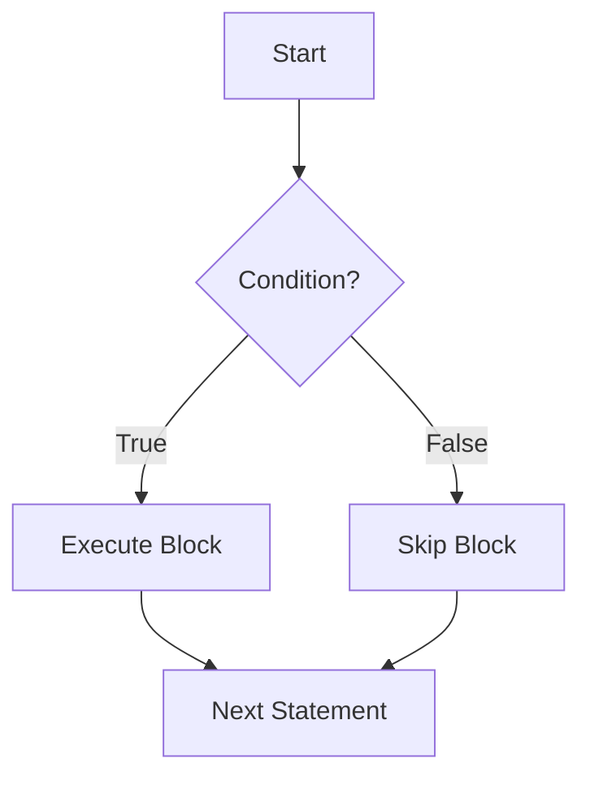

---

## Key Components

| Component | Purpose |
|-----------|----------|
| if | Execute code when condition is True |
| elif | Check additional conditions |
| else | Execute when all conditions are False |
| for | Iterate over a sequence |
| while | Execute while condition remains True |
| break | Exit loop immediately |
| continue | Skip current iteration |
| pass | Placeholder statement |

---

## Types (if applicable)

### Decision Statements

- if
- if-else
- if-elif-else

### Loop Statements

- for loop
- while loop

### Loop Control Statements

- break
- continue
- pass

---

## Lifecycle / Workflow (if applicable)

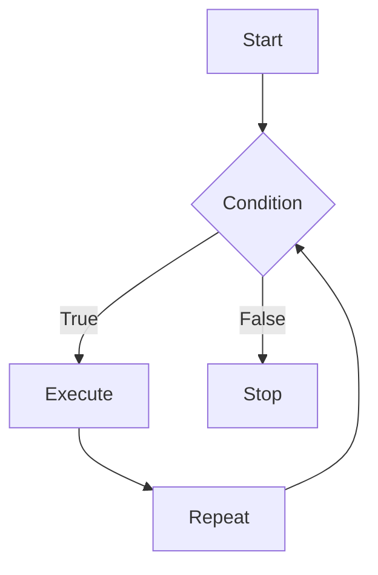

---

## Configuration / Syntax (if applicable)

### if Statement

```python
cpu_usage = 85

if cpu_usage > 80:
    print("High CPU Usage")
```

---

### if-else Statement

```python
server_status = "Running"

if server_status == "Running":
    print("Server is Healthy")
else:
    print("Server is Down")
```

---

### if-elif-else Statement

```python
cpu = 92

if cpu >= 90:
    print("Critical")

elif cpu >= 70:
    print("Warning")

else:
    print("Normal")
```

---

### for Loop

```python
servers = ["web01", "web02", "db01"]

for server in servers:
    print(server)
```

---

### while Loop

```python
count = 1

while count <= 5:
    print(count)
    count += 1
```

---

### break

```python
for i in range(10):

    if i == 5:
        break

    print(i)
```

Output

```
0
1
2
3
4
```

---

### continue

```python
for i in range(5):

    if i == 2:
        continue

    print(i)
```

Output

```
0
1
3
4
```

---

### pass

```python
for server in servers:
    pass
```

Used as a placeholder when code will be added later.

---

## Important Commands (if applicable)

Not Applicable

---

## Important Files (if applicable)

```
automation.py

backup.py

monitor.py

deploy.py
```

---

## Real-World Use Cases

### if

- Check server status
- Verify deployment success
- Validate API response
- Monitor CPU utilization

---

### for Loop

- Restart multiple servers
- Backup files
- Iterate through cloud resources
- Create multiple virtual machines

---

### while Loop

- Poll deployment status
- Wait for server startup
- Monitor application health
- Retry failed API requests

---

### break

- Stop deployment after failure
- Exit monitoring when service becomes available

---

### continue

- Skip unreachable servers
- Ignore empty log entries

---

### pass

- Create function templates
- Placeholder during development

---

## Advantages

- Simple syntax
- Easy automation
- Flexible execution
- Supports complex workflows
- Ideal for scripting

---

## Limitations

- Deep nesting reduces readability
- Infinite loops if conditions never change
- Excessive branching makes debugging difficult

---

## Common Interview Questions (Concept Only)

- What is control flow?
- Difference between if and elif?
- Difference between for and while loops?
- When should you use a for loop?
- When should you use a while loop?
- Difference between break and continue?
- What is pass used for?
- Can else be used without if?
- What happens if a while loop condition never becomes False?
- What is an infinite loop?

---

## Common Mistakes

- Forgetting indentation
- Infinite while loops
- Using break instead of continue
- Incorrect comparison operators
- Forgetting to update loop variables
- Deeply nested if statements
- Using pass when actual logic is required

---

## Troubleshooting

| Problem | Possible Cause | Solution |
|----------|----------------|----------|
| Infinite loop | Condition never changes | Update loop variable |
| Loop executes only once | Incorrect condition | Verify loop condition |
| Unexpected branch execution | Wrong comparison operator | Check conditional logic |
| IndentationError | Incorrect indentation | Use consistent 4-space indentation |
| break not working | Incorrect placement | Ensure it is inside the loop |
| continue skipping too much | Wrong condition | Review continue statement |
| pass does nothing | Expected behavior | Replace with actual implementation |

---

## Summary

Control flow enables Python programs to make decisions and repeat tasks efficiently. The `if`, `elif`, and `else` statements provide conditional execution, while `for` and `while` loops automate repetitive operations. Loop control statements such as `break`, `continue`, and `pass` offer additional control over program execution.

> **Interview Tip**
>
> In DevOps automation:
>
> - Use **if** for decision making.
> - Use **for** to iterate through lists of servers, files, or resources.
> - Use **while** for polling or waiting until a condition is met.
> - Use **break** to stop execution on failures.
> - Use **continue** to skip invalid items.
> - Use **pass** as a placeholder during development.

---

# if, elif, else

## Overview

Conditional statements allow a program to execute different blocks of code based on one or more conditions.

---

## Why It Is Used

- Validate server health
- Check deployment status
- Handle API responses
- Make automation decisions

---

## Architecture / Working

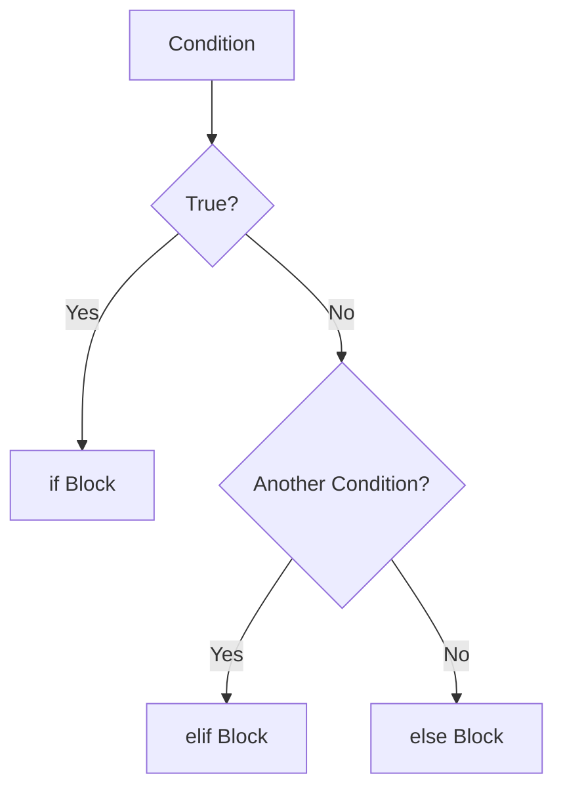

---

## Key Components

| Keyword | Purpose |
|----------|----------|
| if | First condition |
| elif | Additional condition |
| else | Default block |

---

## Types (if applicable)

- if
- if-else
- if-elif-else
- Nested if

---

## Lifecycle / Workflow (if applicable)

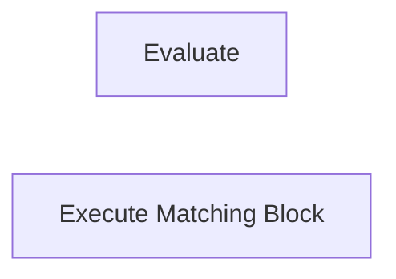

---

## Configuration / Syntax (if applicable)

```python
if cpu > 90:
    print("Critical")
elif cpu > 70:
    print("Warning")
else:
    print("Healthy")
```

---

## Important Commands (if applicable)

Not Applicable

---

## Important Files (if applicable)

Python scripts

---

## Real-World Use Cases

- Server monitoring
- Auto scaling
- Health checks

---

## Advantages

- Flexible decision making

---

## Limitations

- Complex nesting reduces readability

---

## Common Interview Questions (Concept Only)

- Difference between if and elif?
- Can multiple elif blocks exist?

---

## Common Mistakes

- Incorrect indentation
- Missing colon (`:`)

---

## Troubleshooting

- Verify logical conditions

---

## Summary

Conditional statements allow Python scripts to make intelligent decisions.

---

# for Loop

## Overview

A `for` loop iterates over a sequence such as a list, tuple, dictionary, set, or string.

---

## Why It Is Used

Ideal when the number of iterations is known.

---

## Architecture / Working

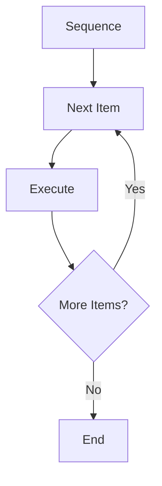

---

## Key Components

- Sequence
- Loop variable
- Loop body

---

## Types (if applicable)

- List iteration
- Dictionary iteration
- String iteration
- Range iteration

---

## Lifecycle / Workflow (if applicable)

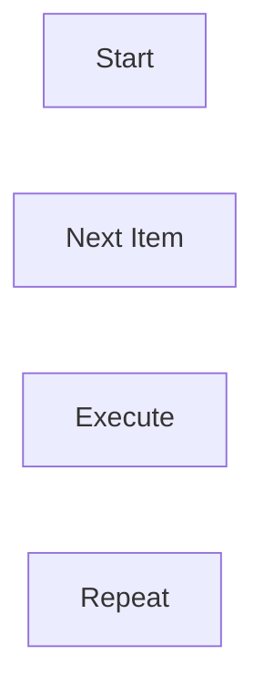

---

## Configuration / Syntax (if applicable)

```python
for server in servers:
    print(server)
```

---

## Important Commands (if applicable)

```python
range()
```

---

## Important Files (if applicable)

Automation scripts

---

## Real-World Use Cases

- Deploy to multiple servers
- Iterate over VMs
- Backup multiple files

---

## Advantages

- Simple iteration
- Readable

---

## Limitations

- Less suitable for unknown iteration counts

---

## Common Interview Questions (Concept Only)

- Difference between range() and list iteration?

---

## Common Mistakes

- Modifying collection during iteration

---

## Troubleshooting

- Verify sequence

---

## Summary

`for` loops are the preferred choice when iterating through collections.

---

# while Loop

## Overview

A `while` loop executes repeatedly as long as its condition remains True.

---

## Why It Is Used

Useful when the number of iterations is unknown.

---

## Architecture / Working

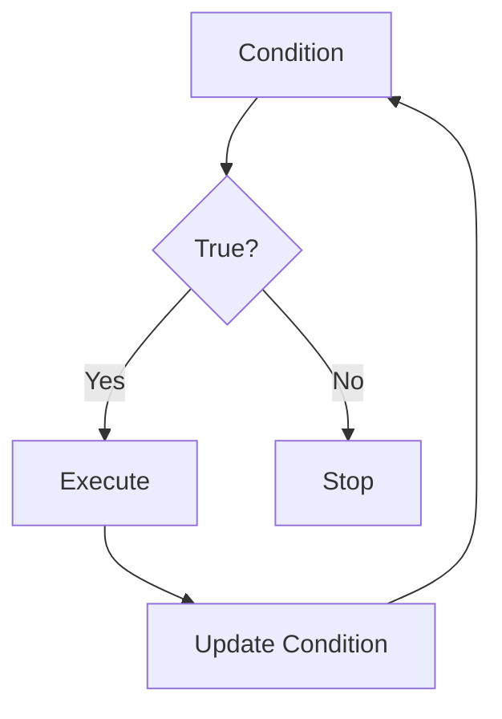

---

## Key Components

- Condition
- Loop body
- Update statement

---

## Types (if applicable)

Standard while loop

---

## Lifecycle / Workflow (if applicable)

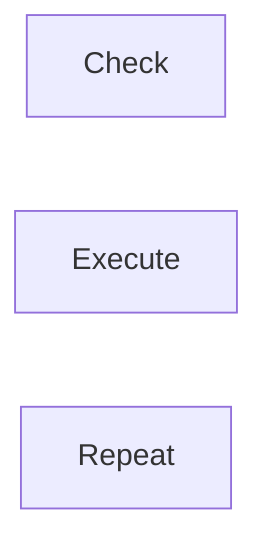

---

## Configuration / Syntax (if applicable)

```python
while retries < 5:
    retries += 1
```

---

## Important Commands (if applicable)

Not Applicable

---

## Important Files (if applicable)

Automation scripts

---

## Real-World Use Cases

- Retry failed deployment
- Poll application health
- Wait for Kubernetes Pod readiness

---

## Advantages

- Flexible

---

## Limitations

- Infinite loops

---

## Common Interview Questions (Concept Only)

- When should while be used?

---

## Common Mistakes

- Forgetting to update loop variable

---

## Troubleshooting

- Verify exit condition

---

## Summary

Use `while` loops when execution depends on a condition rather than a fixed number of iterations.

---

# break

## Overview

`break` immediately exits the nearest loop.

---

## Why It Is Used

Stops unnecessary processing.

---

## Architecture / Working

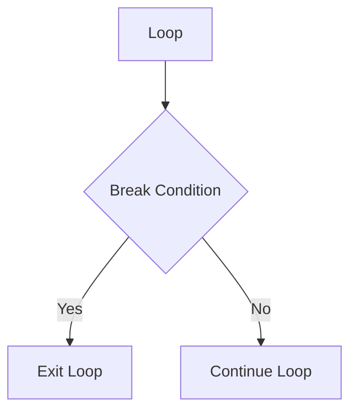

---

## Key Components

- Loop
- Break condition

---

## Types (if applicable)

Not Applicable

---

## Lifecycle /Workflow (if applicable)

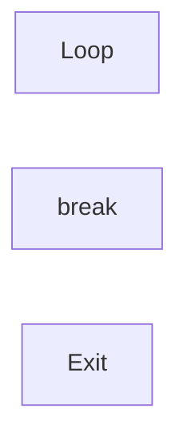

---

## Configuration / Syntax (if applicable)

```python
if error:
    break
```

---

## Important Commands (if applicable)

Not Applicable

---

## Important Files (if applicable)

Python scripts

---

## Real-World Use Cases

- Stop deployment on failure
- Exit monitoring loop

---

## Advantages

- Saves execution time

---

## Limitations

- Can terminate loops unexpectedly

---

## Common Interview Questions (Concept Only)

- What does break do?

---

## Common Mistakes

- Using break outside loops

---

## Troubleshooting

- Ensure break is inside a loop

---

## Summary

`break` exits the current loop immediately.

---

# continue

## Overview

`continue` skips the current iteration and moves to the next iteration.

---

## Why It Is Used

Useful for ignoring unwanted data.

---

## Architecture / Working

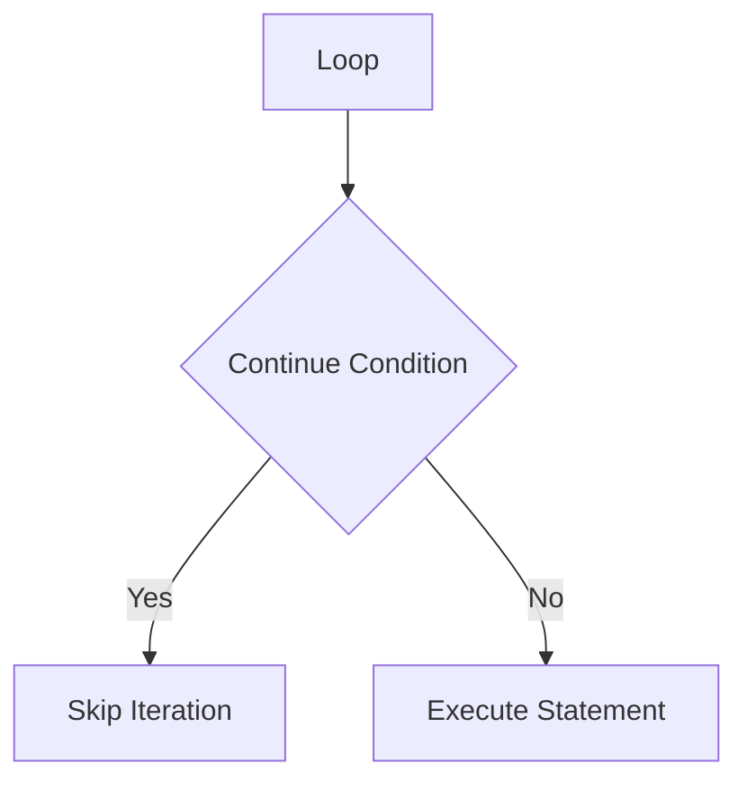

---

## Key Components

- Loop
- Continue condition

---

## Types (if applicable)

Not Applicable

---

## Lifecycle / Workflow (if applicable)

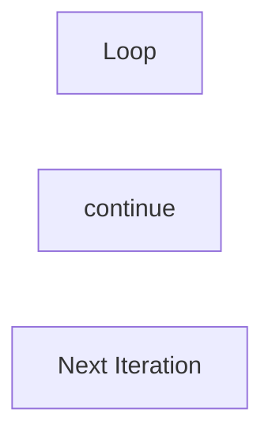

---

## Configuration / Syntax (if applicable)

```python
if server == "offline":
    continue
```

---

## Important Commands (if applicable)

Not Applicable

---

## Important Files (if applicable)

Automation scripts

---

## Real-World Use Cases

- Skip failed servers
- Ignore invalid data

---

## Advantages

- Cleaner loops

---

## Limitations

- Poor placement may skip required logic

---

## Common Interview Questions (Concept Only)

- Difference between break and continue?

---

## Common Mistakes

- Skipping essential statements

---

## Troubleshooting

- Review continue condition

---

## Summary

`continue` skips the current iteration and proceeds with the next loop iteration.

---

# pass

## Overview

`pass` is a null statement that performs no action. It is used as a placeholder where Python expects a statement syntactically.

---

## Why It Is Used

- Placeholder for future code
- Empty loops
- Empty functions
- Empty classes

---

## Architecture / Working

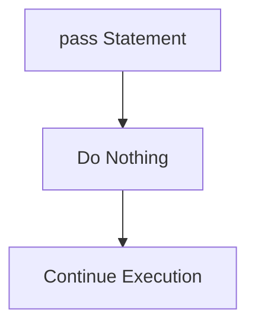

---

## Key Components

- Placeholder
- No operation

---

## Types (if applicable)

Not Applicable

---

## Lifecycle / Workflow (if applicable)

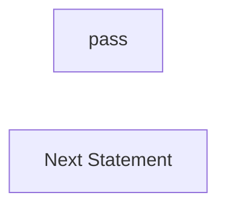

---

## Configuration / Syntax (if applicable)

```python
if maintenance:
    pass
```

---

## Important Commands (if applicable)

Not Applicable

---

## Important Files (if applicable)

Python scripts

---

## Real-World Use Cases

- Code templates
- Feature development
- Empty functions during planning

---

## Advantages

- Prevents syntax errors
- Useful during development

---

## Limitations

- Does not implement functionality

---

## Common Interview Questions (Concept Only)

- Why is pass used?
- Difference between pass and continue?

---

## Common Mistakes

- Forgetting to replace pass with actual logic

---

## Troubleshooting

- Search for leftover pass statements before production deployment

---

## Summary

`pass` is a placeholder statement that allows developers to write syntactically valid code before implementing functionality.

> **Interview Tip (Very Important)**

### Decision Statements

| Statement | Purpose |
|-----------|----------|
| if | Execute when condition is True |
| elif | Check another condition |
| else | Default execution |

### Loop Statements

| Loop | Best Used When |
|------|----------------|
| for | Number of iterations is known |
| while | Number of iterations is unknown |

### Loop Control Statements

| Statement | Function |
|-----------|----------|
| break | Exit the loop completely |
| continue | Skip current iteration |
| pass | Do nothing (placeholder) |

### Frequently Asked Interview Differences

| break | continue |
|---------|----------|
| Exits loop | Skips current iteration |
| Ends execution | Continues with next iteration |

### One-line Interview Answer

**Python control flow uses conditional statements (`if`, `elif`, `else`) for decision-making and looping constructs (`for`, `while`) for repetitive tasks, while `break`, `continue`, and `pass` provide fine-grained control over loop execution, making them essential for DevOps automation scripts.**
