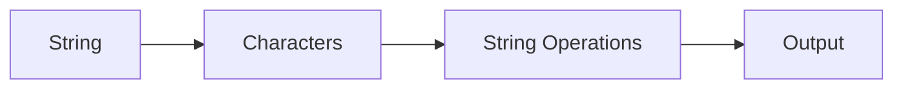
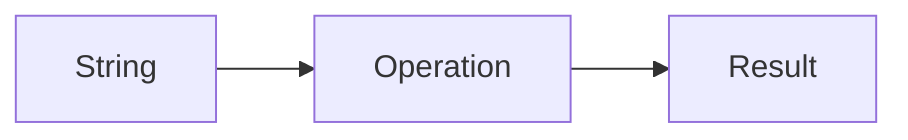
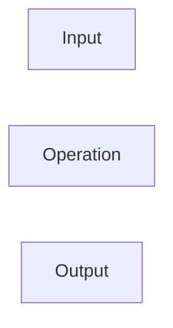
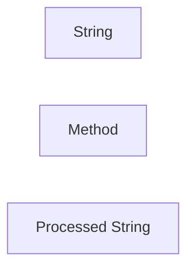
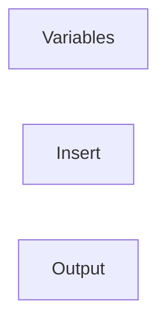
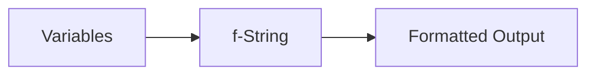
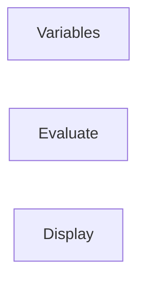

# Strings

## Overview

A string is a sequence of characters enclosed in single quotes (`' '`), double quotes (`" "`), or triple quotes (`''' '''` or `""" """`). Strings are immutable, meaning they cannot be modified after creation.

Strings are one of the most commonly used data types in DevOps automation for:

- File paths
- Server names
- IP addresses
- URLs
- API responses
- JSON/YAML processing
- Log analysis
- Command execution

> **Interview Tip**
>
> Strings are immutable in Python. Most string methods return a **new string** instead of modifying the original.

---

## Why It Is Used

Strings are used to:

- Store textual information
- Build shell commands
- Parse logs
- Read configuration files
- Handle API responses
- Generate dynamic messages
- Format output

---

## Architecture / Working



---

## Key Components

| Component | Purpose |
|-----------|----------|
| Characters | Individual elements |
| Index | Position of character |
| Slice | Extract part of string |
| Methods | Perform string operations |
| Formatting | Create readable output |

---

## Types (if applicable)

Python supports:

- Single-line strings
- Multi-line strings
- Raw strings
- Formatted strings (f-Strings)

---

## Lifecycle / Workflow (if applicable)


---

## Configuration / Syntax (if applicable)

Create strings

```python
name = "Akshay"

server = 'web01'
```

Multiline string

```python
message = """
Deployment Started
Please Wait...
"""
```

Access characters

```python
print(server[0])

print(server[-1])
```

String slicing

```python
print(server[0:3])
```

---

## Important Commands (if applicable)

```python
len()

type()

print()
```

---

## Important Files (if applicable)

```
automation.py

logs.py

config.py

deploy.py
```

---

## Real-World Use Cases

- Log parsing
- URL creation
- Building shell commands
- API requests
- Kubernetes resource names
- Cloud resource naming

---

## Advantages

- Easy to use
- Powerful built-in methods
- Unicode support
- Immutable and safe

---

## Limitations

- Cannot modify individual characters
- Large concatenations may impact performance

---

## Common Interview Questions (Concept Only)

- What is a string?
- Are strings mutable?
- Difference between indexing and slicing?
- Difference between `+` and `join()`?
- Why are f-Strings preferred?

---

## Common Mistakes

- Modifying string characters
- Incorrect slicing
- Forgetting escape characters
- Using `+` repeatedly for concatenation

---

## Troubleshooting

| Problem | Possible Cause | Solution |
|----------|----------------|----------|
| IndexError | Invalid index | Check string length |
| TypeError | Mixing string with integer | Convert using `str()` |
| Unexpected output | Incorrect slicing | Verify indexes |
| AttributeError | Invalid method | Check method name |

---

## Summary

Strings are immutable sequences of characters used extensively in DevOps automation for processing text, commands, logs, configuration files, and cloud resources.

> **Interview Tip**
>
> Learn string methods and formatting thoroughly—they are used in almost every Python automation script.

---

# String Operations

## Overview

String operations allow you to manipulate and process text efficiently.

---

## Why It Is Used

Used for:

- Creating filenames
- Building URLs
- Parsing logs
- Command generation

---

## Architecture / Working



---

## Key Components

| Operation | Example |
|-----------|----------|
| Concatenation | `+` |
| Repetition | `*` |
| Membership | `in` |
| Comparison | `==` |
| Slicing | `[start:end]` |

---

## Types (if applicable)

### Concatenation

```python
first = "Dev"

second = "Ops"

print(first + second)
```

---

### Repetition

```python
print("=" * 30)
```

---

### Membership

```python
"web" in "web01"
```

---

### Length

```python
len(server)
```

---

### Indexing

```python
server[0]
```

---

### Slicing

```python
server[1:4]
```

---

## Lifecycle / Workflow (if applicable)



---

## Configuration / Syntax (if applicable)

```python
server = "web01"

print(server[:3])

print(server[-1])
```

---

## Important Commands (if applicable)

```python
len()
```

---

## Important Files (if applicable)

Python scripts

---

## Real-World Use Cases

- Build URLs
- Parse log entries
- Create resource names

---

## Advantages

- Easy manipulation
- Fast execution

---

## Limitations

- Repeated concatenation is inefficient

---

## Common Interview Questions (Concept Only)

- Difference between indexing and slicing?
- What does `in` operator do?

---

## Common Mistakes

- Wrong slice indexes

---

## Troubleshooting

- Verify indexes

---

## Summary

String operations enable text manipulation required in automation scripts.

---

# String Methods

## Overview

String methods are built-in functions used to manipulate strings without changing the original string.

---

## Why It Is Used

Used for:

- Cleaning input
- Formatting logs
- Searching text
- Splitting data

---

## Architecture / Working


---

## Key Components

| Method | Purpose |
|---------|----------|
| lower() | Lowercase |
| upper() | Uppercase |
| title() | Title Case |
| capitalize() | Capitalize |
| strip() | Remove spaces |
| replace() | Replace text |
| split() | Convert to list |
| join() | Join list |
| find() | Search |
| startswith() | Prefix check |
| endswith() | Suffix check |

---

## Types (if applicable)

Convert case

```python
name.upper()

name.lower()
```

Remove spaces

```python
text.strip()
```

Replace

```python
text.replace("old", "new")
```

Split

```python
line.split(",")
```

Join

```python
",".join(items)
```

---

## Lifecycle / Workflow (if applicable)



---

## Configuration / Syntax (if applicable)

```python
server = " WEB01 "

print(server.strip().lower())
```

---

## Important Commands (if applicable)

Not Applicable

---

## Important Files (if applicable)

Python scripts

---

## Real-World Use Cases

- Process logs
- Read configuration files
- API response cleanup

---

## Advantages

- Rich library
- Easy to chain

---

## Limitations

- Returns new string

---

## Common Interview Questions (Concept Only)

- Difference between split() and join()?
- Does replace() modify the original string?

---

## Common Mistakes

- Assuming methods modify original string

---

## Troubleshooting

- Store returned value

---

## Summary

String methods simplify text processing and automation tasks.

---

# String Formatting

## Overview

String formatting combines variables and text to create readable output.

Python supports multiple formatting techniques.

---

## Why It Is Used

Useful for:

- Logs
- Reports
- API URLs
- Command generation

---

## Architecture / Working


---

## Key Components

| Method | Example |
|---------|----------|
| `%` Formatting | Older style |
| `format()` | Modern |
| f-Strings | Recommended |

---

## Types (if applicable)

Using `format()`

```python
server = "web01"

print("Server: {}".format(server))
```

---

Using `%`

```python
print("Server: %s" % server)
```

---

## Lifecycle / Workflow (if applicable)



---

## Configuration / Syntax (if applicable)

```python
print("{} {}".format(name, age))
```

---

## Important Commands (if applicable)

Not Applicable

---

## Important Files (if applicable)

Python scripts

---

## Real-World Use Cases

- Logging
- Reporting
- Monitoring

---

## Advantages

- Flexible

---

## Limitations

- Older formatting styles are less readable

---

## Common Interview Questions (Concept Only)

- Difference between format() and f-Strings?

---

## Common Mistakes

- Incorrect placeholders

---

## Troubleshooting

- Match placeholders with values

---

## Summary

String formatting creates readable and dynamic output.

---

# f-Strings

## Overview

f-Strings (formatted string literals) were introduced in Python 3.6 and provide the fastest, simplest, and most readable way to format strings.

They are the preferred formatting method in modern Python.

> **Interview Tip**
>
> f-Strings are the **recommended** formatting approach for production Python code.

---

## Why It Is Used

Used for:

- Dynamic messages
- Logging
- Reports
- Cloud automation
- Deployment scripts

---

## Architecture / Working



---

## Key Components

| Component | Purpose |
|-----------|----------|
| `f` Prefix | Enables formatting |
| `{}` | Variable placeholder |
| Expressions | Evaluate inside braces |

---

## Types (if applicable)

Simple

```python
server = "web01"

print(f"Server: {server}")
```

Expression

```python
cpu = 80

print(f"CPU Usage: {cpu}%")
```

Calculation

```python
a = 5

b = 10

print(f"Total = {a+b}")
```

---

## Lifecycle / Workflow (if applicable)



---

## Configuration / Syntax (if applicable)

```python
name = "Akshay"

print(f"Welcome {name}")
```

---

## Important Commands (if applicable)

Not Applicable

---

## Important Files (if applicable)

Python scripts

---

## Real-World Use Cases

- Deployment logs
- API URLs
- Monitoring alerts
- CLI messages
- Resource names

---

## Advantages

- Readable
- Fast
- Supports expressions
- Preferred in Python 3

---

## Limitations

- Requires Python 3.6+

---

## Common Interview Questions (Concept Only)

- What are f-Strings?
- Why are f-Strings preferred?
- Can expressions be used inside f-Strings?

---

## Common Mistakes

- Forgetting `f` prefix
- Missing braces

---

## Troubleshooting

- Verify `f` before opening quote

---

## Summary

f-Strings provide the most efficient and readable way to create dynamic strings in Python.

> **Interview Tip (Very Important)**

### Common String Methods

| Method | Purpose |
|---------|----------|
| lower() | Lowercase |
| upper() | Uppercase |
| strip() | Remove spaces |
| replace() | Replace text |
| split() | Split into list |
| join() | Join list into string |
| find() | Search substring |
| startswith() | Prefix check |
| endswith() | Suffix check |

### Frequently Asked Interview Differences

| Concept | Description |
|---------|-------------|
| Indexing | Access a single character |
| Slicing | Extract a substring |
| `split()` | Convert string to list |
| `join()` | Convert list to string |
| `format()` | String formatting method |
| f-String | Preferred modern formatting |

### String Formatting Comparison

| Method | Recommended |
|---------|-------------|
| `%` Formatting | ❌ Legacy |
| `format()` | ✅ Good |
| f-Strings | ✅✅ Best |

### One-line Interview Answer

**Strings are immutable sequences of characters used extensively in DevOps automation for processing logs, configuration files, API responses, and shell commands. Python provides powerful string operations, built-in methods, and modern f-Strings for efficient and readable text manipulation.**
