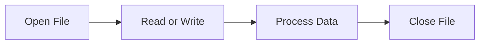
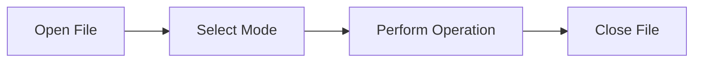
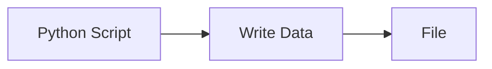

# File Handling

## Overview

File handling is the process of creating, reading, writing, updating, and managing files in Python. It is one of the most important Python concepts for DevOps engineers because automation scripts constantly interact with configuration files, log files, inventory files, backup files, reports, and cloud configuration.

Common file types used in DevOps:

- Text (`.txt`)
- Log (`.log`)
- JSON (`.json`)
- YAML (`.yaml`, `.yml`)
- CSV (`.csv`)
- Configuration (`.conf`, `.ini`)

> **Interview Tip**
>
> Always use the **Context Manager (`with`)** for file operations. It automatically closes the file even if an exception occurs and is considered the production best practice.

---

## Why It Is Used

File handling is used to:

- Read configuration files
- Read server inventories
- Process log files
- Store deployment reports
- Save backup results
- Generate automation outputs
- Read cloud configuration
- Store monitoring data

---

## Architecture / Working



---

## Key Components

| Component | Purpose |
|-----------|----------|
| File | Permanent storage |
| File Object | Performs operations |
| Mode | Defines access type |
| Buffer | Temporary memory during I/O |
| Context Manager | Automatically manages resources |

---

## Types (if applicable)

Python supports several file modes.

| Mode | Description |
|------|-------------|
| `r` | Read |
| `w` | Write (Overwrite) |
| `a` | Append |
| `x` | Create new file |
| `rb` | Read Binary |
| `wb` | Write Binary |
| `r+` | Read and Write |
| `a+` | Read and Append |

---

## Lifecycle / Workflow (if applicable)



---

## Configuration / Syntax (if applicable)

Traditional approach

```python
file = open("servers.txt", "r")

data = file.read()

file.close()
```

Recommended approach

```python
with open("servers.txt", "r") as file:
    data = file.read()
```

---

## Important Commands (if applicable)

```python
open()

close()

read()

readline()

readlines()

write()

writelines()

seek()

tell()

flush()
```

---

## Important Files (if applicable)

```
servers.txt

inventory.txt

config.yaml

settings.json

deployment.log

backup.log
```

---

## Real-World Use Cases

- Read Kubernetes YAML files
- Read Terraform variables
- Process application logs
- Store deployment reports
- Backup configuration files
- Parse monitoring logs
- Read inventory files

---

## Advantages

- Permanent storage
- Supports multiple file types
- Easy automation
- Simple API
- Platform independent

---

## Limitations

- File permission issues
- Large files consume memory
- Requires exception handling
- Slow compared to memory operations

---

## Common Interview Questions (Concept Only)

- What are file modes?
- Difference between `r`, `w`, and `a`?
- Why use `with`?
- Difference between `read()` and `readline()`?
- What happens if a file isn't closed?

---

## Common Mistakes

- Forgetting to close files
- Opening file in wrong mode
- Reading huge files using `read()`
- Accidentally overwriting files
- Ignoring exceptions

---

## Troubleshooting

| Problem | Cause | Solution |
|----------|-------|----------|
| FileNotFoundError | File doesn't exist | Verify path |
| PermissionError | No access | Check permissions |
| UnicodeDecodeError | Wrong encoding | Specify correct encoding |
| IsADirectoryError | Directory specified | Use file path |
| Empty file | Wrong mode | Verify file mode |

---

## Summary

Python file handling enables automation scripts to read, write, and manage files efficiently. It is a core skill for DevOps engineers because almost every automation task involves reading configuration files or generating logs and reports.

> **Interview Tip**
>
> In production code, always prefer `with open()` over `open()` because it guarantees proper resource cleanup.

---

# Read Files

## Overview

Reading files retrieves data stored in a file. It is one of the most common file operations in DevOps automation.

---

## Why It Is Used

Used to:

- Read configuration files
- Read inventory files
- Parse log files
- Process API outputs
- Read YAML/JSON

---

## Architecture / Working


---

## Key Components

| Method | Description |
|---------|-------------|
| `read()` | Reads entire file |
| `readline()` | Reads one line |
| `readlines()` | Reads all lines into a list |

---

## Types (if applicable)

### Read Entire File

```python
with open("servers.txt", "r") as file:
    data = file.read()
```

---

### Read One Line

```python
with open("servers.txt") as file:
    line = file.readline()
```

---

### Read All Lines

```python
with open("servers.txt") as file:
    lines = file.readlines()
```

---

### Read Line by Line (Recommended for Large Files)

```python
with open("servers.txt") as file:
    for line in file:
        print(line.strip())
```

---

## Lifecycle / Workflow (if applicable)


---

## Configuration / Syntax (if applicable)

```python
with open("inventory.txt", "r") as file:
    content = file.read()
```

---

## Important Commands (if applicable)

```python
read()

readline()

readlines()
```

---

## Important Files (if applicable)

```
inventory.txt

servers.txt

deployment.log
```

---

## Real-World Use Cases

- Read server inventory
- Parse log files
- Read YAML manifests
- Read JSON responses

---

## Advantages

- Multiple reading methods
- Simple syntax
- Efficient for automation

---

## Limitations

- `read()` loads the entire file into memory

---

## Common Interview Questions (Concept Only)

- Difference between `read()` and `readline()`?
- When should you use `readlines()`?

---

## Common Mistakes

- Reading large files using `read()`
- Forgetting file encoding

---

## Troubleshooting

- Read files line-by-line for better memory efficiency

---

## Summary

Reading files is essential for configuration management, monitoring, and automation.

---

# Write Files

## Overview

Writing creates a new file or overwrites an existing file.

---

## Why It Is Used

Used to:

- Generate reports
- Store logs
- Create configuration files
- Save automation results

---

## Architecture / Working



---

## Key Components

| Mode | Description |
|------|-------------|
| `w` | Write (Overwrite) |
| `x` | Create new file |

---

## Types (if applicable)

Write

```python
with open("report.txt", "w") as file:
    file.write("Deployment Successful")
```

Multiple lines

```python
with open("report.txt", "w") as file:
    file.writelines([
        "Server1\n",
        "Server2\n"
    ])
```

---

## Lifecycle / Workflow (if applicable)


---

## Configuration / Syntax (if applicable)

```python
with open("output.txt", "w") as file:
    file.write("Hello DevOps")
```

---

## Important Commands (if applicable)

```python
write()

writelines()
```

---

## Important Files (if applicable)

```
report.txt

output.txt

backup.log
```

---

## Real-World Use Cases

- Deployment reports
- Backup reports
- Audit logs
- Configuration generation

---

## Advantages

- Simple
- Fast
- Automatic file creation

---

## Limitations

- Overwrites existing content

---

## Common Interview Questions (Concept Only)

- Difference between `write()` and `writelines()`?
- What happens if the file already exists?

---

## Common Mistakes

- Accidentally overwriting files

---

## Troubleshooting

- Use append mode if existing data should be preserved

---

## Summary

Write mode is used to create new files or completely replace existing file contents.

---

# Append Files

## Overview

Append mode adds new data to the end of an existing file without removing previous content.

---

## Why It Is Used

Used for:

- Logging
- Audit records
- Backup history
- Monitoring reports

---

## Architecture / Working


---

## Key Components

| Mode | Purpose |
|------|----------|
| `a` | Append |
| `a+` | Read and Append |

---

## Types (if applicable)

Append

```python
with open("deployment.log", "a") as file:
    file.write("Deployment Completed\n")
```

---

## Lifecycle / Workflow (if applicable)


---

## Configuration / Syntax (if applicable)

```python
with open("log.txt", "a") as file:
    file.write("Application Started\n")
```

---

## Important Commands (if applicable)

```python
write()

writelines()
```

---

## Important Files (if applicable)

```
deployment.log

application.log

backup.log
```

---

## Real-World Use Cases

- Application logs
- Audit trails
- Monitoring reports
- Backup history

---

## Advantages

- Preserves existing data
- Ideal for logging

---

## Limitations

- Cannot overwrite specific lines

---

## Common Interview Questions (Concept Only)

- Difference between `w` and `a`?

---

## Common Mistakes

- Using write mode instead of append

---

## Troubleshooting

- Verify the file mode before writing

---

## Summary

Append mode is the preferred choice for logging and report generation because it preserves existing data.

---

# Context Manager (`with`)

## Overview

The Context Manager automatically manages resources such as files. It ensures that files are properly closed after use, even if an exception occurs.

This is the recommended approach for all file operations.

> **Interview Tip**
>
> **Always use `with open()` in production code.** It prevents resource leaks and eliminates the need to manually call `close()`.

---

## Why It Is Used

Used to:

- Automatically close files
- Prevent resource leaks
- Handle exceptions safely
- Improve code readability

---

## Architecture / Working

```mermaid
flowchart LR

    A[with open()]
    B[Open File]
    C[Execute Block]
    D[Automatically Close File]

    A --> B
    B --> C
    C --> D
```

---

## Key Components

| Component | Purpose |
|-----------|----------|
| `with` | Context Manager |
| `open()` | Opens file |
| `as` | Assigns file object |

---

## Types (if applicable)

Reading

```python
with open("servers.txt") as file:
    print(file.read())
```

Writing

```python
with open("report.txt", "w") as file:
    file.write("Success")
```

---

## Lifecycle / Workflow (if applicable)


---

## Configuration / Syntax (if applicable)

```python
with open("config.txt", "r") as file:
    data = file.read()
```

---

## Important Commands (if applicable)

```python
with

open()
```

---

## Important Files (if applicable)

All file types

---

## Real-World Use Cases

- Reading configuration files
- Processing logs
- Creating deployment reports
- Automation scripts
- Backup utilities

---

## Advantages

- Automatically closes files
- Cleaner code
- Exception-safe
- Production standard

---

## Limitations

- None for standard file handling

---

## Common Interview Questions (Concept Only)

- What is a Context Manager?
- Why is `with open()` preferred?
- What happens if an exception occurs inside a `with` block?

---

## Common Mistakes

- Using `open()` without closing the file
- Forgetting indentation inside the `with` block

---

## Troubleshooting

- Ensure all file operations are inside the `with` block

---

## Summary

The Context Manager (`with`) is the safest and most recommended way to handle files in Python because it automatically manages file resources and prevents common programming errors.

> **Interview Tip (Very Important)**

### File Modes

| Mode | Purpose |
|------|---------|
| `r` | Read |
| `w` | Write (Overwrite) |
| `a` | Append |
| `x` | Create New File |
| `rb` | Read Binary |
| `wb` | Write Binary |

### File Reading Methods

| Method | Description |
|---------|-------------|
| `read()` | Entire file |
| `readline()` | Single line |
| `readlines()` | List of lines |
| `for line in file` | Best for large files |

### Common DevOps File Types

| File Type | Purpose |
|-----------|---------|
| `.log` | Logs |
| `.json` | API Responses |
| `.yaml` | Kubernetes / Ansible |
| `.txt` | Inventory |
| `.csv` | Reports |

### Frequently Asked Interview Differences

| Concept | Description |
|---------|-------------|
| `w` | Overwrites file |
| `a` | Appends to file |
| `read()` | Entire file |
| `readline()` | One line |
| `with` | Automatically closes file |
| `close()` | Manual file closing |

### One-line Interview Answer

**Python file handling enables DevOps automation scripts to efficiently read, write, append, and manage files. Using the Context Manager (`with`) is the recommended production practice because it automatically closes files, improves code readability, and safely handles exceptions.**
