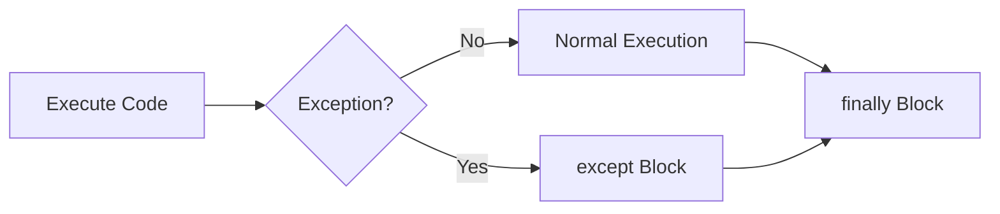
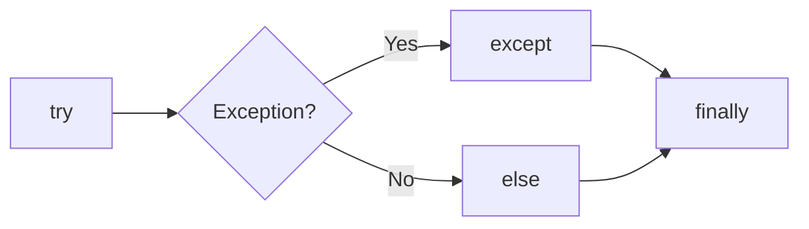
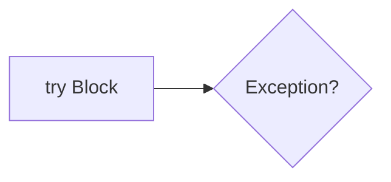
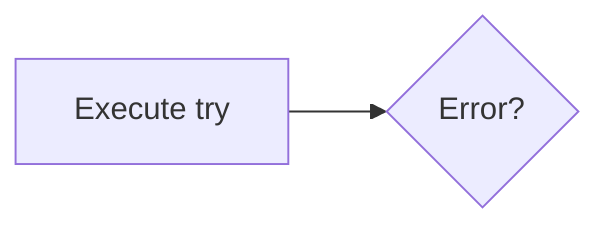
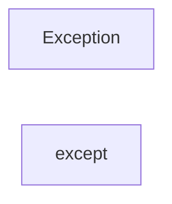
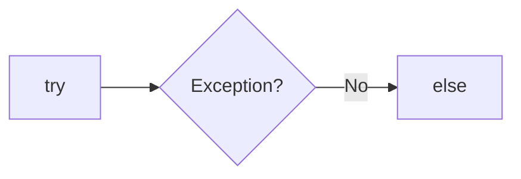
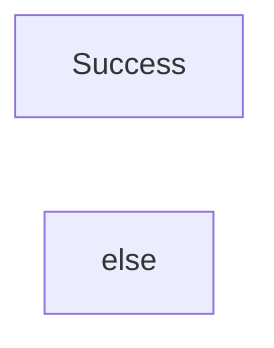
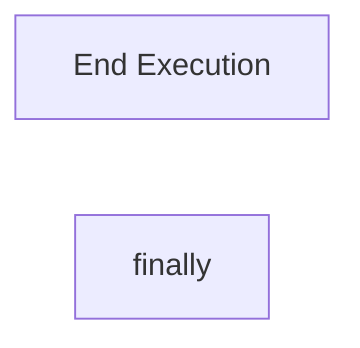
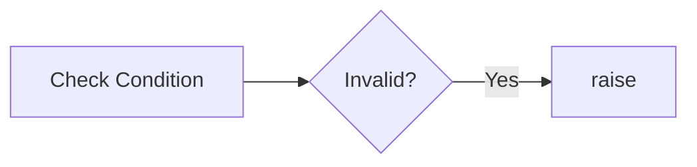

# Exception Handling

## Overview

Exception Handling is the process of detecting and handling runtime errors gracefully without terminating the program unexpectedly.

In DevOps automation, exceptions are common when:

- Reading files
- Connecting to cloud services
- Calling REST APIs
- Executing shell commands
- Connecting to databases
- Managing Kubernetes resources

Instead of crashing, a properly designed script catches the error, logs it, and either retries or exits gracefully.

> **Interview Tip**
>
> Exception handling is essential in production automation scripts. Never assume operations like file access, network requests, or API calls will always succeed.

---

## Why It Is Used

Exception handling helps to:

- Prevent application crashes
- Handle unexpected errors gracefully
- Improve script reliability
- Simplify debugging
- Maintain application flow
- Log meaningful error messages
- Improve production stability

---

## Architecture / Working



---

## Key Components

| Component | Purpose |
|-----------|----------|
| `try` | Contains code that may fail |
| `except` | Handles exceptions |
| `else` | Executes if no exception occurs |
| `finally` | Always executes |
| `raise` | Generates an exception manually |

---

## Types (if applicable)

Common built-in exceptions:

| Exception | Description |
|-----------|-------------|
| FileNotFoundError | File does not exist |
| PermissionError | Permission denied |
| ValueError | Invalid value |
| TypeError | Invalid data type |
| KeyError | Missing dictionary key |
| IndexError | Invalid list index |
| ZeroDivisionError | Divide by zero |
| NameError | Variable not defined |
| ImportError | Import failed |

---

## Lifecycle / Workflow (if applicable)



---

## Configuration / Syntax (if applicable)

Basic structure

```python
try:
    # Risky code
except:
    # Handle error
else:
    # Execute if no error
finally:
    # Always execute
```

---

## Important Commands (if applicable)

Not Applicable

---

## Important Files (if applicable)

```
automation.py

deploy.py

backup.py

logs.py

monitor.py
```

---

## Real-World Use Cases

- Reading configuration files
- Connecting to Azure APIs
- Calling AWS SDK (Boto3)
- Kubernetes automation
- Backup automation
- Network connectivity checks
- Log processing
- Shell command execution

---

## Advantages

- Prevents application crashes
- Improves reliability
- Easier debugging
- Better user experience
- Cleaner code

---

## Limitations

- Poor exception handling can hide real issues
- Catching every exception is not recommended
- Improper use makes debugging difficult

---

## Common Interview Questions (Concept Only)

- What is Exception Handling?
- Why use try-except?
- Difference between except and finally?
- Difference between else and finally?
- When should raise be used?
- What happens if finally contains return?
- Can multiple except blocks be used?

---

## Common Mistakes

- Using bare `except`
- Ignoring exceptions
- Catching overly broad exceptions
- Not logging exceptions
- Using exceptions for normal program flow

---

## Troubleshooting

| Problem | Cause | Solution |
|----------|-------|----------|
| Exception not handled | Wrong except block | Catch correct exception |
| Program still crashes | Exception outside try block | Expand try block appropriately |
| Hidden errors | Generic except | Catch specific exceptions |
| Resources not released | Missing finally | Use finally or `with` |
| Difficult debugging | No logging | Log exception details |

---

## Summary

Exception handling enables Python programs to recover gracefully from runtime errors, making automation scripts more reliable, maintainable, and production-ready.

> **Interview Tip**
>
> Catch **specific exceptions** instead of using a generic `except:` block whenever possible.

---

# try

## Overview

The `try` block contains code that may raise an exception.

Python monitors the code inside the `try` block. If an exception occurs, execution immediately moves to the matching `except` block.

---

## Why It Is Used

Used to:

- Detect runtime errors
- Protect risky operations
- Prevent unexpected crashes

---

## Architecture / Working



---

## Key Components

- Risky code
- Monitored by Python
- First block in exception handling

---

## Types (if applicable)

Single try block

---

## Lifecycle / Workflow (if applicable)



---

## Configuration / Syntax (if applicable)

```python
try:
    number = int(input("Enter number: "))
```

---

## Important Commands (if applicable)

Not Applicable

---

## Important Files (if applicable)

All Python scripts

---

## Real-World Use Cases

- File access
- API requests
- Database connections
- Cloud SDK operations

---

## Advantages

- Prevents unexpected termination

---

## Limitations

- Requires matching exception handling

---

## Common Interview Questions (Concept Only)

- What is the purpose of try?

---

## Common Mistakes

- Placing too much code inside one try block

---

## Troubleshooting

- Keep try blocks small and focused

---

## Summary

The `try` block contains code that Python monitors for exceptions.

---

# except

## Overview

The `except` block executes only when an exception occurs inside the corresponding `try` block.

---

## Why It Is Used

Used to:

- Handle errors
- Display meaningful messages
- Recover from failures

---

## Architecture / Working


---

## Key Components

- Handles exceptions
- Can catch one or multiple exception types

---

## Types (if applicable)

Specific exception

```python
except FileNotFoundError:
```

Multiple exceptions

```python
except (ValueError, TypeError):
```

---

## Lifecycle / Workflow (if applicable)



---

## Configuration / Syntax (if applicable)

```python
try:
    file = open("config.txt")

except FileNotFoundError:
    print("File not found")
```

---

## Important Commands (if applicable)

Not Applicable

---

## Important Files (if applicable)

Python scripts

---

## Real-World Use Cases

- Missing files
- Invalid user input
- API failures
- Network failures

---

## Advantages

- Graceful error handling

---

## Limitations

- Generic except blocks hide issues

---

## Common Interview Questions (Concept Only)

- Why catch specific exceptions?

---

## Common Mistakes

- Using

```python
except:
```

instead of

```python
except ExceptionType:
```

---

## Troubleshooting

- Catch only expected exceptions

---

## Summary

The `except` block handles runtime errors and prevents unexpected program termination.

---

# else

## Overview

The `else` block executes only if **no exception** occurs inside the `try` block.

---

## Why It Is Used

Separates successful execution from error handling.

---

## Architecture / Working



---

## Key Components

- Runs after try
- Executes only on success

---

## Types (if applicable)

Single else block

---

## Lifecycle / Workflow (if applicable)



---

## Configuration / Syntax (if applicable)

```python
try:
    file = open("config.txt")

except FileNotFoundError:
    print("Missing")

else:
    print("Opened Successfully")
```

---

## Important Commands (if applicable)

Not Applicable

---

## Important Files (if applicable)

Python scripts

---

## Real-World Use Cases

- Successful deployment
- Successful API call
- Successful file read

---

## Advantages

- Cleaner code separation

---

## Limitations

- Executes only when no exception occurs

---

## Common Interview Questions (Concept Only)

- When does else execute?

---

## Common Mistakes

- Confusing else with finally

---

## Troubleshooting

- Verify no exception occurred

---

## Summary

The `else` block executes only after successful completion of the `try` block.

---

# finally

## Overview

The `finally` block always executes, whether an exception occurs or not.

It is mainly used for cleanup operations.

---

## Why It Is Used

Used to:

- Close files
- Close database connections
- Release resources
- Stop timers
- Clean temporary files

---

## Architecture / Working


---

## Key Components

- Always executes
- Used for cleanup

---

## Types (if applicable)

Single finally block

---

## Lifecycle / Workflow (if applicable)



---

## Configuration / Syntax (if applicable)

```python
try:
    file = open("config.txt")

finally:
    file.close()
```

---

## Important Commands (if applicable)

Not Applicable

---

## Important Files (if applicable)

Python scripts

---

## Real-World Use Cases

- Close cloud connections
- Cleanup temporary files
- Release resources

---

## Advantages

- Guaranteed execution

---

## Limitations

- Runs even if return statement exists

---

## Common Interview Questions (Concept Only)

- Why use finally?

---

## Common Mistakes

- Forgetting cleanup code

---

## Troubleshooting

- Place cleanup logic inside finally

---

## Summary

The `finally` block guarantees cleanup regardless of program success or failure.

---

# raise

## Overview

The `raise` statement manually generates an exception.

It is used when the programmer wants to signal an error condition.

---

## Why It Is Used

Used to:

- Validate input
- Stop invalid operations
- Create custom validation
- Enforce business rules

---

## Architecture / Working


---

## Key Components

- Exception type
- Error message

---

## Types (if applicable)

Raise built-in exception

```python
raise ValueError("Invalid value")
```

Raise custom message

```python
raise Exception("Deployment Failed")
```

---

## Lifecycle / Workflow (if applicable)



---

## Configuration / Syntax (if applicable)

```python
age = -1

if age < 0:
    raise ValueError("Age cannot be negative")
```

---

## Important Commands (if applicable)

Not Applicable

---

## Important Files (if applicable)

Python scripts

---

## Real-World Use Cases

- Invalid deployment configuration
- Missing credentials
- Invalid cloud region
- Missing environment variables

---

## Advantages

- Explicit validation
- Cleaner error reporting

---

## Limitations

- Incorrect use can terminate the program

---

## Common Interview Questions (Concept Only)

- What is raise?
- When should raise be used?

---

## Common Mistakes

- Raising generic exceptions unnecessarily

---

## Troubleshooting

- Raise meaningful exception types

---

## Summary

The `raise` statement allows developers to intentionally generate exceptions when invalid conditions are detected.

> **Interview Tip (Very Important)**

### Exception Handling Flow

```text
try
   ↓
Exception?
   ↓
Yes → except
No  → else
   ↓
finally (Always Executes)
```

### Common Exceptions

| Exception | Reason |
|-----------|--------|
| FileNotFoundError | Missing file |
| PermissionError | Access denied |
| ValueError | Invalid value |
| TypeError | Wrong data type |
| KeyError | Missing dictionary key |
| IndexError | Invalid list index |
| ZeroDivisionError | Divide by zero |

### Frequently Asked Interview Differences

| Concept | Description |
|---------|-------------|
| `try` | Contains risky code |
| `except` | Handles exceptions |
| `else` | Executes if no exception occurs |
| `finally` | Always executes |
| `raise` | Manually generates an exception |

### Production Best Practices

- Catch specific exceptions instead of using `except:`.
- Keep `try` blocks as small as possible.
- Use `finally` for cleanup operations.
- Log exceptions for easier debugging.
- Use `raise` to enforce validation rules.

### One-line Interview Answer

**Exception handling in Python uses `try`, `except`, `else`, `finally`, and `raise` to detect, handle, recover from, and intentionally generate runtime errors, making DevOps automation scripts reliable, maintainable, and production-ready.**
