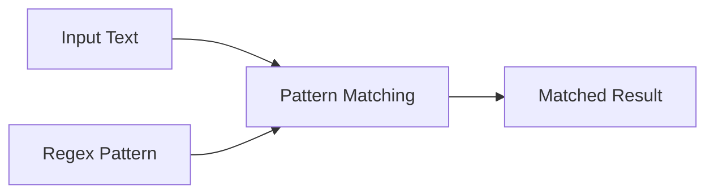
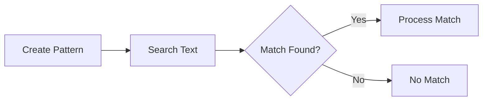
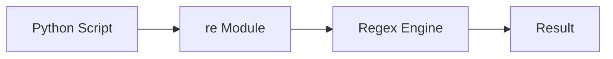
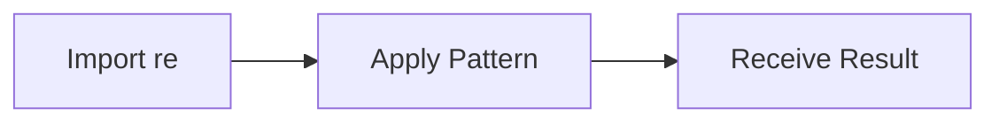
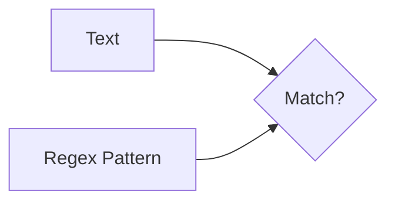
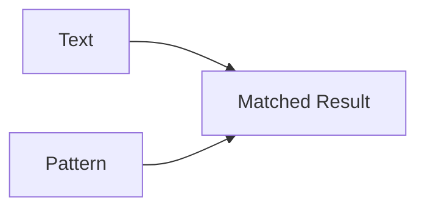
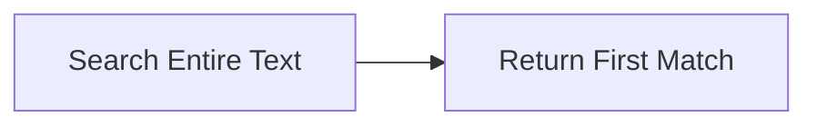
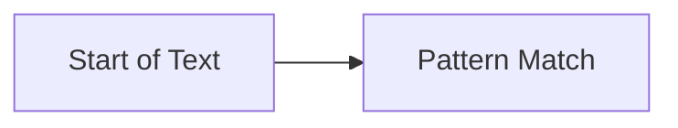
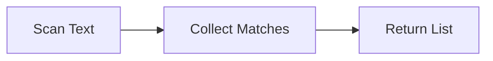
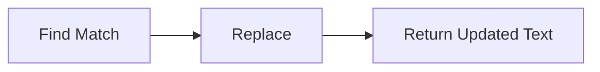

# Regular Expressions

## Overview

Regular Expressions (Regex) are patterns used to search, match, extract, and replace text.

Python provides the built-in **`re`** module to work with regular expressions.

In DevOps, Regular Expressions are commonly used for:

- Parsing log files
- Validating IP addresses
- Extracting URLs
- Finding error messages
- Validating email addresses
- Processing configuration files
- Searching Kubernetes logs
- Analyzing CI/CD outputs

> **Interview Tip**
>
> Regular Expressions are one of the most frequently used text-processing techniques in automation and log analysis.

---

## Why It Is Used

Regular Expressions help to:

- Search text efficiently
- Validate input
- Extract useful information
- Replace text automatically
- Parse logs
- Filter application output
- Process configuration files

---

## Architecture / Working



---

## Key Components

| Component | Description |
|-----------|-------------|
| Pattern | Expression to search |
| Match | Matching text |
| Search | Finds first occurrence |
| Findall | Finds all matches |
| Replace | Replaces matched text |
| Groups | Capture parts of a match |

---

## Types (if applicable)

Python Regex operations include:

- Search
- Match
- Findall
- Replace
- Split
- Compile

---

## Lifecycle / Workflow (if applicable)



---

## Configuration / Syntax (if applicable)

Import module

```python
import re
```

Search

```python
re.search(pattern, text)
```

Find all

```python
re.findall(pattern, text)
```

Replace

```python
re.sub(pattern, replacement, text)
```

---

## Important Commands (if applicable)

```python
re.search()

re.match()

re.findall()

re.sub()

re.split()

re.compile()
```

---

## Important Files (if applicable)

```
logs.txt

access.log

error.log

config.conf

automation.py
```

---

## Real-World Use Cases

- Log analysis
- Server monitoring
- CI/CD log parsing
- Kubernetes log filtering
- IP address extraction
- Email validation
- URL extraction
- Configuration validation

---

## Advantages

- Fast text searching
- Powerful pattern matching
- Supports automation
- Built into Python
- Reduces manual parsing

---

## Limitations

- Complex patterns are difficult to read
- Hard to debug
- Can reduce code readability if overused

---

## Common Interview Questions (Concept Only)

- What are Regular Expressions?
- What is the `re` module?
- Difference between `search()` and `match()`?
- Difference between `search()` and `findall()`?
- What does `re.sub()` do?
- What are capturing groups?
- Why use regex in DevOps?

---

## Common Mistakes

- Forgetting raw strings (`r""`)
- Writing overly complex patterns
- Using `match()` when `search()` is required
- Ignoring special characters
- Not escaping metacharacters

---

## Troubleshooting

| Problem | Cause | Solution |
|----------|-------|----------|
| No match found | Incorrect pattern | Verify regex pattern |
| Unexpected matches | Pattern too broad | Make pattern more specific |
| Syntax error | Missing escape characters | Use raw strings (`r""`) |
| Slow performance | Complex regex | Simplify the pattern |
| Replace not working | Incorrect pattern | Test pattern independently |

---

## Summary

Regular Expressions provide an efficient way to search, validate, extract, and modify text. They are widely used in DevOps automation for log processing, configuration parsing, monitoring, and data validation.

> **Interview Tip**
>
> Always use **raw strings (`r""`)** for regex patterns to avoid issues with escape characters.

---

# re Module

## Overview

The `re` module is Python's built-in library for working with Regular Expressions.

It provides functions for searching, matching, replacing, and splitting text using regex patterns.

---

## Why It Is Used

Used to:

- Search text
- Validate input
- Extract information
- Replace text
- Parse logs

---

## Architecture / Working



---

## Key Components

| Function | Purpose |
|----------|----------|
| `search()` | Search text |
| `match()` | Match beginning |
| `findall()` | Find all matches |
| `sub()` | Replace text |
| `split()` | Split text |
| `compile()` | Compile regex |

---

## Types (if applicable)

Built-in Python module

---

## Lifecycle / Workflow (if applicable)



---

## Configuration / Syntax (if applicable)

```python
import re
```

---

## Important Commands (if applicable)

```python
re.search()

re.match()

re.findall()

re.sub()

re.split()

re.compile()
```

---

## Important Files (if applicable)

Python scripts

---

## Real-World Use Cases

- Log analyzers
- Monitoring tools
- Automation scripts

---

## Advantages

- Powerful
- Flexible
- Built into Python

---

## Limitations

- Learning curve

---

## Common Interview Questions (Concept Only)

- What is the `re` module?

---

## Common Mistakes

- Forgetting to import `re`

---

## Troubleshooting

- Verify module import

---

## Summary

The `re` module provides Python's Regular Expression functionality.

---

# Pattern Matching

## Overview

Pattern Matching is the process of comparing text against a Regular Expression.

Only text that satisfies the pattern is considered a match.

---

## Why It Is Used

Used to:

- Validate text
- Filter logs
- Detect patterns
- Identify errors

---

## Architecture / Working



---

## Key Components

- Pattern
- Text
- Match

---

## Types (if applicable)

- Exact match
- Partial match

---

## Lifecycle / Workflow (if applicable)



---

## Configuration / Syntax (if applicable)

```python
pattern = r"\d+"
```

---

## Important Commands (if applicable)

```python
search()

match()

findall()
```

---

## Important Files (if applicable)

Log files

---

## Real-World Use Cases

- Validate IP addresses
- Extract URLs
- Parse logs

---

## Advantages

- Accurate filtering

---

## Limitations

- Complex expressions become difficult to maintain

---

## Common Interview Questions (Concept Only)

- What is pattern matching?

---

## Common Mistakes

- Using incorrect regex syntax

---

## Troubleshooting

- Test pattern independently

---

## Summary

Pattern matching compares text against predefined Regular Expressions.

---

# Search

## Overview

`re.search()` searches the **entire string** and returns the **first occurrence** of the pattern.

If no match exists, it returns `None`.

---

## Why It Is Used

Used to locate patterns anywhere in a string.

---

## Architecture / Working

```mermaid
flowchart LR

    A[String]
    B[search()]
    C[First Match]

    A --> B
    B --> C
```

---

## Key Components

- Searches entire string
- Returns first match

---

## Types (if applicable)

Single search

---

## Lifecycle / Workflow (if applicable)



---

## Configuration / Syntax (if applicable)

```python
re.search(pattern, text)
```

---

## Important Commands (if applicable)

```python
search()
```

---

## Important Files (if applicable)

Logs

---

## Real-World Use Cases

- Find ERROR entries
- Find IP addresses

---

## Advantages

- Flexible search

---

## Limitations

- Returns only first match

---

## Common Interview Questions (Concept Only)

- How does `search()` work?

---

## Common Mistakes

- Expecting multiple matches

---

## Troubleshooting

- Use `findall()` if multiple matches are required

---

## Summary

`search()` scans the entire string and returns the first matching result.

---

# Match

## Overview

`re.match()` checks only the **beginning** of the string.

If the pattern does not start at position zero, it returns `None`.

---

## Why It Is Used

Used to validate prefixes and string formats.

---

## Architecture / Working

```mermaid
flowchart LR

    A[Beginning of String]
    B[match()]
    C[Matched?]

    A --> B
    B --> C
```

---

## Key Components

- Matches only from the start

---

## Types (if applicable)

Beginning match

---

## Lifecycle / Workflow (if applicable)



---

## Configuration / Syntax (if applicable)

```python
re.match(pattern, text)
```

---

## Important Commands (if applicable)

```python
match()
```

---

## Important Files (if applicable)

Input validation scripts

---

## Real-World Use Cases

- Validate log prefixes
- Validate IDs

---

## Advantages

- Fast

---

## Limitations

- Only checks the start of the string

---

## Common Interview Questions (Concept Only)

- Difference between `match()` and `search()`?

---

## Common Mistakes

- Expecting `match()` to search the whole string

---

## Troubleshooting

- Use `search()` for whole-string searches

---

## Summary

`match()` only checks whether the pattern matches at the beginning of the string.

---

# Findall

## Overview

`re.findall()` returns **all matches** of a pattern as a list.

---

## Why It Is Used

Used to extract every occurrence of a pattern.

---

## Architecture / Working

```mermaid
flowchart LR

    A[Text]
    B[findall()]
    C[List of Matches]

    A --> B
    B --> C
```

---

## Key Components

- Returns list
- Finds all matches

---

## Types (if applicable)

Multiple match extraction

---

## Lifecycle / Workflow (if applicable)



---

## Configuration / Syntax (if applicable)

```python
re.findall(pattern, text)
```

---

## Important Commands (if applicable)

```python
findall()
```

---

## Important Files (if applicable)

Log files

---

## Real-World Use Cases

- Extract IP addresses
- Extract emails
- Extract URLs

---

## Advantages

- Retrieves all matches

---

## Limitations

- Large results may consume memory

---

## Common Interview Questions (Concept Only)

- What does `findall()` return?

---

## Common Mistakes

- Expecting a Match object instead of a list

---

## Troubleshooting

- Verify pattern correctness

---

## Summary

`findall()` returns every matching occurrence in a list.

---

# Replace

## Overview

`re.sub()` replaces matched text with new text.

---

## Why It Is Used

Used to:

- Mask sensitive information
- Clean log files
- Modify configuration data
- Standardize text

---

## Architecture / Working

```mermaid
flowchart LR

    A[Original Text]
    B[sub()]
    C[Modified Text]

    A --> B
    B --> C
```

---

## Key Components

- Pattern
- Replacement
- Original text

---

## Types (if applicable)

Text replacement

---

## Lifecycle / Workflow (if applicable)



---

## Configuration / Syntax (if applicable)

```python
re.sub(pattern, replacement, text)
```

---

## Important Commands (if applicable)

```python
sub()
```

---

## Important Files (if applicable)

Configuration files

Log files

---

## Real-World Use Cases

- Remove passwords
- Mask IP addresses
- Standardize logs

---

## Advantages

- Fast replacement
- Supports regex patterns

---

## Limitations

- Incorrect patterns may replace unintended text

---

## Common Interview Questions (Concept Only)

- What is `re.sub()` used for?

---

## Common Mistakes

- Replacing without testing the regex pattern

---

## Troubleshooting

- Validate the regex before applying replacements

---

## Summary

`re.sub()` replaces matched text efficiently using Regular Expressions.

---

# Interview Quick Revision

## Common Regex Functions

| Function | Purpose |
|----------|----------|
| `search()` | Find first occurrence anywhere |
| `match()` | Match only at the beginning |
| `findall()` | Return all matches |
| `sub()` | Replace text |
| `split()` | Split text using regex |
| `compile()` | Compile pattern for reuse |

---

## search() vs match() vs findall()

| Function | Searches Entire String | Returns |
|----------|------------------------|----------|
| `search()` | Yes | First Match object |
| `match()` | No (start only) | First Match object |
| `findall()` | Yes | List of all matches |

---

## Frequently Used Regex Patterns

| Pattern | Meaning |
|----------|---------|
| `.` | Any character except newline |
| `\d` | Digit (0–9) |
| `\D` | Non-digit |
| `\w` | Letter, digit, underscore |
| `\W` | Non-word character |
| `\s` | Whitespace |
| `\S` | Non-whitespace |
| `^` | Start of string |
| `$` | End of string |
| `*` | Zero or more |
| `+` | One or more |
| `?` | Zero or one |
| `{n}` | Exactly n occurrences |
| `[abc]` | Any one of a, b, or c |
| `[^abc]` | Any character except a, b, or c |

---

## Production Best Practices

- Use raw strings (`r""`) for regex patterns.
- Keep regex patterns simple and readable.
- Test patterns before using them in production.
- Use `findall()` when all matches are required.
- Use `search()` for locating the first occurrence.
- Prefer `sub()` over manual string replacement for pattern-based modifications.

---

## One-line Interview Answer

**Python's `re` module provides powerful Regular Expression capabilities to search, match, extract, and replace text, making it an essential tool for DevOps tasks such as log analysis, configuration validation, automation, and text processing.**
