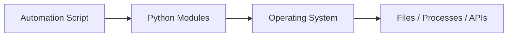
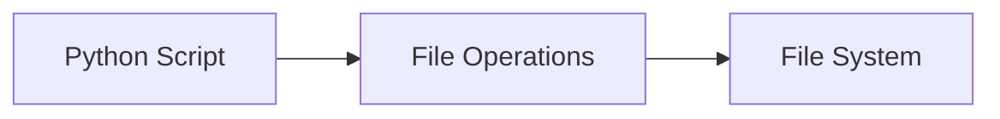
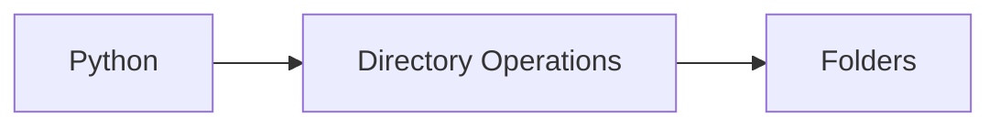
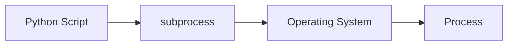
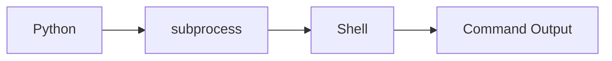
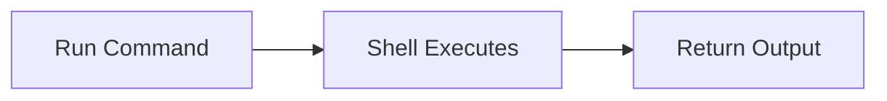
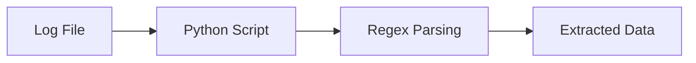

# Automation with Python

## Overview

Automation is one of the primary reasons Python is widely used in DevOps. It helps automate repetitive tasks such as managing files, directories, processes, command execution, deployments, monitoring, and log analysis.

Python's extensive standard library and third-party packages make it an excellent language for building automation scripts.

Common Python modules used:

- `os`
- `pathlib`
- `shutil`
- `subprocess`
- `logging`
- `glob`
- `re`

> **Interview Tip**
>
> Python is considered one of the most important scripting languages for DevOps because it can automate infrastructure, cloud operations, CI/CD pipelines, monitoring, and system administration.

---

## Why It Is Used

Python automation helps to:

- Reduce manual work
- Eliminate human errors
- Save time
- Standardize operations
- Improve deployment consistency
- Automate server administration
- Build reusable scripts
- Integrate multiple DevOps tools

---

## Architecture / Working



---

## Key Components

| Component | Purpose |
|-----------|----------|
| File Automation | Manage files |
| Directory Automation | Manage folders |
| Process Automation | Control running processes |
| Command Execution | Execute system commands |
| Log Parsing | Analyze log files |
| Exception Handling | Handle failures |
| Scheduling | Run tasks automatically |

---

## Types (if applicable)

Common automation categories:

- File automation
- Directory automation
- Process automation
- Server automation
- Cloud automation
- Log automation
- Deployment automation

---

## Lifecycle / Workflow (if applicable)


---

## Configuration / Syntax (if applicable)

Common imports

```python
import os
import shutil
import subprocess
import pathlib
import logging
```

---

## Important Commands (if applicable)

```python
os.listdir()

os.mkdir()

os.remove()

shutil.copy()

subprocess.run()

pathlib.Path()
```

---

## Important Files (if applicable)

```
automation.py

cleanup.py

backup.py

deploy.py

logs.txt

config.json
```

---

## Real-World Use Cases

- Backup automation
- Log cleanup
- Server health checks
- Kubernetes automation
- Cloud resource management
- CI/CD automation
- File synchronization
- Configuration management

---

## Advantages

- Saves time
- Easy scripting
- Cross-platform
- Large standard library
- Easy integration with cloud services

---

## Limitations

- Large automation scripts require proper structure
- Requires testing before production
- Platform-specific commands may vary

---

## Common Interview Questions (Concept Only)

- Why is Python popular in DevOps?
- What tasks can Python automate?
- Which Python modules are commonly used for automation?
- Why use automation instead of manual execution?
- How do you execute Linux commands using Python?

---

## Common Mistakes

- Hardcoding file paths
- Ignoring exceptions
- Running destructive commands without validation
- Not logging automation results
- Using shell commands when built-in modules are sufficient

---

## Troubleshooting

| Problem | Cause | Solution |
|----------|-------|----------|
| Script fails | Missing permissions | Verify file permissions |
| File not found | Incorrect path | Use absolute paths |
| Command fails | Invalid command | Test command manually |
| Permission denied | Insufficient privileges | Run with appropriate permissions |
| Unexpected output | Incorrect logic | Add logging and debugging |

---

## Summary

Python automation simplifies repetitive DevOps tasks by automating file management, directory operations, process control, command execution, and log analysis.

> **Interview Tip**
>
> Prefer Python's built-in modules (`os`, `pathlib`, `shutil`) over shell commands whenever possible for better portability and maintainability.

---

# File Automation

## Overview

File automation involves creating, reading, updating, copying, moving, renaming, and deleting files automatically.

Python provides multiple modules for file automation.

- `os`
- `pathlib`
- `shutil`

---

## Why It Is Used

Used to:

- Backup files
- Generate reports
- Clean temporary files
- Archive logs
- Create configuration files

---

## Architecture / Working



---

## Key Components

| Operation | Purpose |
|-----------|----------|
| Create | New file |
| Read | Read contents |
| Write | Modify file |
| Copy | Duplicate file |
| Move | Relocate file |
| Delete | Remove file |

---

## Types (if applicable)

- Read
- Write
- Copy
- Move
- Delete

---

## Lifecycle / Workflow (if applicable)


---

## Configuration / Syntax (if applicable)

```python
open()

os.remove()

shutil.copy()
```

---

## Important Commands (if applicable)

```python
open()

os.remove()

os.rename()

shutil.copy()

shutil.move()
```

---

## Important Files (if applicable)

```
backup.log

config.yaml

settings.json
```

---

## Real-World Use Cases

- Backup scripts
- Report generation
- Configuration updates

---

## Advantages

- Easy automation
- Cross-platform

---

## Limitations

- File permission issues

---

## Common Interview Questions (Concept Only)

- How does Python automate file operations?

---

## Common Mistakes

- Forgetting to close files (without `with`)

---

## Troubleshooting

- Verify file permissions

---

## Summary

Python automates all common file operations efficiently.

---

# Directory Automation

## Overview

Directory automation manages folders programmatically.

Python can create, remove, rename, and traverse directories.

---

## Why It Is Used

Used to:

- Create project structures
- Organize backups
- Clean temporary folders
- Deploy applications

---

## Architecture / Working



---

## Key Components

| Operation | Purpose |
|----------|----------|
| Create | New folder |
| Delete | Remove folder |
| Rename | Rename folder |
| Traverse | List contents |

---

## Types (if applicable)

- Create
- Delete
- Rename
- Walk directories

---

## Lifecycle / Workflow (if applicable)


---

## Configuration / Syntax (if applicable)

```python
os.mkdir()

os.listdir()

os.walk()
```

---

## Important Commands (if applicable)

```python
os.mkdir()

os.makedirs()

os.listdir()

os.walk()

shutil.rmtree()
```

---

## Important Files (if applicable)

Folder hierarchy

---

## Real-World Use Cases

- Backup directories
- Deployment folders
- Log rotation

---

## Advantages

- Efficient folder management

---

## Limitations

- Permission dependent

---

## Common Interview Questions (Concept Only)

- Difference between `mkdir()` and `makedirs()`?

---

## Common Mistakes

- Removing non-empty folders incorrectly

---

## Troubleshooting

- Verify directory exists

---

## Summary

Directory automation simplifies large-scale folder management.

---

# Process Automation

## Overview

Process automation involves starting, monitoring, stopping, or interacting with system processes.

Python primarily uses the `subprocess` module.

---

## Why It Is Used

Used to:

- Execute applications
- Monitor services
- Restart processes
- Deploy software
- Run scripts

---

## Architecture / Working



---

## Key Components

- Process creation
- Process monitoring
- Exit status
- Standard output
- Standard error

---

## Types (if applicable)

- Synchronous execution
- Asynchronous execution

---

## Lifecycle / Workflow (if applicable)


---

## Configuration / Syntax (if applicable)

```python
subprocess.run()
```

---

## Important Commands (if applicable)

```python
subprocess.run()

subprocess.Popen()
```

---

## Important Files (if applicable)

Automation scripts

---

## Real-World Use Cases

- Restart services
- Run Terraform
- Execute Ansible
- Trigger builds

---

## Advantages

- Powerful
- Flexible

---

## Limitations

- Incorrect commands may impact the system

---

## Common Interview Questions (Concept Only)

- Why use the `subprocess` module?

---

## Common Mistakes

- Ignoring exit codes

---

## Troubleshooting

- Check return code and stderr output

---

## Summary

Process automation enables Python to control operating system processes.

---

# Command Execution

## Overview

Python can execute Linux, Windows, or macOS commands directly using the `subprocess` module.

This is one of the most common DevOps automation techniques.

---

## Why It Is Used

Used to:

- Execute shell commands
- Manage services
- Run deployments
- Collect system information

---

## Architecture / Working



---

## Key Components

- Command
- Shell
- Output
- Exit status

---

## Types (if applicable)

- Blocking execution
- Background execution

---

## Lifecycle / Workflow (if applicable)



---

## Configuration / Syntax (if applicable)

```python
subprocess.run()
```

---

## Important Commands (if applicable)

```python
subprocess.run()

subprocess.Popen()
```

---

## Important Files (if applicable)

Deployment scripts

---

## Real-World Use Cases

- Run Docker commands
- Execute Git commands
- Start services
- Check disk usage

---

## Advantages

- Access to all system commands

---

## Limitations

- OS-dependent commands

---

## Common Interview Questions (Concept Only)

- How do you execute Linux commands in Python?

---

## Common Mistakes

- Using `os.system()` instead of `subprocess`

---

## Troubleshooting

- Verify command manually before automation

---

## Summary

Command execution allows Python to interact directly with the operating system.

---

# Log Parsing

## Overview

Log parsing is the process of reading log files and extracting meaningful information such as errors, warnings, timestamps, IP addresses, or application events.

Python commonly uses:

- `re`
- `logging`
- File handling

---

## Why It Is Used

Used to:

- Detect failures
- Generate reports
- Monitor applications
- Troubleshoot servers
- Build monitoring tools

---

## Architecture / Working



---

## Key Components

| Component | Purpose |
|----------|----------|
| Log file | Input |
| Regex | Pattern matching |
| Parser | Extract information |
| Report | Output |

---

## Types (if applicable)

- Error logs
- Access logs
- Application logs
- System logs

---

## Lifecycle / Workflow (if applicable)


---

## Configuration / Syntax (if applicable)

```python
import re
```

---

## Important Commands (if applicable)

```python
open()

read()

re.search()

re.findall()
```

---

## Important Files (if applicable)

```
access.log

error.log

messages.log

syslog
```

---

## Real-World Use Cases

- Kubernetes log analysis
- Nginx access log parsing
- Apache log monitoring
- CI/CD build log analysis
- Security auditing

---

## Advantages

- Detect issues quickly
- Automate monitoring
- Generate reports

---

## Limitations

- Large log files require optimized parsing

---

## Common Interview Questions (Concept Only)

- What is log parsing?
- Which Python modules are commonly used for log parsing?
- Why is regex useful for parsing logs?

---

## Common Mistakes

- Reading the entire log into memory unnecessarily
- Ignoring malformed log entries
- Not handling file encoding issues

---

## Troubleshooting

| Problem | Cause | Solution |
|----------|-------|----------|
| No matches found | Incorrect regex | Test and refine the pattern |
| Unicode errors | Encoding mismatch | Specify the correct file encoding |
| Slow parsing | Large log files | Read files line by line |
| Missing log file | Incorrect path | Verify file location |

---

## Summary

Log parsing enables Python scripts to analyze logs automatically, detect issues, extract useful information, and support monitoring and troubleshooting.

---

# Interview Quick Revision

## Common Automation Modules

| Module | Purpose |
|----------|----------|
| `os` | Operating system operations |
| `pathlib` | Object-oriented file paths |
| `shutil` | File and directory management |
| `subprocess` | Execute system commands |
| `logging` | Application logging |
| `re` | Regular expressions |
| `glob` | File pattern matching |

---

## Frequently Used Automation Functions

| Function | Purpose |
|----------|----------|
| `os.listdir()` | List directory contents |
| `os.mkdir()` | Create directory |
| `os.remove()` | Delete file |
| `shutil.copy()` | Copy file |
| `shutil.move()` | Move file |
| `shutil.rmtree()` | Delete directory tree |
| `subprocess.run()` | Execute a command |
| `subprocess.Popen()` | Start a process |
| `os.walk()` | Traverse directories |

---

## Production Best Practices

- Prefer `pathlib` over string-based file paths.
- Use `subprocess.run()` instead of `os.system()` for better control and security.
- Log automation activities using the `logging` module.
- Validate file paths before performing destructive operations.
- Handle exceptions to avoid script failures.
- Read large log files line by line instead of loading them entirely into memory.
- Test automation scripts in a non-production environment before deployment.

---

## One-line Interview Answer

**Python automation enables DevOps engineers to automate file management, directory operations, process control, command execution, and log analysis using modules like `os`, `pathlib`, `shutil`, `subprocess`, and `re`, significantly improving operational efficiency and reducing manual effort.**
