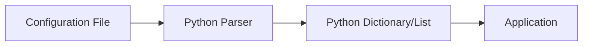
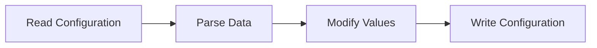
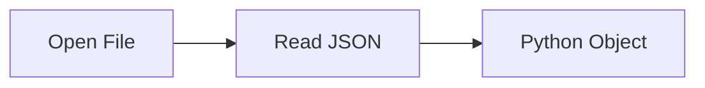
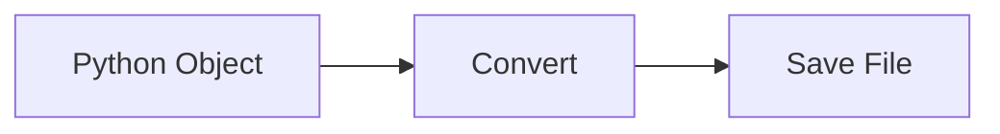
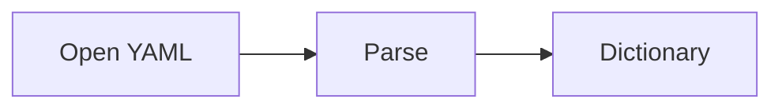
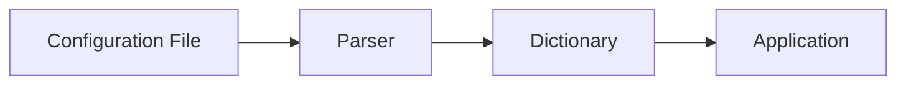

# YAML & JSON

## Overview

**YAML (YAML Ain't Markup Language)** and **JSON (JavaScript Object Notation)** are the two most widely used configuration and data exchange formats in DevOps.

Python provides built-in support for **JSON** through the `json` module and supports **YAML** using the `PyYAML` library.

They are commonly used in:

- Kubernetes manifests
- Docker Compose files
- GitHub Actions workflows
- Ansible Playbooks
- Terraform variables
- CI/CD pipeline configurations
- Cloud configuration files
- Application settings

> **Interview Tip**
>
> JSON is built into Python, whereas YAML requires installing the **PyYAML** package.

---

## Why It Is Used

Configuration files help to:

- Store application settings
- Exchange data between applications
- Configure cloud infrastructure
- Define Kubernetes resources
- Automate deployments
- Avoid hardcoding values
- Maintain environment-specific configurations

---

## Architecture / Working



---

## Key Components

| Component | Purpose |
|-----------|----------|
| JSON | Data exchange format |
| YAML | Human-readable configuration |
| Parser | Reads configuration |
| Serializer | Writes configuration |
| Dictionary | Stores parsed data |

---

## Types (if applicable)

Configuration formats:

- JSON
- YAML

---

## Lifecycle / Workflow (if applicable)



---

## Configuration / Syntax (if applicable)

Import JSON

```python
import json
```

Import YAML

```python
import yaml
```

Install PyYAML

```bash
pip install pyyaml
```

---

## Important Commands (if applicable)

```python
json.load()

json.loads()

json.dump()

json.dumps()

yaml.safe_load()

yaml.dump()
```

---

## Important Files (if applicable)

```
config.json

settings.json

config.yaml

values.yaml

docker-compose.yml

ansible-playbook.yml

deployment.yaml
```

---

## Real-World Use Cases

- Kubernetes manifests
- Docker Compose
- GitHub Actions workflows
- Ansible inventories
- Terraform configuration
- Application settings
- API payloads

---

## Advantages

- Easy configuration management
- Human-readable
- Language-independent
- Easy parsing
- Widely supported

---

## Limitations

- YAML indentation errors
- Large JSON files are difficult to read
- Invalid formatting causes parsing failures

---

## Common Interview Questions (Concept Only)

- What is JSON?
- What is YAML?
- Difference between YAML and JSON?
- Why is YAML used in Kubernetes?
- Which Python modules parse JSON and YAML?
- Why use `safe_load()` instead of `load()`?

---

## Common Mistakes

- Incorrect YAML indentation
- Invalid JSON syntax
- Using tabs instead of spaces in YAML
- Forgetting to install PyYAML
- Editing configuration manually without validation

---

## Troubleshooting

| Problem | Cause | Solution |
|----------|-------|----------|
| JSONDecodeError | Invalid JSON | Validate JSON syntax |
| YAML parsing error | Incorrect indentation | Fix spacing |
| ModuleNotFoundError | PyYAML not installed | Install using `pip install pyyaml` |
| KeyError | Missing configuration key | Validate configuration |
| File not found | Incorrect path | Verify file location |

---

## Summary

JSON and YAML are the most common configuration formats in DevOps. Python provides excellent support for reading, writing, and processing these files, making configuration management simple and reliable.

> **Interview Tip**
>
> Kubernetes, Docker Compose, GitHub Actions, and Ansible all rely heavily on YAML configuration files.

---

# Read JSON

## Overview

Reading JSON means loading JSON data into Python objects such as dictionaries and lists.

Python uses the built-in **`json`** module.

---

## Why It Is Used

Used to:

- Read configuration files
- Process API responses
- Load application settings
- Parse cloud configurations

---

## Architecture / Working

```mermaid
flowchart LR

    A[JSON File]
    B[json.load()]
    C[Python Dictionary]

    A --> B
    B --> C
```

---

## Key Components

| Component | Purpose |
|----------|----------|
| File | JSON input |
| Parser | Converts JSON |
| Dictionary | Stores data |

---

## Types (if applicable)

- Read from file
- Read from string

---

## Lifecycle / Workflow (if applicable)



---

## Configuration / Syntax (if applicable)

```python
import json

json.load(file)
```

Read from a JSON string:

```python
json.loads(json_string)
```

---

## Important Commands (if applicable)

```python
json.load()

json.loads()
```

---

## Important Files (if applicable)

```
config.json

settings.json
```

---

## Real-World Use Cases

- Read API responses
- Load application configuration
- Cloud automation

---

## Advantages

- Simple parsing
- Native Python support

---

## Limitations

- Invalid JSON causes parsing errors

---

## Common Interview Questions (Concept Only)

- Difference between `load()` and `loads()`?

---

## Common Mistakes

- Confusing `load()` and `loads()`

---

## Troubleshooting

- Validate JSON syntax

---

## Summary

JSON files are easily converted into Python dictionaries using `json.load()`.

---

# Write JSON

## Overview

Writing JSON converts Python dictionaries or lists into JSON format.

Used for exporting configuration and API data.

---

## Why It Is Used

Used to:

- Save configuration
- Export reports
- Generate API payloads
- Store automation results

---

## Architecture / Working

```mermaid
flowchart LR

    A[Python Dictionary]
    B[json.dump()]
    C[JSON File]

    A --> B
    B --> C
```

---

## Key Components

- Python dictionary
- JSON serializer
- Output file

---

## Types (if applicable)

- Write to file
- Convert to string

---

## Lifecycle / Workflow (if applicable)



---

## Configuration / Syntax (if applicable)

```python
json.dump(data, file)
```

Convert to string:

```python
json.dumps(data)
```

---

## Important Commands (if applicable)

```python
json.dump()

json.dumps()
```

---

## Important Files (if applicable)

```
report.json

config.json
```

---

## Real-World Use Cases

- Export reports
- Save application settings
- Create API payloads

---

## Advantages

- Standardized format
- Portable

---

## Limitations

- Supports limited data types

---

## Common Interview Questions (Concept Only)

- Difference between `dump()` and `dumps()`?

---

## Common Mistakes

- Forgetting to close files

---

## Troubleshooting

- Verify output permissions

---

## Summary

Python easily converts dictionaries into JSON using `json.dump()`.

---

# Read YAML

## Overview

YAML is commonly used for infrastructure configuration.

Python reads YAML using the **PyYAML** package.

---

## Why It Is Used

Used to:

- Read Kubernetes manifests
- Parse Docker Compose files
- Load Ansible Playbooks
- Read GitHub Actions workflows

---

## Architecture / Working


---

## Key Components

| Component | Purpose |
|----------|----------|
| YAML file | Configuration |
| Parser | Converts YAML |
| Dictionary | Stores values |

---

## Types (if applicable)

- Read configuration
- Read manifests

---

## Lifecycle / Workflow (if applicable)



---

## Configuration / Syntax (if applicable)

Install

```bash
pip install pyyaml
```

Import

```python
import yaml
```

Read YAML

```python
yaml.safe_load(file)
```

---

## Important Commands (if applicable)

```python
yaml.safe_load()

yaml.dump()
```

---

## Important Files (if applicable)

```
deployment.yaml

values.yaml

docker-compose.yml
```

---

## Real-World Use Cases

- Kubernetes
- Docker Compose
- GitHub Actions
- Ansible

---

## Advantages

- Human-readable
- Supports comments
- Easy configuration management

---

## Limitations

- Sensitive to indentation

---

## Common Interview Questions (Concept Only)

- Why use `safe_load()`?
- Why is YAML preferred for Kubernetes?

---

## Common Mistakes

- Incorrect indentation
- Using tabs instead of spaces

---

## Troubleshooting

- Validate YAML syntax

---

## Summary

PyYAML enables Python to parse YAML configuration files into dictionaries.

---

# Parse Configuration Files

## Overview

Parsing configuration files means reading configuration values and converting them into Python objects that applications can use.

Configuration files remove hardcoded values from applications.

---

## Why It Is Used

Used to:

- Store credentials
- Configure applications
- Define environments
- Maintain deployment settings
- Separate code from configuration

---

## Architecture / Working



---

## Key Components

- Configuration file
- Parser
- Dictionary
- Application

---

## Types (if applicable)

- JSON configuration
- YAML configuration

---

## Lifecycle / Workflow (if applicable)


---

## Configuration / Syntax (if applicable)

Common approach

```python
import json

import yaml
```

---

## Important Commands (if applicable)

```python
json.load()

yaml.safe_load()
```

---

## Important Files (if applicable)

```
config.json

config.yaml

settings.yaml

application.yaml
```

---

## Real-World Use Cases

- Kubernetes deployment files
- Docker Compose
- CI/CD configuration
- Infrastructure configuration
- Application settings

---

## Advantages

- Flexible
- Easy maintenance
- Environment-specific configuration
- Better security

---

## Limitations

- Incorrect configuration may break applications

---

## Common Interview Questions (Concept Only)

- Why store configuration outside code?
- Why use YAML instead of JSON?
- How does Python parse configuration files?

---

## Common Mistakes

- Hardcoding configuration values
- Ignoring validation
- Missing configuration keys

---

## Troubleshooting

| Problem | Cause | Solution |
|----------|-------|----------|
| Missing key | Invalid configuration | Validate configuration |
| Parsing failure | Invalid syntax | Check formatting |
| File missing | Wrong location | Verify path |
| Permission denied | File permissions | Update permissions |

---

## Summary

Configuration parsing allows applications to load settings dynamically from JSON or YAML files instead of embedding values directly in code.

---

# Interview Quick Revision

## JSON vs YAML

| Feature | JSON | YAML |
|----------|------|------|
| Human readable | Moderate | Excellent |
| Supports comments | No | Yes |
| Built into Python | Yes | No |
| Used in Kubernetes | Rarely | Yes |
| Used in APIs | Yes | Sometimes |

---

## Common JSON Functions

| Function | Purpose |
|----------|----------|
| `json.load()` | Read JSON file |
| `json.loads()` | Read JSON string |
| `json.dump()` | Write JSON file |
| `json.dumps()` | Convert to JSON string |

---

## Common YAML Functions

| Function | Purpose |
|----------|----------|
| `yaml.safe_load()` | Read YAML safely |
| `yaml.dump()` | Write YAML |

---

## Production Best Practices

- Use `json.load()` and `yaml.safe_load()` for reading configuration files.
- Always validate configuration before using it.
- Store sensitive values (passwords, API keys, tokens) in environment variables or secret managers instead of configuration files.
- Use YAML for infrastructure-as-code tools like Kubernetes, Docker Compose, GitHub Actions, and Ansible.
- Use JSON primarily for APIs and structured data exchange.
- Keep configuration separate from application code to simplify maintenance and deployments.

---

## One-line Interview Answer

**Python parses JSON using the built-in `json` module and YAML using the `PyYAML` library, enabling DevOps engineers to manage application settings, infrastructure configurations, Kubernetes manifests, CI/CD pipelines, and cloud automation in a structured and maintainable way.**
