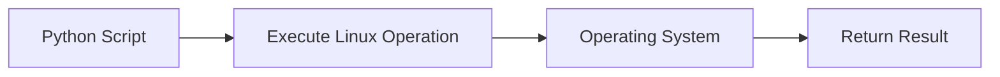
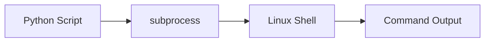
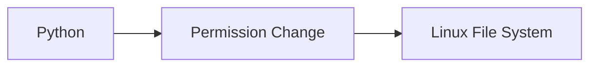
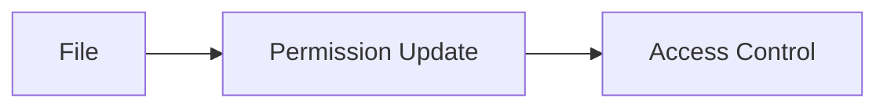
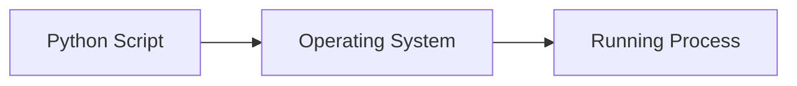

# Working with Linux

## Overview

Linux is the most widely used operating system for servers, cloud platforms, containers, and Kubernetes. Python integrates seamlessly with Linux, enabling DevOps engineers to automate system administration, execute shell commands, manage files, monitor processes, and configure environments.

Python commonly uses these modules:

- `subprocess`
- `os`
- `pathlib`
- `shutil`
- `stat`

> **Interview Tip**
>
> Most DevOps automation scripts are executed on Linux systems. Understanding how Python interacts with Linux is an essential interview skill.

---

## Why It Is Used

Python helps automate Linux administration tasks such as:

- Executing shell commands
- Managing files and directories
- Monitoring processes
- Managing permissions
- Reading environment variables
- Automating deployments
- Running backup scripts
- Managing services

---

## Architecture / Working


---

## Key Components

| Component | Purpose |
|-----------|----------|
| Shell Commands | Execute Linux commands |
| Environment Variables | Store runtime configuration |
| File Permissions | Control access |
| Processes | Manage running applications |
| File System | Read and modify files |

---

## Types (if applicable)

Common Linux automation tasks:

- Command execution
- File management
- Process management
- Permission management
- Environment management

---

## Lifecycle / Workflow (if applicable)



---

## Configuration / Syntax (if applicable)

Common imports

```python
import os
import subprocess
import pathlib
import shutil
```

---

## Important Commands (if applicable)

```python
subprocess.run()

os.getenv()

os.chmod()

os.listdir()

os.getpid()
```

---

## Important Files (if applicable)

```
~/.bashrc

~/.profile

/etc/environment

/etc/passwd

/etc/group

/etc/sudoers
```

---

## Real-World Use Cases

- Deployment automation
- Backup automation
- Service monitoring
- Log collection
- Kubernetes automation
- Server health monitoring
- Configuration management

---

## Advantages

- Easy Linux integration
- Cross-platform
- Rich standard library
- Excellent automation support

---

## Limitations

- Linux commands differ across distributions
- Permission issues may occur
- Some operations require root privileges

---

## Common Interview Questions (Concept Only)

- Why is Linux important for DevOps?
- How does Python interact with Linux?
- Which Python modules are commonly used with Linux?
- Why use Python instead of shell scripting?

---

## Common Mistakes

- Hardcoding Linux paths
- Ignoring permissions
- Running commands without validation
- Ignoring return codes
- Not handling exceptions

---

## Troubleshooting

| Problem | Cause | Solution |
|----------|-------|----------|
| Permission denied | Insufficient privileges | Verify permissions or use appropriate privileges |
| Command not found | Incorrect command | Verify PATH and command |
| File not found | Wrong path | Use absolute paths |
| Environment variable missing | Variable not set | Check environment configuration |
| Process not found | Invalid PID | Verify process status |

---

## Summary

Python provides powerful integration with Linux, allowing DevOps engineers to automate system administration, execute commands, manage files, and monitor processes efficiently.

> **Interview Tip**
>
> Prefer Python's built-in modules over shell commands whenever possible for better portability and error handling.

---

# Execute Shell Commands

## Overview

Python executes Linux shell commands using the **`subprocess`** module.

`subprocess` is preferred over `os.system()` because it provides better control, security, and access to command output.

---

## Why It Is Used

Used to:

- Execute Linux commands
- Restart services
- Run Git commands
- Deploy applications
- Execute Docker commands
- Run Kubernetes commands

---

## Architecture / Working



---

## Key Components

| Component | Purpose |
|-----------|----------|
| Command | Linux command |
| Shell | Executes command |
| Standard Output | Command output |
| Standard Error | Error output |
| Return Code | Execution status |

---

## Types (if applicable)

- Blocking execution
- Background execution

---

## Lifecycle / Workflow (if applicable)


---

## Configuration / Syntax (if applicable)

```python
subprocess.run()
```

---

## Important Commands (if applicable)

```python
subprocess.run()

subprocess.Popen()

subprocess.check_output()
```

---

## Important Files (if applicable)

Deployment scripts

---

## Real-World Use Cases

- Execute Docker commands
- Restart Nginx
- Run Git commands
- Deploy Kubernetes resources
- Trigger Terraform

---

## Advantages

- Secure
- Captures output
- Better error handling

---

## Limitations

- Invalid commands cause failures

---

## Common Interview Questions (Concept Only)

- Why use `subprocess` instead of `os.system()`?
- What is the difference between `run()` and `Popen()`?

---

## Common Mistakes

- Ignoring return codes
- Using shell commands unnecessarily

---

## Troubleshooting

- Verify command manually

---

## Summary

`subprocess` is the preferred way to execute Linux commands from Python.

---

# Environment Variables

## Overview

Environment variables are key-value pairs maintained by the operating system that store configuration information.

Python accesses them using the **`os`** module.

Common examples:

- PATH
- HOME
- USER
- HOSTNAME
- JAVA_HOME
- AWS_ACCESS_KEY_ID
- AZURE_CLIENT_ID

---

## Why It Is Used

Used to:

- Store credentials
- Configure applications
- Define runtime behavior
- Avoid hardcoding secrets
- Manage environments

---

## Architecture / Working

```mermaid
flowchart LR

    A[Linux Environment]
    B[os.getenv()]
    C[Python Script]

    A --> B
    B --> C
```

---

## Key Components

| Component | Purpose |
|-----------|----------|
| Variable | Configuration |
| Name | Variable key |
| Value | Variable data |

---

## Types (if applicable)

- System variables
- User variables

---

## Lifecycle / Workflow (if applicable)


---

## Configuration / Syntax (if applicable)

```python
os.getenv()
```

---

## Important Commands (if applicable)

```python
os.getenv()

os.environ
```

---

## Important Files (if applicable)

```
/etc/environment

~/.bashrc

~/.profile
```

---

## Real-World Use Cases

- Store API keys
- Cloud credentials
- Database connections
- Deployment configuration

---

## Advantages

- Secure configuration
- Easy environment switching

---

## Limitations

- Variables disappear after session unless persisted

---

## Common Interview Questions (Concept Only)

- What are environment variables?
- Why avoid hardcoding credentials?

---

## Common Mistakes

- Hardcoding secrets

---

## Troubleshooting

- Verify variable exists

---

## Summary

Environment variables securely store runtime configuration outside application code.

---

# File Permissions

## Overview

Linux file permissions determine who can read, write, or execute files and directories.

Python manages permissions using the **`os`** module.

---

## Why It Is Used

Used to:

- Secure files
- Restrict access
- Protect configuration
- Secure scripts

---

## Architecture / Working



---

## Key Components

| Permission | Meaning |
|------------|---------|
| Read | View file |
| Write | Modify file |
| Execute | Run file |

---

## Types (if applicable)

- User
- Group
- Others

---

## Lifecycle / Workflow (if applicable)



---

## Configuration / Syntax (if applicable)

```python
os.chmod()
```

---

## Important Commands (if applicable)

```python
os.chmod()

os.stat()
```

---

## Important Files (if applicable)

```
/etc/passwd

/etc/group
```

---

## Real-World Use Cases

- Secure SSH keys
- Protect configuration files
- Restrict deployment scripts

---

## Advantages

- Improves security

---

## Limitations

- Incorrect permissions may block applications

---

## Common Interview Questions (Concept Only)

- What is `chmod()`?
- Why are file permissions important?

---

## Common Mistakes

- Setting overly permissive permissions

---

## Troubleshooting

- Verify ownership and permissions

---

## Summary

Python allows automated management of Linux file permissions.

---

# Process Management

## Overview

Processes are running programs managed by the operating system.

Python can monitor, create, and manage processes using the **`subprocess`** and **`os`** modules.

---

## Why It Is Used

Used to:

- Start applications
- Stop services
- Monitor running processes
- Collect process information
- Automate deployments

---

## Architecture / Working



---

## Key Components

| Component | Purpose |
|-----------|----------|
| Process | Running program |
| PID | Process ID |
| Exit Code | Execution result |
| Signals | Control process |

---

## Types (if applicable)

- Foreground process
- Background process

---

## Lifecycle / Workflow (if applicable)


---

## Configuration / Syntax (if applicable)

```python
os.getpid()

subprocess.Popen()
```

---

## Important Commands (if applicable)

```python
os.getpid()

os.kill()

subprocess.Popen()

subprocess.run()
```

---

## Important Files (if applicable)

```
/proc/

/var/run
```

---

## Real-World Use Cases

- Restart services
- Monitor applications
- Execute deployments
- Health checks

---

## Advantages

- Automates process control
- Integrates with Linux

---

## Limitations

- Requires appropriate permissions

---

## Common Interview Questions (Concept Only)

- What is a process?
- What is a PID?
- How do you manage processes in Python?

---

## Common Mistakes

- Ignoring exit codes
- Leaving background processes running

---

## Troubleshooting

| Problem | Cause | Solution |
|----------|-------|----------|
| Process not starting | Invalid command | Verify executable |
| Permission denied | Restricted access | Check user permissions |
| Process hangs | Waiting for input | Handle input/output correctly |
| Process terminated unexpectedly | Runtime error | Review logs and exit codes |

---

## Summary

Python provides powerful tools for managing Linux processes, enabling DevOps engineers to automate deployments, monitor services, and execute system tasks.

---

# Interview Quick Revision

## Common Python Modules

| Module | Purpose |
|----------|----------|
| `subprocess` | Execute Linux commands |
| `os` | Operating system interaction |
| `pathlib` | File path management |
| `shutil` | File and directory operations |
| `stat` | File permission information |

---

## Frequently Used Functions

| Function | Purpose |
|----------|----------|
| `subprocess.run()` | Execute command |
| `subprocess.Popen()` | Start background process |
| `os.getenv()` | Read environment variable |
| `os.environ` | Access all environment variables |
| `os.chmod()` | Change file permissions |
| `os.stat()` | Get file metadata |
| `os.getpid()` | Current process ID |
| `os.kill()` | Send signal to process |

---

## Production Best Practices

- Prefer `subprocess.run()` over `os.system()`.
- Store credentials in environment variables, not in source code.
- Use the principle of least privilege for file permissions.
- Always check command exit codes and handle errors.
- Use absolute file paths in automation scripts.
- Log command execution results for easier troubleshooting.
- Avoid running scripts as the root user unless absolutely necessary.

---

## One-line Interview Answer

**Python integrates closely with Linux using modules such as `subprocess` and `os`, enabling DevOps engineers to execute shell commands, manage environment variables, control file permissions, and automate process management efficiently and securely.**
