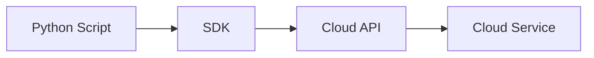
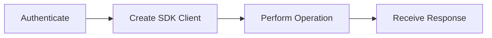
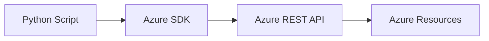
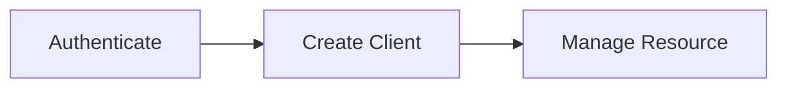
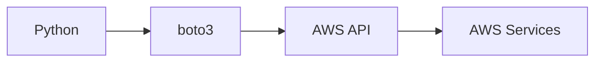
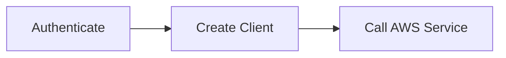
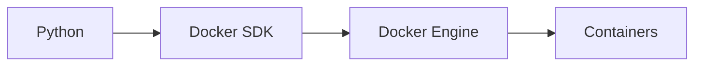
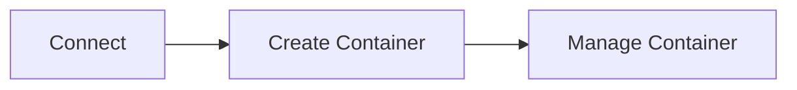
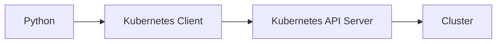
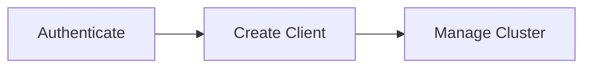

# Cloud & DevOps Automation

## Overview

Cloud & DevOps automation involves using Python to interact with cloud platforms, containers, and orchestration systems through their Software Development Kits (SDKs) and APIs.

Instead of manually performing tasks through web portals or CLI tools, Python scripts can automate infrastructure provisioning, deployments, monitoring, scaling, and management.

Common SDKs:

- Azure SDK for Python
- AWS SDK (`boto3`)
- Docker SDK for Python
- Kubernetes Python Client

> **Interview Tip**
>
> Most enterprise automation uses SDKs instead of directly invoking CLI commands because SDKs provide structured APIs, better error handling, and native Python objects.

---

## Why It Is Used

Cloud automation helps to:

- Provision infrastructure
- Manage virtual machines
- Deploy applications
- Scale cloud resources
- Manage Kubernetes clusters
- Build CI/CD pipelines
- Automate backups
- Reduce manual work

---

## Architecture / Working



---

## Key Components

| Component | Purpose |
|-----------|----------|
| SDK | Python library |
| Authentication | Access cloud resources |
| API | Cloud communication |
| Resources | VMs, Containers, Storage, Networks |
| Response | Python objects |

---

## Types (if applicable)

Common automation platforms:

- Azure
- AWS
- Docker
- Kubernetes

---

## Lifecycle / Workflow (if applicable)



---

## Configuration / Syntax (if applicable)

Typical workflow

```python
import sdk

authenticate()

create_client()

perform_operation()
```

---

## Important Commands (if applicable)

```python
client.list()

client.create()

client.delete()

client.update()
```

---

## Important Files (if applicable)

```
requirements.txt

config.json

credentials

.env

automation.py
```

---

## Real-World Use Cases

- Provision Azure VMs
- Manage AWS EC2
- Deploy Docker containers
- Manage Kubernetes Pods
- Automate cloud backups
- CI/CD deployments

---

## Advantages

- Native Python interface
- Better error handling
- Secure authentication
- Cloud provider supported
- Easy automation

---

## Limitations

- SDK installation required
- Cloud authentication needed
- API changes across versions

---

## Common Interview Questions (Concept Only)

- Why use SDKs instead of CLI?
- What is cloud automation?
- Which SDKs are commonly used?
- Why use Python for cloud automation?

---

## Common Mistakes

- Hardcoding credentials
- Ignoring authentication failures
- Not handling exceptions
- Using outdated SDK versions

---

## Troubleshooting

| Problem | Cause | Solution |
|----------|-------|----------|
| Authentication failed | Invalid credentials | Verify authentication |
| Module not found | SDK missing | Install package |
| Permission denied | Missing IAM/RBAC permissions | Update access policies |
| Resource not found | Invalid resource ID | Verify identifiers |
| API error | Invalid request | Validate request parameters |

---

## Summary

Python SDKs provide an efficient and secure way to automate cloud and DevOps operations without manually interacting with cloud portals or CLI tools.

> **Interview Tip**
>
> In production, SDKs are preferred over CLI commands because they offer structured APIs, stronger error handling, and better integration with automation scripts.

---

# Azure SDK Basics

## Overview

The Azure SDK for Python enables developers and DevOps engineers to manage Azure resources programmatically.

It supports services such as:

- Virtual Machines
- Storage Accounts
- Resource Groups
- Networking
- Azure Kubernetes Service (AKS)
- Key Vault

---

## Why It Is Used

Used to:

- Create Azure resources
- Manage VMs
- Deploy applications
- Automate Azure infrastructure
- Manage storage

---

## Architecture / Working



---

## Key Components

| Component | Purpose |
|-----------|----------|
| Credential | Authentication |
| SDK Client | Resource management |
| Subscription | Azure account |
| Resource Group | Resource organization |

---

## Types (if applicable)

Common SDKs

- Compute
- Storage
- Networking
- Identity

---

## Lifecycle / Workflow (if applicable)



---

## Configuration / Syntax (if applicable)

Install

```bash
pip install azure-identity
pip install azure-mgmt-resource
```

---

## Important Commands (if applicable)

```python
ResourceManagementClient()

DefaultAzureCredential()
```

---

## Important Files (if applicable)

```
requirements.txt

.env
```

---

## Real-World Use Cases

- Create Resource Groups
- Provision VMs
- Manage AKS
- Deploy applications

---

## Advantages

- Native Azure support
- Secure authentication

---

## Limitations

- Azure authentication required

---

## Common Interview Questions (Concept Only)

- What is the Azure SDK?
- What is `DefaultAzureCredential`?

---

## Common Mistakes

- Hardcoding Azure credentials

---

## Troubleshooting

- Verify Azure login

---

## Summary

The Azure SDK automates Azure resource management through Python.

---

# AWS SDK (boto3) Basics

## Overview

`boto3` is the official AWS SDK for Python.

It provides APIs for almost every AWS service.

Common services:

- EC2
- S3
- IAM
- Lambda
- CloudWatch
- RDS

---

## Why It Is Used

Used to:

- Launch EC2 instances
- Upload files to S3
- Manage IAM
- Trigger Lambda functions
- Monitor AWS resources

---

## Architecture / Working



---

## Key Components

| Component | Purpose |
|-----------|----------|
| Session | Authentication |
| Client | Low-level API |
| Resource | Object-oriented API |

---

## Types (if applicable)

- Client
- Resource

---

## Lifecycle / Workflow (if applicable)



---

## Configuration / Syntax (if applicable)

Install

```bash
pip install boto3
```

---

## Important Commands (if applicable)

```python
boto3.client()

boto3.resource()
```

---

## Important Files (if applicable)

```
~/.aws/credentials

~/.aws/config
```

---

## Real-World Use Cases

- Launch EC2
- Upload S3 objects
- Manage IAM users
- Cloud automation

---

## Advantages

- Official AWS SDK
- Comprehensive API coverage

---

## Limitations

- Requires AWS credentials

---

## Common Interview Questions (Concept Only)

- What is boto3?
- Difference between client and resource?

---

## Common Mistakes

- Exposing AWS keys

---

## Troubleshooting

- Verify AWS credentials

---

## Summary

`boto3` is the standard Python SDK for AWS automation.

---

# Docker SDK Basics

## Overview

The Docker SDK for Python enables Python scripts to interact directly with the Docker Engine.

Instead of executing Docker CLI commands, the SDK provides Python methods to manage containers, images, networks, and volumes.

---

## Why It Is Used

Used to:

- Create containers
- Stop containers
- Build images
- Remove containers
- Monitor Docker

---

## Architecture / Working



---

## Key Components

| Component | Purpose |
|-----------|----------|
| Client | Docker connection |
| Images | Container templates |
| Containers | Running workloads |

---

## Types (if applicable)

- Image operations
- Container operations

---

## Lifecycle / Workflow (if applicable)



---

## Configuration / Syntax (if applicable)

Install

```bash
pip install docker
```

---

## Important Commands (if applicable)

```python
docker.from_env()
```

---

## Important Files (if applicable)

```
Dockerfile

docker-compose.yml
```

---

## Real-World Use Cases

- Container deployment
- CI/CD automation
- Health monitoring

---

## Advantages

- Native Docker integration

---

## Limitations

- Docker daemon must be running

---

## Common Interview Questions (Concept Only)

- What is Docker SDK?

---

## Common Mistakes

- Docker daemon unavailable

---

## Troubleshooting

- Verify Docker service

---

## Summary

Docker SDK enables Python-based container management.

---

# Kubernetes Python Client Basics

## Overview

The Kubernetes Python Client enables Python applications to interact directly with Kubernetes clusters.

It provides APIs for managing:

- Pods
- Deployments
- Services
- Namespaces
- ConfigMaps
- Secrets

---

## Why It Is Used

Used to:

- Deploy workloads
- Monitor clusters
- Scale applications
- Read pod logs
- Automate Kubernetes

---

## Architecture / Working



---

## Key Components

| Component | Purpose |
|-----------|----------|
| Client | Kubernetes API |
| API Server | Cluster communication |
| Resources | Pods, Services, Deployments |

---

## Types (if applicable)

- Core API
- Apps API

---

## Lifecycle / Workflow (if applicable)



---

## Configuration / Syntax (if applicable)

Install

```bash
pip install kubernetes
```

---

## Important Commands (if applicable)

```python
config.load_kube_config()

CoreV1Api()

AppsV1Api()
```

---

## Important Files (if applicable)

```
~/.kube/config

deployment.yaml
```

---

## Real-World Use Cases

- Deploy Pods
- Monitor Deployments
- Read logs
- Scale applications

---

## Advantages

- Native Kubernetes integration
- Official client

---

## Limitations

- Kubernetes access required

---

## Common Interview Questions (Concept Only)

- What is the Kubernetes Python Client?
- Why use it instead of kubectl?

---

## Common Mistakes

- Invalid kubeconfig

---

## Troubleshooting

- Verify cluster connectivity

---

## Summary

The Kubernetes Python Client enables complete Kubernetes automation using Python.

---

# Interview Quick Revision

## Common SDKs

| SDK | Platform |
|------|----------|
| Azure SDK | Microsoft Azure |
| `boto3` | AWS |
| Docker SDK | Docker Engine |
| Kubernetes Client | Kubernetes |

---

## Common Installation Commands

| SDK | Installation |
|------|-------------|
| Azure SDK | `pip install azure-identity azure-mgmt-resource` |
| boto3 | `pip install boto3` |
| Docker SDK | `pip install docker` |
| Kubernetes Client | `pip install kubernetes` |
| PyYAML | `pip install pyyaml` |

---

## Common Authentication Methods

| Platform | Authentication |
|----------|----------------|
| Azure | `DefaultAzureCredential` or Service Principal |
| AWS | IAM User, IAM Role, or `~/.aws/credentials` |
| Docker | Docker daemon / Registry credentials |
| Kubernetes | `~/.kube/config` or Service Account |

---

## Production Best Practices

- Use SDKs instead of invoking CLI commands where possible.
- Store credentials securely using environment variables, managed identities, IAM roles, or secret managers.
- Follow the principle of least privilege when assigning permissions.
- Handle SDK exceptions and retry transient failures.
- Pin SDK versions in `requirements.txt` to avoid unexpected changes.
- Avoid hardcoding resource IDs, regions, or credentials in scripts.
- Log automation activities for auditing and troubleshooting.

---

## One-line Interview Answer

**Python SDKs such as the Azure SDK, `boto3`, Docker SDK, and Kubernetes Python Client allow DevOps engineers to automate cloud infrastructure, container management, and Kubernetes operations through native APIs, providing a more reliable, secure, and maintainable approach than manual CLI-based automation.**
