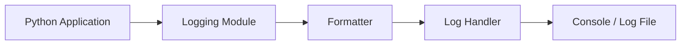
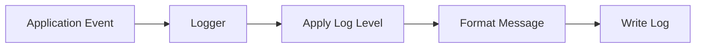
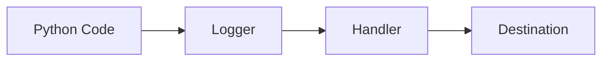
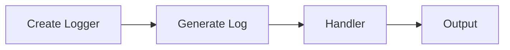
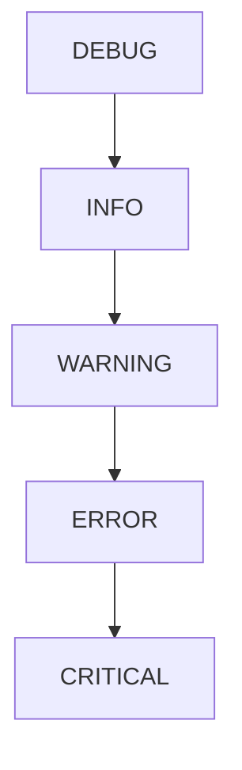
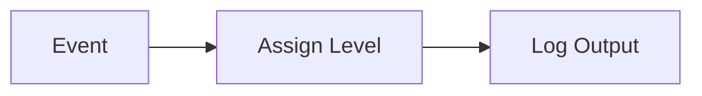
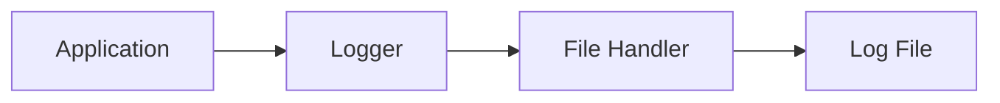

# Logging

## Overview

Logging is the process of recording events that occur while a program is running. Instead of printing messages to the console using `print()`, Python applications use the built-in **`logging`** module to generate structured logs.

Logging is essential for:

- Debugging applications
- Monitoring production systems
- Troubleshooting failures
- Auditing system activities
- Understanding application behavior

The Python `logging` module supports multiple log levels, custom formatting, and writing logs to files or other destinations.

> **Interview Tip**
>
> In production, always use the `logging` module instead of `print()` because it provides configurable log levels, timestamps, file output, and better maintainability.

---

## Why It Is Used

Logging helps to:

- Track application execution
- Record errors and exceptions
- Debug production issues
- Monitor automation scripts
- Audit user actions
- Analyze system failures
- Generate operational reports

---

## Architecture / Working



---

## Key Components

| Component | Purpose |
|-----------|----------|
| Logger | Generates log messages |
| Log Level | Defines message severity |
| Formatter | Formats log output |
| Handler | Sends logs to destination |
| Log File | Stores logs permanently |

---

## Types (if applicable)

Common logging destinations:

- Console Logging
- File Logging
- Rotating File Logging
- Remote Logging (SIEM, Cloud Logging)

---

## Lifecycle / Workflow (if applicable)



---

## Configuration / Syntax (if applicable)

Import logging

```python
import logging
```

Basic configuration

```python
logging.basicConfig()
```

Create logger

```python
logger = logging.getLogger(__name__)
```

---

## Important Commands (if applicable)

```python
logging.basicConfig()

logging.getLogger()

logger.debug()

logger.info()

logger.warning()

logger.error()

logger.critical()

logger.exception()
```

---

## Important Files (if applicable)

```
application.log

automation.log

system.log

requirements.txt
```

---

## Real-World Use Cases

- CI/CD pipeline logging
- Infrastructure automation
- Kubernetes deployment logs
- Backup automation
- API monitoring
- Server monitoring
- Security auditing
- DevOps automation

---

## Advantages

- Built into Python
- Configurable log levels
- Supports log files
- Easy debugging
- Production ready
- Supports multiple output destinations

---

## Limitations

- Poor configuration may generate excessive logs
- Large log files require rotation
- Sensitive information should never be logged

---

## Common Interview Questions (Concept Only)

- Why use logging instead of `print()`?
- What are log levels?
- What is a logger?
- What is a log handler?
- What is log formatting?
- Why are log files important?

---

## Common Mistakes

- Using `print()` in production
- Logging passwords or secrets
- Using the wrong log level
- Ignoring exceptions
- Not rotating large log files
- Logging excessive debug information

---

## Troubleshooting

| Problem | Cause | Solution |
|----------|-------|----------|
| No logs generated | Logging not configured | Configure `basicConfig()` |
| Empty log file | Wrong file path | Verify file location |
| Duplicate logs | Multiple handlers | Remove duplicate handlers |
| Missing timestamps | Formatter not configured | Configure formatter |
| Large log files | No rotation | Use rotating log handlers |

---

## Summary

Python's `logging` module provides a flexible, configurable, and production-ready mechanism for recording application events. Proper logging simplifies debugging, monitoring, and troubleshooting while improving application reliability.

> **Interview Tip**
>
> Production applications should always use the `logging` module with appropriate log levels and file-based logging instead of relying on `print()` statements.

---

# logging Module

## Overview

The **`logging`** module is Python's built-in framework for generating log messages.

It supports:

- Multiple log levels
- File logging
- Console logging
- Custom formatting
- Multiple handlers

---

## Why It Is Used

Used to:

- Replace `print()`
- Record execution flow
- Capture exceptions
- Monitor applications
- Generate audit logs

---

## Architecture / Working



---

## Key Components

| Component | Purpose |
|-----------|----------|
| Logger | Creates log entries |
| Handler | Sends logs |
| Formatter | Formats logs |
| Filter | Filters messages |

---

## Types (if applicable)

- Root Logger
- Custom Logger

---

## Lifecycle / Workflow (if applicable)



---

## Configuration / Syntax (if applicable)

```python
import logging

logger = logging.getLogger(__name__)
```

---

## Important Commands (if applicable)

```python
logging.getLogger()

logging.basicConfig()
```

---

## Important Files (if applicable)

```
application.log
```

---

## Real-World Use Cases

- API logging
- Server monitoring
- Infrastructure automation

---

## Advantages

- Built-in
- Flexible
- Production ready

---

## Limitations

- Requires configuration

---

## Common Interview Questions (Concept Only)

- What is the logging module?
- What is a logger?

---

## Common Mistakes

- Using only the root logger

---

## Troubleshooting

- Verify logger configuration

---

## Summary

The `logging` module is the standard way to implement logging in Python applications.

---

# Log Levels

## Overview

Log levels define the severity of log messages.

Each level represents the importance of an event.

---

## Why It Is Used

Helps developers:

- Filter logs
- Identify errors
- Reduce unnecessary output

---

## Architecture / Working



---

## Key Components

| Level | Purpose |
|--------|----------|
| DEBUG | Detailed debugging |
| INFO | Normal operations |
| WARNING | Potential issue |
| ERROR | Operation failed |
| CRITICAL | Application failure |

---

## Types (if applicable)

- DEBUG
- INFO
- WARNING
- ERROR
- CRITICAL

---

## Lifecycle / Workflow (if applicable)



---

## Configuration / Syntax (if applicable)

```python
logger.info()

logger.error()

logger.warning()
```

---

## Important Commands (if applicable)

```python
logger.debug()

logger.info()

logger.warning()

logger.error()

logger.critical()
```

---

## Important Files (if applicable)

```
application.log
```

---

## Real-World Use Cases

- Debug automation
- Monitor deployments
- Record failures

---

## Advantages

- Organized logging
- Easy filtering

---

## Limitations

- Incorrect level selection reduces usefulness

---

## Common Interview Questions (Concept Only)

- What are Python log levels?
- Which log level should be used for production issues?

---

## Common Mistakes

- Logging everything as INFO
- Using DEBUG in production

---

## Troubleshooting

- Verify configured log level

---

## Summary

Log levels classify log messages based on severity, making logs easier to analyze.

---

# Log Formatting

## Overview

Log formatting determines how log messages appear.

A formatter typically includes:

- Timestamp
- Log level
- Logger name
- Message

---

## Why It Is Used

Formatting makes logs:

- Easier to read
- Easier to search
- Consistent
- Suitable for monitoring systems

---

## Architecture / Working


---

## Key Components

| Component | Purpose |
|-----------|----------|
| Timestamp | Event time |
| Level | Severity |
| Logger Name | Source |
| Message | Log content |

---

## Types (if applicable)

- Simple format
- Detailed format

---

## Lifecycle / Workflow (if applicable)


---

## Configuration / Syntax (if applicable)

```python
logging.basicConfig(
    format="%(asctime)s %(levelname)s %(message)s"
)
```

---

## Important Commands (if applicable)

```python
logging.Formatter()
```

---

## Important Files (if applicable)

```
application.log
```

---

## Real-World Use Cases

- Production monitoring
- CI/CD logs
- Security auditing

---

## Advantages

- Better readability
- Consistent output

---

## Limitations

- Poor formatting makes debugging difficult

---

## Common Interview Questions (Concept Only)

- What is a log formatter?
- Why include timestamps?

---

## Common Mistakes

- Omitting timestamps
- Inconsistent formats

---

## Troubleshooting

- Verify formatter configuration

---

## Summary

Proper log formatting improves troubleshooting and monitoring by making log messages structured and readable.

---

# Log Files

## Overview

Log files permanently store application events for later analysis.

They help developers investigate production issues after application execution.

---

## Why It Is Used

Used to:

- Preserve logs
- Audit operations
- Analyze failures
- Debug production issues
- Support compliance

---

## Architecture / Working



---

## Key Components

| Component | Purpose |
|-----------|----------|
| Log File | Stores logs |
| File Handler | Writes logs |
| Formatter | Formats entries |

---

## Types (if applicable)

- Single log file
- Rotating log file
- Daily log file

---

## Lifecycle / Workflow (if applicable)


---

## Configuration / Syntax (if applicable)

```python
logging.basicConfig(
    filename="application.log"
)
```

---

## Important Commands (if applicable)

```python
logging.FileHandler()
```

---

## Important Files (if applicable)

```
application.log

automation.log

error.log
```

---

## Real-World Use Cases

- Server logs
- Deployment logs
- API logs
- Security logs
- Infrastructure logs

---

## Advantages

- Persistent storage
- Historical analysis
- Easy troubleshooting

---

## Limitations

- Log files grow over time
- Require rotation and cleanup

---

## Common Interview Questions (Concept Only)

- Why store logs in files?
- What is log rotation?
- Why are log files important?

---

## Common Mistakes

- Unlimited log growth
- Storing secrets
- No backup strategy

---

## Troubleshooting

| Problem | Cause | Solution |
|----------|-------|----------|
| Log file not created | Wrong path | Verify location |
| Permission denied | File permissions | Update permissions |
| Huge log file | No rotation | Configure rotating logs |

---

## Summary

Log files provide persistent records of application activity, making them essential for production monitoring and troubleshooting.

---

# Interview Quick Revision

## Standard Log Levels

| Level | Usage |
|--------|-------|
| DEBUG | Detailed troubleshooting information |
| INFO | Normal application events |
| WARNING | Potential issues that don't stop execution |
| ERROR | Failed operations requiring attention |
| CRITICAL | Severe failures that may stop the application |

---

## Frequently Used Logging Functions

| Function | Purpose |
|----------|----------|
| `logging.basicConfig()` | Configure logging |
| `logging.getLogger()` | Create or retrieve a logger |
| `logger.debug()` | Debug messages |
| `logger.info()` | Informational messages |
| `logger.warning()` | Warning messages |
| `logger.error()` | Error messages |
| `logger.critical()` | Critical failure messages |
| `logger.exception()` | Log exception with traceback |

---

## Production Best Practices

- Use the `logging` module instead of `print()`.
- Select appropriate log levels for each message.
- Include timestamps, log levels, and logger names in log formats.
- Store logs in files or centralized logging systems.
- Enable log rotation to prevent uncontrolled file growth.
- Never log passwords, API keys, or sensitive data.
- Use structured logging for easier integration with monitoring tools like ELK, Loki, or Splunk.

---

## One-line Interview Answer

**Python's `logging` module provides configurable, production-ready logging with multiple log levels, custom formatting, and file handlers, enabling DevOps engineers to monitor applications, troubleshoot failures, and maintain audit trails effectively.**
