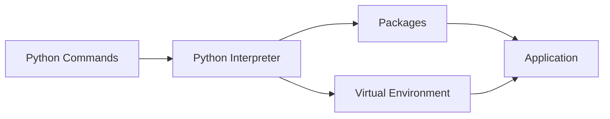

# Essential Python Commands

## Overview

Python provides several command-line utilities for running programs, managing packages, and creating isolated development environments. These commands are used daily by DevOps engineers for automation, CI/CD pipelines, cloud scripting, and infrastructure management.

The most frequently used commands are:

- `python`
- `python3`
- `pip`
- `pip install`
- `pip freeze`
- `python -m venv`
- Activate Virtual Environment

> **Interview Tip**
>
> Every DevOps engineer should know how to create virtual environments, install packages, and execute Python scripts from the command line.

---

## Why It Is Used

These commands help to:

- Execute Python scripts
- Install third-party packages
- Manage project dependencies
- Create isolated environments
- Prepare applications for deployment
- Build CI/CD pipelines

---

## Architecture / Working



---

## Key Components

| Component | Purpose |
|-----------|----------|
| Python Interpreter | Executes Python code |
| pip | Package manager |
| Virtual Environment | Isolated project environment |
| Package Repository | PyPI packages |
| Requirements File | Stores project dependencies |

---

## Types (if applicable)

Common command categories:

- Python execution
- Package management
- Dependency management
- Virtual environment management

---

## Lifecycle / Workflow (if applicable)


---

## Configuration / Syntax (if applicable)

General command format

```bash
python <script.py>

pip <command>

python -m <module>
```

---

## Important Commands (if applicable)

```bash
python

python3

pip

pip install

pip freeze

python -m venv

source venv/bin/activate
```

---

## Important Files (if applicable)

```
requirements.txt

pyproject.toml

setup.py

venv/

activate
```

---

## Real-World Use Cases

- Install automation libraries
- Create isolated development environments
- Run CI/CD scripts
- Deploy cloud automation
- Package dependency management
- Execute infrastructure scripts

---

## Advantages

- Easy package management
- Project isolation
- Reproducible environments
- Platform independent

---

## Limitations

- Multiple Python versions may cause confusion
- Dependency conflicts
- Incorrect virtual environment activation

---

## Common Interview Questions (Concept Only)

- Difference between `python` and `python3`?
- What is pip?
- Why use virtual environments?
- What is `requirements.txt`?
- Why use `pip freeze`?
- How do you install Python packages?

---

## Common Mistakes

- Installing packages globally
- Forgetting to activate virtual environments
- Not maintaining `requirements.txt`
- Mixing Python versions
- Using outdated packages

---

## Troubleshooting

| Problem | Cause | Solution |
|----------|-------|----------|
| Command not found | Python not installed | Install Python or update PATH |
| pip not found | Missing pip | Install or upgrade pip |
| ModuleNotFoundError | Package missing | Install required package |
| Wrong Python version | Multiple installations | Verify interpreter |
| Virtual environment inactive | Environment not activated | Activate virtual environment |

---

## Summary

Essential Python commands enable developers and DevOps engineers to execute scripts, manage packages, create isolated environments, and maintain reproducible projects.

> **Interview Tip**
>
> Most CI/CD pipelines create a virtual environment, install dependencies using `pip`, and execute Python automation scripts.

---

# python

## Overview

The `python` command starts the Python interpreter or executes a Python script.

Depending on the operating system, it may point to Python 2 or Python 3.

---

## Why It Is Used

Used to:

- Start interactive interpreter
- Execute Python scripts
- Test code quickly
- Run automation scripts

---

## Architecture / Working


---

## Key Components

| Component | Purpose |
|-----------|----------|
| Interpreter | Executes Python code |
| Script | Python program |

---

## Types (if applicable)

- Interactive mode
- Script execution

---

## Lifecycle / Workflow (if applicable)


---

## Configuration / Syntax (if applicable)

```bash
python

python script.py
```

---

## Important Commands (if applicable)

```bash
python

python script.py
```

---

## Important Files (if applicable)

```
script.py
```

---

## Real-World Use Cases

- Execute automation scripts
- Test Python code
- Run deployment scripts

---

## Advantages

- Simple execution
- Interactive shell

---

## Limitations

- May reference Python 2 on older systems

---

## Common Interview Questions (Concept Only)

- What does the `python` command do?

---

## Common Mistakes

- Using incorrect interpreter

---

## Troubleshooting

- Verify Python installation

---

## Summary

The `python` command executes Python programs and starts the interactive interpreter.

---

# python3

## Overview

The `python3` command explicitly invokes the Python 3 interpreter.

Most modern Linux distributions use this command.

---

## Why It Is Used

Used to:

- Avoid Python version conflicts
- Run Python 3 scripts
- Execute automation reliably

---

## Architecture / Working


---

## Key Components

- Python 3 Interpreter
- Script

---

## Types (if applicable)

- Interactive
- Script execution

---

## Lifecycle / Workflow (if applicable)


---

## Configuration / Syntax (if applicable)

```bash
python3 script.py
```

---

## Important Commands (if applicable)

```bash
python3

python3 script.py
```

---

## Important Files (if applicable)

```
script.py
```

---

## Real-World Use Cases

- Linux automation
- DevOps scripting
- CI/CD pipelines

---

## Advantages

- Explicit Python 3 execution

---

## Limitations

- Requires Python 3 installation

---

## Common Interview Questions (Concept Only)

- Difference between `python` and `python3`?

---

## Common Mistakes

- Mixing interpreter versions

---

## Troubleshooting

- Check Python version

---

## Summary

`python3` ensures Python 3 is used regardless of system configuration.

---

# pip

## Overview

`pip` is Python's official package manager.

It downloads and installs packages from the Python Package Index (PyPI).

---

## Why It Is Used

Used to:

- Install libraries
- Upgrade packages
- Remove packages
- Manage dependencies

---

## Architecture / Working


---

## Key Components

| Component | Purpose |
|-----------|----------|
| pip | Package manager |
| PyPI | Package repository |

---

## Types (if applicable)

- Install
- Upgrade
- Uninstall

---

## Lifecycle / Workflow (if applicable)


---

## Configuration / Syntax (if applicable)

```bash
pip
```

---

## Important Commands (if applicable)

```bash
pip list

pip show

pip uninstall
```

---

## Important Files (if applicable)

```
requirements.txt
```

---

## Real-World Use Cases

- Install SDKs
- Install DevOps libraries

---

## Advantages

- Easy package management

---

## Limitations

- Internet access required

---

## Common Interview Questions (Concept Only)

- What is pip?

---

## Common Mistakes

- Installing globally

---

## Troubleshooting

- Upgrade pip

---

## Summary

`pip` is the standard package manager for Python.

---

# pip install

## Overview

`pip install` downloads and installs Python packages.

---

## Why It Is Used

Used to:

- Install SDKs
- Install frameworks
- Install automation tools

---

## Architecture / Working


---

## Key Components

- Package
- Version

---

## Types (if applicable)

- Single package
- Multiple packages
- Requirements file

---

## Lifecycle / Workflow (if applicable)


---

## Configuration / Syntax (if applicable)

```bash
pip install package-name
```

---

## Important Commands (if applicable)

```bash
pip install requests

pip install boto3

pip install docker
```

---

## Important Files (if applicable)

```
requirements.txt
```

---

## Real-World Use Cases

- Install cloud SDKs
- Install testing tools

---

## Advantages

- Fast package installation

---

## Limitations

- Version conflicts

---

## Common Interview Questions (Concept Only)

- How do you install packages?

---

## Common Mistakes

- Installing outside virtual environment

---

## Troubleshooting

- Verify internet connection

---

## Summary

`pip install` downloads and installs packages from PyPI.

---

# pip freeze

## Overview

`pip freeze` lists all installed packages and versions.

It is commonly used to generate the `requirements.txt` file.

---

## Why It Is Used

Used to:

- Capture dependencies
- Reproduce environments
- Deploy applications

---

## Architecture / Working


---

## Key Components

- Package
- Version

---

## Types (if applicable)

- Display packages
- Export packages

---

## Lifecycle / Workflow (if applicable)


---

## Configuration / Syntax (if applicable)

```bash
pip freeze
```

---

## Important Commands (if applicable)

```bash
pip freeze

pip freeze > requirements.txt
```

---

## Important Files (if applicable)

```
requirements.txt
```

---

## Real-World Use Cases

- CI/CD deployment
- Environment backup

---

## Advantages

- Reproducible builds

---

## Limitations

- Lists all installed packages

---

## Common Interview Questions (Concept Only)

- Why use `pip freeze`?

---

## Common Mistakes

- Forgetting to update requirements

---

## Troubleshooting

- Activate correct virtual environment

---

## Summary

`pip freeze` exports installed package versions for reproducible deployments.

---

# python -m venv

## Overview

`python -m venv` creates an isolated Python environment.

Each project can have its own dependencies without affecting the system installation.

---

## Why It Is Used

Used to:

- Isolate projects
- Prevent dependency conflicts
- Support CI/CD pipelines

---

## Architecture / Working


---

## Key Components

| Component | Purpose |
|-----------|----------|
| Python | Base interpreter |
| Virtual Environment | Isolated environment |
| Packages | Project dependencies |

---

## Types (if applicable)

- Project environment

---

## Lifecycle / Workflow (if applicable)


---

## Configuration / Syntax (if applicable)

```bash
python -m venv venv
```

---

## Important Commands (if applicable)

```bash
python -m venv venv
```

---

## Important Files (if applicable)

```
venv/
```

---

## Real-World Use Cases

- Development
- Testing
- CI/CD

---

## Advantages

- Dependency isolation

---

## Limitations

- Separate environment per project

---

## Common Interview Questions (Concept Only)

- Why use virtual environments?

---

## Common Mistakes

- Installing packages before activation

---

## Troubleshooting

- Verify interpreter

---

## Summary

`python -m venv` creates isolated project environments for reliable dependency management.

---

# Activate Virtual Environment

## Overview

A virtual environment must be activated before using project-specific packages.

Once activated, Python and pip commands use the isolated environment instead of the global installation.

---

## Why It Is Used

Used to:

- Use project dependencies
- Prevent conflicts
- Simplify development

---

## Architecture / Working


---

## Key Components

- Activation script
- Environment variables
- Python interpreter

---

## Types (if applicable)

- Linux/macOS activation
- Windows activation

---

## Lifecycle / Workflow (if applicable)


---

## Configuration / Syntax (if applicable)

Linux/macOS

```bash
source venv/bin/activate
```

Windows (Command Prompt)

```cmd
venv\Scripts\activate
```

Windows (PowerShell)

```powershell
venv\Scripts\Activate.ps1
```

Deactivate

```bash
deactivate
```

---

## Important Commands (if applicable)

```bash
source venv/bin/activate

deactivate
```

---

## Important Files (if applicable)

```
venv/bin/activate

venv/Scripts/activate
```

---

## Real-World Use Cases

- Python development
- CI/CD builds
- Automation projects

---

## Advantages

- Clean project isolation
- Consistent environments

---

## Limitations

- Must be activated for each session

---

## Common Interview Questions (Concept Only)

- How do you activate a virtual environment?
- How do you deactivate it?

---

## Common Mistakes

- Forgetting to activate the environment
- Installing packages globally instead of inside the virtual environment

---

## Troubleshooting

| Problem | Cause | Solution |
|----------|-------|----------|
| Package not found | Environment not active | Activate virtual environment |
| Wrong interpreter | Global Python used | Verify active environment |
| Activation script missing | Virtual environment not created | Create the environment again |

---

## Summary

Activating a virtual environment ensures that Python and pip use the project's isolated dependencies, making development and deployments more reliable.

---

# Interview Quick Revision

## Essential Python Commands

| Command | Purpose |
|----------|----------|
| `python` | Run Python interpreter or script |
| `python3` | Explicitly use Python 3 |
| `pip` | Python package manager |
| `pip install` | Install packages |
| `pip freeze` | Export installed dependencies |
| `python -m venv venv` | Create virtual environment |
| `source venv/bin/activate` | Activate virtual environment (Linux/macOS) |
| `venv\Scripts\activate` | Activate virtual environment (Windows) |
| `deactivate` | Exit virtual environment |

---

## Production Best Practices

- Use `python3` explicitly on Linux systems to avoid version ambiguity.
- Create a virtual environment for every project.
- Install dependencies inside the virtual environment only.
- Maintain a `requirements.txt` file using `pip freeze`.
- Pin package versions to ensure consistent deployments.
- Never install project dependencies globally on production servers.
- Recreate environments using `pip install -r requirements.txt` during CI/CD deployments.

---

## One-line Interview Answer

**Essential Python commands such as `python`, `pip`, `python -m venv`, and `pip freeze` are used to execute scripts, manage dependencies, and create isolated environments, enabling reliable and reproducible Python development and DevOps automation.**
