# Cloud Computing Fundamentals

## Overview

Cloud Computing is the delivery of computing services such as servers, storage, databases, networking, security, and software over the internet on a pay-as-you-go basis.

AWS (Amazon Web Services) is one of the world's leading cloud providers, offering hundreds of cloud services that help organizations build, deploy, and manage applications without owning physical infrastructure.

> **Interview Tip**
>
> Cloud Computing Fundamentals are among the **most frequently asked AWS interview topics**. Be comfortable explaining **Regions, Availability Zones, Edge Locations, and the Shared Responsibility Model**.

---

## Why It Is Used

Cloud computing enables organizations to:

- Eliminate physical infrastructure management
- Reduce capital expenditure (CapEx)
- Scale resources on demand
- Improve application availability
- Deploy applications globally
- Increase business agility
- Enhance disaster recovery capabilities
- Pay only for resources consumed

---

## Architecture / Working

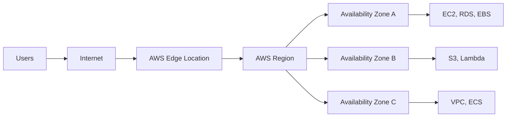

---

## Key Components

| Component | Purpose |
|-----------|----------|
| Cloud Computing | On-demand IT resources over the internet |
| AWS Region | Geographic location containing multiple Availability Zones |
| Availability Zone (AZ) | One or more isolated data centers within a Region |
| Edge Location | Global locations that cache and deliver content closer to users |
| Shared Responsibility Model | Defines security responsibilities between AWS and customers |

---

## Types (if applicable)

### Cloud Deployment Models

| Model | Description |
|--------|-------------|
| Public Cloud | Infrastructure shared among multiple customers (AWS, Azure, GCP) |
| Private Cloud | Dedicated infrastructure for one organization |
| Hybrid Cloud | Combination of on-premises and cloud resources |
| Multi-Cloud | Use of multiple cloud providers |

---

## Lifecycle / Workflow (if applicable)

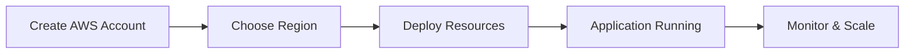

---

## Configuration / Syntax (if applicable)

Not applicable.

---

## Important Commands (if applicable)

AWS CLI examples:

```bash
aws configure

aws sts get-caller-identity

aws ec2 describe-regions

aws ec2 describe-availability-zones

aws s3 ls
```

---

## Important Files (if applicable)

```
~/.aws/config

~/.aws/credentials
```

---

## Real-World Use Cases

- Host web applications
- Deploy enterprise applications
- Disaster recovery
- Global content delivery
- Big data processing
- Machine learning workloads
- Backup and storage
- CI/CD infrastructure

---

## Advantages

- Pay-as-you-go pricing
- High availability
- Global infrastructure
- Elastic scalability
- Managed services
- Faster deployment
- Built-in security services
- Reduced operational overhead

---

## Limitations

- Internet connectivity required
- Vendor lock-in can occur
- Cost management requires monitoring
- Learning curve for cloud services
- Shared responsibility for security

---

## Common Interview Questions (Concept Only)

- What is Cloud Computing?
- What are the benefits of cloud computing?
- What are the cloud deployment models?
- What is AWS Global Infrastructure?
- What is the difference between a Region and an Availability Zone?
- What is an Edge Location?
- Why are multiple Availability Zones used?
- What is the AWS Shared Responsibility Model?
- Why should production workloads span multiple AZs?
- What is high availability in AWS?

---

## Common Mistakes

- Confusing Regions with Availability Zones
- Assuming AWS manages everything related to security
- Deploying production workloads in a single Availability Zone
- Choosing a Region without considering latency or compliance
- Assuming Edge Locations store all AWS resources

---

## Troubleshooting

| Problem | Cause | Solution |
|----------|-------|----------|
| High latency | Incorrect Region selected | Deploy resources closer to users |
| Single point of failure | Single AZ deployment | Deploy across multiple AZs |
| Compliance issues | Wrong Region | Choose a compliant Region |
| Slow content delivery | No CDN | Use Amazon CloudFront |
| Security misunderstanding | Misinterpreting Shared Responsibility | Understand AWS vs Customer responsibilities |

---

## Summary

Cloud Computing enables organizations to consume IT resources on demand without managing physical infrastructure. AWS provides a global infrastructure consisting of Regions, Availability Zones, and Edge Locations to deliver highly available, scalable, and low-latency services worldwide. Understanding the Shared Responsibility Model is essential for securing AWS workloads.

---

# Cloud Computing Concepts

## Overview

Cloud Computing provides computing resources over the internet instead of relying on on-premises infrastructure.

Resources include:

- Compute
- Storage
- Networking
- Databases
- Security
- Analytics
- AI/ML services

---

## Why It Is Used

- Reduce infrastructure costs
- Increase flexibility
- Improve scalability
- Accelerate deployments

---

## Architecture / Working

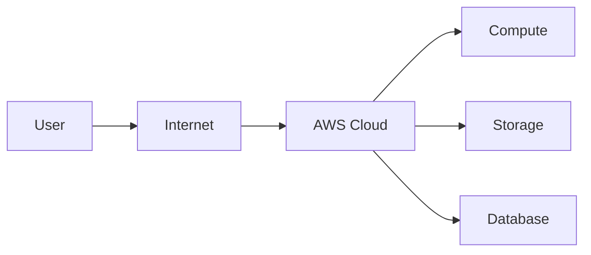

---

## Key Components

- Compute
- Storage
- Networking
- Database
- Security

---

## Types (if applicable)

### Service Models

| Model | Customer Manages | AWS Manages |
|--------|------------------|-------------|
| IaaS | OS, Applications, Data | Infrastructure |
| PaaS | Applications, Data | Platform + Infrastructure |
| SaaS | Uses Application | Everything else |

---

## Lifecycle / Workflow (if applicable)

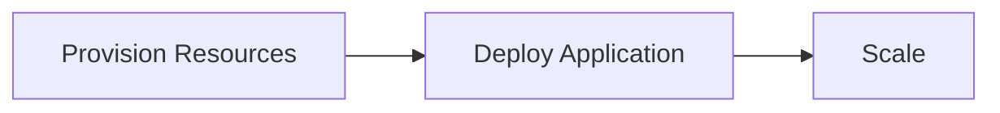

---

## Configuration / Syntax (if applicable)

Not applicable.

---

## Important Commands (if applicable)

Not applicable.

---

## Important Files (if applicable)

None.

---

## Real-World Use Cases

- Hosting applications
- Cloud storage
- Disaster recovery
- CI/CD

---

## Advantages

- Elastic
- Reliable
- Cost-effective

---

## Limitations

- Internet dependency

---

## Common Interview Questions (Concept Only)

- What is Cloud Computing?
- Explain IaaS, PaaS, and SaaS.

---

## Common Mistakes

- Mixing deployment models with service models.

---

## Troubleshooting

Choose the appropriate cloud service model based on application requirements.

---

## Summary

Cloud Computing provides scalable, on-demand IT resources over the internet.

---

# Global Infrastructure

## Overview

AWS Global Infrastructure is the worldwide network of Regions, Availability Zones, and Edge Locations that deliver AWS services.

---

## Why It Is Used

- Global application deployment
- Disaster recovery
- Low latency
- High availability

---

## Architecture / Working

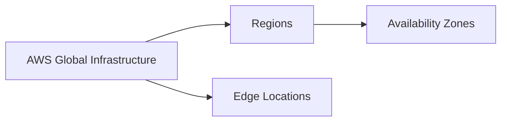

---

## Key Components

| Component | Purpose |
|-----------|----------|
| Region | Geographic location |
| Availability Zone | Isolated data centers |
| Edge Location | Content delivery |

---

## Types (if applicable)

- Regions
- Availability Zones
- Edge Locations

---

## Lifecycle / Workflow (if applicable)

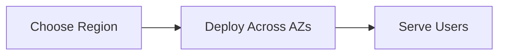

---

## Configuration / Syntax (if applicable)

None.

---

## Important Commands (if applicable)

```bash
aws ec2 describe-regions
```

---

## Important Files (if applicable)

None.

---

## Real-World Use Cases

- Multi-region applications
- Disaster recovery
- CDN

---

## Advantages

- Global reach
- Fault tolerance

---

## Limitations

- Data transfer costs

---

## Common Interview Questions (Concept Only)

- Explain AWS Global Infrastructure.

---

## Common Mistakes

- Deploying everything in one Region.

---

## Troubleshooting

Deploy workloads near users.

---

## Summary

AWS Global Infrastructure enables worldwide application deployment with high availability.

---

# Regions

## Overview

A Region is a **separate geographic area** that contains multiple Availability Zones.

Each Region operates independently.

---

## Why It Is Used

- Geographic distribution
- Compliance
- Low latency

---

## Architecture / Working

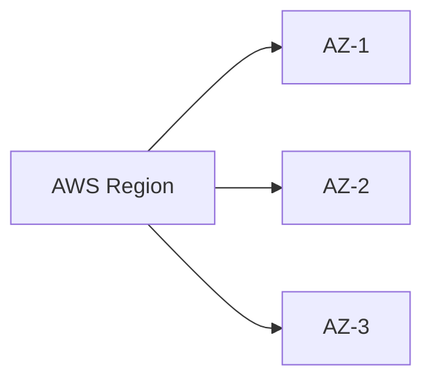

---

## Key Components

- Multiple AZs
- Independent infrastructure

---

## Types (if applicable)

Examples:

- us-east-1
- eu-west-1
- ap-south-1

---

## Lifecycle / Workflow (if applicable)

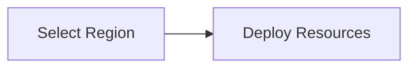

---

## Configuration / Syntax (if applicable)

Region selected during resource creation.

---

## Important Commands (if applicable)

```bash
aws configure

aws ec2 describe-regions
```

---

## Important Files (if applicable)

```
~/.aws/config
```

---

## Real-World Use Cases

- Country-specific deployments
- Disaster recovery

---

## Advantages

- Geographic isolation
- Compliance

---

## Limitations

- Cross-region data transfer costs

---

## Common Interview Questions (Concept Only)

- What is an AWS Region?
- Can Regions communicate?

---

## Common Mistakes

- Choosing distant Regions

---

## Troubleshooting

Verify Region selection before deployment.

---

## Summary

Regions provide geographic separation for AWS services.

---

# Availability Zones

## Overview

Availability Zones (AZs) are isolated data centers within a Region.

Each Region contains multiple AZs connected by high-speed networking.

---

## Why It Is Used

- High availability
- Fault tolerance
- Disaster recovery

---

## Architecture / Working

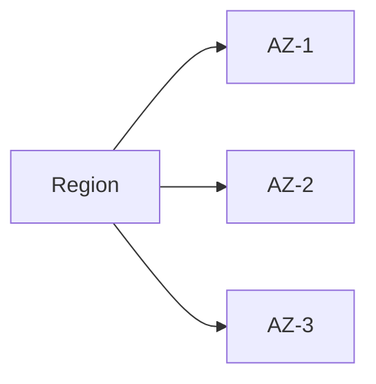

---

## Key Components

- Independent power
- Independent networking
- Independent cooling

---

## Types (if applicable)

Multiple AZs per Region.

---

## Lifecycle / Workflow (if applicable)

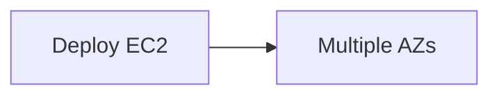

---

## Configuration / Syntax (if applicable)

Selected during deployment.

---

## Important Commands (if applicable)

```bash
aws ec2 describe-availability-zones
```

---

## Important Files (if applicable)

None.

---

## Real-World Use Cases

- Highly available applications
- Load-balanced architectures

---

## Advantages

- Fault isolation
- High availability

---

## Limitations

- Cross-AZ data transfer charges

---

## Common Interview Questions (Concept Only)

- What is an Availability Zone?
- Why deploy across multiple AZs?

---

## Common Mistakes

- Deploying production in one AZ.

---

## Troubleshooting

Distribute workloads across AZs.

---

## Summary

Availability Zones improve application resilience and availability.

---

# Edge Locations

## Overview

Edge Locations are AWS sites located closer to end users that cache content and reduce latency.

They are primarily used by services such as Amazon CloudFront and Route 53.

---

## Why It Is Used

- Faster content delivery
- Lower latency
- Improved user experience

---

## Architecture / Working

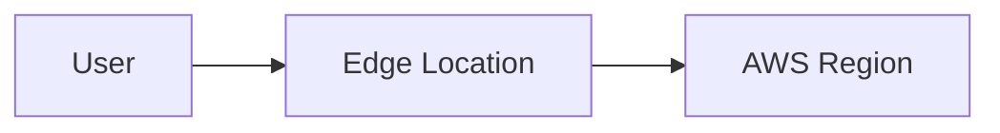

---

## Key Components

- CloudFront
- Route 53
- AWS Global Accelerator

---

## Types (if applicable)

- Content cache
- DNS endpoint

---

## Lifecycle / Workflow (if applicable)

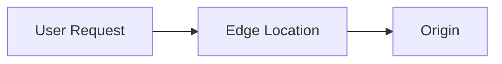

---

## Configuration / Syntax (if applicable)

Configured automatically by supported AWS services.

---

## Important Commands (if applicable)

None.

---

## Important Files (if applicable)

None.

---

## Real-World Use Cases

- CDN
- Video streaming
- Static websites

---

## Advantages

- Reduced latency
- Better performance

---

## Limitations

- Does not host full AWS services

---

## Common Interview Questions (Concept Only)

- What is an Edge Location?
- Difference between Edge Location and Region?

---

## Common Mistakes

- Assuming Edge Locations are Availability Zones.

---

## Troubleshooting

Use CloudFront for global content delivery.

---

## Summary

Edge Locations cache content closer to users for faster delivery.

---

# Shared Responsibility Model

## Overview

The AWS Shared Responsibility Model defines which security tasks are handled by AWS and which are handled by the customer.

> **Interview Tip**
>
> **AWS is responsible for Security OF the Cloud.**
>
> **Customers are responsible for Security IN the Cloud.**

---

## Why It Is Used

- Clearly defines security ownership
- Protects customer workloads
- Improves compliance

---

## Architecture / Working

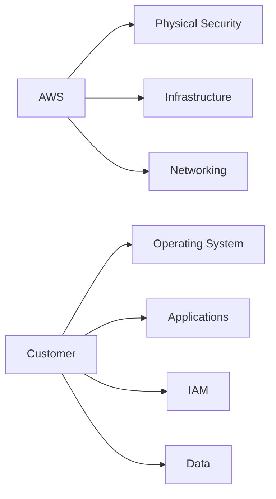

---

## Key Components

| AWS Responsibility | Customer Responsibility |
|--------------------|-------------------------|
| Data Centers | IAM Users |
| Hardware | Operating System |
| Networking | Security Groups |
| Virtualization | Application Security |
| Managed Services Infrastructure | Data Encryption |

---

## Types (if applicable)

- Security **of** the Cloud
- Security **in** the Cloud

---

## Lifecycle / Workflow (if applicable)

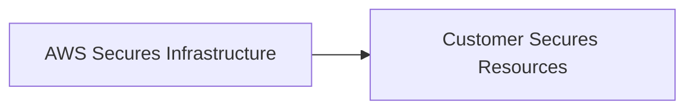

---

## Configuration / Syntax (if applicable)

Not applicable.

---

## Important Commands (if applicable)

```bash
aws iam list-users
```

---

## Important Files (if applicable)

None.

---

## Real-World Use Cases

- IAM configuration
- Data encryption
- Security Groups
- EC2 patch management

---

## Advantages

- Clear responsibility boundaries
- Better security governance

---

## Limitations

- Customers remain responsible for workload security

---

## Common Interview Questions (Concept Only)

- Explain the Shared Responsibility Model.
- Who patches EC2 operating systems?
- Who secures physical data centers?
- Who manages IAM users?
- Who secures customer data?

---

## Common Mistakes

- Assuming AWS patches EC2 operating systems.
- Believing AWS secures customer IAM configurations.
- Ignoring customer security responsibilities.

---

## Troubleshooting

Review whether an issue falls under AWS-managed infrastructure or customer-managed resources.

---

## Summary

The Shared Responsibility Model is a fundamental AWS security concept. AWS secures the underlying cloud infrastructure, while customers are responsible for securing their workloads, operating systems, applications, identities, and data.

---

# Interview Quick Revision

## AWS Global Infrastructure


---

## Shared Responsibility Model

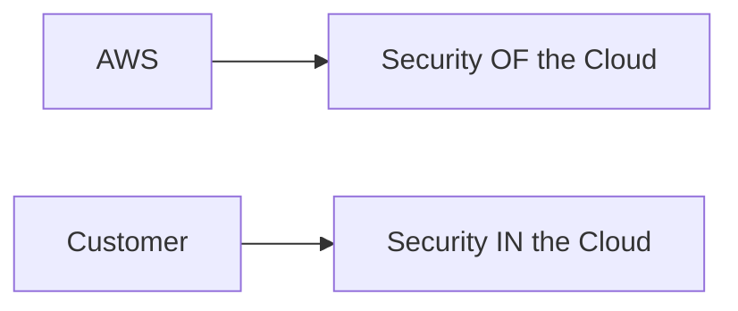

---

## Region vs Availability Zone vs Edge Location

| Feature | Region | Availability Zone | Edge Location |
|---------|--------|-------------------|---------------|
| Geographic Area | ✅ Yes | ❌ No | ❌ No |
| Contains Data Centers | ✅ Yes | ✅ Yes | Limited |
| Fault Isolation | Region Level | AZ Level | No |
| Used for CDN | ❌ No | ❌ No | ✅ Yes |
| Example | ap-south-1 | ap-south-1a | Mumbai Edge Location |

---

## Shared Responsibility Summary

| AWS Manages | Customer Manages |
|-------------|------------------|
| Physical Data Centers | IAM |
| Hardware | Operating System |
| Networking Infrastructure | Applications |
| Hypervisor | Security Groups |
| Global Infrastructure | Data |

---

## One-line Interview Answer

**AWS Cloud Computing provides scalable, on-demand infrastructure through a global network of Regions, Availability Zones, and Edge Locations, while the Shared Responsibility Model clearly divides security responsibilities between AWS (security of the cloud) and customers (security in the cloud).**
