# Identity & Access Management (IAM)

## Overview

AWS Identity and Access Management (IAM) is a global AWS service used to securely control **who can access AWS resources** and **what actions they can perform**.

IAM enables organizations to implement the **principle of least privilege**, ensuring users and applications receive only the permissions they require.

> **Interview Tip**
>
> IAM is one of the **most frequently asked AWS interview topics**. Be comfortable explaining **Users, Groups, Roles, Policies, MFA, and Permission Boundaries**.

---

## Why It Is Used

IAM helps organizations:

- Secure AWS accounts
- Control user access
- Manage permissions centrally
- Enable temporary access
- Protect sensitive resources
- Meet compliance requirements
- Support secure automation

---

## Architecture / Working

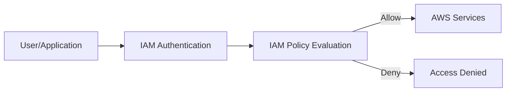

---

## Key Components

| Component | Purpose |
|-----------|----------|
| IAM User | Individual AWS identity |
| IAM Group | Collection of IAM users |
| IAM Role | Temporary identity with permissions |
| IAM Policy | JSON document defining permissions |
| Permission Boundary | Maximum permissions for an identity |
| MFA | Additional authentication factor |

---

## Types (if applicable)

### IAM Identities

| Identity | Used For |
|----------|----------|
| User | Human users |
| Group | Permission management |
| Role | Applications, AWS services, cross-account access |

---

## Lifecycle / Workflow

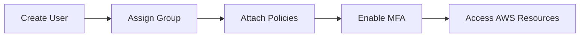

---

## Configuration / Syntax (if applicable)

IAM policies use JSON.

Example:

```json
{
  "Version": "2012-10-17",
  "Statement": [
    {
      "Effect": "Allow",
      "Action": "s3:*",
      "Resource": "*"
    }
  ]
}
```

---

## Important Commands (if applicable)

```bash
aws iam list-users

aws iam list-groups

aws iam list-roles

aws iam list-policies

aws sts get-caller-identity
```

---

## Important Files (if applicable)

```
~/.aws/config

~/.aws/credentials
```

---

## Real-World Use Cases

- Employee access management
- EC2 accessing S3
- Lambda accessing DynamoDB
- CI/CD authentication
- Cross-account access
- Temporary administrator access

---

## Advantages

- Centralized access management
- Fine-grained permissions
- Temporary credentials
- Secure authentication
- Global service
- Integration with AWS services

---

## Limitations

- Misconfigured policies can create security risks
- Complex permission evaluation
- Poor IAM design increases management overhead

---

## Common Interview Questions (Concept Only)

- What is IAM?
- Is IAM a global or regional service?
- Difference between IAM User and IAM Role?
- Difference between IAM Group and IAM Role?
- What is an IAM Policy?
- What is least privilege?
- What are Permission Boundaries?
- Why is MFA important?
- What is an Identity-based Policy?
- What is the default permission for a new IAM user?

---

## Common Mistakes

- Using the root account for daily tasks
- Sharing IAM user credentials
- Granting AdministratorAccess unnecessarily
- Not enabling MFA
- Using long-term credentials instead of roles
- Attaching policies directly to many users

---

## Troubleshooting

| Problem | Cause | Solution |
|----------|-------|----------|
| Access denied | Missing permissions | Verify attached IAM policies |
| MFA required | MFA not configured | Enable MFA for the user |
| EC2 cannot access S3 | Missing IAM Role | Attach correct IAM Role |
| User cannot assume role | Trust policy missing | Update role trust relationship |
| Unexpected permission | Multiple policies attached | Review effective permissions |

---

## Summary

IAM securely manages authentication and authorization in AWS using Users, Groups, Roles, Policies, Permission Boundaries, and MFA. Proper IAM design follows the principle of least privilege and uses roles whenever possible instead of long-term credentials.

---

# IAM Users

## Overview

An IAM User represents an individual person or application that requires permanent access to AWS.

Each user has unique credentials.

---

## Why It Is Used

- Individual access
- Audit user activities
- Separate credentials
- Fine-grained permissions

---

## Architecture / Working

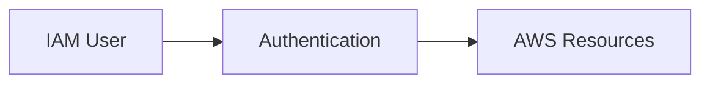

---

## Key Components

- Username
- Password
- Access Keys
- Policies

---

## Types (if applicable)

- Console User
- Programmatic User

---

## Lifecycle / Workflow

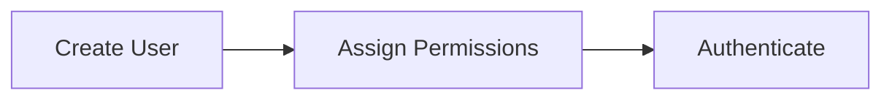

---

## Configuration / Syntax (if applicable)

Console or AWS CLI.

---

## Important Commands (if applicable)

```bash
aws iam create-user

aws iam list-users

aws iam delete-user
```

---

## Important Files (if applicable)

```
~/.aws/credentials
```

---

## Real-World Use Cases

- Developer access
- Administrator accounts

---

## Advantages

- Individual identity
- Easy auditing

---

## Limitations

- Long-term credentials require protection

---

## Common Interview Questions (Concept Only)

- What is an IAM User?
- When should IAM Users be used?

---

## Common Mistakes

- Sharing IAM users
- Using root account

---

## Troubleshooting

Verify attached permissions.

---

## Summary

IAM Users provide permanent identities for people or applications.

---

# IAM Groups

## Overview

IAM Groups are collections of IAM Users that share the same permissions.

Groups simplify permission management.

---

## Why It Is Used

- Permission management
- Role-based administration
- Reduce duplication

---

## Architecture / Working

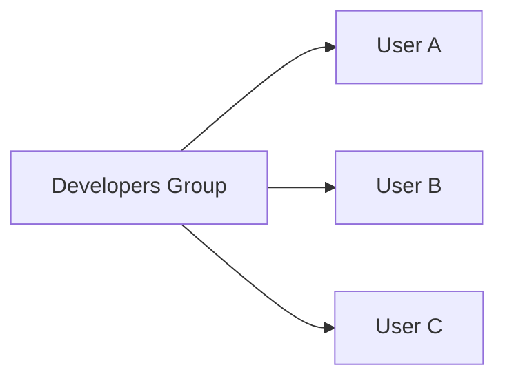

---

## Key Components

- Users
- Policies

---

## Types (if applicable)

Examples:

- Developers
- Administrators
- DevOps
- ReadOnly

---

## Lifecycle / Workflow


---

## Configuration / Syntax (if applicable)

Groups contain users only.

---

## Important Commands (if applicable)

```bash
aws iam create-group

aws iam add-user-to-group
```

---

## Important Files (if applicable)

None.

---

## Real-World Use Cases

- Developer teams
- Operations teams

---

## Advantages

- Easier permission management

---

## Limitations

- Cannot contain other groups

---

## Common Interview Questions (Concept Only)

- What is an IAM Group?
- Can Groups contain Groups?

---

## Common Mistakes

- Assigning permissions directly to users instead of groups

---

## Troubleshooting

Verify group membership.

---

## Summary

Groups simplify permission management for multiple IAM Users.

---

# IAM Roles

## Overview

IAM Roles provide **temporary AWS credentials** that can be assumed by users, AWS services, or external identities.

Unlike IAM Users, Roles have **no permanent credentials**.

> **Interview Tip**
>
> EC2, Lambda, ECS, and EKS should access AWS services using **IAM Roles**, not Access Keys.

---

## Why It Is Used

- Temporary credentials
- Cross-account access
- Service authentication
- Federated access

---

## Architecture / Working

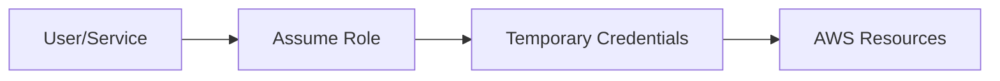

---

## Key Components

- Trust Policy
- Permission Policy
- Temporary Credentials

---

## Types (if applicable)

- Service Role
- Cross-Account Role
- Federated Role

---

## Lifecycle / Workflow

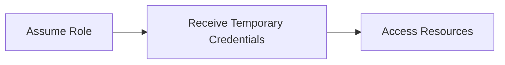

---

## Configuration / Syntax (if applicable)

Trust relationship required.

---

## Important Commands (if applicable)

```bash
aws iam create-role

aws sts assume-role
```

---

## Important Files (if applicable)

None.

---

## Real-World Use Cases

- EC2 → S3
- Lambda → DynamoDB
- Cross-account administration

---

## Advantages

- No long-term credentials
- Improved security

---

## Limitations

- Trust policy configuration required

---

## Common Interview Questions (Concept Only)

- What is an IAM Role?
- Difference between User and Role?
- What is AssumeRole?

---

## Common Mistakes

- Using Access Keys inside EC2 instances

---

## Troubleshooting

Verify trust policy.

---

## Summary

IAM Roles provide secure temporary credentials for AWS resources and users.

---

# IAM Policies

## Overview

IAM Policies define permissions using JSON documents.

Policies specify:

- Who
- What action
- Which resource
- Allow or Deny

---

## Why It Is Used

- Fine-grained permissions
- Access control

---

## Architecture / Working

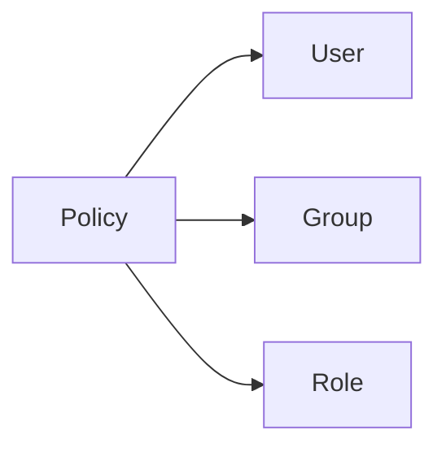

---

## Key Components

- Effect
- Action
- Resource
- Condition

---

## Types (if applicable)

| Policy Type | Description |
|-------------|-------------|
| AWS Managed | Created by AWS |
| Customer Managed | Created by customer |
| Inline | Embedded directly into identity |

---

## Lifecycle / Workflow

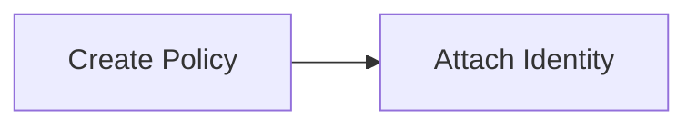

---

## Configuration / Syntax (if applicable)

JSON policy.

---

## Important Commands (if applicable)

```bash
aws iam create-policy

aws iam list-policies
```

---

## Important Files (if applicable)

JSON files.

---

## Real-World Use Cases

- S3 access
- EC2 permissions
- IAM administration

---

## Advantages

- Granular access

---

## Limitations

- Complex evaluation

---

## Common Interview Questions (Concept Only)

- Types of IAM Policies?
- Explicit Deny vs Allow?

---

## Common Mistakes

- Using wildcard permissions

---

## Troubleshooting

Use IAM Policy Simulator.

---

## Summary

Policies define what AWS actions identities can perform.

---

# Permission Boundaries

## Overview

Permission Boundaries define the **maximum permissions** an IAM User or Role can receive.

Even if an attached policy grants additional permissions, the boundary limits the effective permissions.

---

## Why It Is Used

- Restrict delegated administration
- Prevent privilege escalation

---

## Architecture / Working

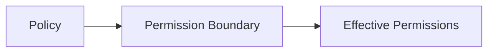

---

## Key Components

- Boundary Policy
- Identity Policy

---

## Types (if applicable)

- Managed Policy Boundary

---

## Lifecycle / Workflow

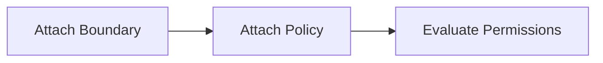

---

## Configuration / Syntax (if applicable)

Managed policy.

---

## Important Commands (if applicable)

```bash
aws iam put-user-permissions-boundary
```

---

## Important Files (if applicable)

JSON policy.

---

## Real-World Use Cases

- Developer self-service IAM

---

## Advantages

- Prevents excessive permissions

---

## Limitations

- Does not grant permissions

---

## Common Interview Questions (Concept Only)

- What is a Permission Boundary?

---

## Common Mistakes

- Assuming boundaries grant permissions

---

## Troubleshooting

Verify both policy and boundary.

---

## Summary

Permission Boundaries limit the maximum permissions an identity can obtain.

---

# Multi-Factor Authentication (MFA)

## Overview

MFA adds an additional authentication factor beyond username and password.

Users must provide:

- Password
- One-time verification code

---

## Why It Is Used

- Improve account security
- Protect privileged accounts
- Prevent credential theft

---

## Architecture / Working

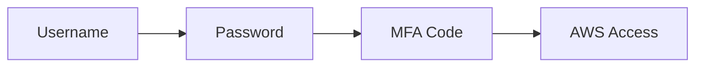

---

## Key Components

- Password
- MFA Device
- Verification Code

---

## Types (if applicable)

- Virtual MFA
- Hardware MFA
- FIDO Security Key

---

## Lifecycle / Workflow

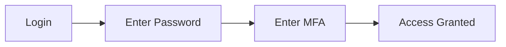

---

## Configuration / Syntax (if applicable)

Configured per IAM User.

---

## Important Commands (if applicable)

```bash
aws iam list-mfa-devices
```

---

## Important Files (if applicable)

None.

---

## Real-World Use Cases

- Administrator login
- Root account protection

---

## Advantages

- Strong authentication
- Reduced credential theft

---

## Limitations

- Requires MFA device

---

## Common Interview Questions (Concept Only)

- Why use MFA?
- Should MFA be enabled for root users?

---

## Common Mistakes

- Leaving administrator accounts without MFA

---

## Troubleshooting

Reconfigure lost MFA device using AWS recovery procedures.

---

## Summary

MFA significantly improves AWS account security by requiring an additional verification factor.

---

# Interview Quick Revision

## IAM Components

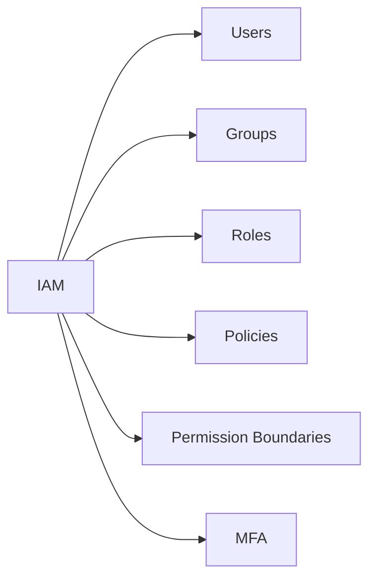

---

## IAM User vs IAM Role

| IAM User | IAM Role |
|-----------|----------|
| Permanent identity | Temporary identity |
| Long-term credentials | Temporary credentials |
| Used by people | Used by AWS services, users, applications |
| Access Keys supported | No permanent Access Keys |

---

## IAM Policy Types

| Type | Created By |
|------|------------|
| AWS Managed | AWS |
| Customer Managed | Customer |
| Inline | Attached directly to one identity |

---

## IAM Best Practices

- Never use the root account for daily work.
- Enable MFA for the root account and all privileged IAM users.
- Grant least privilege permissions.
- Prefer IAM Roles over long-term Access Keys.
- Assign permissions to Groups instead of individual Users whenever possible.
- Rotate Access Keys regularly.
- Use Customer Managed Policies for reusable permission sets.
- Avoid wildcard (`*`) permissions unless absolutely necessary.

---

## One-line Interview Answer

**AWS IAM is a global service that securely manages authentication and authorization using Users, Groups, Roles, Policies, Permission Boundaries, and MFA, enabling organizations to implement least privilege access and protect AWS resources.**
