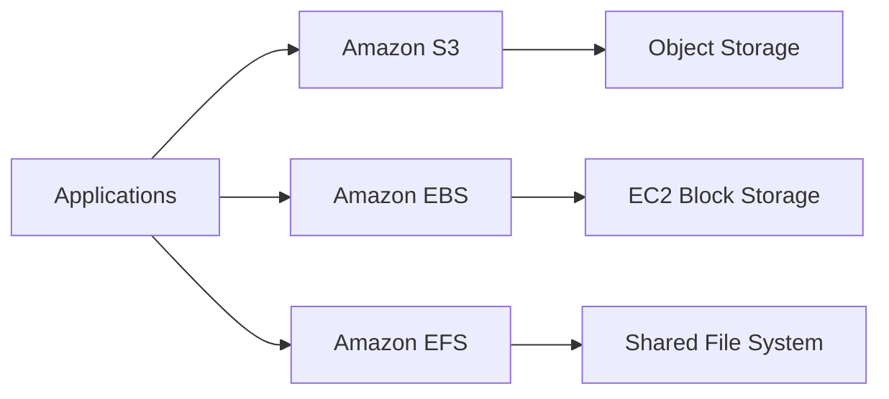
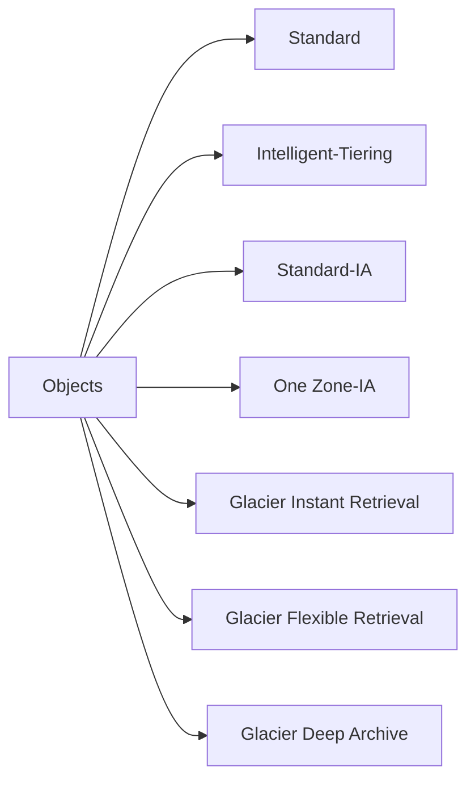
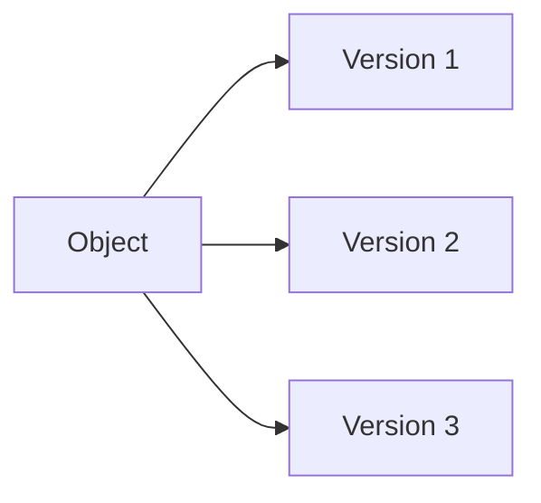
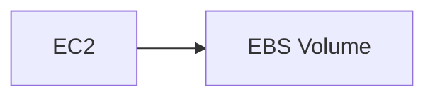
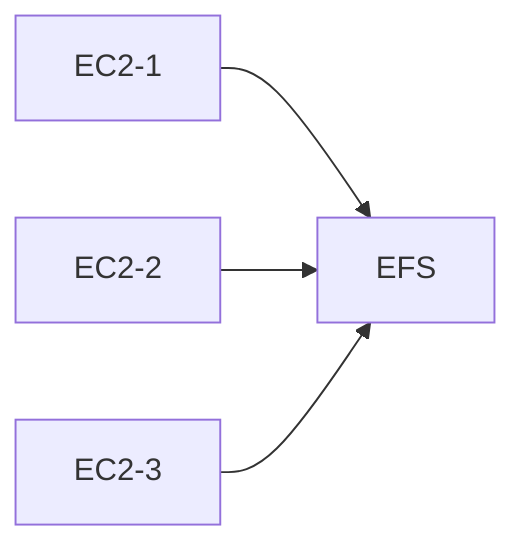
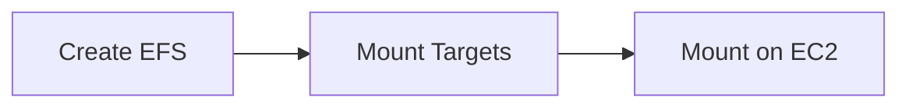
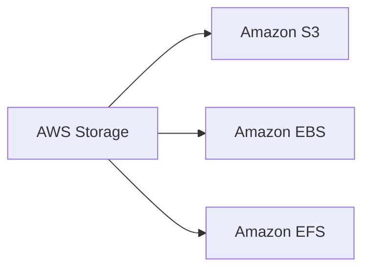

# Storage Services

## Overview

AWS Storage Services provide scalable, durable, and secure storage solutions for different workloads. AWS offers object storage, block storage, and file storage depending on the application requirements.

The three most commonly used storage services are:

- Amazon S3 (Object Storage)
- Amazon EBS (Block Storage)
- Amazon EFS (File Storage)

> **Interview Tip**
>
> One of the most common interview questions is:
>
> **"When would you choose S3, EBS, or EFS?"**
>
> Always remember:
>
> - **S3 → Object Storage**
> - **EBS → Block Storage**
> - **EFS → Shared File Storage**

---

## Why It Is Used

AWS Storage Services are used to:

- Store application files
- Host static websites
- Store backups
- Persist EC2 data
- Share files across multiple EC2 instances
- Store logs
- Archive data
- Store media files

---

## Architecture / Working



---

## Key Components

| Service | Storage Type | Used With |
|----------|--------------|-----------|
| Amazon S3 | Object | Applications |
| Amazon EBS | Block | EC2 |
| Amazon EFS | File | Multiple EC2 Instances |

---

## Types (if applicable)

| Storage Type | AWS Service |
|--------------|-------------|
| Object Storage | Amazon S3 |
| Block Storage | Amazon EBS |
| File Storage | Amazon EFS |

---

## Lifecycle / Workflow


---

## Configuration / Syntax (if applicable)

Storage services are configured through:

- AWS Console
- AWS CLI
- SDK
- CloudFormation
- Terraform

---

## Important Commands (if applicable)

```bash
aws s3 ls

aws s3 cp

aws ec2 describe-volumes

aws efs describe-file-systems
```

---

## Important Files (if applicable)

Linux mount points

```
/mnt/efs

/data

/backup
```

---

## Real-World Use Cases

- Website hosting
- Database storage
- Shared application storage
- Log storage
- Backup storage
- Disaster recovery

---

## Advantages

- Highly durable
- Scalable
- Managed service
- Secure
- Cost effective

---

## Limitations

- Choosing the wrong storage type impacts cost and performance
- Some services are AZ specific

---

## Common Interview Questions (Concept Only)

- Difference between S3, EBS and EFS?
- Which storage service is object storage?
- Which storage is shared?
- Which storage is attached to EC2?
- Which storage is persistent?

---

## Common Mistakes

- Using EBS for shared storage
- Using EFS for object storage
- Making S3 buckets public accidentally
- Forgetting lifecycle policies

---

## Troubleshooting

| Problem | Solution |
|----------|----------|
| EC2 cannot access EBS | Verify attachment |
| S3 access denied | Check IAM and Bucket Policy |
| EFS not mounting | Verify Mount Targets and Security Groups |

---

## Summary

AWS provides object, block, and file storage solutions. Choosing the correct storage service is essential for performance, scalability, and cost optimization.

---

# Amazon S3

## Overview

Amazon Simple Storage Service (Amazon S3) is AWS's highly durable, scalable object storage service.

Objects are stored inside buckets.

Each object consists of:

- Data
- Metadata
- Object Key

> **Interview Tip**
>
> S3 provides **11 9's (99.999999999%) durability**.

---

## Why It Is Used

- Backup
- Static website hosting
- Application assets
- Log storage
- Media files
- Data lakes

---

## Architecture / Working


---

## Key Components

| Component | Description |
|------------|-------------|
| Bucket | Storage container |
| Object | Stored file |
| Object Key | Unique object name |
| Metadata | Object information |

---

## Types (if applicable)

Buckets can store:

- Images
- Videos
- Documents
- Logs
- Backups

---

## Lifecycle / Workflow


---

## Configuration / Syntax (if applicable)

Bucket names must be globally unique.

---

## Important Commands (if applicable)

```bash
aws s3 ls

aws s3 mb s3://mybucket

aws s3 cp file.txt s3://mybucket

aws s3 rm s3://mybucket/file.txt
```

---

## Important Files (if applicable)

None.

---

## Real-World Use Cases

- Website hosting
- Backup
- CloudFront origin
- Log archive

---

## Advantages

- Unlimited storage
- Highly durable
- Low cost

---

## Limitations

- Not a file system
- Not block storage

---

## Common Interview Questions (Concept Only)

- What is Amazon S3?
- What is an Object?
- What is a Bucket?
- Is S3 regional?
- Can S3 host static websites?

---

## Common Mistakes

- Public buckets
- Poor bucket naming

---

## Troubleshooting

Verify IAM permissions and bucket policies.

---

## Summary

Amazon S3 is AWS's scalable object storage service.

---

# S3 Storage Classes

## Overview

Storage Classes optimize cost based on access frequency.

---

## Why It Is Used

- Reduce storage costs
- Archive infrequently used data

---

## Architecture / Working



---

## Key Components

| Storage Class | Use Case |
|---------------|----------|
| Standard | Frequently accessed |
| Intelligent-Tiering | Unknown access pattern |
| Standard-IA | Infrequent access |
| One Zone-IA | Low-cost single AZ |
| Glacier Instant Retrieval | Archive with milliseconds retrieval |
| Glacier Flexible Retrieval | Long-term archive |
| Glacier Deep Archive | Lowest-cost archival |

---

## Types (if applicable)

See table above.

---

## Lifecycle / Workflow


---

## Configuration / Syntax (if applicable)

Selected during upload or lifecycle transition.

---

## Important Commands (if applicable)

```bash
aws s3 cp file.txt s3://bucket --storage-class STANDARD_IA
```

---

## Important Files (if applicable)

None.

---

## Real-World Use Cases

- Log archives
- Compliance
- Backup

---

## Advantages

- Cost optimization

---

## Limitations

- Retrieval charges for archive classes

---

## Common Interview Questions (Concept Only)

- Difference between Standard and Glacier?
- When should Intelligent-Tiering be used?

---

## Common Mistakes

- Archiving frequently accessed data

---

## Troubleshooting

Verify lifecycle configuration.

---

## Summary

Storage Classes help optimize storage costs.

---

# Bucket Policies

## Overview

Bucket Policies are JSON documents that control access to S3 buckets.

---

## Why It Is Used

- Grant cross-account access
- Restrict bucket access
- Allow public access when required

---

## Architecture / Working


---

## Key Components

- Effect
- Action
- Resource
- Principal
- Condition

---

## Types (if applicable)

- Allow
- Deny

---

## Lifecycle / Workflow


---

## Configuration / Syntax (if applicable)

Uses JSON.

---

## Important Commands (if applicable)

```bash
aws s3api get-bucket-policy
```

---

## Important Files (if applicable)

Policy JSON

---

## Real-World Use Cases

- Static websites
- Cross-account access

---

## Advantages

- Fine-grained permissions

---

## Limitations

- Incorrect policies can expose data

---

## Common Interview Questions (Concept Only)

- Difference between Bucket Policy and IAM Policy?

---

## Common Mistakes

- Public bucket access

---

## Troubleshooting

Use IAM Policy Simulator and review bucket policy.

---

## Summary

Bucket Policies provide resource-level access control for S3.

---

# Object Versioning

## Overview

Versioning stores multiple versions of an object in the same bucket.

---

## Why It Is Used

- Recover deleted files
- Protect against accidental overwrite
- Maintain history

---

## Architecture / Working



---

## Key Components

- Version ID
- Delete Marker

---

## Types (if applicable)

- Enabled
- Suspended

---

## Lifecycle / Workflow


---

## Configuration / Syntax (if applicable)

Enable versioning on bucket.

---

## Important Commands (if applicable)

```bash
aws s3api put-bucket-versioning
```

---

## Important Files (if applicable)

None.

---

## Real-World Use Cases

- Backup
- Recovery

---

## Advantages

- Prevents data loss

---

## Limitations

- Increased storage costs

---

## Common Interview Questions (Concept Only)

- What is S3 Versioning?

---

## Common Mistakes

- Forgetting storage cost increases

---

## Troubleshooting

Verify versioning status.

---

## Summary

Versioning protects against accidental deletion and overwrites.

---

# Lifecycle Policies

## Overview

Lifecycle Policies automatically transition or delete objects.

---

## Why It Is Used

- Reduce storage costs
- Archive old data
- Delete obsolete objects

---

## Architecture / Working


---

## Key Components

- Transition
- Expiration

---

## Types (if applicable)

- Transition Rule
- Expiration Rule

---

## Lifecycle / Workflow


---

## Configuration / Syntax (if applicable)

Configured at bucket level.

---

## Important Commands (if applicable)

```bash
aws s3api get-bucket-lifecycle-configuration
```

---

## Important Files (if applicable)

JSON policy.

---

## Real-World Use Cases

- Backup retention
- Log management

---

## Advantages

- Automatic cost savings

---

## Limitations

- Rule evaluation delay

---

## Common Interview Questions (Concept Only)

- What are Lifecycle Policies?

---

## Common Mistakes

- Incorrect expiration rules

---

## Troubleshooting

Review lifecycle configuration.

---

## Summary

Lifecycle Policies automate storage optimization.

---

# Amazon EBS

## Overview

Amazon Elastic Block Store (EBS) provides persistent block storage for EC2 instances.

---

## Why It Is Used

- Boot volumes
- Database storage
- Persistent disks

---

## Architecture / Working



---

## Key Components

- Volume
- Snapshot

---

## Types (if applicable)

- gp3
- io2
- st1
- sc1

---

## Lifecycle / Workflow


---

## Configuration / Syntax (if applicable)

Attached to EC2.

---

## Important Commands (if applicable)

```bash
aws ec2 describe-volumes
```

---

## Important Files (if applicable)

```
/dev/xvda
```

---

## Real-World Use Cases

- Databases
- Application storage

---

## Advantages

- Persistent
- High performance

---

## Limitations

- Limited to one Availability Zone

---

## Common Interview Questions (Concept Only)

- What is EBS?
- Difference between EBS and EFS?

---

## Common Mistakes

- Assuming EBS is shared storage

---

## Troubleshooting

Verify attachment and mount status.

---

## Summary

EBS provides persistent block storage for EC2 instances.

---

# Amazon EFS

## Overview

Amazon Elastic File System (EFS) is a fully managed, scalable Network File System (NFS) that can be mounted by multiple EC2 instances simultaneously.

---

## Why It Is Used

- Shared storage
- Kubernetes
- Web servers
- CMS platforms

---

## Architecture / Working



---

## Key Components

- File System
- Mount Target
- NFS

---

## Types (if applicable)

- Standard
- One Zone

---

## Lifecycle / Workflow



---

## Configuration / Syntax (if applicable)

Mounted using NFS.

---

## Important Commands (if applicable)

```bash
mount -t nfs4 <efs-endpoint>:/ /mnt/efs
```

---

## Important Files (if applicable)

```
/etc/fstab
```

---

## Real-World Use Cases

- Shared web content
- Kubernetes persistent storage
- WordPress

---

## Advantages

- Shared storage
- Auto scaling
- Managed service

---

## Limitations

- Higher latency than EBS
- More expensive than S3 for large object storage

---

## Common Interview Questions (Concept Only)

- What is Amazon EFS?
- Difference between EBS and EFS?
- Can multiple EC2 instances mount EFS?

---

## Common Mistakes

- Using EFS for databases requiring low latency

---

## Troubleshooting

Verify mount targets, NFS port (2049), and Security Groups.

---

## Summary

Amazon EFS provides scalable shared file storage that can be accessed simultaneously by multiple EC2 instances.

---

# Interview Quick Revision

## AWS Storage Services



---

## Storage Comparison

| Feature | Amazon S3 | Amazon EBS | Amazon EFS |
|----------|-----------|------------|------------|
| Storage Type | Object | Block | File |
| Mountable | ❌ No | ✅ Yes | ✅ Yes |
| Shared Storage | ❌ No | ❌ No | ✅ Yes |
| Attached to EC2 | ❌ No | ✅ Yes | ✅ Yes |
| Multiple EC2 Access | ❌ No | ❌ No | ✅ Yes |
| Durability | Very High (11 9's) | High | High |
| Primary Use | Backups, Static Content | OS, Databases | Shared Files |

---

## S3 Storage Classes

| Storage Class | Best For |
|---------------|----------|
| Standard | Frequently accessed data |
| Intelligent-Tiering | Unknown access patterns |
| Standard-IA | Infrequently accessed data |
| One Zone-IA | Cost-sensitive, non-critical data |
| Glacier Instant Retrieval | Archived data with fast retrieval |
| Glacier Flexible Retrieval | Long-term archives |
| Glacier Deep Archive | Lowest-cost long-term storage |

---

## AWS Storage Best Practices

- Use **S3** for object storage, backups, logs, and static content.
- Use **EBS** for EC2 operating systems, databases, and applications requiring low-latency block storage.
- Use **EFS** when multiple EC2 instances need concurrent access to the same files.
- Enable **S3 Versioning** to protect against accidental deletion and overwrites.
- Configure **Lifecycle Policies** to automatically transition or delete old objects.
- Follow the **principle of least privilege** with Bucket Policies and IAM Policies.
- Avoid making S3 buckets publicly accessible unless absolutely required.
- Regularly create **EBS Snapshots** for backup and disaster recovery.
- Choose the appropriate **S3 Storage Class** based on access patterns to optimize costs.

---

## One-line Interview Answer

**AWS Storage Services provide scalable object (Amazon S3), block (Amazon EBS), and shared file (Amazon EFS) storage solutions, enabling organizations to build secure, durable, highly available, and cost-effective cloud applications while selecting the right storage type based on workload requirements.**
