# DNS & Content Delivery

## Overview

AWS provides highly available DNS and content delivery services through:

- **Amazon Route 53** – Managed DNS service for domain registration, DNS routing, and health checks.
- **Amazon CloudFront** – Global Content Delivery Network (CDN) that caches and delivers content with low latency.

These services improve **application availability, performance, scalability, and user experience**.

> **Interview Tip**
>
> Frequently asked interview topics:
>
> - Route 53 Routing Policies
> - Hosted Zones
> - DNS Record Types
> - Health Checks
> - CloudFront Caching
> - Route 53 vs CloudFront

---

## Why It Is Used

AWS DNS and CDN services help to:

- Resolve domain names
- Route traffic efficiently
- Improve website performance
- Reduce latency
- Increase availability
- Protect against failures
- Deliver static and dynamic content globally

---

## Architecture / Working

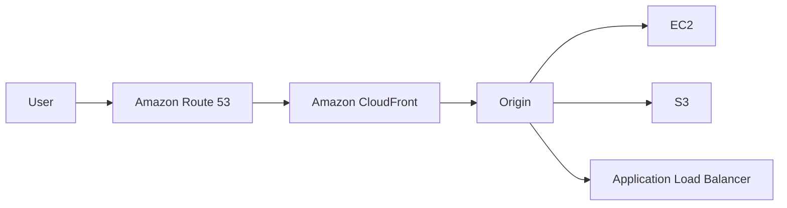

---

## Key Components

| Component | Purpose |
|-----------|----------|
| Route 53 | DNS Resolution |
| Hosted Zone | Stores DNS records |
| DNS Record | Maps domain to resources |
| Health Check | Monitors endpoint health |
| CloudFront | Global CDN |
| Edge Location | Cached content delivery |
| Origin | Original content source |

---

## Types (if applicable)

### Route 53 Routing Policies

| Policy | Purpose |
|----------|----------|
| Simple | Single resource |
| Weighted | Traffic distribution |
| Latency | Lowest latency |
| Failover | High availability |
| Geolocation | Geographic routing |
| Geoproximity | Location-based routing |
| Multi-Value Answer | Multiple healthy IPs |

> **Interview Focus**
>
> Most interviews cover:
>
> - Simple
> - Weighted
> - Latency
> - Failover

---

## Lifecycle / Workflow

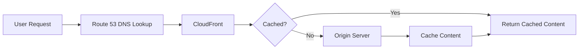

---

## Configuration / Syntax (if applicable)

Typical deployment:

1. Register domain
2. Create Hosted Zone
3. Add DNS records
4. Configure CloudFront
5. Configure Origin
6. Enable HTTPS
7. Configure Health Checks

---

## Important Commands (if applicable)

```bash
aws route53 list-hosted-zones

aws route53 list-resource-record-sets

aws cloudfront list-distributions

aws cloudfront get-distribution
```

---

## Important Files (if applicable)

None.

---

## Real-World Use Cases

- Company websites
- Global applications
- Static websites
- APIs
- Video streaming
- E-commerce
- Disaster recovery

---

## Advantages

- Highly available DNS
- Global CDN
- Low latency
- Automatic failover
- Improved website performance
- DDoS protection integration

---

## Limitations

- CloudFront cache invalidation may incur additional cost
- DNS changes require propagation time
- Complex routing policies require careful planning

---

## Common Interview Questions (Concept Only)

- What is Amazon Route 53?
- Why is it called Route 53?
- What is a Hosted Zone?
- What are DNS Records?
- What are Routing Policies?
- What is CloudFront?
- What is an Edge Location?
- Difference between Route 53 and CloudFront?
- What are Health Checks?
- What is an Origin Server?

---

## Common Mistakes

- Incorrect DNS records
- Wrong hosted zone selection
- Forgetting cache invalidation
- Misconfigured CloudFront origin
- Incorrect health check endpoint

---

## Troubleshooting

| Problem | Solution |
|----------|----------|
| Domain not resolving | Verify DNS records and Hosted Zone |
| Website unavailable | Check Route 53 Health Check status |
| Old content displayed | Invalidate CloudFront cache |
| Slow website | Verify CloudFront distribution and caching |
| SSL errors | Check ACM certificate configuration |

---

## Summary

Amazon Route 53 provides highly available DNS services, while Amazon CloudFront accelerates content delivery using a global network of Edge Locations. Together, they improve application availability, performance, and scalability.

---

# Amazon Route 53

## Overview

Amazon Route 53 is AWS's fully managed Domain Name System (DNS) service.

It provides:

- Domain registration
- DNS resolution
- Traffic routing
- Health monitoring

---

## Why It Is Used

- Resolve domain names
- Route traffic
- Improve availability
- Failover routing
- Domain registration

---

## Architecture / Working

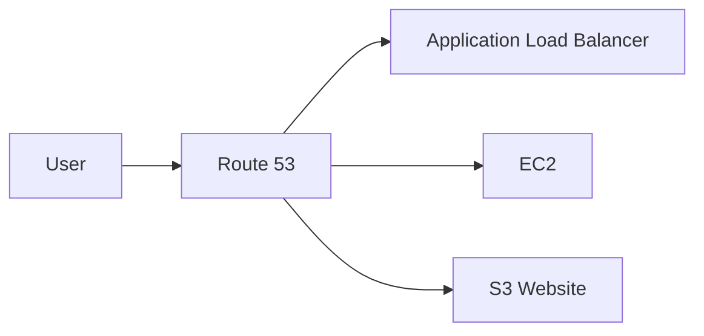

---

## Key Components

- Domain
- Hosted Zone
- Record Set
- Routing Policy
- Health Check

---

## Types (if applicable)

Routing policies include:

- Simple
- Weighted
- Latency
- Failover
- Geolocation
- Multi-Value Answer

---

## Lifecycle / Workflow

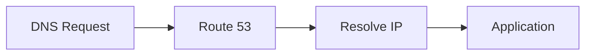

---

## Configuration / Syntax (if applicable)

Typical steps:

1. Register domain
2. Create Hosted Zone
3. Add DNS records

---

## Important Commands (if applicable)

```bash
aws route53 list-hosted-zones
```

---

## Important Files (if applicable)

None.

---

## Real-World Use Cases

- Company websites
- APIs
- Multi-region applications

---

## Advantages

- Highly available
- Global
- Managed service

---

## Limitations

- DNS propagation delays

---

## Common Interview Questions (Concept Only)

- What is Route 53?
- Why is it called Route 53?

---

## Common Mistakes

- Incorrect record type

---

## Troubleshooting

Verify Hosted Zone configuration.

---

## Summary

Amazon Route 53 provides scalable and reliable DNS services.

---

# Hosted Zones

## Overview

A Hosted Zone is a container for DNS records associated with a domain.

It defines how Route 53 responds to DNS queries.

---

## Why It Is Used

- Store DNS records
- Manage domain configuration

---

## Architecture / Working

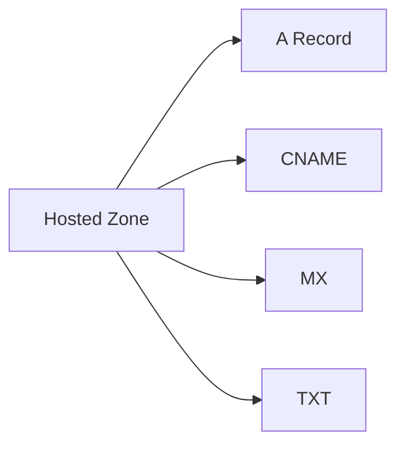

---

## Key Components

- Public Hosted Zone
- Private Hosted Zone

---

## Types (if applicable)

| Type | Purpose |
|------|----------|
| Public Hosted Zone | Internet-accessible domains |
| Private Hosted Zone | Internal VPC DNS |

---

## Lifecycle / Workflow

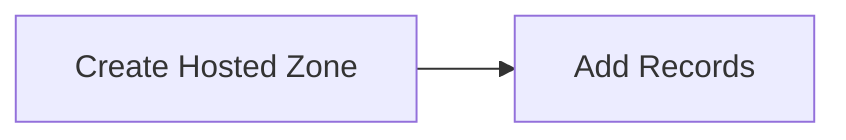

---

## Configuration / Syntax (if applicable)

Associated with one domain.

---

## Important Commands (if applicable)

```bash
aws route53 list-hosted-zones
```

---

## Important Files (if applicable)

None.

---

## Real-World Use Cases

- Public websites
- Internal corporate DNS

---

## Advantages

- Easy DNS management

---

## Limitations

- Domain-specific

---

## Common Interview Questions (Concept Only)

- What is a Hosted Zone?

---

## Common Mistakes

- Using Public instead of Private Hosted Zone

---

## Troubleshooting

Verify NS records.

---

## Summary

Hosted Zones store DNS records for a domain.

---

# DNS Records

## Overview

DNS records map domain names to AWS resources.

---

## Why It Is Used

- Domain resolution
- Email routing
- Service discovery

---

## Architecture / Working

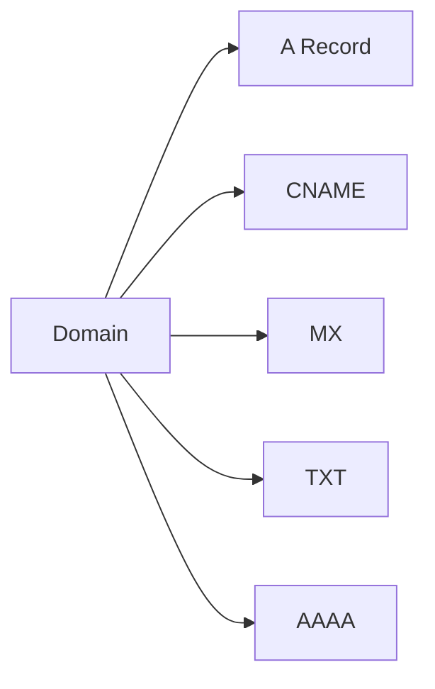

---

## Key Components

Common records:

- A
- AAAA
- CNAME
- MX
- TXT
- NS
- Alias

---

## Types (if applicable)

| Record | Purpose |
|---------|----------|
| A | IPv4 |
| AAAA | IPv6 |
| CNAME | Alias |
| MX | Mail |
| TXT | Verification |
| NS | Name Server |
| Alias | AWS Resources |

---

## Lifecycle / Workflow

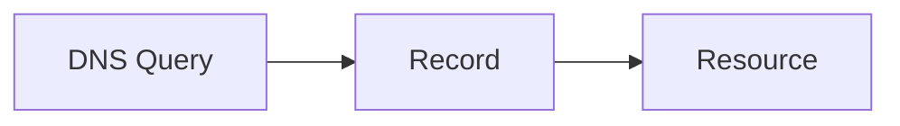

---

## Configuration / Syntax (if applicable)

Configured inside Hosted Zone.

---

## Important Commands (if applicable)

```bash
aws route53 list-resource-record-sets
```

---

## Important Files (if applicable)

None.

---

## Real-World Use Cases

- Website hosting
- Email routing

---

## Advantages

- Flexible

---

## Limitations

- DNS propagation

---

## Common Interview Questions (Concept Only)

- Difference between A Record and CNAME?
- What is an Alias Record?

---

## Common Mistakes

- Using CNAME at zone apex instead of Alias

---

## Troubleshooting

Verify DNS record values.

---

## Summary

DNS records map domains to AWS resources.

---

# Health Checks

## Overview

Route 53 Health Checks monitor application endpoints.

Traffic is routed only to healthy resources.

---

## Why It Is Used

- High availability
- Automatic failover

---

## Architecture / Working

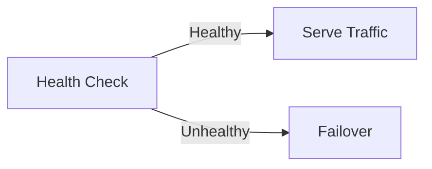

---

## Key Components

- Endpoint
- Interval
- Threshold

---

## Types (if applicable)

- HTTP
- HTTPS
- TCP

---

## Lifecycle / Workflow

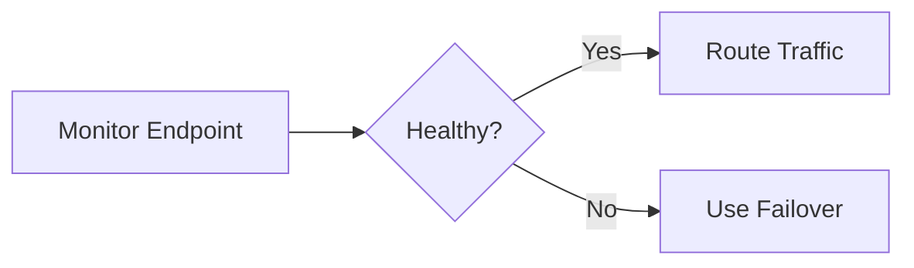

---

## Configuration / Syntax (if applicable)

Configured in Route 53.

---

## Important Commands (if applicable)

Health Checks are primarily managed through the AWS Console or CLI APIs.

---

## Important Files (if applicable)

None.

---

## Real-World Use Cases

- Disaster recovery
- Multi-region applications

---

## Advantages

- Automatic failover

---

## Limitations

- Additional cost

---

## Common Interview Questions (Concept Only)

- What is Route 53 Health Check?

---

## Common Mistakes

- Wrong endpoint path

---

## Troubleshooting

Verify endpoint availability.

---

## Summary

Health Checks monitor endpoint health for intelligent DNS routing.

---

# Amazon CloudFront

## Overview

Amazon CloudFront is AWS's global Content Delivery Network (CDN).

It caches content at Edge Locations close to users.

This reduces latency and improves application performance.

---

## Why It Is Used

- Faster content delivery
- Lower latency
- Reduced origin load
- Improved scalability
- Global distribution

---

## Architecture / Working

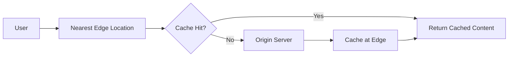

---

## Key Components

- Distribution
- Origin
- Edge Location
- Cache
- Cache Behavior

---

## Types (if applicable)

Origin examples:

- Amazon S3
- EC2
- Application Load Balancer
- API Gateway

---

## Lifecycle / Workflow

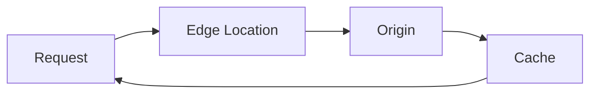

---

## Configuration / Syntax (if applicable)

Requires:

- Distribution
- Origin
- Cache Policy

---

## Important Commands (if applicable)

```bash
aws cloudfront list-distributions
```

---

## Important Files (if applicable)

None.

---

## Real-World Use Cases

- Static websites
- Video streaming
- APIs
- Software downloads
- Images and media

---

## Advantages

- Global performance
- Reduced latency
- Secure content delivery
- DDoS protection integration
- Lower origin server load

---

## Limitations

- Cache invalidation may increase costs
- Dynamic content benefits less from caching

---

## Common Interview Questions (Concept Only)

- What is CloudFront?
- What is an Edge Location?
- What is an Origin?
- Why use CloudFront with S3?

---

## Common Mistakes

- Not configuring cache behaviors correctly
- Frequent cache invalidations

---

## Troubleshooting

- Verify Origin health.
- Check cache settings.
- Perform cache invalidation if required.
- Verify SSL certificate configuration.

---

## Summary

Amazon CloudFront improves application performance by caching content at global Edge Locations and delivering it from the location nearest to users.

---

# Interview Quick Revision

## Route 53 + CloudFront Architecture

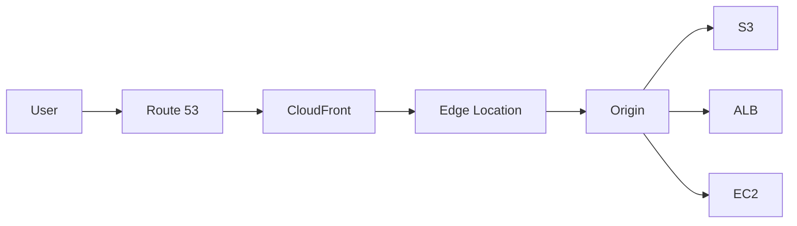

---

## Route 53 Routing Policies

| Policy | Purpose |
|---------|----------|
| Simple | Single resource |
| Weighted | Split traffic |
| Latency | Lowest latency |
| Failover | High availability |
| Geolocation | Geographic routing |
| Multi-Value | Multiple healthy endpoints |

---

## Public vs Private Hosted Zone

| Public Hosted Zone | Private Hosted Zone |
|--------------------|---------------------|
| Internet accessible | Accessible only within VPC |
| Public websites | Internal applications |
| Public DNS | Private DNS |

---

## Common DNS Records

| Record | Purpose |
|---------|----------|
| A | IPv4 Address |
| AAAA | IPv6 Address |
| CNAME | Canonical name |
| Alias | AWS resource mapping |
| MX | Email routing |
| TXT | Domain verification |
| NS | Name servers |

---

## Route 53 vs CloudFront

| Route 53 | CloudFront |
|-----------|------------|
| DNS Service | Content Delivery Network |
| Resolves domain names | Caches and delivers content |
| Supports routing policies | Uses Edge Locations |
| Health Checks | Content caching |
| Domain registration | Performance optimization |

---

## CloudFront Cache Flow

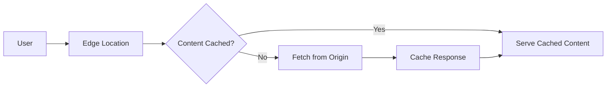

---

## AWS DNS & Content Delivery Best Practices

- Use **Route 53 Alias Records** for AWS resources such as ALB and CloudFront.
- Deploy **CloudFront** in front of S3, ALB, or API Gateway to reduce latency.
- Use **Private Hosted Zones** for internal applications within a VPC.
- Configure **Health Checks** with Failover Routing for high availability.
- Enable **HTTPS** using AWS Certificate Manager (ACM).
- Set appropriate **TTL values** to balance performance and DNS propagation.
- Use **CloudFront cache policies** to improve cache efficiency.
- Invalidate the cache only when necessary to reduce costs.
- Monitor Route 53 and CloudFront metrics using **Amazon CloudWatch**.
- Use **AWS Shield Standard** (enabled by default with CloudFront) for DDoS protection.

---

## One-line Interview Answer

**Amazon Route 53 is AWS's highly available managed DNS service that resolves domain names and routes traffic intelligently, while Amazon CloudFront is a global CDN that caches content at Edge Locations to improve performance, reduce latency, and enhance application availability.**
