# Containers

## Overview

Containers package an application along with its dependencies into a lightweight, portable unit that can run consistently across different environments.

AWS provides three primary services for containerized workloads:

- **Amazon ECR (Elastic Container Registry)** – Managed Docker image registry
- **Amazon ECS (Elastic Container Service)** – Managed container orchestration service
- **Amazon EKS (Elastic Kubernetes Service)** – Managed Kubernetes service

Together, these services help organizations build, store, deploy, and manage containerized applications.

> **Interview Tip**
>
> Frequently asked topics:
>
> - ECR vs Docker Hub
> - ECS vs EKS
> - ECS Launch Types
> - Fargate vs EC2
> - Kubernetes vs ECS
> - ECR Image Lifecycle

---

# Why It Is Used

Containers help organizations to:

- Standardize deployments
- Improve portability
- Simplify CI/CD
- Reduce infrastructure overhead
- Enable microservices architecture
- Scale applications easily
- Improve resource utilization

---

# Architecture / Working

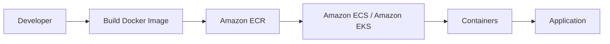

---

# Key Components

| Component | Purpose |
|-----------|----------|
| Amazon ECR | Container Image Registry |
| Amazon ECS | Container Orchestration |
| Amazon EKS | Managed Kubernetes |
| Docker Image | Application Package |
| Task / Pod | Running Container |
| Cluster | Group of Compute Resources |

---

# Types (if applicable)

| Service | Purpose |
|----------|----------|
| Amazon ECR | Image Registry |
| Amazon ECS | AWS Native Container Orchestrator |
| Amazon EKS | Managed Kubernetes |

---

# Lifecycle / Workflow

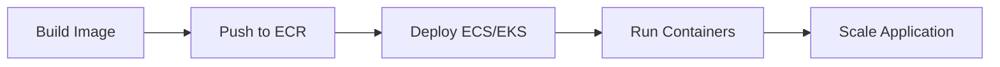

---

# Configuration / Syntax (if applicable)

Typical workflow:

1. Build Docker image
2. Push image to ECR
3. Create ECS/EKS Cluster
4. Deploy application
5. Scale containers
6. Monitor application

---

# Important Commands (if applicable)

### Amazon ECR

```bash
aws ecr create-repository

aws ecr describe-repositories

aws ecr get-login-password
```

### Amazon ECS

```bash
aws ecs list-clusters

aws ecs list-services

aws ecs list-tasks
```

### Amazon EKS

```bash
aws eks list-clusters

aws eks describe-cluster

kubectl get nodes
```

---

# Important Files (if applicable)

| File | Purpose |
|------|----------|
| Dockerfile | Container image definition |
| task-definition.json | ECS Task Definition |
| deployment.yaml | Kubernetes Deployment |
| service.yaml | Kubernetes Service |

---

# Real-World Use Cases

- Microservices
- CI/CD pipelines
- Kubernetes workloads
- Web applications
- APIs
- Batch processing
- Containerized enterprise applications

---

# Advantages

- Portable deployments
- Fast startup
- Easy scaling
- Managed infrastructure
- CI/CD integration
- Reduced operational overhead

---

# Limitations

- Learning curve
- Kubernetes complexity
- Container image management
- Networking configuration

---

# Common Interview Questions (Concept Only)

- What is Amazon ECR?
- What is Amazon ECS?
- What is Amazon EKS?
- Difference between ECS and EKS?
- Difference between ECS EC2 and Fargate?
- What is a Task Definition?
- What is a Kubernetes Pod?
- Difference between Docker Hub and ECR?

---

# Common Mistakes

- Using large Docker images
- Storing secrets inside images
- Not tagging image versions
- Running containers as root
- Ignoring image cleanup

---

# Troubleshooting

| Problem | Solution |
|----------|----------|
| Image push failed | Verify ECR authentication |
| Container won't start | Check container logs |
| ECS task stopped | Review Task Definition |
| Kubernetes Pod CrashLoopBackOff | Check Pod logs |
| Image not found | Verify repository and tag |

---

# Summary

AWS container services provide a complete platform for building, storing, deploying, and managing containerized applications using Amazon ECR, Amazon ECS, and Amazon EKS.

---

# Amazon ECR

## Overview

Amazon Elastic Container Registry (ECR) is a fully managed Docker container image registry.

It securely stores, manages, and distributes container images.

ECR integrates directly with:

- ECS
- EKS
- AWS CodeBuild
- AWS CodePipeline

---

## Why It Is Used

- Store Docker images
- Private image registry
- Secure image storage
- CI/CD integration
- Version management

---

## Architecture / Working

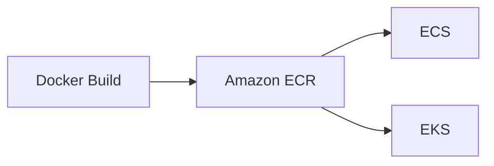

---

## Key Components

| Component | Purpose |
|-----------|----------|
| Repository | Stores container images |
| Image | Docker image |
| Tag | Version identifier |
| Lifecycle Policy | Automatic image cleanup |

---

## Types (if applicable)

Repositories:

- Private Repository
- Public Repository

---

## Lifecycle / Workflow

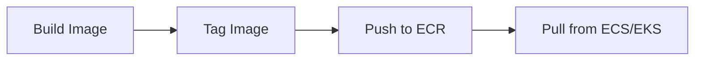

---

## Configuration / Syntax (if applicable)

Workflow:

1. Create repository
2. Authenticate Docker
3. Push image
4. Deploy image

---

## Important Commands (if applicable)

```bash
aws ecr create-repository

aws ecr describe-repositories

aws ecr get-login-password

docker push

docker pull
```

---

## Important Files (if applicable)

| File | Purpose |
|------|----------|
| Dockerfile | Build container image |

---

## Real-World Use Cases

- CI/CD pipelines
- Kubernetes deployments
- ECS deployments
- Image versioning

---

## Advantages

- Fully managed
- Secure
- Integrated with AWS
- High availability

---

## Limitations

- AWS specific
- Image storage costs

---

## Common Interview Questions (Concept Only)

- What is Amazon ECR?
- Difference between ECR and Docker Hub?
- What are image tags?

---

## Common Mistakes

- Using latest tag only
- Not enabling lifecycle policies

---

## Troubleshooting

- Verify Docker authentication.
- Check repository permissions.
- Verify image tag.

---

## Summary

Amazon ECR securely stores and manages Docker container images for AWS deployments.

---

# Amazon ECS Basics

## Overview

Amazon Elastic Container Service (ECS) is AWS's fully managed container orchestration service.

ECS deploys and manages Docker containers without requiring Kubernetes.

---

## Why It Is Used

- Deploy containers
- Container orchestration
- AWS-native container management
- Simplified operations

---

## Architecture / Working

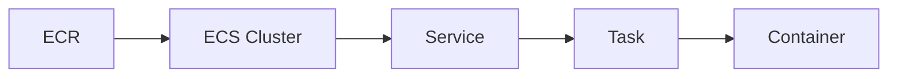

---

## Key Components

| Component | Purpose |
|-----------|----------|
| Cluster | Group of compute resources |
| Task Definition | Blueprint for containers |
| Task | Running container instance |
| Service | Maintains desired task count |

---

## Types (if applicable)

Launch Types:

| Launch Type | Description |
|-------------|-------------|
| EC2 | User manages EC2 instances |
| Fargate | Serverless containers |

> **Interview Tip**
>
> Fargate eliminates server management.

---

## Lifecycle / Workflow

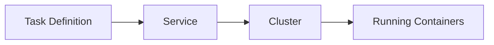

---

## Configuration / Syntax (if applicable)

Deployment steps:

1. Create Cluster
2. Create Task Definition
3. Create Service
4. Deploy Tasks

---

## Important Commands (if applicable)

```bash
aws ecs list-clusters

aws ecs list-services

aws ecs list-tasks
```

---

## Important Files (if applicable)

| File | Purpose |
|------|----------|
| task-definition.json | ECS Task Definition |

---

## Real-World Use Cases

- APIs
- Web applications
- Microservices
- Batch jobs

---

## Advantages

- AWS managed
- Easy deployment
- Native AWS integration

---

## Limitations

- AWS only
- Less portable than Kubernetes

---

## Common Interview Questions (Concept Only)

- What is Amazon ECS?
- What is a Task Definition?
- What is a Service?
- Difference between ECS EC2 and Fargate?

---

## Common Mistakes

- Incorrect task resource allocation
- Missing IAM task roles

---

## Troubleshooting

- Check ECS Service events.
- Verify Task Definition.
- Review container logs.

---

## Summary

Amazon ECS simplifies Docker container deployment using AWS-managed orchestration.

---

# Amazon EKS Basics

## Overview

Amazon Elastic Kubernetes Service (EKS) is AWS's managed Kubernetes service.

AWS manages the Kubernetes control plane while users manage worker nodes (or use Fargate).

EKS provides standard Kubernetes APIs and supports the Kubernetes ecosystem.

---

## Why It Is Used

- Kubernetes deployments
- Multi-cloud portability
- Container orchestration
- Enterprise Kubernetes

---

## Architecture / Working

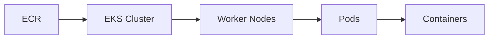

---

## Key Components

| Component | Purpose |
|-----------|----------|
| Cluster | Kubernetes environment |
| Node | Worker machine |
| Pod | Smallest deployable unit |
| Deployment | Manages Pods |
| Service | Exposes Pods |

---

## Types (if applicable)

Worker options:

- Managed Node Groups
- Self-managed Nodes
- AWS Fargate

---

## Lifecycle / Workflow

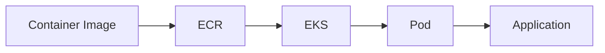

---

## Configuration / Syntax (if applicable)

Typical deployment:

1. Create EKS Cluster
2. Add Worker Nodes
3. Deploy Application
4. Expose Service

---

## Important Commands (if applicable)

```bash
aws eks list-clusters

aws eks describe-cluster

kubectl get nodes

kubectl get pods
```

---

## Important Files (if applicable)

| File | Purpose |
|------|----------|
| deployment.yaml | Kubernetes Deployment |
| service.yaml | Kubernetes Service |

---

## Real-World Use Cases

- Enterprise Kubernetes
- Multi-region applications
- Microservices
- GitOps

---

## Advantages

- Managed Kubernetes
- Kubernetes compatibility
- Portable workloads
- High availability

---

## Limitations

- More complex than ECS
- Kubernetes learning curve
- Additional operational overhead

---

## Common Interview Questions (Concept Only)

- What is Amazon EKS?
- Difference between ECS and EKS?
- What is a Pod?
- What is a Kubernetes Cluster?
- Can EKS use Fargate?

---

## Common Mistakes

- Poor Kubernetes resource limits
- Missing IAM Roles for Service Accounts (IRSA)
- Misconfigured networking

---

## Troubleshooting

- Check Pod status.
- Review Kubernetes events.
- Verify node health.
- Inspect application logs.

---

## Summary

Amazon EKS provides a fully managed Kubernetes control plane, enabling organizations to deploy and operate Kubernetes applications on AWS.

---

# Interview Quick Revision

## AWS Container Architecture

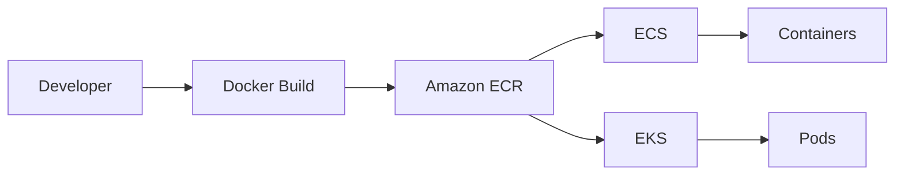

---

## ECS Architecture

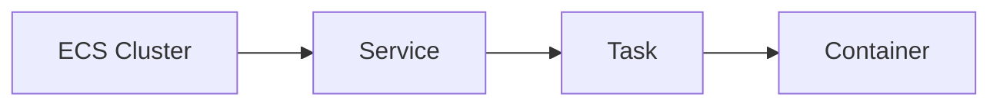

---

## EKS Architecture

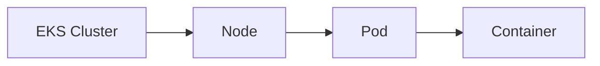

---

## ECS vs EKS

| Amazon ECS | Amazon EKS |
|-------------|------------|
| AWS Native | Kubernetes |
| Easier to learn | Higher learning curve |
| AWS-specific | Kubernetes standard |
| Task Definition | Deployment YAML |
| Task | Pod |
| Service | Service |
| Best for AWS-only environments | Best for Kubernetes and multi-cloud |

---

## ECS EC2 vs Fargate

| EC2 Launch Type | Fargate |
|-----------------|----------|
| Manage EC2 instances | Serverless |
| More control | Less management |
| Lower cost for steady workloads | Pay per use |
| OS management required | AWS manages infrastructure |

---

## Amazon ECR vs Docker Hub

| Amazon ECR | Docker Hub |
|------------|------------|
| AWS Managed | Public/Private Registry |
| IAM Integration | Docker Authentication |
| AWS Native | General Purpose |
| Secure Private Registry | Public Image Repository |

---

## ECS Core Components

| Component | Purpose |
|-----------|----------|
| Cluster | Infrastructure |
| Task Definition | Blueprint |
| Task | Running Containers |
| Service | Maintains Desired Count |

---

## Kubernetes Core Components (EKS)

| Component | Purpose |
|-----------|----------|
| Cluster | Kubernetes Environment |
| Node | Worker Machine |
| Pod | Smallest Deployable Unit |
| Deployment | Pod Management |
| Service | Network Access |

---

## AWS Container Best Practices

- Store container images in **Amazon ECR**.
- Tag images using **version numbers**, not only `latest`.
- Use **Lifecycle Policies** to clean up unused images.
- Scan container images for vulnerabilities before deployment.
- Use **AWS Fargate** when you want to avoid managing servers.
- Use **Amazon ECS** for simple AWS-native container orchestration.
- Use **Amazon EKS** when Kubernetes compatibility or portability is required.
- Store secrets in **AWS Secrets Manager** or **AWS Systems Manager Parameter Store**, not inside container images.
- Configure CPU and memory limits appropriately.
- Monitor containers using **Amazon CloudWatch** and **Container Insights**.

---

## One-line Interview Answer

**AWS container services consist of Amazon ECR for securely storing container images, Amazon ECS for AWS-native container orchestration, and Amazon EKS for managed Kubernetes, enabling scalable, highly available, and production-ready containerized application deployments.**
