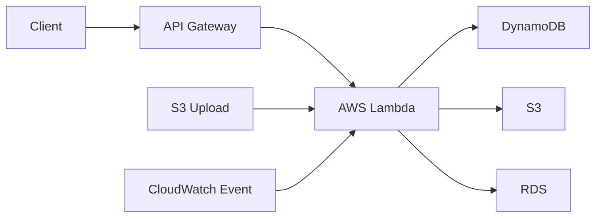
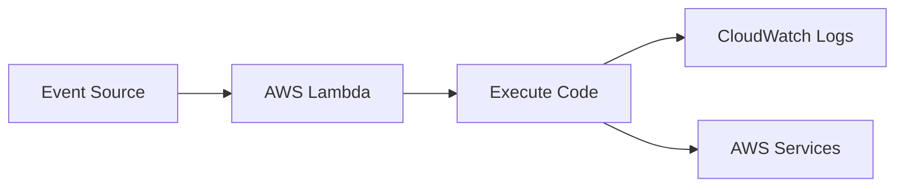
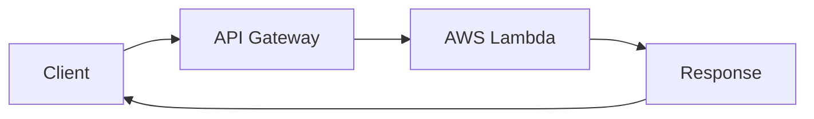
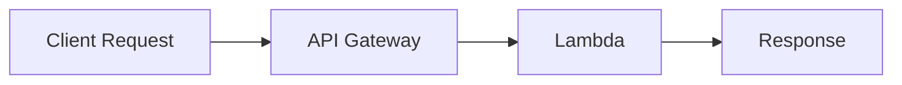
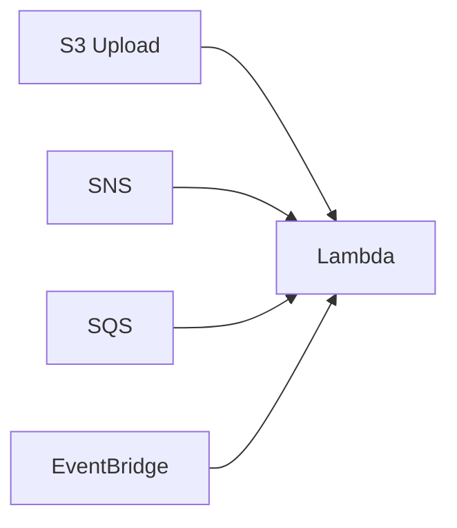
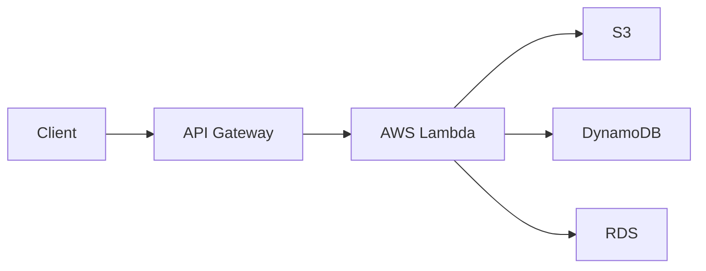
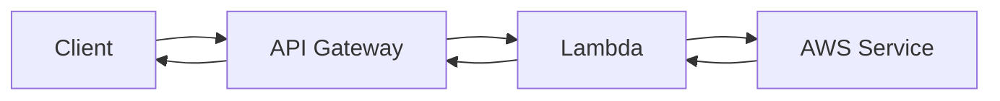

# Serverless

## Overview

Serverless computing is a cloud execution model where AWS manages the underlying infrastructure, including servers, operating systems, scaling, and availability. Developers only need to write application code and define event triggers.

The primary AWS serverless services covered in interviews are:

- **AWS Lambda** – Executes code without provisioning servers.
- **Amazon API Gateway** – Creates and manages RESTful and HTTP APIs.
- **Event Triggers** – Automatically invoke Lambda functions when specific AWS events occur.

> **Interview Tip**
>
> Frequently asked interview topics:
>
> - What is Serverless Computing?
> - AWS Lambda lifecycle
> - Lambda cold start
> - Lambda vs EC2
> - API Gateway integration with Lambda
> - Common Lambda event sources

---

# Why It Is Used

Serverless architecture helps organizations:

- Eliminate server management
- Reduce infrastructure costs
- Scale automatically
- Pay only for execution time
- Accelerate application development
- Build event-driven applications
- Simplify CI/CD deployments

---

# Architecture / Working



---

# Key Components

| Component | Purpose |
|-----------|----------|
| AWS Lambda | Executes application code |
| API Gateway | Exposes REST or HTTP APIs |
| Event Source | Triggers Lambda execution |
| IAM Role | Grants Lambda permissions |
| CloudWatch | Logging and monitoring |
| Environment Variables | Store configuration values |

---

# Types (if applicable)

### Compute

- AWS Lambda

### API Services

- REST API
- HTTP API
- WebSocket API

### Common Event Sources

- Amazon S3
- Amazon SNS
- Amazon SQS
- Amazon EventBridge
- API Gateway
- DynamoDB Streams
- CloudWatch Events

---

# Lifecycle / Workflow


---

# Configuration / Syntax (if applicable)

Typical serverless workflow:

1. Write Lambda function
2. Assign IAM Role
3. Configure event trigger
4. Deploy function
5. Invoke automatically
6. Monitor logs

---

# Important Commands (if applicable)

```bash
aws lambda create-function

aws lambda list-functions

aws lambda invoke

aws lambda update-function-code

aws lambda delete-function

aws apigateway get-rest-apis
```

---

# Important Files (if applicable)

| File | Purpose |
|------|----------|
| lambda_function.py | Lambda source code |
| template.yaml | AWS SAM template |
| serverless.yml | Serverless Framework configuration |
| requirements.txt | Python dependencies |

---

# Real-World Use Cases

- REST APIs
- Image processing
- File uploads
- Email notifications
- Scheduled automation
- Log processing
- Data transformation
- Event-driven workflows

---

# Advantages

- No server management
- Automatic scaling
- High availability
- Pay-per-use pricing
- Easy integration with AWS services
- Faster development

---

# Limitations

- Cold start latency
- Execution time limits
- Memory limits
- Vendor lock-in
- Stateless execution model

---

# Common Interview Questions (Concept Only)

- What is Serverless Computing?
- What is AWS Lambda?
- What is a Lambda trigger?
- What is API Gateway?
- What are Lambda cold starts?
- Difference between Lambda and EC2?
- What services can trigger Lambda?
- What is the maximum Lambda execution time?

---

# Common Mistakes

- Hardcoding credentials
- Creating oversized deployment packages
- Ignoring timeout settings
- Giving excessive IAM permissions
- Not monitoring CloudWatch logs

---

# Troubleshooting

| Problem | Solution |
|----------|----------|
| Lambda timeout | Increase timeout or optimize code |
| Access denied | Verify IAM Role permissions |
| Function not triggered | Check event source configuration |
| API returns 500 | Review CloudWatch Logs |
| Deployment failed | Verify package structure and dependencies |

---

# Summary

AWS Serverless services enable developers to build scalable, event-driven applications without managing servers. AWS Lambda executes code, API Gateway exposes APIs, and AWS event sources automatically trigger workloads.

---

# AWS Lambda

## Overview

AWS Lambda is a serverless compute service that runs application code in response to events without requiring server management.

AWS automatically handles:

- Server provisioning
- Scaling
- Operating system maintenance
- High availability

You are billed only for the compute time consumed during execution.

---

## Why It Is Used

AWS Lambda is commonly used for:

- Backend APIs
- Automation scripts
- Scheduled jobs
- File processing
- Data transformation
- Event-driven applications
- CI/CD automation

---

## Architecture / Working



---

## Key Components

| Component | Purpose |
|-----------|----------|
| Function | Executable code |
| Handler | Entry point |
| Runtime | Python, Node.js, Java, etc. |
| IAM Role | Permissions |
| Trigger | Starts execution |
| Environment Variables | Configuration values |

---

## Types (if applicable)

Supported runtimes include:

- Python
- Node.js
- Java
- .NET
- Go
- Ruby
- Custom Runtime

---

## Lifecycle / Workflow


---

## Configuration / Syntax (if applicable)

Typical Lambda configuration includes:

- Runtime
- Memory allocation
- Timeout
- IAM Role
- Environment Variables
- Trigger

---

## Important Commands (if applicable)

```bash
aws lambda create-function

aws lambda invoke

aws lambda update-function-code

aws lambda delete-function

aws lambda list-functions
```

---

## Important Files (if applicable)

| File | Purpose |
|------|----------|
| lambda_function.py | Python Lambda function |
| requirements.txt | Dependencies |
| template.yaml | SAM deployment template |

---

## Real-World Use Cases

- Image resizing
- File validation
- Scheduled backups
- REST API backend
- Notification systems
- Database automation
- Cloud resource automation

---

## Advantages

- Fully managed
- Auto scaling
- Cost-effective
- Highly available
- Supports multiple programming languages

---

## Limitations

- Maximum execution time: **15 minutes**
- Cold start latency
- Deployment package size limits
- Stateless execution

---

## Common Interview Questions (Concept Only)

- What is AWS Lambda?
- What is a Lambda handler?
- What is a cold start?
- What is Lambda timeout?
- Can Lambda store local data permanently?

---

## Common Mistakes

- Using Lambda for long-running tasks
- Ignoring memory optimization
- Storing secrets in code
- Using excessive permissions

---

## Troubleshooting

- Check CloudWatch Logs.
- Verify IAM Role.
- Increase timeout if needed.
- Validate event payload.

---

## Summary

AWS Lambda is a fully managed serverless compute service that executes application code in response to events while automatically managing infrastructure and scaling.

---

# API Gateway Basics

## Overview

Amazon API Gateway is a fully managed service for creating, publishing, securing, and monitoring APIs.

It acts as the front-end for backend services such as Lambda, ECS, EC2, or on-premises applications.

---

## Why It Is Used

API Gateway provides:

- Secure API endpoints
- Authentication
- Authorization
- Request routing
- Rate limiting
- API monitoring

---

## Architecture / Working



---

## Key Components

| Component | Purpose |
|-----------|----------|
| API | Collection of endpoints |
| Resource | URL path |
| Method | GET, POST, PUT, DELETE |
| Stage | Deployment environment |
| Integration | Backend connection |

---

## Types (if applicable)

| API Type | Description |
|----------|-------------|
| REST API | Feature-rich API |
| HTTP API | Lightweight and lower cost |
| WebSocket API | Real-time communication |

---

## Lifecycle / Workflow



---

## Configuration / Syntax (if applicable)

Typical API workflow:

1. Create API
2. Create Resource
3. Add HTTP Method
4. Integrate backend
5. Deploy Stage

---

## Important Commands (if applicable)

```bash
aws apigateway get-rest-apis

aws apigateway create-rest-api

aws apigateway delete-rest-api
```

---

## Important Files (if applicable)

| File | Purpose |
|------|----------|
| OpenAPI Specification | API definition |
| Swagger File | API documentation |

---

## Real-World Use Cases

- REST APIs
- Mobile applications
- Web applications
- Serverless backend
- Microservices

---

## Advantages

- Fully managed
- Built-in authentication
- Request throttling
- Easy Lambda integration

---

## Limitations

- Additional request cost
- Configuration complexity for large APIs

---

## Common Interview Questions (Concept Only)

- What is API Gateway?
- Difference between REST API and HTTP API?
- How does API Gateway invoke Lambda?
- What is an API Stage?

---

## Common Mistakes

- Missing deployment after API changes
- Poor authentication configuration
- Ignoring throttling limits

---

## Troubleshooting

- Verify deployment stage.
- Review CloudWatch Logs.
- Check Lambda integration.
- Validate IAM permissions.

---

## Summary

Amazon API Gateway securely exposes backend services as REST, HTTP, or WebSocket APIs and integrates seamlessly with AWS Lambda.

---

# Event Triggers

## Overview

Event triggers automatically invoke Lambda functions when specific events occur in AWS services.

This enables event-driven architectures with minimal operational overhead.

---

## Why It Is Used

Event triggers allow applications to:

- Respond automatically
- Reduce polling
- Build asynchronous workflows
- Automate infrastructure

---

## Architecture / Working



---

## Key Components

| Component | Purpose |
|-----------|----------|
| Event Source | Generates event |
| Trigger | Invokes Lambda |
| Function | Processes event |
| Response | Output or action |

---

## Types (if applicable)

Common event sources:

| Event Source | Example |
|--------------|----------|
| Amazon S3 | File upload |
| Amazon SNS | Notification |
| Amazon SQS | Queue message |
| EventBridge | Scheduled event |
| DynamoDB Streams | Database change |
| API Gateway | HTTP request |
| CloudWatch | Scheduled execution |

---

## Lifecycle / Workflow


---

## Configuration / Syntax (if applicable)

Typical steps:

1. Create Lambda
2. Configure trigger
3. Grant permissions
4. Test event
5. Monitor execution

---

## Important Commands (if applicable)

```bash
aws lambda list-event-source-mappings

aws lambda create-event-source-mapping

aws events put-rule
```

---

## Important Files (if applicable)

No mandatory configuration files.

---

## Real-World Use Cases

- Image processing after upload
- Scheduled reports
- Notification systems
- Database synchronization
- Backup automation
- Security alerts

---

## Advantages

- Automatic execution
- Event-driven architecture
- Highly scalable
- Minimal infrastructure management

---

## Limitations

- Retry behavior varies by event source
- Debugging asynchronous workflows can be complex
- Requires correct IAM permissions

---

## Common Interview Questions (Concept Only)

- What can trigger Lambda?
- Difference between synchronous and asynchronous invocation?
- Which AWS services commonly trigger Lambda?
- Can EventBridge invoke Lambda?

---

## Common Mistakes

- Missing trigger permissions
- Duplicate event processing
- Ignoring retry policies

---

## Troubleshooting

- Verify trigger configuration.
- Check Lambda permissions.
- Review CloudWatch Logs.
- Validate event payload format.

---

## Summary

AWS event triggers enable Lambda functions to execute automatically in response to AWS service events, forming the foundation of event-driven serverless applications.

---

# Interview Quick Revision

## Serverless Architecture



---

## Event-Driven Workflow


---

## Common Lambda Event Sources

| Service | Trigger Example |
|----------|-----------------|
| Amazon S3 | Object upload |
| Amazon SNS | Notification |
| Amazon SQS | Queue message |
| API Gateway | HTTP request |
| EventBridge | Scheduled event |
| DynamoDB Streams | Table changes |
| CloudWatch | Scheduled rule |

---

## Lambda vs EC2

| AWS Lambda | Amazon EC2 |
|-------------|------------|
| Serverless | Server-based |
| Auto scaling | Manual/Auto Scaling Groups |
| Pay per invocation | Pay for running instances |
| Max execution 15 minutes | No execution limit |
| Event-driven | Continuously running |

---

## REST API vs HTTP API

| REST API | HTTP API |
|-----------|----------|
| More features | Lower cost |
| API Keys | Basic features |
| Usage Plans | Faster performance |
| Complex applications | Simple APIs |

---

## API Gateway Request Flow



---

## Serverless Best Practices

- Keep Lambda functions focused on a single responsibility.
- Use **IAM Roles** with the principle of least privilege.
- Store secrets in **AWS Secrets Manager** or **Systems Manager Parameter Store**.
- Monitor Lambda using **Amazon CloudWatch Logs** and metrics.
- Optimize memory and timeout settings for performance and cost.
- Use environment variables for configuration instead of hardcoding values.
- Package only required dependencies to reduce deployment size.
- Design Lambda functions to be idempotent where possible.
- Use API Gateway throttling and authentication to protect APIs.
- Test Lambda functions locally before deployment.

---

## One-line Interview Answer

**AWS Serverless enables developers to build scalable, event-driven applications without managing servers. AWS Lambda executes code in response to events, API Gateway securely exposes APIs, and event sources such as Amazon S3, SNS, SQS, and EventBridge automatically trigger application workflows.**
