# Security Services

## Overview

AWS provides several managed security services to protect data, manage encryption keys, securely store secrets, automate server administration, and defend web applications.

The most commonly used AWS security services in production and interviews are:

- **AWS Key Management Service (KMS)** – Encryption key management
- **AWS Secrets Manager** – Secure storage and rotation of secrets
- **AWS Systems Manager (SSM)** – Secure server management and automation
- **AWS Web Application Firewall (WAF)** – Protects web applications from common attacks

> **Interview Tip**
>
> Frequently asked topics:
>
> - KMS vs Secrets Manager
> - Secrets Manager vs Parameter Store
> - AWS Systems Manager Session Manager
> - Customer Managed Keys vs AWS Managed Keys
> - WAF vs Security Groups
> - Server-side Encryption using KMS

---

# Why It Is Used

AWS Security Services help organizations to:

- Encrypt sensitive data
- Securely manage credentials
- Eliminate hardcoded secrets
- Manage EC2 instances without SSH
- Protect web applications
- Improve compliance
- Centralize security management

---

# Architecture / Working

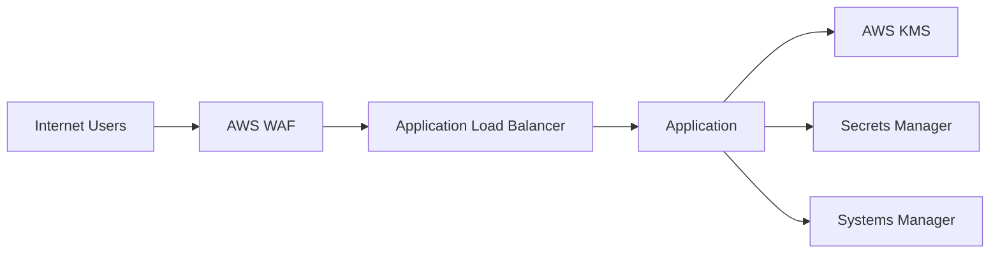

---

# Key Components

| Service | Purpose |
|----------|----------|
| AWS KMS | Encryption Key Management |
| AWS Secrets Manager | Store passwords and secrets |
| AWS Systems Manager | Server management and automation |
| AWS WAF | Web application protection |

---

# Types (if applicable)

| Service | Function |
|----------|-----------|
| AWS Managed KMS Keys | Managed by AWS |
| Customer Managed Keys | Created and managed by customers |
| Secrets Manager | Secret storage |
| Systems Manager | Operational management |
| AWS WAF | Layer 7 Web Firewall |

---

# Lifecycle / Workflow

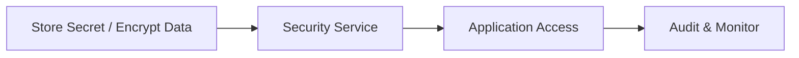

---

# Configuration / Syntax (if applicable)

General workflow:

1. Create security resource
2. Configure IAM permissions
3. Integrate with AWS services
4. Monitor usage
5. Rotate or update as needed

---

# Important Commands (if applicable)

```bash
aws kms

aws secretsmanager

aws ssm

aws wafv2
```

---

# Important Files (if applicable)

No mandatory configuration files.

---

# Real-World Use Cases

- Encrypt EBS volumes
- Secure database passwords
- Store API keys
- Patch EC2 instances
- Remote server administration
- Protect web applications from attacks

---

# Advantages

- Fully managed
- Highly secure
- IAM integration
- Centralized management
- Compliance support

---

# Limitations

- Additional service costs
- Requires proper IAM configuration
- Encryption does not replace access control

---

# Common Interview Questions (Concept Only)

- What is AWS KMS?
- What is Secrets Manager?
- Difference between Secrets Manager and Parameter Store?
- What is Systems Manager?
- What is Session Manager?
- What is AWS WAF?
- Difference between WAF and Security Groups?

---

# Common Mistakes

- Hardcoding credentials
- Using overly permissive IAM policies
- Not rotating secrets
- Disabling key rotation
- Assuming encryption replaces IAM permissions

---

# Troubleshooting

| Problem | Solution |
|----------|----------|
| Access denied | Verify IAM permissions |
| Secret retrieval failed | Check secret policy and IAM role |
| KMS encryption failed | Verify key permissions |
| Session Manager not working | Check SSM Agent and IAM Role |
| WAF rule not blocking traffic | Review rule priority and associations |

---

# Summary

AWS Security Services help organizations encrypt data, manage secrets, administer servers securely, and protect applications from web-based attacks.

---

# AWS Key Management Service (KMS)

## Overview

AWS Key Management Service (KMS) is a managed service used to create, manage, and control encryption keys.

KMS integrates with many AWS services such as:

- Amazon S3
- Amazon EBS
- Amazon RDS
- AWS Lambda
- AWS Secrets Manager

It enables secure encryption without managing hardware security modules directly.

---

## Why It Is Used

- Encrypt data
- Secure AWS services
- Centralize key management
- Enable compliance
- Audit encryption usage

---

## Architecture / Working

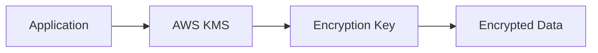

---

## Key Components

| Component | Purpose |
|-----------|----------|
| Customer Managed Key (CMK) | Customer-controlled encryption key |
| AWS Managed Key | Automatically managed by AWS |
| Alias | Friendly name for a key |
| Key Policy | Controls key access |

---

## Types (if applicable)

| Key Type | Description |
|----------|-------------|
| AWS Managed Key | Managed automatically |
| Customer Managed Key | Full customer control |

---

## Lifecycle / Workflow


---

## Configuration / Syntax (if applicable)

Typical workflow:

1. Create KMS Key
2. Configure Key Policy
3. Encrypt resources
4. Grant IAM permissions

---

## Important Commands (if applicable)

```bash
aws kms create-key

aws kms list-keys

aws kms describe-key

aws kms encrypt

aws kms decrypt
```

---

## Important Files (if applicable)

No mandatory files.

---

## Real-World Use Cases

- Encrypt S3 objects
- Encrypt EBS volumes
- Encrypt RDS databases
- Encrypt Secrets Manager secrets

---

## Advantages

- Centralized key management
- Automatic integration
- Secure encryption
- Audit logging

---

## Limitations

- Cannot recover deleted keys
- Improper key policies can block access

---

## Common Interview Questions (Concept Only)

- What is AWS KMS?
- Difference between AWS Managed Keys and Customer Managed Keys?
- What is envelope encryption?
- Can KMS store passwords?

---

## Common Mistakes

- Deleting keys accidentally
- Not enabling automatic rotation
- Incorrect key policies

---

## Troubleshooting

- Verify IAM permissions.
- Review key policy.
- Confirm key state is enabled.

---

## Summary

AWS KMS securely manages encryption keys used to protect AWS resources and application data.

---

# AWS Secrets Manager

## Overview

AWS Secrets Manager securely stores, manages, and automatically rotates sensitive information.

Examples:

- Database passwords
- API Keys
- Tokens
- Certificates
- Application credentials

---

## Why It Is Used

- Secure secret storage
- Automatic password rotation
- Eliminate hardcoded credentials
- Improve application security

---

## Architecture / Working

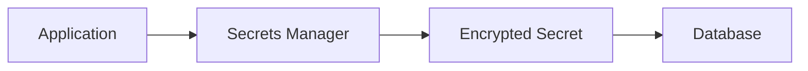

---

## Key Components

| Component | Purpose |
|-----------|----------|
| Secret | Sensitive value |
| Rotation | Automatic credential update |
| KMS | Encrypts secrets |
| IAM Policy | Controls access |

---

## Types (if applicable)

Common secrets:

- Database passwords
- API Keys
- SSH Keys
- OAuth Tokens

---

## Lifecycle / Workflow

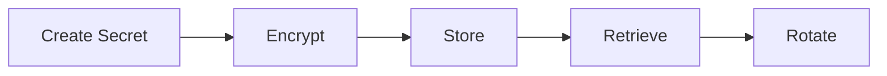

---

## Configuration / Syntax (if applicable)

Typical workflow:

1. Create secret
2. Encrypt using KMS
3. Grant IAM permissions
4. Retrieve programmatically

---

## Important Commands (if applicable)

```bash
aws secretsmanager create-secret

aws secretsmanager get-secret-value

aws secretsmanager list-secrets
```

---

## Important Files (if applicable)

No mandatory files.

---

## Real-World Use Cases

- Database credentials
- API tokens
- Kubernetes secrets
- CI/CD credentials

---

## Advantages

- Automatic rotation
- Encryption
- IAM integration
- Secure API access

---

## Limitations

- Additional cost
- Requires application integration

---

## Common Interview Questions (Concept Only)

- What is Secrets Manager?
- Difference between Secrets Manager and Parameter Store?
- Can Secrets Manager rotate passwords?

---

## Common Mistakes

- Hardcoding secrets
- Not enabling rotation
- Excessive IAM permissions

---

## Troubleshooting

- Verify IAM permissions.
- Confirm KMS access.
- Validate secret name.

---

## Summary

Secrets Manager securely stores, encrypts, and rotates application credentials and sensitive information.

---

# AWS Systems Manager (SSM)

## Overview

AWS Systems Manager is a management service that provides operational control of AWS resources.

It allows administrators to:

- Manage EC2 instances
- Execute remote commands
- Patch systems
- Automate maintenance
- Store configuration parameters

One of its most popular features is **Session Manager**, which enables secure shell access without opening SSH (port 22) or RDP (port 3389).

---

## Why It Is Used

- Remote administration
- Patch management
- Configuration management
- Automation
- Inventory collection

---

## Architecture / Working

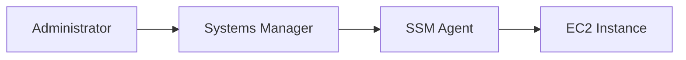

---

## Key Components

| Component | Purpose |
|-----------|----------|
| SSM Agent | Installed on managed instances |
| Session Manager | Secure shell access |
| Run Command | Execute commands remotely |
| Parameter Store | Store configuration values |
| Patch Manager | Patch operating systems |

---

## Types (if applicable)

Core capabilities:

- Session Manager
- Run Command
- Patch Manager
- Automation
- Parameter Store

---

## Lifecycle / Workflow

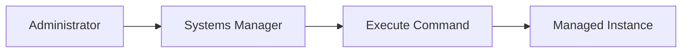

---

## Configuration / Syntax (if applicable)

Requirements:

- SSM Agent installed
- IAM Role attached
- Network connectivity to SSM endpoints

---

## Important Commands (if applicable)

```bash
aws ssm describe-instance-information

aws ssm send-command

aws ssm start-session
```

---

## Important Files (if applicable)

No mandatory files.

---

## Real-World Use Cases

- Remote server administration
- Patch automation
- Configuration management
- EC2 maintenance

---

## Advantages

- No SSH required
- Centralized management
- Secure remote access
- Automation capabilities

---

## Limitations

- Requires SSM Agent
- Requires IAM Role
- Internet or VPC endpoints required

---

## Common Interview Questions (Concept Only)

- What is Systems Manager?
- What is Session Manager?
- What is Run Command?
- Can Systems Manager replace SSH?

---

## Common Mistakes

- Missing IAM role
- Outdated SSM Agent
- Closed network connectivity

---

## Troubleshooting

- Verify SSM Agent is running.
- Check IAM role.
- Verify instance appears as Managed Instance.

---

## Summary

AWS Systems Manager simplifies secure administration, automation, patching, and remote management of AWS resources.

---

# AWS WAF Basics

## Overview

AWS Web Application Firewall (WAF) protects web applications from common Layer 7 attacks.

It filters HTTP/HTTPS requests before they reach the application.

AWS WAF integrates with:

- Application Load Balancer
- Amazon CloudFront
- API Gateway

---

## Why It Is Used

- Protect applications
- Block malicious requests
- Prevent SQL Injection
- Prevent Cross-Site Scripting (XSS)
- Rate limiting

---

## Architecture / Working

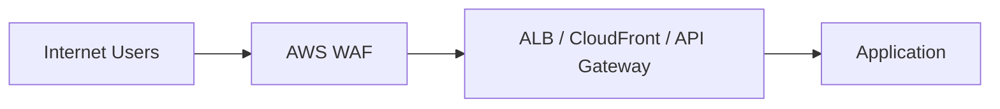

---

## Key Components

| Component | Purpose |
|-----------|----------|
| Web ACL | Collection of rules |
| Rule | Match requests |
| Rule Group | Multiple rules |
| IP Set | Allowed/Blocked IPs |

---

## Types (if applicable)

Common rule types:

- IP Rules
- SQL Injection Rules
- XSS Rules
- Rate-based Rules
- Geographic Rules

---

## Lifecycle / Workflow

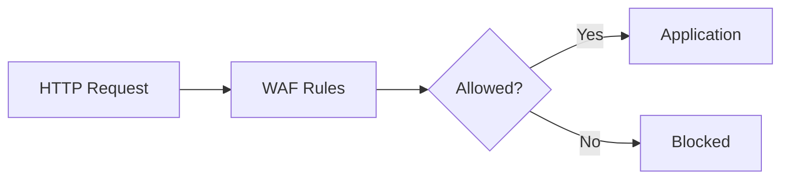

---

## Configuration / Syntax (if applicable)

Typical setup:

1. Create Web ACL
2. Add Rules
3. Associate resource
4. Monitor requests

---

## Important Commands (if applicable)

```bash
aws wafv2 list-web-acls

aws wafv2 create-web-acl

aws wafv2 list-ip-sets
```

---

## Important Files (if applicable)

No mandatory files.

---

## Real-World Use Cases

- Block SQL Injection
- Prevent XSS
- Block malicious IPs
- Rate limiting
- Protect public APIs

---

## Advantages

- Managed firewall
- Easy AWS integration
- Layer 7 protection
- Flexible rule engine

---

## Limitations

- Protects only web traffic
- Does not replace Security Groups or NACLs

---

## Common Interview Questions (Concept Only)

- What is AWS WAF?
- Difference between WAF and Security Groups?
- What is a Web ACL?
- Can WAF protect APIs?

---

## Common Mistakes

- Incorrect rule order
- Forgetting to associate Web ACL
- Overly broad blocking rules

---

## Troubleshooting

- Verify Web ACL association.
- Review sampled requests.
- Check rule priorities.

---

## Summary

AWS WAF protects web applications from common Layer 7 attacks by filtering HTTP and HTTPS requests before they reach backend resources.

---

# Interview Quick Revision

## AWS Security Architecture

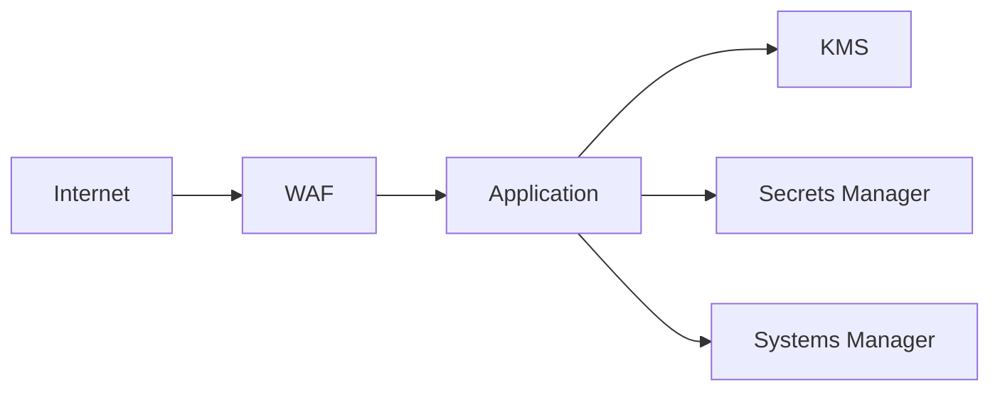

---

## KMS Encryption Flow

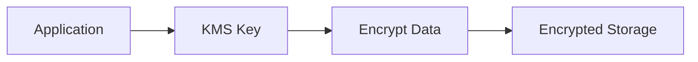

---

## Secrets Manager Flow

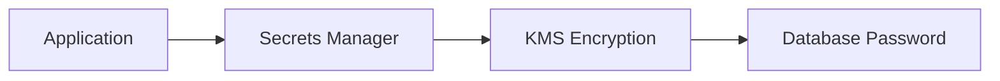

---

## Systems Manager Workflow


---

## AWS WAF Request Flow

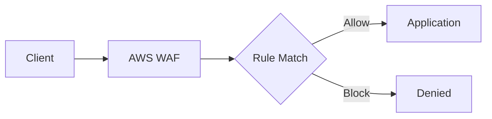

---

## KMS vs Secrets Manager

| AWS KMS | AWS Secrets Manager |
|----------|---------------------|
| Manages encryption keys | Stores secrets |
| Encrypts data | Stores passwords, API keys, tokens |
| Integrates with AWS services | Uses KMS for encryption |
| No secret rotation | Supports automatic rotation |

---

## Secrets Manager vs Parameter Store

| Secrets Manager | Parameter Store |
|-----------------|-----------------|
| Designed for secrets | Configuration storage |
| Automatic rotation | No built-in rotation |
| Higher cost | Standard parameters are free |
| Database credential rotation | General configuration management |

---

## WAF vs Security Groups

| AWS WAF | Security Groups |
|----------|-----------------|
| Layer 7 (HTTP/HTTPS) | Layer 4 (TCP/UDP) |
| Protects web applications | Protects EC2 instances |
| Filters web requests | Controls network traffic |
| Blocks SQLi, XSS, bots | Allows or denies ports |

---

## Systems Manager Features

| Feature | Purpose |
|----------|----------|
| Session Manager | Secure shell access |
| Run Command | Execute remote commands |
| Patch Manager | Patch operating systems |
| Parameter Store | Store configuration values |
| Automation | Operational workflows |

---

## AWS Security Best Practices

- Enable automatic key rotation for customer-managed KMS keys when appropriate.
- Never hardcode passwords or API keys in application code.
- Store sensitive credentials in **AWS Secrets Manager**.
- Use **Systems Manager Session Manager** instead of opening SSH (port 22) whenever possible.
- Grant only the minimum IAM permissions required (Principle of Least Privilege).
- Protect internet-facing applications with **AWS WAF**.
- Encrypt data both at rest and in transit.
- Monitor security events using **AWS CloudTrail** and **Amazon CloudWatch**.
- Regularly rotate secrets and review IAM policies.
- Test WAF rules in monitoring mode before enforcing blocking rules.

---

## One-line Interview Answer

**AWS Security Services include AWS KMS for encryption key management, AWS Secrets Manager for securely storing and rotating sensitive credentials, AWS Systems Manager for secure server administration and automation, and AWS WAF for protecting web applications against common Layer 7 attacks such as SQL Injection and Cross-Site Scripting (XSS).**
