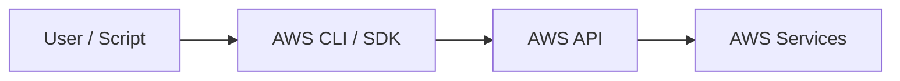
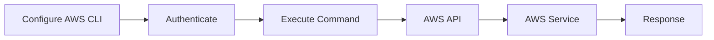
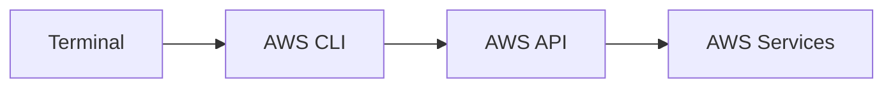
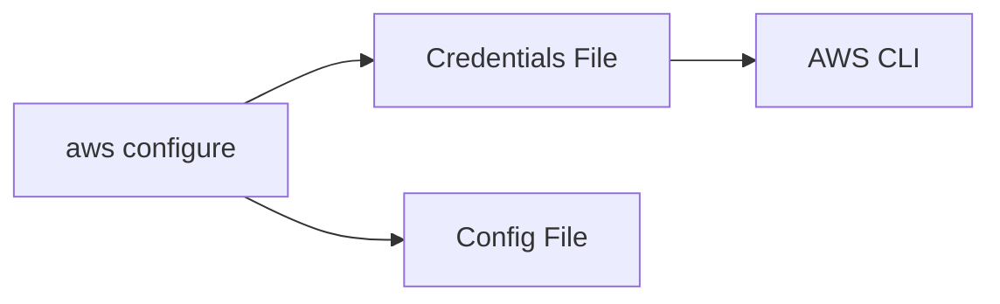
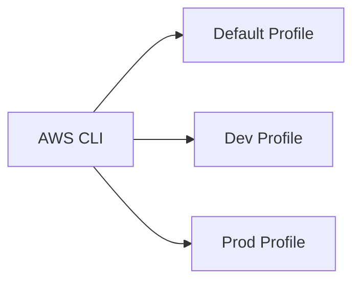
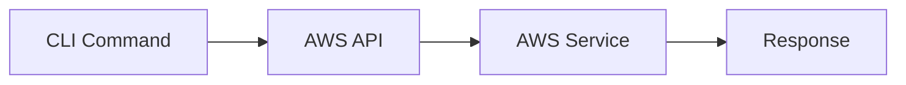
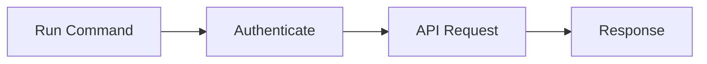
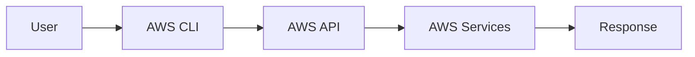
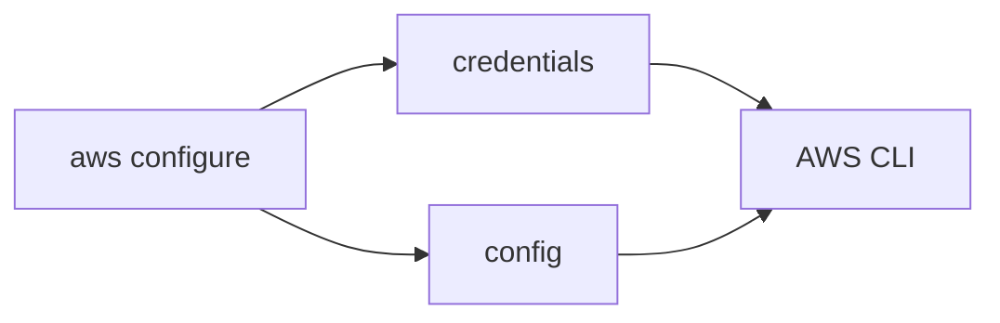
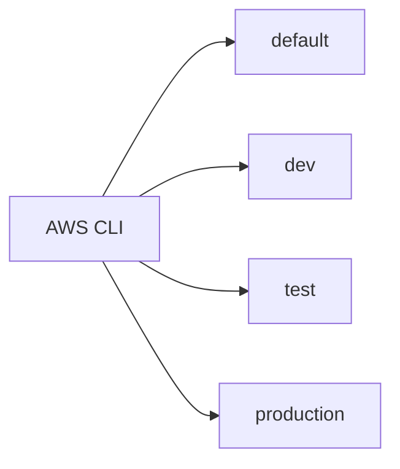

# CLI & SDK

## Overview

The AWS Command Line Interface (AWS CLI) and AWS Software Development Kits (SDKs) enable users to interact with AWS services programmatically.

- **AWS CLI** – Command-line tool for managing AWS resources
- **AWS SDK** – Language-specific libraries (Python, Java, Go, .NET, JavaScript, etc.) used to build applications that interact with AWS APIs

For DevOps Engineers, the AWS CLI is one of the most frequently used tools for automation, scripting, CI/CD pipelines, and infrastructure management.

> **Interview Tip**
>
> Frequently asked topics:
>
> - AWS CLI vs AWS SDK
> - AWS CLI configuration
> - AWS Profiles
> - Authentication process
> - CLI credential files
> - Common AWS CLI commands

---

# Why It Is Used

AWS CLI and SDKs help users to:

- Automate AWS administration
- Manage cloud infrastructure
- Deploy applications
- Write Infrastructure Automation scripts
- Integrate AWS with CI/CD pipelines
- Reduce manual tasks
- Access AWS services programmatically

---

# Architecture / Working



---

# Key Components

| Component | Purpose |
|-----------|----------|
| AWS CLI | Command-line management tool |
| AWS SDK | Programming library |
| IAM User | Authentication |
| Access Key | API authentication |
| Secret Access Key | Secure authentication |
| AWS API | Executes requests |
| Configuration Files | Store credentials and settings |

---

# Types (if applicable)

AWS SDKs

| SDK | Language |
|------|----------|
| Boto3 | Python |
| AWS SDK for Java | Java |
| AWS SDK for JavaScript | JavaScript |
| AWS SDK for Go | Go |
| AWS SDK for .NET | C# |

---

# Lifecycle / Workflow



---

# Configuration / Syntax (if applicable)

Basic workflow:

1. Install AWS CLI
2. Configure credentials
3. Verify authentication
4. Execute AWS CLI commands
5. Automate using shell scripts or CI/CD pipelines

---

# Important Commands (if applicable)

```bash
aws configure

aws configure list

aws configure list-profiles

aws sts get-caller-identity

aws help

aws --version
```

---

# Important Files (if applicable)

| File | Purpose |
|------|----------|
| ~/.aws/credentials | Stores AWS credentials |
| ~/.aws/config | Stores default region, output format, profiles |

Linux/macOS:

```text
~/.aws/
```

Windows:

```text
C:\Users\<username>\.aws\
```

---

# Real-World Use Cases

- Infrastructure automation
- EC2 management
- S3 uploads
- CloudFormation deployments
- CI/CD automation
- Backup scripts
- Monitoring resources
- DevOps scripting

---

# Advantages

- Easy automation
- Script-friendly
- Supports all AWS services
- Platform independent
- Integrates with CI/CD tools

---

# Limitations

- Requires credential management
- Incorrect permissions cause failures
- CLI syntax can be lengthy

---

# Common Interview Questions (Concept Only)

- What is AWS CLI?
- Difference between AWS CLI and SDK?
- How does AWS CLI authenticate?
- Where are AWS credentials stored?
- What are AWS Profiles?
- How do you verify CLI authentication?

---

# Common Mistakes

- Hardcoding AWS credentials
- Using root account credentials
- Forgetting to configure region
- Committing credential files to Git
- Using incorrect IAM permissions

---

# Troubleshooting

| Problem | Solution |
|----------|----------|
| AccessDenied | Verify IAM permissions |
| Invalid credentials | Reconfigure AWS CLI |
| Region not specified | Configure default region |
| Command not found | Verify AWS CLI installation |
| Authentication failed | Check Access Key and Secret Key |

---

# Summary

AWS CLI and SDKs provide powerful interfaces for managing AWS resources, automating cloud operations, and integrating AWS services into applications and DevOps workflows.

---

# AWS CLI

## Overview

AWS CLI (Command Line Interface) is an open-source tool that allows users to manage AWS resources directly from the terminal.

Instead of using the AWS Management Console, administrators can execute commands from Linux, macOS, or Windows.

---

## Why It Is Used

- Resource management
- Infrastructure automation
- DevOps scripting
- CI/CD pipelines
- Bulk resource operations

---

## Architecture / Working



---

## Key Components

| Component | Purpose |
|-----------|----------|
| AWS CLI | Command execution |
| IAM Credentials | Authentication |
| AWS API | Executes requests |
| AWS Service | Resource management |

---

## Types (if applicable)

AWS CLI Versions

| Version | Status |
|----------|--------|
| CLI v1 | Legacy |
| CLI v2 | Recommended |

> **Interview Tip**
>
> AWS CLI v2 is the current production standard.

---

## Lifecycle / Workflow


---

## Configuration / Syntax (if applicable)

General syntax:

```bash
aws <service> <operation> [options]
```

Example:

```bash
aws s3 ls
```

---

## Important Commands (if applicable)

```bash
aws --version

aws help

aws s3 ls

aws ec2 describe-instances

aws iam list-users
```

---

## Important Files (if applicable)

| File | Purpose |
|------|----------|
| credentials | Authentication |
| config | Default settings |

---

## Real-World Use Cases

- EC2 administration
- S3 file uploads
- IAM management
- Lambda deployments
- CI/CD automation

---

## Advantages

- Fast
- Scriptable
- Supports automation
- Supports every AWS service

---

## Limitations

- Requires command knowledge
- Depends on IAM permissions

---

## Common Interview Questions (Concept Only)

- What is AWS CLI?
- Why use AWS CLI instead of Console?
- What is the AWS CLI syntax?

---

## Common Mistakes

- Running commands with root credentials
- Forgetting the default region
- Incorrect service names

---

## Troubleshooting

- Verify installation.
- Check IAM permissions.
- Confirm credentials.

---

## Summary

AWS CLI enables efficient management of AWS resources using terminal commands and automation scripts.

---

# CLI Configuration

## Overview

AWS CLI must be configured before it can communicate with AWS services.

Configuration includes:

- Access Key ID
- Secret Access Key
- Default Region
- Output Format

---

## Why It Is Used

- Authenticate requests
- Set default region
- Simplify command execution

---

## Architecture / Working



---

## Key Components

| Setting | Purpose |
|----------|----------|
| Access Key ID | Authentication |
| Secret Access Key | Authentication |
| Region | Default AWS Region |
| Output | JSON, Table, Text, YAML |

---

## Lifecycle / Workflow


---

## Configuration / Syntax (if applicable)

Configure CLI:

```bash
aws configure
```

Prompts:

```text
AWS Access Key ID

AWS Secret Access Key

Default Region

Default Output Format
```

---

## Important Commands (if applicable)

```bash
aws configure

aws configure list

aws configure get region
```

---

## Important Files (if applicable)

### credentials

```text
~/.aws/credentials
```

Example:

```ini
[default]
aws_access_key_id=AKIA...
aws_secret_access_key=xxxxxxxx
```

---

### config

```text
~/.aws/config
```

Example:

```ini
[default]
region=ap-south-1
output=json
```

---

## Real-World Use Cases

- Administrator workstation
- Automation server
- CI/CD agents
- Development laptop

---

## Advantages

- Simple configuration
- Supports multiple profiles
- Easy automation

---

## Limitations

- Credentials stored locally
- Must secure credential files

---

## Common Interview Questions (Concept Only)

- What does aws configure do?
- Where are AWS credentials stored?
- What files are created?

---

## Common Mistakes

- Wrong region
- Wrong output format
- Incorrect credentials

---

## Troubleshooting

- Re-run `aws configure`.
- Check configuration files.
- Verify credentials.

---

## Summary

CLI configuration securely stores AWS credentials and default settings required for authentication.

---

# AWS Profiles

## Overview

AWS Profiles allow users to manage multiple AWS accounts or IAM users on the same system.

Each profile has independent credentials and configuration.

---

## Why It Is Used

- Multiple AWS accounts
- Development and Production separation
- Different IAM users
- Cross-account administration

---

## Architecture / Working



---

## Key Components

| Component | Purpose |
|-----------|----------|
| Default Profile | Default credentials |
| Named Profile | Additional AWS accounts |
| Config File | Profile settings |

---

## Types (if applicable)

Common profiles:

- default
- dev
- test
- production

---

## Lifecycle / Workflow


---

## Configuration / Syntax (if applicable)

Create profile:

```bash
aws configure --profile dev
```

Use profile:

```bash
aws s3 ls --profile dev
```

Environment variable:

```bash
export AWS_PROFILE=dev
```

---

## Important Commands (if applicable)

```bash
aws configure --profile dev

aws configure list-profiles

aws sts get-caller-identity --profile dev
```

---

## Important Files (if applicable)

Example:

```ini
[default]

[dev]

[production]
```

---

## Real-World Use Cases

- Managing multiple AWS accounts
- Development vs Production
- Consulting environments
- Customer accounts

---

## Advantages

- Easy account switching
- Secure credential separation
- Better organization

---

## Limitations

- More configuration management
- Incorrect profile selection may affect production

---

## Common Interview Questions (Concept Only)

- What are AWS Profiles?
- How do you create multiple AWS profiles?
- How do you switch profiles?

---

## Common Mistakes

- Running production commands with development profile
- Duplicate profile names
- Incorrect profile configuration

---

## Troubleshooting

- Verify profile exists.
- Check credentials.
- Confirm profile selection.

---

## Summary

AWS Profiles simplify managing multiple AWS accounts by storing separate credentials and configuration.

---

# Basic AWS CLI Commands

## Overview

AWS CLI provides commands for managing nearly every AWS service.

Learning commonly used commands is essential for DevOps interviews and day-to-day administration.

---

## Why It Is Used

- Manage AWS resources
- Automate operations
- Troubleshoot infrastructure
- Integrate with scripts

---

## Architecture / Working



---

## Key Components

| Command Category | Example |
|------------------|----------|
| Identity | sts |
| Storage | s3 |
| Compute | ec2 |
| IAM | iam |
| Monitoring | cloudwatch |

---

## Lifecycle / Workflow



---

## Configuration / Syntax (if applicable)

General syntax:

```bash
aws <service> <operation>
```

Examples:

List S3 buckets:

```bash
aws s3 ls
```

List EC2 instances:

```bash
aws ec2 describe-instances
```

Show IAM users:

```bash
aws iam list-users
```

Show caller identity:

```bash
aws sts get-caller-identity
```

Copy file to S3:

```bash
aws s3 cp file.txt s3://my-bucket/
```

Sync directory:

```bash
aws s3 sync ./website s3://my-bucket
```

---

## Important Commands (if applicable)

### General

```bash
aws --version

aws help

aws configure

aws configure list

aws configure list-profiles
```

### Identity

```bash
aws sts get-caller-identity
```

### S3

```bash
aws s3 ls

aws s3 cp

aws s3 sync

aws s3 rm
```

### EC2

```bash
aws ec2 describe-instances

aws ec2 start-instances

aws ec2 stop-instances

aws ec2 terminate-instances
```

### IAM

```bash
aws iam list-users

aws iam list-roles
```

### CloudWatch

```bash
aws cloudwatch list-metrics
```

---

## Important Files (if applicable)

| File | Purpose |
|------|----------|
| ~/.aws/config | Configuration |
| ~/.aws/credentials | Credentials |

---

## Real-World Use Cases

- Deploy infrastructure
- Upload application artifacts
- EC2 management
- Backup automation
- Monitoring
- CI/CD pipelines

---

## Advantages

- Fast administration
- Automation friendly
- Consistent across AWS services

---

## Limitations

- Large number of commands
- Requires correct IAM permissions

---

## Common Interview Questions (Concept Only)

- How do you configure AWS CLI?
- How do you verify AWS credentials?
- How do you manage multiple AWS accounts?
- Which command lists S3 buckets?
- How do you upload files to S3?
- How do you describe EC2 instances?

---

## Common Mistakes

- Forgetting to specify the correct profile
- Running destructive commands in the wrong region
- Using excessive IAM permissions
- Storing credentials in scripts
- Not verifying the current AWS identity

---

## Troubleshooting

| Problem | Solution |
|----------|----------|
| AccessDenied | Verify IAM permissions |
| InvalidClientTokenId | Check Access Key ID |
| SignatureDoesNotMatch | Verify Secret Access Key |
| Unable to locate credentials | Configure AWS CLI or set environment variables |
| Wrong AWS account | Run `aws sts get-caller-identity` to verify identity |
| Wrong region | Specify `--region` or update the default region |

---

## Summary

The AWS CLI is the primary command-line tool for managing AWS resources. Proper configuration, secure credential management, AWS Profiles, and familiarity with commonly used CLI commands are essential skills for DevOps Engineers and are frequently tested in technical interviews.

---

# Interview Quick Revision

## AWS CLI Workflow



---

## AWS CLI Configuration



---

## AWS Profiles



---

## AWS CLI vs AWS SDK

| AWS CLI | AWS SDK |
|----------|----------|
| Command-line tool | Programming library |
| Manual commands and scripts | Application development |
| Used by administrators | Used by developers |
| Shell automation | Code automation |

---

## Common AWS CLI Commands

| Command | Purpose |
|----------|----------|
| `aws configure` | Configure AWS CLI |
| `aws configure list` | View current configuration |
| `aws configure list-profiles` | List available profiles |
| `aws sts get-caller-identity` | Verify current identity |
| `aws s3 ls` | List S3 buckets |
| `aws ec2 describe-instances` | List EC2 instances |
| `aws iam list-users` | List IAM users |
| `aws s3 cp` | Copy files to or from S3 |
| `aws s3 sync` | Synchronize directories with S3 |

---

## AWS CLI Best Practices

- Use **IAM users or IAM roles**, never the AWS root account, for CLI operations.
- Configure **named profiles** for Development, Testing, and Production environments.
- Verify the active AWS account using `aws sts get-caller-identity` before executing critical commands.
- Store credentials securely and never commit the `~/.aws/credentials` file to version control.
- Use **IAM roles** instead of long-term access keys whenever possible (especially on EC2, ECS, Lambda, and CI/CD systems).
- Apply the Principle of Least Privilege to IAM policies.
- Use environment variables or AWS Secrets Manager for automation instead of hardcoding credentials.
- Keep AWS CLI updated to the latest version.
- Use `--dry-run` where supported to validate commands before making changes.
- Specify the correct AWS Region explicitly for production operations when necessary.

---

## One-line Interview Answer

**AWS CLI is a command-line tool used to manage AWS services through AWS APIs, while AWS SDKs provide language-specific libraries for application development. Proper CLI configuration, secure credential management, named profiles, and knowledge of common AWS CLI commands are fundamental skills for DevOps and Cloud Engineers.**
