# Common DevOps Integration

## Overview

AWS integrates with popular DevOps tools to automate software development, testing, deployment, monitoring, and infrastructure management.

The most common AWS integrations used in production environments are:

- **EC2 Deployment**
- **S3 Artifact Storage**
- **IAM for CI/CD**
- **Docker with Amazon ECR**
- **Jenkins Integration**
- **GitHub Actions Integration**

These integrations form the backbone of most AWS-based CI/CD pipelines.

> **Interview Tip**
>
> Frequently asked topics:
>
> - CI/CD pipeline architecture on AWS
> - Jenkins deployment to EC2
> - GitHub Actions deployment to AWS
> - ECR workflow
> - IAM Roles in CI/CD
> - S3 as artifact storage
> - Docker image deployment

---

# Why It Is Used

AWS DevOps integrations help organizations:

- Automate software delivery
- Improve deployment consistency
- Reduce manual effort
- Increase release frequency
- Secure deployments
- Enable Infrastructure as Code
- Support Continuous Integration and Continuous Delivery

---

# Architecture / Working

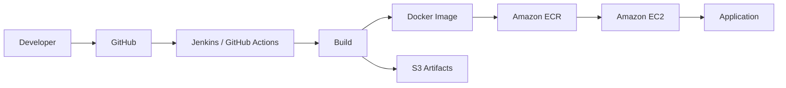

---

# Key Components

| Component | Purpose |
|-----------|----------|
| EC2 | Application hosting |
| S3 | Artifact storage |
| IAM | Secure authentication |
| Amazon ECR | Docker image registry |
| Jenkins | CI/CD automation |
| GitHub Actions | GitHub-native CI/CD |

---

# Types (if applicable)

Common integration categories:

| Integration | Purpose |
|-------------|----------|
| Build | Jenkins, GitHub Actions |
| Artifact Storage | Amazon S3 |
| Container Registry | Amazon ECR |
| Deployment | EC2 |
| Authentication | IAM |

---

# Lifecycle / Workflow

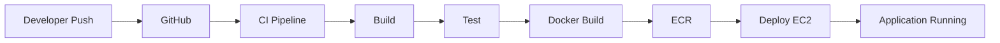

---

# Configuration / Syntax (if applicable)

Typical workflow:

1. Push code to GitHub
2. CI/CD pipeline starts
3. Build application
4. Run tests
5. Create Docker image
6. Push image to Amazon ECR
7. Deploy to EC2

---

# Important Commands (if applicable)

```bash
aws ecr

aws ec2

aws s3

docker build

docker push
```

---

# Important Files (if applicable)

| File | Purpose |
|------|----------|
| Dockerfile | Container image |
| Jenkinsfile | Jenkins Pipeline |
| .github/workflows/*.yml | GitHub Actions Workflow |
| buildspec.yml | AWS CodeBuild (optional) |
| docker-compose.yml | Multi-container deployment |

---

# Real-World Use Cases

- CI/CD automation
- Docker deployments
- Microservices
- Kubernetes deployments
- Web applications
- Infrastructure automation

---

# Advantages

- Automated deployment
- Faster releases
- Improved consistency
- Better scalability
- Native AWS integration

---

# Limitations

- IAM configuration complexity
- Pipeline maintenance
- Additional infrastructure costs

---

# Common Interview Questions (Concept Only)

- How do you deploy applications to EC2?
- Why use Amazon ECR?
- Why store artifacts in S3?
- How does Jenkins deploy to AWS?
- How does GitHub Actions authenticate with AWS?
- What IAM permissions are required for CI/CD?

---

# Common Mistakes

- Using root credentials
- Hardcoding AWS keys
- No rollback strategy
- Storing secrets in repositories
- Overly permissive IAM policies

---

# Troubleshooting

| Problem | Solution |
|----------|----------|
| Deployment failed | Review pipeline logs |
| Docker push failed | Verify ECR login |
| EC2 deployment failed | Verify SSH or SSM access |
| AccessDenied | Check IAM permissions |
| Artifact missing | Verify S3 upload |

---

# Summary

AWS DevOps integrations enable automated software delivery using EC2, S3, IAM, ECR, Jenkins, and GitHub Actions, forming complete CI/CD pipelines.

---

# EC2 Deployment

## Overview

Amazon EC2 is one of the most common deployment targets for applications.

Applications are deployed directly onto EC2 instances using:

- SSH
- Jenkins
- GitHub Actions
- AWS Systems Manager
- CodeDeploy

---

## Why It Is Used

- Host applications
- Web servers
- APIs
- Backend services
- Custom software

---

## Architecture / Working

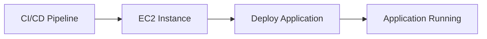

---

## Key Components

| Component | Purpose |
|-----------|----------|
| EC2 | Compute server |
| Security Group | Network security |
| SSH / SSM | Remote access |
| Application | Hosted service |

---

## Lifecycle / Workflow

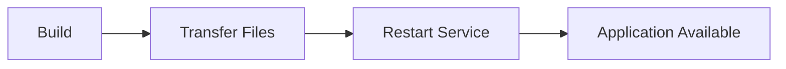

---

## Configuration / Syntax (if applicable)

Typical deployment:

1. Build application
2. Copy files to EC2
3. Restart application
4. Verify deployment

---

## Important Commands (if applicable)

```bash
scp

ssh

systemctl restart

docker pull
```

---

## Important Files (if applicable)

| File | Purpose |
|------|----------|
| Dockerfile | Container deployment |
| systemd service file | Linux service |
| nginx.conf | Reverse proxy |

---

## Real-World Use Cases

- Java applications
- Python APIs
- Node.js services
- Web hosting

---

## Advantages

- Full server control
- Flexible deployment
- Supports all application types

---

## Limitations

- Requires server management
- Scaling is manual unless integrated with Auto Scaling

---

## Common Interview Questions (Concept Only)

- How do you deploy applications to EC2?
- What deployment methods are commonly used?

---

## Common Mistakes

- Not restarting services
- Missing security group rules
- Incorrect file permissions

---

## Troubleshooting

- Verify SSH connectivity.
- Review application logs.
- Check system services.

---

## Summary

EC2 provides flexible compute infrastructure for hosting and deploying applications using various deployment mechanisms.

---

# S3 Artifact Storage

## Overview

Amazon S3 is commonly used to store build artifacts generated during CI/CD pipelines.

Examples:

- ZIP files
- WAR files
- JAR files
- Configuration files
- Static website files

---

## Why It Is Used

- Central artifact repository
- Highly durable
- Easy integration
- Versioning support

---

## Architecture / Working

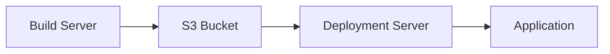

---

## Key Components

| Component | Purpose |
|-----------|----------|
| S3 Bucket | Artifact storage |
| Object Versioning | Maintain artifact history |
| IAM Policy | Secure access |

---

## Lifecycle / Workflow

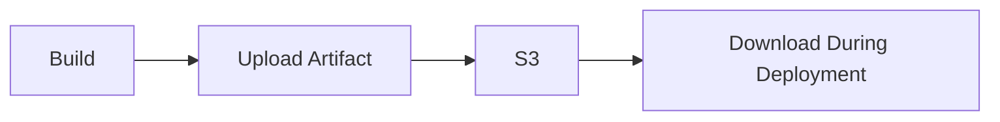

---

## Configuration / Syntax (if applicable)

Artifacts are uploaded after successful builds and downloaded during deployment.

---

## Important Commands (if applicable)

```bash
aws s3 cp

aws s3 sync

aws s3 ls
```

---

## Important Files (if applicable)

Build artifacts:

- application.jar
- application.war
- application.zip

---

## Real-World Use Cases

- CI/CD artifact storage
- Backup
- Static websites
- Lambda deployment packages

---

## Advantages

- Highly durable
- Scalable
- Cost-effective
- Versioning support

---

## Limitations

- Object storage only
- Requires IAM permissions

---

## Common Interview Questions (Concept Only)

- Why store artifacts in S3?
- What is artifact versioning?

---

## Common Mistakes

- Public bucket exposure
- No lifecycle policy
- No versioning enabled

---

## Troubleshooting

- Verify bucket permissions.
- Check IAM policies.
- Review object versioning.

---

## Summary

Amazon S3 serves as a reliable and scalable artifact repository in AWS-based CI/CD pipelines.

---

# IAM for CI/CD

## Overview

IAM secures CI/CD pipelines by controlling access to AWS resources.

Instead of using the AWS root account, pipelines should use IAM users or IAM roles with least-privilege permissions.

---

## Why It Is Used

- Secure deployments
- Least privilege
- Authentication
- Authorization
- Compliance

---

## Architecture / Working

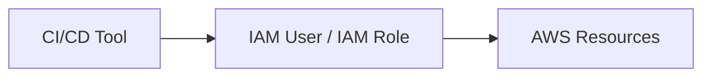

---

## Key Components

| Component | Purpose |
|-----------|----------|
| IAM Role | Recommended authentication |
| IAM Policy | Permission control |
| Access Key | Programmatic access |
| Secret Key | Authentication |

---

## Lifecycle / Workflow

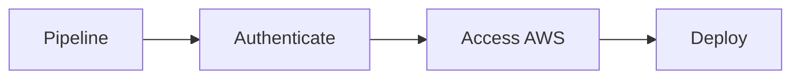

---

## Configuration / Syntax (if applicable)

Typical permissions:

- ECR
- EC2
- S3
- CloudFormation

---

## Important Commands (if applicable)

```bash
aws sts get-caller-identity

aws iam list-roles
```

---

## Important Files (if applicable)

Credential files:

```text
~/.aws/credentials
```

---

## Real-World Use Cases

- Jenkins authentication
- GitHub Actions authentication
- Terraform deployments
- Kubernetes deployments

---

## Advantages

- Secure
- Granular permissions
- Auditable

---

## Limitations

- Misconfigured IAM causes deployment failures

---

## Common Interview Questions (Concept Only)

- Why use IAM Roles in CI/CD?
- What permissions are required?

---

## Common Mistakes

- Root credentials
- Hardcoded access keys
- Overly permissive policies

---

## Troubleshooting

- Verify IAM role.
- Check policy permissions.
- Confirm trust relationship.

---

## Summary

IAM secures CI/CD pipelines by providing controlled access to AWS resources using roles and policies.

---

# Docker with Amazon ECR

## Overview

Amazon Elastic Container Registry (ECR) is AWS's fully managed Docker image registry.

CI/CD pipelines push Docker images to ECR before deployment.

---

## Why It Is Used

- Store Docker images
- Secure image repository
- Version container images
- Integrate with ECS/EKS/EC2

---

## Architecture / Working

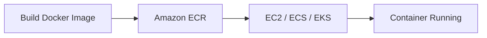

---

## Key Components

| Component | Purpose |
|-----------|----------|
| Repository | Image storage |
| Docker Image | Application package |
| IAM | Authentication |

---

## Lifecycle / Workflow

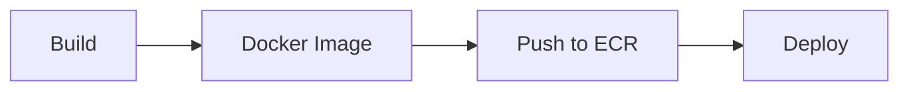

---

## Configuration / Syntax (if applicable)

Typical workflow:

1. Build image
2. Authenticate to ECR
3. Push image
4. Pull image
5. Run container

---

## Important Commands (if applicable)

```bash
aws ecr get-login-password

docker login

docker build

docker push

docker pull
```

---

## Important Files (if applicable)

| File | Purpose |
|------|----------|
| Dockerfile | Image definition |

---

## Real-World Use Cases

- Kubernetes deployments
- ECS deployments
- Microservices

---

## Advantages

- Fully managed
- Secure
- Highly available

---

## Limitations

- AWS-specific
- Storage costs

---

## Common Interview Questions (Concept Only)

- What is Amazon ECR?
- How do you authenticate Docker with ECR?

---

## Common Mistakes

- Forgetting Docker login
- Wrong repository URI
- IAM permission issues

---

## Troubleshooting

- Verify ECR authentication.
- Check repository permissions.
- Confirm image tags.

---

## Summary

Amazon ECR provides a secure and scalable Docker image registry tightly integrated with AWS services.

---

# Jenkins Integration

## Overview

Jenkins is one of the most widely used CI/CD tools for AWS deployments.

Typical Jenkins pipeline:

- Checkout code
- Build
- Test
- Build Docker image
- Push to ECR
- Deploy to EC2/ECS/EKS

---

## Why It Is Used

- Continuous Integration
- Continuous Deployment
- Automation

---

## Architecture / Working

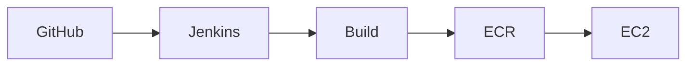

---

## Key Components

| Component | Purpose |
|-----------|----------|
| Jenkinsfile | Pipeline definition |
| Agent | Build execution |
| Credentials | AWS authentication |

---

## Lifecycle / Workflow

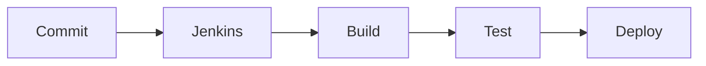

---

## Configuration / Syntax (if applicable)

Jenkins pipeline typically includes:

- Checkout
- Build
- Test
- Deploy

---

## Important Commands (if applicable)

Typical deployment commands:

```bash
docker build

docker push

aws s3 cp

ssh
```

---

## Important Files (if applicable)

| File | Purpose |
|------|----------|
| Jenkinsfile | Pipeline |

---

## Real-World Use Cases

- Automated deployments
- Infrastructure provisioning
- Docker deployments

---

## Advantages

- Mature ecosystem
- Plugin support
- Flexible pipelines

---

## Limitations

- Requires maintenance
- Plugin management

---

## Common Interview Questions (Concept Only)

- How does Jenkins deploy to AWS?
- What credentials should Jenkins use?

---

## Common Mistakes

- Hardcoded AWS keys
- Missing IAM permissions
- No rollback stage

---

## Troubleshooting

- Review Jenkins logs.
- Verify AWS credentials.
- Check deployment scripts.

---

## Summary

Jenkins integrates seamlessly with AWS to automate build, test, and deployment workflows.

---

# GitHub Actions Integration

## Overview

GitHub Actions is GitHub's native CI/CD platform that automates workflows directly from GitHub repositories.

It integrates with AWS using:

- IAM User
- IAM Role (OIDC recommended)
- AWS CLI
- Docker
- Amazon ECR

---

## Why It Is Used

- Native GitHub automation
- Continuous Deployment
- Container deployments
- Infrastructure automation

---

## Architecture / Working

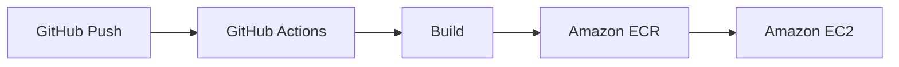

---

## Key Components

| Component | Purpose |
|-----------|----------|
| Workflow | CI/CD automation |
| Runner | Executes jobs |
| Secrets | Store credentials |
| AWS Credentials | Authentication |

---

## Lifecycle / Workflow

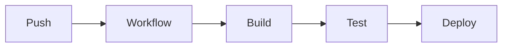

---

## Configuration / Syntax (if applicable)

Workflow file:

```text
.github/workflows/deploy.yml
```

Typical stages:

- Checkout
- Configure AWS
- Build
- Push
- Deploy

---

## Important Commands (if applicable)

```bash
aws configure

docker build

docker push

aws s3 cp
```

---

## Important Files (if applicable)

| File | Purpose |
|------|----------|
| deploy.yml | GitHub Actions Workflow |

---

## Real-World Use Cases

- EC2 deployment
- Docker deployment
- Lambda deployment
- Kubernetes deployment

---

## Advantages

- Native GitHub integration
- Easy setup
- Marketplace actions
- No separate CI server required

---

## Limitations

- GitHub-hosted runner limits
- Workflow complexity increases with larger pipelines

---

## Common Interview Questions (Concept Only)

- How does GitHub Actions authenticate with AWS?
- Where are AWS credentials stored?
- How do you deploy Docker images from GitHub Actions?

---

## Common Mistakes

- Storing AWS keys in repository code
- Missing IAM permissions
- Incorrect workflow triggers

---

## Troubleshooting

- Review workflow logs.
- Verify GitHub Secrets or OIDC configuration.
- Check AWS authentication.

---

## Summary

GitHub Actions provides GitHub-native CI/CD automation and integrates with AWS for secure application deployment.

---

# Interview Quick Revision

## AWS DevOps Pipeline

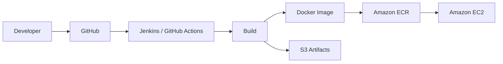

---

## Docker Deployment Flow

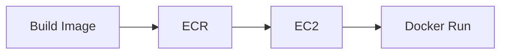

---

## Jenkins Deployment Flow

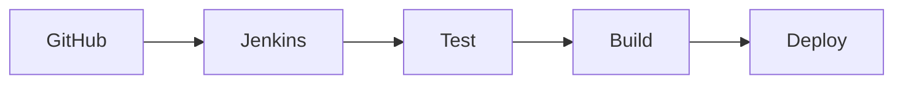

---

## GitHub Actions Deployment Flow

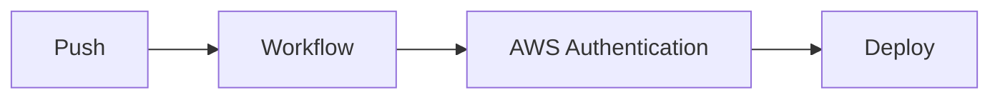

---

## Common AWS DevOps Integrations

| Service | Purpose |
|----------|----------|
| EC2 | Application Hosting |
| Amazon S3 | Artifact Storage |
| IAM | Authentication and Authorization |
| Amazon ECR | Docker Image Registry |
| Jenkins | CI/CD Automation |
| GitHub Actions | GitHub-native CI/CD |

---

## Jenkins vs GitHub Actions

| Jenkins | GitHub Actions |
|----------|----------------|
| Self-managed CI/CD server | GitHub-native CI/CD platform |
| Extensive plugin ecosystem | Marketplace actions |
| Requires infrastructure maintenance | Managed by GitHub |
| Highly customizable | Easier setup for GitHub repositories |

---

## AWS DevOps Best Practices

- Use **IAM Roles** or **OIDC** instead of long-lived AWS access keys in CI/CD pipelines.
- Store build artifacts in **Amazon S3** or Docker images in **Amazon ECR**.
- Separate Development, Testing, and Production environments.
- Implement automated testing before deployment.
- Use immutable Docker image tags or semantic versioning for releases.
- Store secrets in **AWS Secrets Manager** or **AWS Systems Manager Parameter Store**.
- Enable logging and monitoring for deployment pipelines.
- Use Infrastructure as Code (CloudFormation or Terraform) for provisioning AWS resources.
- Implement rollback mechanisms for failed deployments.
- Apply the Principle of Least Privilege to IAM policies used by CI/CD tools.

---

## One-line Interview Answer

**AWS DevOps integration combines EC2 for application hosting, Amazon S3 for artifact storage, IAM for secure authentication, Amazon ECR for Docker image management, and CI/CD tools like Jenkins or GitHub Actions to automate build, test, and deployment workflows securely and efficiently.**
