# Helm Repositories

## Overview

A **Helm Repository** is a location where Helm Charts are stored and shared. It functions similarly to package repositories such as **APT**, **YUM**, or **npm**, allowing users to discover, download, and install Kubernetes applications.

Repositories can be **public** (accessible to everyone) or **private** (restricted to an organization).

> **Interview Tip**
>
> A Helm repository stores **Charts**, not deployed applications. Installing a chart from a repository creates a **Release** inside the Kubernetes cluster.

---

## Why It Is Used

Helm repositories help to:

- Store Helm Charts
- Share applications
- Version Helm Charts
- Download application packages
- Install applications with a single command
- Manage chart updates
- Simplify CI/CD deployments

---

## Architecture / Working

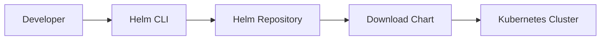

### Working Steps

1. Add a Helm repository.
2. Update the repository index.
3. Search available charts.
4. Download a chart.
5. Install the chart.
6. Deploy resources to Kubernetes.

---

## Key Components

| Component | Purpose |
|-----------|----------|
| Repository | Stores Helm Charts |
| Chart | Deployable application package |
| index.yaml | Repository index |
| Chart Package | Compressed `.tgz` chart |
| Helm CLI | Accesses repositories |

---

## Types (if applicable)

| Repository Type | Description |
|-----------------|-------------|
| Public Repository | Accessible by everyone |
| Private Repository | Requires authentication |
| Local Repository | Stored on local filesystem |
| OCI Registry | Stores charts in container registries |

---

## Lifecycle / Workflow

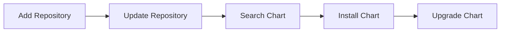

---

## Configuration / Syntax

Typical repository workflow

```text
Add Repository
      │
      ▼
Update Repository
      │
      ▼
Search Charts
      │
      ▼
Install Chart
```

---

## Important Commands

```bash
helm repo add

helm repo update

helm repo list

helm repo remove

helm search repo

helm install
```

---

## Important Files

```
repositories.yaml

index.yaml

*.tgz
```

---

## Real-World Use Cases

- Install NGINX
- Install Prometheus
- Install Grafana
- Install Argo CD
- Install Jenkins
- Install Redis
- Install MySQL
- Internal enterprise repositories
- CI/CD automation

---

## Advantages

- Easy chart distribution
- Centralized storage
- Version management
- Supports reusable deployments
- Simplifies Kubernetes application installation

---

## Limitations

- Public repositories may not contain organization-specific charts
- Repository availability affects deployments
- Requires updates to fetch latest charts

---

## Common Interview Questions (Concept Only)

- What is a Helm Repository?
- Why are Helm repositories used?
- Difference between a Chart and Repository?
- What is `index.yaml`?
- How do you add a repository?
- How do you search charts?
- What is the purpose of `helm repo update`?

---

## Common Mistakes

- Forgetting to update repositories
- Using incorrect repository URLs
- Installing outdated chart versions
- Assuming repository updates automatically
- Deleting repositories without checking dependencies

---

## Troubleshooting

| Problem | Cause | Solution |
|----------|-------|----------|
| Repository not found | Wrong URL | Verify repository URL |
| Chart not found | Repository not updated | Run `helm repo update` |
| Unable to download chart | Network issue | Verify internet connectivity |
| Authentication failed | Private repository credentials missing | Configure credentials |
| Old chart version installed | Local cache outdated | Update repository |

---

## Summary

Helm repositories provide a centralized location for storing and distributing Helm Charts. They simplify Kubernetes deployments by allowing users to search, download, install, and update applications using standard Helm commands.

> **Interview Tip**
>
> A repository stores **Charts**, while Kubernetes stores **Releases**.

---

# Public Repositories

## Overview

Public Helm repositories are freely accessible repositories that host open-source Helm Charts maintained by vendors and the Kubernetes community.

Popular examples include:

- Bitnami
- Prometheus Community
- Grafana
- Argo Helm

---

## Why It Is Used

Public repositories allow users to:

- Install applications quickly
- Use community-maintained charts
- Receive chart updates
- Reduce deployment effort

---

## Architecture / Working

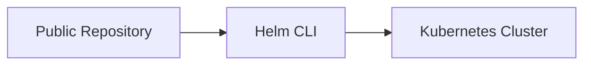

---

## Key Components

| Component | Purpose |
|-----------|----------|
| Repository URL | Chart source |
| index.yaml | Chart index |
| Charts | Kubernetes applications |

---

## Types (if applicable)

Examples

- Bitnami Repository
- Grafana Repository
- Prometheus Community Repository

---

## Lifecycle / Workflow

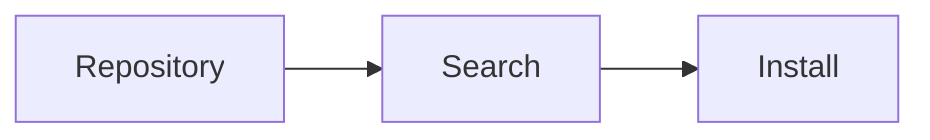

---

## Configuration / Syntax

```bash
helm repo add bitnami https://charts.bitnami.com/bitnami
```

---

## Important Commands

```bash
helm repo add

helm repo update
```

---

## Important Files

```
index.yaml
```

---

## Real-World Use Cases

- Install NGINX
- Install PostgreSQL
- Install Redis
- Install Grafana

---

## Advantages

- Free
- Frequently updated
- Large collection

---

## Limitations

- Limited customization
- Internet access required

---

## Common Interview Questions (Concept Only)

- Name some public Helm repositories.

---

## Common Mistakes

- Trusting unverified repositories

---

## Troubleshooting

- Verify repository URL

---

## Summary

Public repositories provide ready-to-use Helm Charts maintained by trusted organizations.

---

# Repository Structure

## Overview

A Helm repository consists of an **index file** and packaged Helm Charts.

---

## Why It Is Used

The structure allows Helm to locate and download charts efficiently.

---

## Architecture / Working

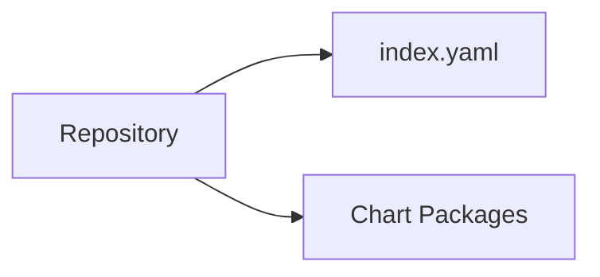

---

## Key Components

| Component | Description |
|-----------|-------------|
| index.yaml | Repository metadata |
| chart.tgz | Packaged Helm Chart |

---

## Types (if applicable)

Not applicable.

---

## Lifecycle / Workflow

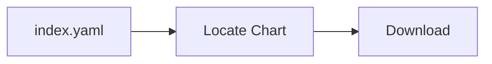

---

## Configuration / Syntax

Typical repository

```text
repository/
├── index.yaml
├── nginx-1.0.0.tgz
├── redis-2.1.0.tgz
```

---

## Important Commands

```bash
helm repo index
```

---

## Important Files

```
index.yaml

chart.tgz
```

---

## Real-World Use Cases

- Enterprise chart repositories

---

## Advantages

- Simple structure

---

## Limitations

- Requires index updates

---

## Common Interview Questions (Concept Only)

- What files exist inside a Helm repository?

---

## Common Mistakes

- Missing index.yaml

---

## Troubleshooting

- Regenerate repository index

---

## Summary

A Helm repository mainly contains `index.yaml` and packaged chart archives.

---

# Add Repository

## Overview

Repositories must be added before Helm can search or install charts.

---

## Why It Is Used

Registers the repository with the local Helm client.

---

## Architecture / Working

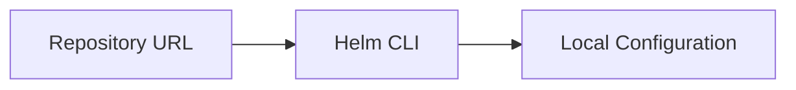

---

## Key Components

- Repository name
- Repository URL

---

## Types (if applicable)

- Public
- Private

---

## Lifecycle / Workflow

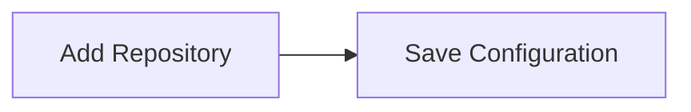

---

## Configuration / Syntax

```bash
helm repo add bitnami https://charts.bitnami.com/bitnami
```

---

## Important Commands

```bash
helm repo add
```

---

## Important Files

```
repositories.yaml
```

---

## Real-World Use Cases

- Register enterprise repositories

---

## Advantages

- Quick setup

---

## Limitations

- Requires valid URL

---

## Common Interview Questions (Concept Only)

- How do you add a Helm repository?

---

## Common Mistakes

- Typing incorrect URLs

---

## Troubleshooting

- Verify repository accessibility

---

## Summary

`helm repo add` registers a repository for future chart operations.

---

# Update Repository

## Overview

Repository updates download the latest repository metadata (`index.yaml`) and chart information.

---

## Why It Is Used

Ensures Helm can access the latest chart versions.

---

## Architecture / Working

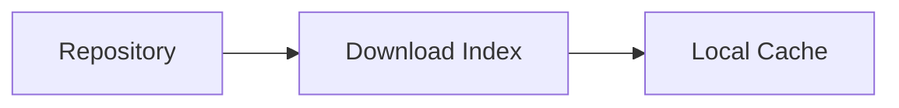

---

## Key Components

- Repository
- Index
- Cache

---

## Types (if applicable)

Not applicable.

---

## Lifecycle / Workflow

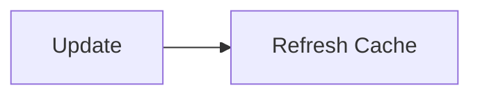

---

## Configuration / Syntax

```bash
helm repo update
```

---

## Important Commands

```bash
helm repo update
```

---

## Important Files

```
index.yaml
```

---

## Real-World Use Cases

- Refresh charts before installation

---

## Advantages

- Latest chart versions

---

## Limitations

- Internet required

---

## Common Interview Questions (Concept Only)

- Why run `helm repo update`?

---

## Common Mistakes

- Forgetting to update before installation

---

## Troubleshooting

- Check repository connectivity

---

## Summary

Repository updates synchronize the local Helm cache with remote repositories.

---

# Search Charts

## Overview

Helm allows searching repositories for available charts.

---

## Why It Is Used

Helps discover available applications and chart versions.

---

## Architecture / Working

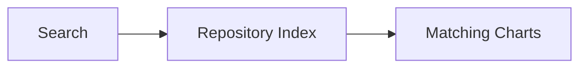

---

## Key Components

- Repository index
- Chart metadata

---

## Types (if applicable)

- Local search
- Repository search

---

## Lifecycle / Workflow

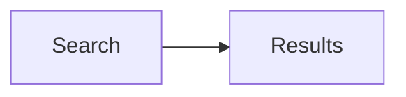

---

## Configuration / Syntax

```bash
helm search repo nginx
```

---

## Important Commands

```bash
helm search repo

helm search hub
```

---

## Important Files

```
index.yaml
```

---

## Real-World Use Cases

- Find application charts
- Compare versions

---

## Advantages

- Quick discovery

---

## Limitations

- Requires updated repository index

---

## Common Interview Questions (Concept Only)

- How do you search Helm Charts?

---

## Common Mistakes

- Searching before repository update

---

## Troubleshooting

- Update repository cache

---

## Summary

`helm search` finds charts available in configured repositories.

---

# Remove Repository

## Overview

Repositories that are no longer needed can be removed from the local Helm configuration.

Removing a repository does **not** uninstall any deployed releases.

---

## Why It Is Used

Used to:

- Clean repository configuration
- Remove unused repositories
- Manage repository list

---

## Architecture / Working

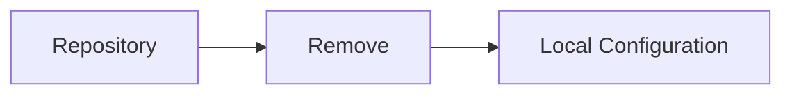

---

## Key Components

- Repository
- Local configuration

---

## Types (if applicable)

Not applicable.

---

## Lifecycle / Workflow

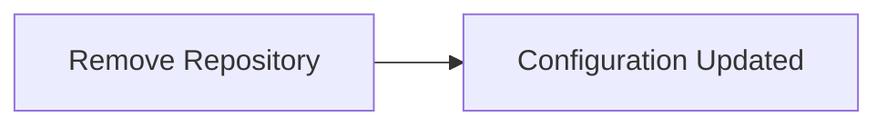

---

## Configuration / Syntax

```bash
helm repo remove bitnami
```

---

## Important Commands

```bash
helm repo remove

helm repo list
```

---

## Important Files

```
repositories.yaml
```

---

## Real-World Use Cases

- Remove deprecated repositories
- Organization cleanup

---

## Advantages

- Keeps configuration organized

---

## Limitations

- Installed releases remain unaffected

---

## Common Interview Questions (Concept Only)

- Does removing a repository uninstall deployed applications?

---

## Common Mistakes

- Assuming repository removal deletes releases

---

## Troubleshooting

- Verify repository list after removal

---

## Summary

Removing a repository only deletes its local configuration. Existing Helm releases continue to function normally.

---

# Interview Quick Revision

## Repository Commands

| Command | Purpose |
|----------|----------|
| `helm repo add` | Add a repository |
| `helm repo list` | List configured repositories |
| `helm repo update` | Refresh repository metadata |
| `helm repo remove` | Remove a repository |
| `helm search repo` | Search local repositories |
| `helm search hub` | Search Artifact Hub |

---

## Repository Components

| Component | Purpose |
|-----------|----------|
| Repository | Stores Helm Charts |
| Chart | Deployable package |
| `index.yaml` | Repository metadata |
| `.tgz` | Packaged Helm Chart |

---

## Production Best Practices

- Use trusted repositories such as Bitnami or official vendor repositories.
- Run `helm repo update` before installing or upgrading charts.
- Pin chart versions in production instead of always using the latest version.
- Validate repository URLs before adding them.
- Use private repositories for internal applications.
- Regularly review and remove unused repositories from local configuration.
- Verify chart authenticity and source before deployment.

---

## One-line Interview Answer

**A Helm Repository is a centralized location that stores versioned Helm Charts. The Helm CLI interacts with repositories to search, download, install, and update Kubernetes applications, making application deployment consistent, reusable, and easy to manage.**
