# Helm Charts

## Overview

A **Helm Chart** is a package that contains all the files required to deploy an application on Kubernetes. It bundles Kubernetes manifests, templates, configuration values, metadata, and optional dependencies into a reusable package.

A Helm Chart makes application deployment **consistent, reusable, and version-controlled**.

> **Interview Tip**
>
> **Chart = Package**
>
> **Release = Installed instance of a Chart**

---

## Why It Is Used

Helm Charts help to:

- Package Kubernetes applications
- Reuse deployment templates
- Simplify deployments
- Parameterize application configuration
- Support versioning
- Standardize deployments across environments
- Reduce duplicate YAML files
- Enable CI/CD automation

---

## Architecture / Working

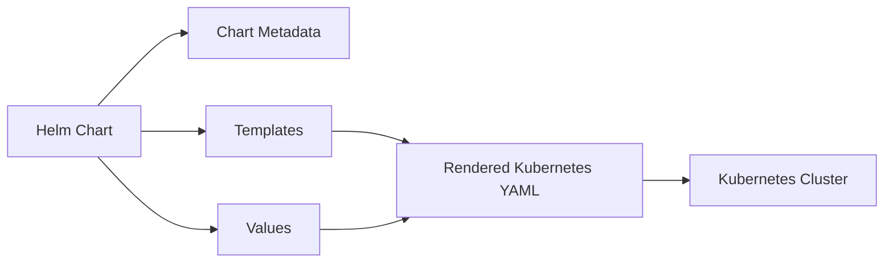

### Working Steps

1. Helm reads the chart.
2. Loads values from `values.yaml`.
3. Applies values to templates.
4. Generates Kubernetes manifests.
5. Deploys resources to Kubernetes.
6. Creates a Helm Release.

---

## Key Components

| Component | Purpose |
|-----------|----------|
| Chart.yaml | Chart metadata |
| values.yaml | Default configuration values |
| templates/ | Kubernetes resource templates |
| charts/ | Dependency charts |
| crds/ | Custom Resource Definitions |
| .helmignore | Ignore files while packaging |
| LICENSE | License information |
| README.md | Documentation |

---

## Types (if applicable)

| Chart Type | Description |
|------------|-------------|
| Application Chart | Deploys an application |
| Library Chart | Provides reusable templates |

---

## Lifecycle / Workflow

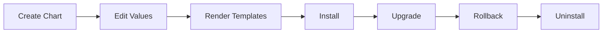

---

## Configuration / Syntax

Typical chart structure

```text
my-chart/
│
├── Chart.yaml
├── values.yaml
├── charts/
├── templates/
├── crds/
├── .helmignore
├── LICENSE
└── README.md
```

---

## Important Commands

```bash
helm create my-chart

helm lint my-chart

helm package my-chart

helm install my-app my-chart

helm template my-chart

helm show chart my-chart
```

---

## Important Files

```
Chart.yaml

values.yaml

templates/

charts/

crds/

.helmignore

LICENSE

README.md
```

---

## Real-World Use Cases

- Deploy NGINX
- Deploy Prometheus
- Deploy Grafana
- Deploy Jenkins
- Deploy Argo CD
- Deploy MySQL
- Deploy Redis
- Enterprise Kubernetes applications

---

## Advantages

- Reusable deployments
- Version control
- Parameterized configuration
- Easy upgrades
- Easy rollback
- Modular application packaging

---

## Limitations

- Requires understanding of templates
- Large charts become complex
- Poor chart design affects maintainability

---

## Common Interview Questions (Concept Only)

- What is a Helm Chart?
- What files exist inside a Helm Chart?
- What is the purpose of Chart.yaml?
- What is values.yaml?
- What is the templates directory?
- What are chart dependencies?
- What is the purpose of the crds directory?
- What is .helmignore used for?

---

## Common Mistakes

- Editing generated Kubernetes manifests directly
- Hardcoding values inside templates
- Ignoring chart versioning
- Not validating charts before packaging
- Mixing unrelated applications in one chart

---

## Troubleshooting

| Problem | Cause | Solution |
|----------|-------|----------|
| Chart installation fails | Invalid templates | Run `helm lint` |
| Missing values | Incorrect values.yaml | Verify configuration |
| Dependency missing | charts directory incomplete | Run dependency update |
| CRD installation error | Incorrect CRD definition | Validate CRDs |
| Packaging fails | Invalid chart structure | Verify required files |

---

## Summary

A Helm Chart packages all Kubernetes resources and configuration required to deploy an application. It enables reusable, versioned, and configurable deployments that simplify Kubernetes application management.

> **Interview Tip**
>
> Every valid Helm Chart contains **Chart.yaml**, while most production charts also include **values.yaml**, **templates/**, and optional directories such as **charts/** and **crds/**.

---

# Chart Structure

## Overview

A Helm Chart follows a standard directory structure understood by the Helm CLI.

Each file and directory has a specific purpose.

---

## Why It Is Used

A standardized structure allows Helm to:

- Validate charts
- Package applications
- Render templates
- Manage dependencies

---

## Architecture / Working

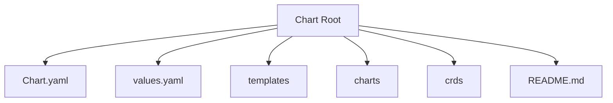

---

## Key Components

- Metadata
- Configuration
- Templates
- Dependencies

---

## Types (if applicable)

Not applicable.

---

## Lifecycle / Workflow

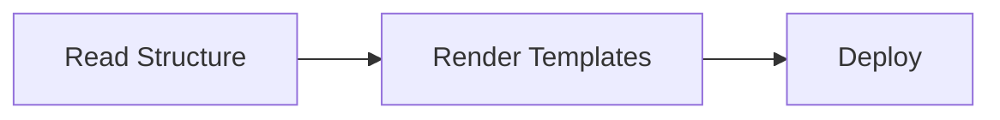

---

## Configuration / Syntax

```text
chart/
├── Chart.yaml
├── values.yaml
├── templates/
├── charts/
├── crds/
```

---

## Important Commands

```bash
helm create
```

---

## Important Files

Entire chart directory

---

## Real-World Use Cases

- Kubernetes application packaging

---

## Advantages

- Standardized layout

---

## Limitations

- Must follow Helm conventions

---

## Common Interview Questions (Concept Only)

- Explain the structure of a Helm Chart.

---

## Common Mistakes

- Removing required files

---

## Troubleshooting

- Validate using `helm lint`

---

## Summary

A standardized directory layout enables Helm to package and deploy applications consistently.

---

# Chart Directory Layout

## Overview

A chart directory contains metadata, templates, values, documentation, dependencies, and optional CRDs.

---

## Why It Is Used

Provides a logical organization for all deployment resources.

---

## Architecture / Working

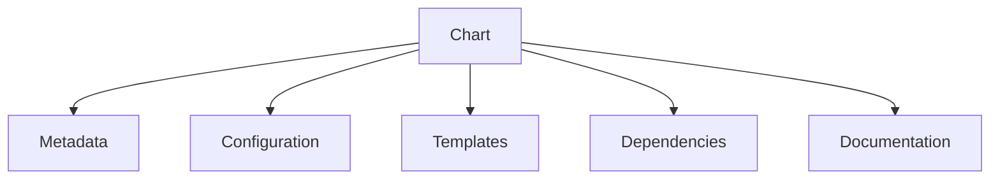

---

## Key Components

- Metadata
- Templates
- Values
- Dependencies

---

## Types (if applicable)

Not applicable.

---

## Lifecycle / Workflow

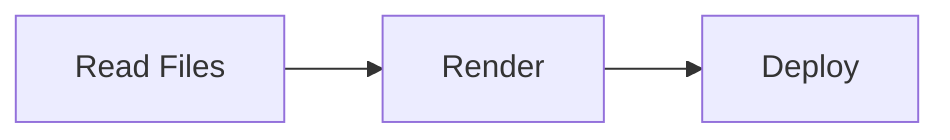

---

## Configuration / Syntax

Standard layout

```text
Chart/
```

---

## Important Commands

```bash
helm create
```

---

## Important Files

All chart files

---

## Real-World Use Cases

- Production Helm Charts

---

## Advantages

- Easy maintenance

---

## Limitations

- Requires proper organization

---

## Common Interview Questions (Concept Only)

- Describe the Helm chart directory layout.

---

## Common Mistakes

- Incorrect directory names

---

## Troubleshooting

- Verify directory structure

---

## Summary

Following the standard directory layout ensures Helm can correctly interpret the chart.

---

# Chart.yaml

## Overview

`Chart.yaml` is the **metadata file** of a Helm Chart.

It defines chart information such as name, version, description, dependencies, and API version.

It is **mandatory**.

---

## Why It Is Used

Stores chart metadata required by Helm.

---

## Architecture / Working

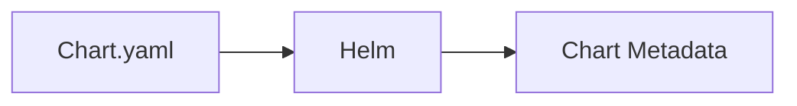

---

## Key Components

| Field | Purpose |
|---------|----------|
| apiVersion | Chart API version |
| name | Chart name |
| version | Chart version |
| description | Chart description |
| appVersion | Application version |
| dependencies | Dependent charts |

---

## Types (if applicable)

- apiVersion v2

---

## Lifecycle / Workflow

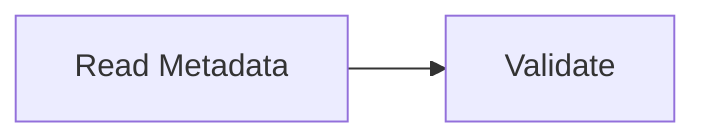

---

## Configuration / Syntax

```yaml
apiVersion: v2
name: my-app
version: 1.0.0
appVersion: "1.2.0"
```

---

## Important Commands

```bash
helm show chart
```

---

## Important Files

```
Chart.yaml
```

---

## Real-World Use Cases

- Version management
- Dependency declaration

---

## Advantages

- Centralized metadata

---

## Limitations

- Required file

---

## Common Interview Questions (Concept Only)

- What information is stored in Chart.yaml?

---

## Common Mistakes

- Incorrect versioning

---

## Troubleshooting

- Validate YAML syntax

---

## Summary

`Chart.yaml` defines the metadata for every Helm Chart.

---

# values.yaml

## Overview

`values.yaml` stores the default configuration values used by Helm templates.

---

## Why It Is Used

Allows configuration without modifying templates.

---

## Architecture / Working

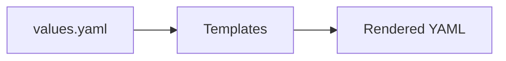

---

## Key Components

- Image
- Replica count
- Ports
- Resources

---

## Types (if applicable)

- Default values
- Custom values

---

## Lifecycle / Workflow

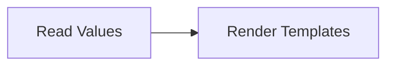

---

## Configuration / Syntax

```yaml
replicaCount: 2

image:
  repository: nginx
```

---

## Important Commands

```bash
helm show values
```

---

## Important Files

```
values.yaml
```

---

## Real-World Use Cases

- Environment configuration

---

## Advantages

- Easy customization

---

## Limitations

- Incorrect values break deployments

---

## Common Interview Questions (Concept Only)

- What is values.yaml?

---

## Common Mistakes

- Hardcoding configuration

---

## Troubleshooting

- Validate YAML

---

## Summary

`values.yaml` provides configurable values for Helm templates.

---

# templates/

## Overview

The `templates/` directory contains Kubernetes manifest templates.

These templates become actual Kubernetes YAML during deployment.

---

## Why It Is Used

Creates dynamic Kubernetes resources.

---

## Architecture / Working

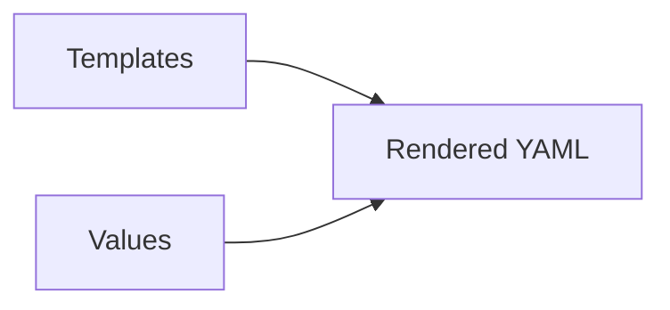

---

## Key Components

- Deployment
- Service
- ConfigMap
- Ingress

---

## Types (if applicable)

Kubernetes resources

---

## Lifecycle / Workflow

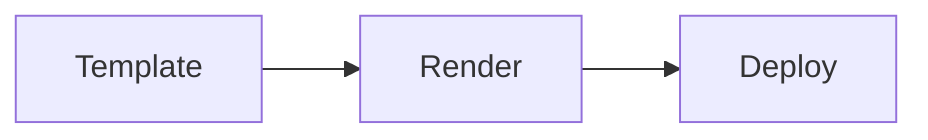

---

## Configuration / Syntax

Uses Go template syntax.

---

## Important Commands

```bash
helm template
```

---

## Important Files

```
deployment.yaml

service.yaml

ingress.yaml
```

---

## Real-World Use Cases

- Dynamic Kubernetes manifests

---

## Advantages

- Reusable templates

---

## Limitations

- Template complexity

---

## Common Interview Questions (Concept Only)

- What is the templates directory?

---

## Common Mistakes

- Invalid template syntax

---

## Troubleshooting

- Use `helm template`

---

## Summary

Templates generate Kubernetes manifests dynamically.

---

# charts/

## Overview

The `charts/` directory stores dependency charts used by the parent chart.

---

## Why It Is Used

Allows reuse of existing Helm Charts.

---

## Architecture / Working

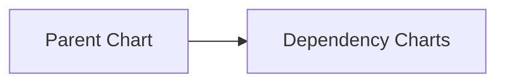

---

## Key Components

- Child charts

---

## Types (if applicable)

- Internal dependencies
- External dependencies

---

## Lifecycle / Workflow

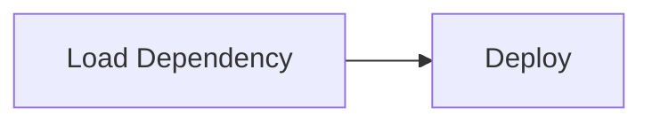

---

## Configuration / Syntax

Managed via dependencies.

---

## Important Commands

```bash
helm dependency update
```

---

## Important Files

```
charts/
```

---

## Real-World Use Cases

- Shared services

---

## Advantages

- Modular architecture

---

## Limitations

- Dependency management

---

## Common Interview Questions (Concept Only)

- What is the charts directory?

---

## Common Mistakes

- Missing dependencies

---

## Troubleshooting

- Update dependencies

---

## Summary

The `charts/` directory contains dependent Helm Charts.

---

# crds/

## Overview

The `crds/` directory contains Kubernetes **Custom Resource Definitions (CRDs)**.

CRDs are installed before the remaining chart resources.

---

## Why It Is Used

Deploy custom Kubernetes resource types.

---

## Architecture / Working

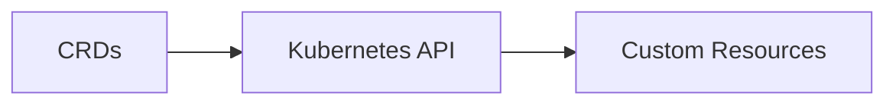

---

## Key Components

- CRDs

---

## Types (if applicable)

- Custom Resources

---

## Lifecycle / Workflow

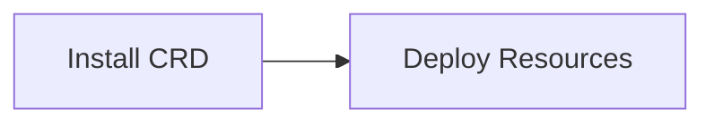

---

## Configuration / Syntax

Standard Kubernetes CRDs.

---

## Important Commands

```bash
kubectl get crds
```

---

## Important Files

```
crds/
```

---

## Real-World Use Cases

- Argo CD
- Prometheus Operator
- Cert Manager

---

## Advantages

- Extends Kubernetes

---

## Limitations

- CRDs require cluster permissions

---

## Common Interview Questions (Concept Only)

- What is the purpose of the crds directory?

---

## Common Mistakes

- Modifying installed CRDs incorrectly

---

## Troubleshooting

- Verify CRD installation

---

## Summary

The `crds/` directory installs Kubernetes Custom Resource Definitions required by applications.

---

# .helmignore

## Overview

`.helmignore` specifies files and directories that should be excluded when packaging a Helm Chart.

---

## Why It Is Used

Prevents unnecessary files from being included in chart packages.

---

## Architecture / Working

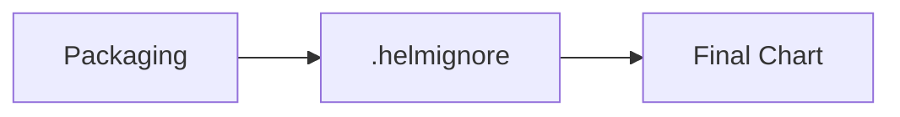

---

## Key Components

- Ignore patterns

---

## Types (if applicable)

Similar to `.gitignore`.

---

## Lifecycle / Workflow

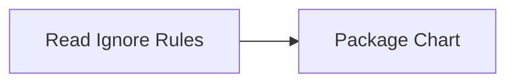

---

## Configuration / Syntax

```text
*.log

.git/

.vscode/
```

---

## Important Commands

```bash
helm package
```

---

## Important Files

```
.helmignore
```

---

## Real-World Use Cases

- Exclude editor files
- Exclude logs

---

## Advantages

- Smaller packages

---

## Limitations

- Incorrect rules may exclude required files

---

## Common Interview Questions (Concept Only)

- What is `.helmignore`?

---

## Common Mistakes

- Ignoring required files

---

## Troubleshooting

- Review ignore patterns

---

## Summary

`.helmignore` excludes unnecessary files during chart packaging.

---

# LICENSE

## Overview

The `LICENSE` file specifies the legal license under which the Helm Chart is distributed.

---

## Why It Is Used

Defines usage and distribution rights.

---

## Architecture / Working

Not applicable.

---

## Key Components

- License text

---

## Types (if applicable)

- Apache
- MIT
- GPL

---

## Lifecycle / Workflow

Not applicable.

---

## Configuration / Syntax

Plain text license.

---

## Important Commands

Not applicable.

---

## Important Files

```
LICENSE
```

---

## Real-World Use Cases

- Open-source charts
- Enterprise chart repositories

---

## Advantages

- Legal clarity

---

## Limitations

- Optional but recommended

---

## Common Interview Questions (Concept Only)

- Why include a LICENSE file?

---

## Common Mistakes

- Omitting licensing information

---

## Troubleshooting

Not applicable.

---

## Summary

The `LICENSE` file defines how a chart can be used and distributed.

---

# README.md

## Overview

`README.md` documents the Helm Chart.

It explains installation, configuration, prerequisites, and usage.

---

## Why It Is Used

Provides guidance for chart users.

---

## Architecture / Working

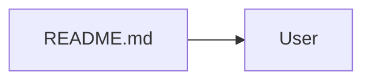

---

## Key Components

- Installation
- Configuration
- Examples

---

## Types (if applicable)

Markdown documentation.

---

## Lifecycle / Workflow

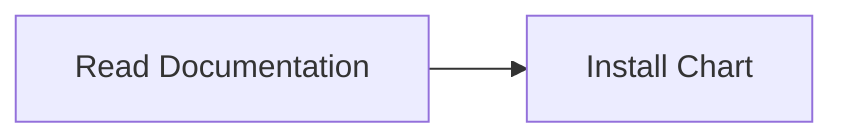

---

## Configuration / Syntax

Markdown.

---

## Important Commands

Not applicable.

---

## Important Files

```
README.md
```

---

## Real-World Use Cases

- Open-source documentation
- Internal deployment guides

---

## Advantages

- Improves usability

---

## Limitations

- Requires maintenance

---

## Common Interview Questions (Concept Only)

- Why include a README in a Helm Chart?

---

## Common Mistakes

- Outdated documentation

---

## Troubleshooting

- Keep documentation synchronized with chart changes

---

## Summary

A well-maintained `README.md` helps users understand and deploy the Helm Chart correctly.

---

# Interview Quick Revision

## Standard Helm Chart Directory

```text
my-chart/
├── Chart.yaml          # Required metadata
├── values.yaml         # Default configuration
├── charts/             # Dependency charts
├── templates/          # Kubernetes templates
├── crds/               # Custom Resource Definitions
├── .helmignore         # Ignore files during packaging
├── LICENSE             # License information
└── README.md           # Documentation
```

---

## File Purpose

| File/Directory | Purpose |
|----------------|----------|
| `Chart.yaml` | Chart metadata |
| `values.yaml` | Default configuration values |
| `templates/` | Kubernetes manifest templates |
| `charts/` | Dependency charts |
| `crds/` | Custom Resource Definitions |
| `.helmignore` | Excludes files during packaging |
| `LICENSE` | License information |
| `README.md` | Documentation |

---

## Production Best Practices

- Keep `Chart.yaml` metadata accurate and versioned.
- Store configurable values in `values.yaml`; avoid hardcoding values in templates.
- Organize Kubernetes manifests under the `templates/` directory with clear file names.
- Manage dependencies using `Chart.yaml` and keep the `charts/` directory updated.
- Include CRDs only when the application requires custom Kubernetes resources.
- Use `.helmignore` to exclude temporary files, editor settings, and unnecessary artifacts.
- Maintain a comprehensive `README.md` with installation, configuration, and upgrade instructions.
- Validate chart structure with `helm lint` before packaging or deploying.

---

## One-line Interview Answer

**A Helm Chart is a structured package containing metadata, configuration values, templates, dependencies, and optional resources that together enable reusable, version-controlled, and configurable Kubernetes application deployments.**
