# Helm Templates

## Overview

Helm Templates are Kubernetes manifest files that use the **Go Template language** to generate dynamic YAML during deployment.

Instead of writing multiple static YAML files for different environments, Helm templates allow you to create reusable Kubernetes manifests by injecting values from `values.yaml` or command-line overrides.

> **Interview Tip**
>
> Helm templates are **not sent directly to Kubernetes**. Helm first renders them into standard Kubernetes YAML, then applies the generated manifests to the cluster.

---

## Why It Is Used

Helm Templates help to:

- Eliminate duplicate YAML files
- Create reusable Kubernetes manifests
- Deploy the same application to multiple environments
- Parameterize application configuration
- Simplify CI/CD deployments
- Standardize Kubernetes deployments

---

## Architecture / Working

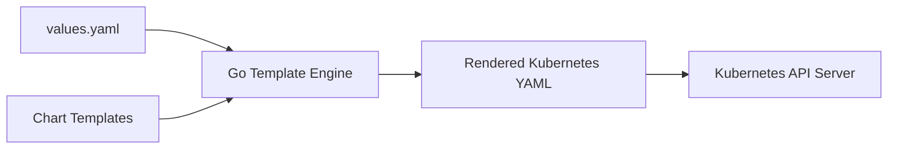

### Working Process

1. User installs a Helm Chart.
2. Helm loads `values.yaml`.
3. Go Template Engine processes template files.
4. Variables are replaced with actual values.
5. Kubernetes manifests are generated.
6. Generated manifests are deployed.

---

## Key Components

| Component | Purpose |
|------------|----------|
| Template Files | Dynamic Kubernetes YAML |
| Go Templates | Template language |
| Values | Input configuration |
| Built-in Objects | Chart metadata and runtime information |
| Functions | Modify template output |
| Variables | Store temporary values |
| Named Templates | Reusable template blocks |

---

## Types (if applicable)

| Template Type | Purpose |
|---------------|----------|
| Resource Templates | Deployment, Service, ConfigMap, etc. |
| Helper Templates | Reusable functions |
| Named Templates | Shared template blocks |

---

## Lifecycle / Workflow

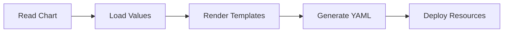

---

## Configuration / Syntax

Basic template syntax

```yaml
{{ .Values.image.repository }}
```

Template expressions

```yaml
{{ expression }}
```

Comments

```yaml
{{/* Comment */}}
```

Whitespace trimming

```yaml
{{- }}
{{ -}}
```

---

## Important Commands

```bash
helm template

helm lint

helm install

helm upgrade

helm get manifest
```

---

## Important Files

```
templates/

_helpers.tpl

values.yaml

Chart.yaml
```

---

## Real-World Use Cases

- Deploy applications to Dev, QA and Production
- Dynamic image versions
- Dynamic replica counts
- ConfigMaps
- Secrets
- Services
- Ingress resources
- CI/CD automation

---

## Advantages

- Reusable templates
- Environment-specific configuration
- Less duplicate YAML
- Easy upgrades
- Easy maintenance
- Supports complex deployments

---

## Limitations

- Learning Go Templates takes time
- Debugging large templates can be difficult
- Incorrect template syntax causes rendering failures

---

## Common Interview Questions (Concept Only)

- What are Helm Templates?
- Why are Helm Templates used?
- How does Helm render templates?
- What template language does Helm use?
- Difference between values.yaml and templates?
- What are built-in objects?
- What are helper templates?

---

## Common Mistakes

- Hardcoding values
- Incorrect indentation
- Invalid template syntax
- Mixing business logic into templates
- Ignoring whitespace trimming
- Forgetting template validation

---

## Troubleshooting

| Problem | Cause | Solution |
|----------|-------|----------|
| YAML parse error | Incorrect indentation | Validate YAML |
| Missing value | Wrong variable path | Verify `.Values` |
| Template rendering fails | Syntax error | Run `helm template` |
| Invalid Kubernetes YAML | Template generated incorrect output | Inspect rendered manifests |
| Variable not found | Typo in variable name | Verify variable path |

---

## Summary

Helm Templates generate Kubernetes manifests dynamically using Go Templates and configuration values. They are the core feature that makes Helm reusable, configurable, and suitable for production deployments.

> **Interview Tip**
>
> Helm Templates are rendered locally by Helm before being sent to the Kubernetes API Server.

---

# Template Syntax

## Overview

Template syntax defines how variables, expressions, loops, conditions, and functions are written inside Helm templates.

Every template expression is enclosed within double curly braces.

```
{{ }}
```

---

## Why It Is Used

Template syntax enables:

- Dynamic values
- Conditional resources
- Loops
- Functions
- Variable substitution

---

## Architecture / Working

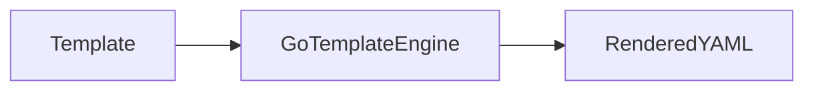

---

## Key Components

| Syntax | Purpose |
|----------|----------|
| `{{ }}` | Evaluate expression |
| `{{- }}` | Trim left whitespace |
| `{{ -}}` | Trim right whitespace |
| `{{/* */}}` | Comment |

---

## Types (if applicable)

- Variables
- Functions
- Flow control
- Comments

---

## Lifecycle / Workflow

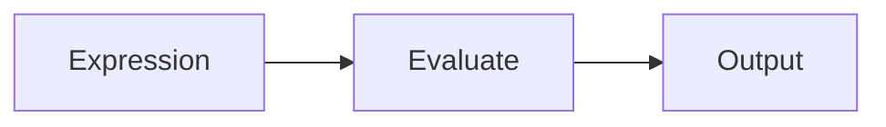

---

## Configuration / Syntax

Variable

```yaml
{{ .Values.image }}
```

Comment

```yaml
{{/* comment */}}
```

Trim whitespace

```yaml
{{- if }}
```

---

## Important Commands

```bash
helm template
```

---

## Important Files

```
templates/*
```

---

## Real-World Use Cases

- Dynamic Deployments
- Dynamic Services

---

## Advantages

- Flexible
- Reusable

---

## Limitations

- Syntax sensitive

---

## Common Interview Questions (Concept Only)

- What syntax does Helm use?

---

## Common Mistakes

- Missing braces
- Incorrect spacing

---

## Troubleshooting

Run

```bash
helm template
```

---

## Summary

Helm Template syntax uses Go Template expressions enclosed within `{{ }}`.

---

# Go Templates

## Overview

Helm uses the Go Template engine to render Kubernetes manifests.

It supports:

- Variables
- Functions
- Conditions
- Loops
- Pipelines

---

## Why It Is Used

Allows dynamic YAML generation.

---

## Architecture / Working

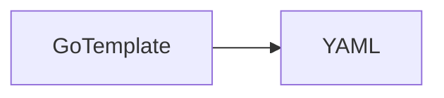

---

## Key Components

- Variables
- Functions
- Conditions

---

## Types (if applicable)

Standard Go Templates

---

## Lifecycle / Workflow

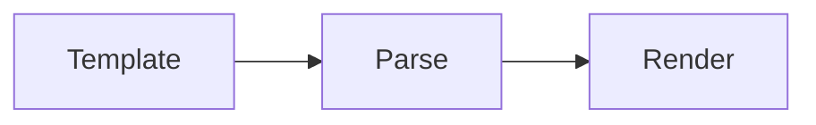

---

## Configuration / Syntax

```
{{ .Values.name }}
```

---

## Important Commands

```bash
helm template
```

---

## Important Files

```
templates/
```

---

## Real-World Use Cases

- Environment-based deployment

---

## Advantages

- Powerful
- Flexible

---

## Limitations

- Learning curve

---

## Common Interview Questions (Concept Only)

- What template engine does Helm use?

---

## Common Mistakes

- Incorrect object paths

---

## Troubleshooting

Render templates locally.

---

## Summary

Helm relies on Go Templates to generate Kubernetes manifests dynamically.

---

# Template Functions

## Overview

Functions manipulate template values before rendering.

---

## Why It Is Used

Functions help format, transform, and validate data.

---

## Architecture / Working

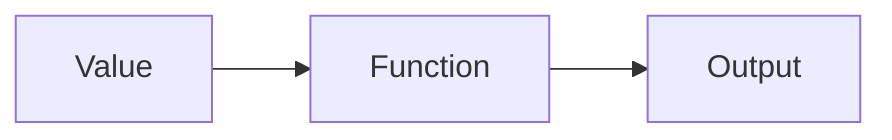

---

## Key Components

Common functions:

| Function | Purpose |
|-----------|----------|
| default | Default value |
| upper | Uppercase |
| lower | Lowercase |
| quote | Add quotes |
| trim | Remove spaces |
| replace | Replace text |
| required | Mandatory value |
| toYaml | Convert object to YAML |
| indent | Add indentation |

---

## Types (if applicable)

- String
- Math
- YAML
- Validation

---

## Lifecycle /Workflow

```
Value → Function → Output
```

---

## Configuration / Syntax

```yaml
{{ default "nginx" .Values.image }}
```

---

## Important Commands

```bash
helm template
```

---

## Important Files

```
templates/
```

---

## Real-World Use Cases

- Default values
- YAML formatting

---

## Advantages

- Cleaner templates

---

## Limitations

- Nested functions become difficult to read

---

## Common Interview Questions (Concept Only)

- What is the purpose of template functions?

---

## Common Mistakes

- Incorrect function order

---

## Troubleshooting

Inspect rendered output.

---

## Summary

Functions transform values during template rendering.

---

# Pipelines

## Overview

Pipelines pass the output of one function as the input to another.

Similar to Linux pipes.

---

## Why It Is Used

Makes templates cleaner and easier to read.

---

## Architecture / Working

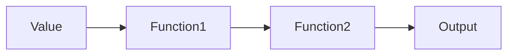

---

## Key Components

Pipeline operator

```
|
```

---

## Types (if applicable)

Function pipelines

---

## Lifecycle / Workflow

```
Value
 ↓
Function
 ↓
Output
```

---

## Configuration / Syntax

```yaml
{{ .Values.image | quote }}
```

---

## Important Commands

Not applicable.

---

## Important Files

Templates

---

## Real-World Use Cases

- Formatting values

---

## Advantages

- Readable templates

---

## Limitations

- Long pipelines reduce readability

---

## Common Interview Questions (Concept Only)

- What are pipelines in Helm?

---

## Common Mistakes

- Incorrect function chaining

---

## Troubleshooting

Render templates.

---

## Summary

Pipelines chain multiple template functions together.

---

# Variables

## Overview

Variables temporarily store values inside templates.

---

## Why It Is Used

Avoid repeated expressions.

---

## Architecture / Working

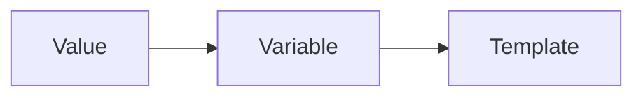

---

## Key Components

Variable declaration

---

## Types (if applicable)

Temporary variables

---

## Lifecycle / Workflow

```
Assign → Use
```

---

## Configuration / Syntax

```yaml
{{- $name := .Values.name }}
```

---

## Important Commands

Not applicable.

---

## Important Files

Templates

---

## Real-World Use Cases

- Store labels
- Store image names

---

## Advantages

- Cleaner templates

---

## Limitations

- Scope limited

---

## Common Interview Questions (Concept Only)

- How are variables declared?

---

## Common Mistakes

- Variable scope confusion

---

## Troubleshooting

Check rendered YAML.

---

## Summary

Variables improve readability and reduce repetition.

---

# Built-in Objects

## Overview

Built-in Objects provide access to Helm runtime information.

---

## Why It Is Used

Templates need chart metadata and deployment information.

---

## Architecture / Working

```mermaid
flowchart LR

Built-in Objects --> Template
```

---

## Key Components

| Object | Description |
|---------|-------------|
| .Values | Configuration |
| .Chart | Chart metadata |
| .Release | Release information |
| .Files | Chart files |
| .Capabilities | Kubernetes capabilities |

---

## Types (if applicable)

Runtime objects

---

## Lifecycle / Workflow

```
Object → Template
```

---

## Configuration / Syntax

```yaml
{{ .Release.Name }}
```

---

## Important Commands

```bash
helm template
```

---

## Important Files

Templates

---

## Real-World Use Cases

- Namespace
- Release name
- Chart version

---

## Advantages

- Rich deployment information

---

## Limitations

- Read-only

---

## Common Interview Questions (Concept Only)

- Name Helm built-in objects.

---

## Common Mistakes

- Wrong object path

---

## Troubleshooting

Render templates.

---

## Summary

Built-in objects expose deployment metadata to templates.

---

# Flow Control

## Overview

Flow Control allows templates to execute logic using conditions and loops.

---

## Why It Is Used

Create dynamic Kubernetes resources.

---

## Architecture / Working

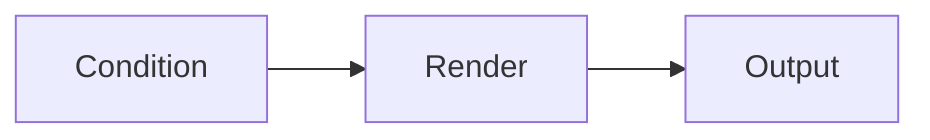

---

## Key Components

- if
- else
- range
- with

---

## Types (if applicable)

Conditional and iterative control

---

## Lifecycle / Workflow

```
Condition → Render
```

---

## Configuration / Syntax

```
if

else

range

with
```

---

## Important Commands

```bash
helm template
```

---

## Important Files

Templates

---

## Real-World Use Cases

- Optional Ingress
- Multiple ports
- Labels

---

## Advantages

- Dynamic manifests

---

## Limitations

- Complex nesting

---

## Common Interview Questions (Concept Only)

- Which flow control statements does Helm support?

---

## Common Mistakes

- Incorrect indentation

---

## Troubleshooting

Validate rendered YAML.

---

## Summary

Flow control enables conditional and iterative template rendering.

---

# Named Templates

## Overview

Named Templates define reusable template blocks.

---

## Why It Is Used

Avoid duplicated template code.

---

## Architecture / Working

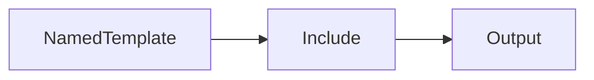

---

## Key Components

Reusable template block

---

## Types (if applicable)

Named templates

---

## Lifecycle / Workflow

```
Define → Include
```

---

## Configuration / Syntax

Uses

```
define

template
```

---

## Important Commands

Not applicable.

---

## Important Files

```
_helpers.tpl
```

---

## Real-World Use Cases

- Labels
- Metadata

---

## Advantages

- Reusability

---

## Limitations

- Naming conflicts

---

## Common Interview Questions (Concept Only)

- What are named templates?

---

## Common Mistakes

- Duplicate template names

---

## Troubleshooting

Verify helper definitions.

---

## Summary

Named templates eliminate repetitive template code.

---

# Helper Templates

## Overview

Helper Templates are reusable template definitions stored in `_helpers.tpl`.

---

## Why It Is Used

Centralizes commonly used template logic.

---

## Architecture / Working

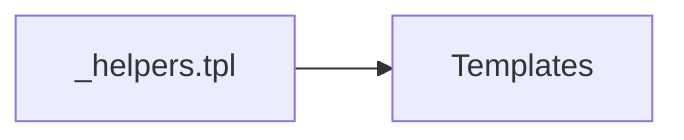

---

## Key Components

- Labels
- Names
- Selectors

---

## Types (if applicable)

Shared templates

---

## Lifecycle / Workflow

```
Define → Include
```

---

## Configuration / Syntax

Stored in

```
_helpers.tpl
```

---

## Important Commands

Not applicable.

---

## Important Files

```
_helpers.tpl
```

---

## Real-World Use Cases

- Standard labels
- Resource names

---

## Advantages

- DRY principle
- Easy maintenance

---

## Limitations

- Harder debugging

---

## Common Interview Questions (Concept Only)

- What is `_helpers.tpl`?

---

## Common Mistakes

- Editing helper names incorrectly

---

## Troubleshooting

Render templates.

---

## Summary

Helper templates improve template reuse and maintainability.

---

# Template Debugging

## Overview

Template debugging helps identify syntax errors, missing values, and rendering problems before deploying to Kubernetes.

---

## Why It Is Used

Prevent deployment failures.

---

## Architecture / Working

```mermaid
flowchart LR

Template --> Debug --> Fixed Template
```

---

## Key Components

- Rendering
- Validation
- Linting

---

## Types (if applicable)

Local debugging

---

## Lifecycle / Workflow


---

## Configuration / Syntax

Useful commands

```bash
helm lint

helm template

helm install --dry-run --debug
```

---

## Important Commands

```bash
helm lint

helm template

helm install --dry-run

helm install --debug
```

---

## Important Files

```
templates/

values.yaml
```

---

## Real-World Use Cases

- Validate production deployments
- CI/CD testing
- Template troubleshooting

---

## Advantages

- Detects errors before deployment
- Saves troubleshooting time
- Prevents Kubernetes failures

---

## Limitations

- Does not validate application logic
- Requires familiarity with rendered manifests

---

## Common Interview Questions (Concept Only)

- How do you debug Helm templates?
- What is the difference between `helm template` and `helm install --dry-run --debug`?
- Why use `helm lint`?

---

## Common Mistakes

- Skipping `helm lint`
- Deploying without reviewing rendered YAML
- Ignoring template rendering errors
- Debugging directly in production

---

## Troubleshooting

| Problem | Cause | Solution |
|----------|-------|----------|
| YAML parsing error | Invalid template or indentation | Run `helm template` and inspect output |
| Missing values | Incorrect `.Values` path | Verify `values.yaml` |
| Undefined helper template | Missing or incorrect `_helpers.tpl` definition | Check template names and includes |
| Incorrect function output | Wrong function usage | Validate function syntax |
| Chart validation fails | Template or metadata issue | Run `helm lint` |

---

## Summary

Template debugging ensures Helm templates render into valid Kubernetes manifests before deployment. The most commonly used debugging commands in production are `helm lint`, `helm template`, and `helm install --dry-run --debug`.

> **Interview Tip**
>
> - `helm lint` validates the chart structure and syntax.
> - `helm template` renders Kubernetes YAML locally without deploying.
> - `helm install --dry-run --debug` simulates an installation and provides detailed debugging information.

---

# Interview Quick Revision

## Frequently Used Built-in Objects

| Object | Purpose |
|---------|---------|
| `.Values` | Configuration values |
| `.Chart` | Chart metadata |
| `.Release` | Release information |
| `.Files` | Access chart files |
| `.Capabilities` | Kubernetes API capabilities |

---

## Common Template Functions

| Function | Purpose |
|----------|---------|
| `default` | Set a fallback value |
| `required` | Ensure a value is provided |
| `quote` | Wrap value in quotes |
| `upper` | Convert to uppercase |
| `lower` | Convert to lowercase |
| `replace` | Replace text |
| `toYaml` | Convert object to YAML |
| `indent` / `nindent` | Format YAML indentation |

---

## Essential Debugging Commands

| Command | Purpose |
|----------|---------|
| `helm lint` | Validate chart syntax |
| `helm template` | Render manifests locally |
| `helm install --dry-run --debug` | Simulate installation with debug output |
| `helm get manifest <release>` | View deployed manifests |

---

## Production Best Practices

- Keep templates focused on rendering logic; avoid complex business logic.
- Store configurable values in `values.yaml` instead of hardcoding them.
- Reuse common code through `_helpers.tpl` and named templates.
- Use template functions like `default` and `required` for safer deployments.
- Validate every chart with `helm lint` before packaging.
- Review rendered manifests using `helm template` before deploying to production.
- Use whitespace trimming (`{{-` and `-}}`) to generate clean YAML.
- Keep template files modular and easy to maintain.

---

## One-line Interview Answer

**Helm Templates use the Go Template engine to dynamically generate Kubernetes manifests from reusable templates and configuration values, enabling consistent, parameterized, and production-ready application deployments.**
