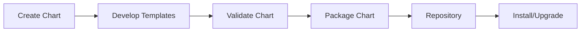
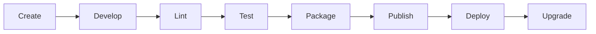
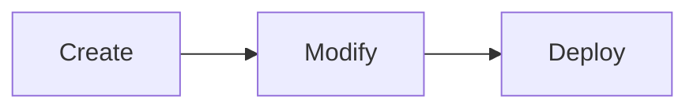
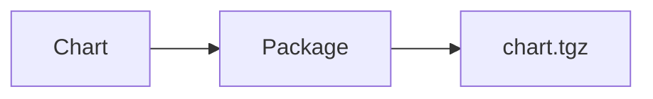
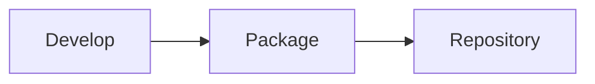
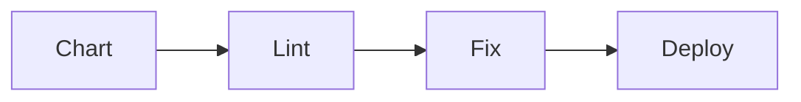
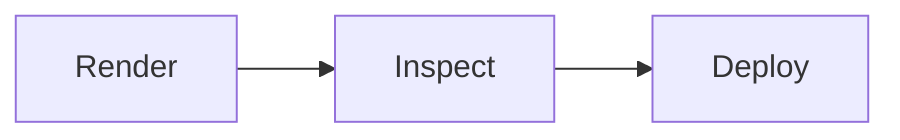
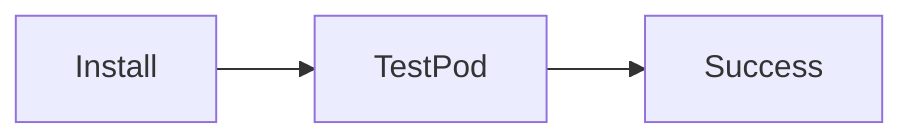
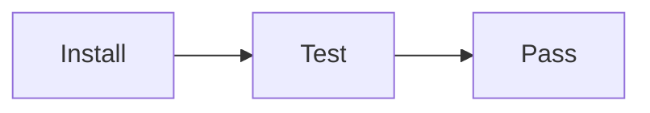
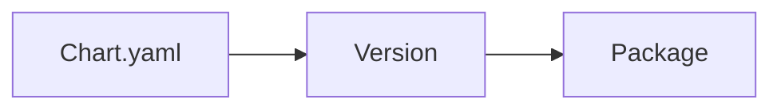

# Chart Development

## Overview

Chart Development is the process of creating, validating, packaging, versioning, and maintaining Helm Charts used to deploy Kubernetes applications.

A well-developed Helm Chart makes deployments **reusable, configurable, version-controlled, and production-ready**.

> **Interview Tip**
>
> A Helm Chart is similar to a software package. It contains everything required to deploy an application consistently across multiple Kubernetes environments.

---

## Why It Is Used

Chart Development helps to:

- Package Kubernetes applications
- Standardize deployments
- Reuse deployment templates
- Support version-controlled releases
- Simplify CI/CD pipelines
- Enable environment-specific deployments
- Reduce duplicate YAML files

---

## Architecture / Working



### Working Process

1. Create a new chart.
2. Add Kubernetes templates.
3. Configure `values.yaml`.
4. Validate chart syntax.
5. Package the chart.
6. Publish to a Helm repository.
7. Install or upgrade the application.

---

## Key Components

| Component | Purpose |
|-----------|----------|
| Chart.yaml | Chart metadata |
| values.yaml | Default configuration |
| templates/ | Kubernetes templates |
| charts/ | Dependencies |
| _helpers.tpl | Reusable templates |
| README.md | Documentation |

---

## Types (if applicable)

| Chart Type | Purpose |
|------------|----------|
| Application Chart | Deploy applications |
| Library Chart | Reusable template library |

---

## Lifecycle / Workflow



---

## Configuration / Syntax

Typical workflow

```text
Create Chart
      │
      ▼
Edit Templates
      │
      ▼
Validate
      │
      ▼
Package
      │
      ▼
Publish
```

---

## Important Commands

```bash
helm create

helm lint

helm template

helm package

helm install

helm upgrade

helm test

helm show chart
```

---

## Important Files

```
Chart.yaml

values.yaml

templates/

_helpers.tpl

README.md
```

---

## Real-World Use Cases

- Internal application deployment
- Kubernetes platform engineering
- CI/CD automation
- Multi-environment deployments
- Enterprise application packaging
- Microservices deployment

---

## Advantages

- Reusable deployments
- Version control
- Easy upgrades
- Easy rollback
- Environment-specific configuration
- Simplifies Kubernetes management

---

## Limitations

- Large charts become complex
- Requires understanding of Go Templates
- Template debugging can be difficult

---

## Common Interview Questions (Concept Only)

- What is Helm Chart Development?
- What are the stages of chart development?
- How do you validate a chart?
- How do you package a chart?
- What is chart versioning?
- What is the difference between chart version and application version?

---

## Common Mistakes

- Hardcoding values
- Ignoring chart validation
- Incorrect version updates
- Poor chart structure
- Missing documentation
- Using production values as defaults

---

## Troubleshooting

| Problem | Cause | Solution |
|----------|-------|----------|
| Chart fails validation | Invalid YAML | Run `helm lint` |
| Installation fails | Template error | Run `helm template` |
| Package creation fails | Invalid chart structure | Verify required files |
| Wrong chart version | Metadata not updated | Update `Chart.yaml` |
| Test failures | Application not ready | Check Kubernetes resources |

---

## Summary

Chart Development is the complete process of building reusable Helm Charts, validating them, packaging them, versioning them, and deploying them to Kubernetes.

> **Interview Tip**
>
> Production workflow:
>
> **Create → Validate → Test → Package → Publish → Deploy**

---

# Create Charts

## Overview

Creating a chart generates the standard Helm directory structure used to develop Kubernetes applications.

---

## Why It Is Used

- Bootstrap chart development
- Create standard directory layout
- Save development time

---

## Architecture / Working

```mermaid
flowchart LR

helm create --> ChartDirectory
```

---

## Key Components

Generated directories include:

- Chart.yaml
- values.yaml
- templates/
- charts/

---

## Types (if applicable)

Application Chart

---

## Lifecycle / Workflow



---

## Configuration / Syntax

```bash
helm create my-chart
```

---

## Important Commands

```bash
helm create
```

---

## Important Files

```
Chart.yaml

values.yaml

templates/
```

---

## Real-World Use Cases

- New microservice deployment
- Internal platform templates

---

## Advantages

- Standard structure
- Faster development

---

## Limitations

- Generated templates often require cleanup

---

## Common Interview Questions (Concept Only)

- How do you create a Helm Chart?

---

## Common Mistakes

- Keeping unused templates

---

## Troubleshooting

Inspect generated files.

---

## Summary

`helm create` generates a production-ready starting point for chart development.

---

# Package Charts

## Overview

Packaging converts a chart directory into a compressed `.tgz` archive.

---

## Why It Is Used

Allows charts to be:

- Shared
- Published
- Installed
- Versioned

---

## Architecture / Working



---

## Key Components

- Chart directory
- Metadata
- Templates

---

## Types (if applicable)

Compressed archive

---

## Lifecycle / Workflow



---

## Configuration / Syntax

```bash
helm package my-chart
```

---

## Important Commands

```bash
helm package
```

---

## Important Files

```
chart-name-version.tgz
```

---

## Real-World Use Cases

- Publish internal charts
- Release new application versions

---

## Advantages

- Easy distribution

---

## Limitations

- Invalid charts cannot be packaged successfully

---

## Common Interview Questions (Concept Only)

- What does `helm package` do?

---

## Common Mistakes

- Packaging without validation

---

## Troubleshooting

Run `helm lint` first.

---

## Summary

Packaging creates a distributable Helm Chart archive.

---

# Lint Charts

## Overview

Linting checks a Helm Chart for syntax errors, YAML issues, and best-practice violations.

---

## Why It Is Used

Detect problems before deployment.

---

## Architecture / Working

```mermaid
flowchart LR

Chart --> Linter --> Validation Report
```

---

## Key Components

- YAML validation
- Template validation
- Metadata validation

---

## Types (if applicable)

Static analysis

---

## Lifecycle / Workflow



---

## Configuration / Syntax

```bash
helm lint my-chart
```

---

## Important Commands

```bash
helm lint
```

---

## Important Files

Entire chart

---

## Real-World Use Cases

- CI/CD validation
- Pre-release checks

---

## Advantages

- Early error detection

---

## Limitations

- Does not validate application behavior

---

## Common Interview Questions (Concept Only)

- Why use `helm lint`?

---

## Common Mistakes

- Ignoring warnings

---

## Troubleshooting

Review lint output carefully.

---

## Summary

Linting validates chart quality before packaging or deployment.

---

# Validate Charts

## Overview

Validation ensures a chart renders correctly into valid Kubernetes manifests.

---

## Why It Is Used

Prevents deployment failures.

---

## Architecture / Working

```mermaid
flowchart LR

Chart --> Render --> Kubernetes YAML
```

---

## Key Components

- Rendering
- YAML validation

---

## Types (if applicable)

Template validation

---

## Lifecycle / Workflow



---

## Configuration / Syntax

```bash
helm template my-chart
```

---

## Important Commands

```bash
helm template

helm lint
```

---

## Important Files

```
templates/
```

---

## Real-World Use Cases

- CI validation
- GitOps validation

---

## Advantages

- Detects rendering issues

---

## Limitations

- Does not deploy resources

---

## Common Interview Questions (Concept Only)

- How do you validate a Helm Chart?

---

## Common Mistakes

- Skipping rendered YAML review

---

## Troubleshooting

Inspect generated manifests.

---

## Summary

Validation confirms templates render into valid Kubernetes YAML.

---

# Test Charts

## Overview

Helm supports chart testing using Kubernetes test resources.

Tests verify that an application is functioning correctly after installation.

---

## Why It Is Used

- Verify deployments
- Validate application health
- Automate testing

---

## Architecture / Working



---

## Key Components

- Test Pods
- Test Hooks

---

## Types (if applicable)

Post-install tests

---

## Lifecycle / Workflow



---

## Configuration / Syntax

Tests are stored in:

```
templates/tests/
```

---

## Important Commands

```bash
helm test

helm install
```

---

## Important Files

```
templates/tests/
```

---

## Real-World Use Cases

- Smoke testing
- Health verification

---

## Advantages

- Automated verification

---

## Limitations

- Tests require running Kubernetes resources

---

## Common Interview Questions (Concept Only)

- What does `helm test` do?

---

## Common Mistakes

- No cleanup after tests

---

## Troubleshooting

Inspect test pod logs.

---

## Summary

Helm tests verify successful deployments using Kubernetes resources.

---

# Chart Versioning

## Overview

Chart Versioning tracks changes to the Helm Chart itself and the application it deploys.

Two versions are maintained:

- Chart Version
- Application Version

---

## Why It Is Used

- Track releases
- Manage upgrades
- Support rollback
- Publish repositories

---

## Architecture / Working



---

## Key Components

| Field | Purpose |
|---------|----------|
| version | Helm Chart version |
| appVersion | Application version |

---

## Types (if applicable)

| Version | Description |
|----------|-------------|
| Chart Version | Package version |
| App Version | Application version |

---

## Lifecycle / Workflow

```mermaid
flowchart LR

Modify --> Increment Version --> Package
```

---

## Configuration / Syntax

```yaml
version: 1.2.0

appVersion: "2.5.1"
```

---

## Important Commands

```bash
helm show chart

helm package
```

---

## Important Files

```
Chart.yaml
```

---

## Real-World Use Cases

- Software releases
- CI/CD pipelines
- Repository publishing

---

## Advantages

- Controlled upgrades
- Easy rollback
- Version tracking

---

## Limitations

- Incorrect versioning causes deployment confusion

---

## Common Interview Questions (Concept Only)

- Difference between `version` and `appVersion`?
- When should chart version change?
- When should application version change?

---

## Common Mistakes

- Updating only appVersion
- Forgetting chart version
- Incorrect semantic versioning

---

## Troubleshooting

Verify `Chart.yaml`.

---

## Summary

Chart Version tracks the Helm package, while Application Version tracks the deployed application.

> **Interview Tip**
>
> **version → Helm Chart**
>
> **appVersion → Application**

---

# Interview Quick Revision

## Chart Development Workflow

```text
Create Chart
      │
      ▼
Develop Templates
      │
      ▼
Lint
      │
      ▼
Validate
      │
      ▼
Test
      │
      ▼
Package
      │
      ▼
Publish
      │
      ▼
Deploy
```

---

## Frequently Used Commands

| Command | Purpose |
|----------|---------|
| `helm create` | Generate a new chart |
| `helm lint` | Validate chart syntax and best practices |
| `helm template` | Render Kubernetes manifests locally |
| `helm package` | Create a `.tgz` chart package |
| `helm install` | Install a chart |
| `helm upgrade` | Upgrade an existing release |
| `helm test` | Execute chart tests |
| `helm show chart` | Display chart metadata |

---

## Chart Version vs Application Version

| Field | Purpose |
|--------|---------|
| `version` | Version of the Helm Chart package |
| `appVersion` | Version of the deployed application |

---

## Production Best Practices

- Keep charts modular and focused on a single application.
- Store all configurable settings in `values.yaml`; avoid hardcoding values.
- Run `helm lint` before every package or deployment.
- Review rendered manifests using `helm template`.
- Test charts in a non-production environment before release.
- Follow Semantic Versioning for both `version` and `appVersion`.
- Maintain clear documentation in `README.md`.
- Publish only validated and tested chart packages to repositories.

---

## One-line Interview Answer

**Chart Development is the process of creating, validating, testing, packaging, versioning, and maintaining reusable Helm Charts to deliver consistent, configurable, and production-ready Kubernetes deployments.**
