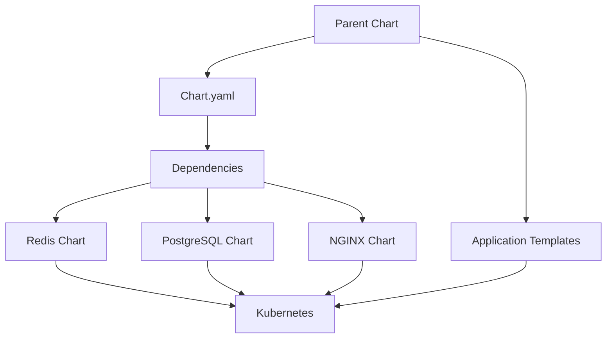
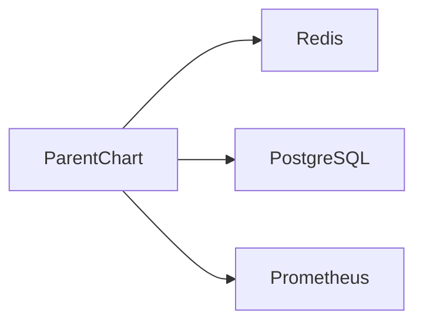
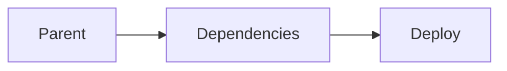
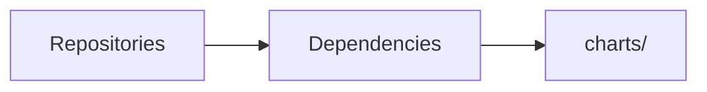
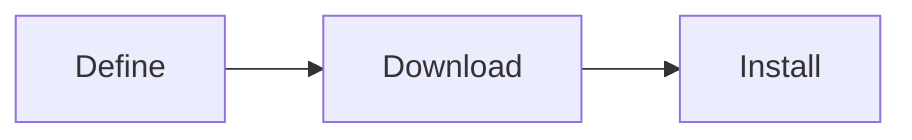
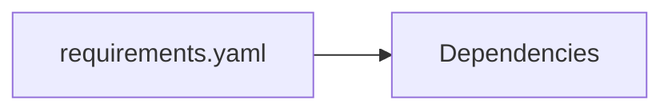
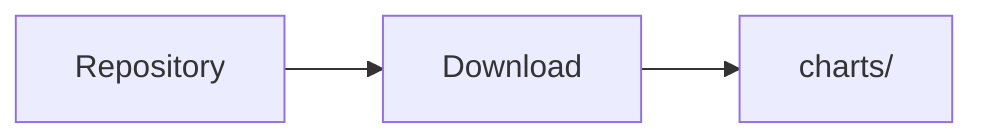
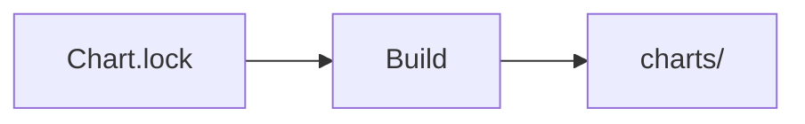

# Dependencies

## Overview

Helm Dependencies allow a chart to include and manage other Helm Charts (called **subcharts**) as part of a single deployment.

Instead of creating everything from scratch, a parent chart can reuse existing charts (such as PostgreSQL, Redis, or NGINX) maintained by the community or your organization.

> **Interview Tip**
>
> A **parent chart** can contain one or more **subcharts**. Helm automatically downloads and manages these dependencies.

---

## Why It Is Used

Dependencies help to:

- Reuse existing Helm Charts
- Reduce duplicate configurations
- Standardize deployments
- Simplify complex applications
- Package multiple services together
- Manage third-party applications easily

---

## Architecture / Working



### Working Process

1. Parent chart defines dependencies.
2. Helm downloads dependent charts.
3. Dependencies are stored locally.
4. Parent chart and subcharts are rendered together.
5. Kubernetes resources are created.

---

## Key Components

| Component | Purpose |
|-----------|----------|
| Parent Chart | Main application chart |
| Subchart | Dependent Helm chart |
| Chart.yaml | Defines dependencies |
| charts/ | Stores downloaded dependency charts |
| Repository | Source of dependency charts |

---

## Types (if applicable)

| Type | Description |
|------|-------------|
| Local Dependency | Chart stored locally |
| Remote Dependency | Chart downloaded from repository |
| Application Dependency | Deploys another application |
| Library Dependency | Provides reusable templates |

---

## Lifecycle / Workflow

```mermaid
flowchart LR

Define Dependency
        │
        ▼
Update Dependencies
        │
        ▼
Download Charts
        │
        ▼
Store in charts/
        │
        ▼
Install Parent Chart
```

---

## Configuration / Syntax (if applicable)

Modern dependency definition:

```yaml
dependencies:
  - name: redis
    version: 18.0.0
    repository: https://charts.bitnami.com/bitnami
```

---

## Important Commands (if applicable)

```bash
helm dependency update

helm dependency build

helm dependency list

helm install

helm upgrade
```

---

## Important Files (if applicable)

```
Chart.yaml

Chart.lock

charts/
```

---

## Real-World Use Cases

- Deploy application with PostgreSQL
- Install Redis automatically
- Package monitoring stack
- Deploy complete microservices platform
- Bundle ingress controller with application

---

## Advantages

- Reusable charts
- Simplifies deployments
- Version management
- Easy upgrades
- Reduced duplication
- Better maintainability

---

## Limitations

- Version conflicts
- Dependency updates may introduce breaking changes
- Large dependency trees increase deployment size

---

## Common Interview Questions (Concept Only)

- What are Helm dependencies?
- What is a subchart?
- Where are dependencies defined?
- How does Helm download dependencies?
- What is Chart.lock?
- Difference between `helm dependency update` and `helm dependency build`?
- Where are downloaded charts stored?

---

## Common Mistakes

- Forgetting to update dependencies
- Using incompatible chart versions
- Editing downloaded charts manually
- Not committing `Chart.lock`
- Mixing legacy and modern dependency formats

---

## Troubleshooting

| Problem | Cause | Solution |
|----------|-------|----------|
| Dependency missing | Not downloaded | Run `helm dependency update` |
| Installation fails | Invalid version | Verify version compatibility |
| Repository error | Repository unavailable | Check repository URL |
| Dependency mismatch | Chart.lock outdated | Update dependencies |
| Subchart not installed | Incorrect dependency definition | Verify `Chart.yaml` |

---

## Summary

Helm Dependencies allow a parent chart to package and deploy multiple charts together, making Kubernetes deployments modular, reusable, and easier to maintain.

> **Interview Tip**
>
> Dependencies are defined in **Chart.yaml**, downloaded into the **charts/** directory, and managed automatically by Helm.

---

# Chart Dependencies

## Overview

Chart Dependencies are Helm Charts referenced by another chart.

The main chart is called the **Parent Chart**, and the included charts are called **Subcharts**.

---

## Why It Is Used

- Reuse existing charts
- Deploy complete application stacks
- Simplify architecture

---

## Architecture / Working



---

## Key Components

- Parent chart
- Subchart
- Repository

---

## Types (if applicable)

- Local
- Remote

---

## Lifecycle / Workflow



---

## Configuration / Syntax (if applicable)

```yaml
dependencies:
  - name: mysql
```

---

## Important Commands (if applicable)

```bash
helm dependency list
```

---

## Important Files (if applicable)

```
Chart.yaml
```

---

## Real-World Use Cases

- Web application + database
- Monitoring stack

---

## Advantages

- Modular deployments

---

## Limitations

- Version management required

---

## Common Interview Questions (Concept Only)

- What is a subchart?

---

## Common Mistakes

- Incorrect dependency versions

---

## Troubleshooting

Verify dependency list.

---

## Summary

Chart Dependencies package multiple Helm Charts together.

---

# Dependency Management

## Overview

Dependency Management is the process of downloading, updating, validating, and maintaining Helm Chart dependencies.

---

## Why It Is Used

Ensures all required charts are available before deployment.

---

## Architecture / Working



---

## Key Components

- Repository
- Chart.lock
- charts/

---

## Types (if applicable)

Automatic management

---

## Lifecycle / Workflow



---

## Configuration / Syntax (if applicable)

Dependencies are managed automatically.

---

## Important Commands (if applicable)

```bash
helm dependency update

helm dependency build
```

---

## Important Files (if applicable)

```
Chart.lock
```

---

## Real-World Use Cases

- CI/CD pipelines
- Enterprise deployments

---

## Advantages

- Automated dependency handling

---

## Limitations

- External repositories may become unavailable

---

## Common Interview Questions (Concept Only)

- How are dependencies managed?

---

## Common Mistakes

- Ignoring Chart.lock

---

## Troubleshooting

Update dependencies.

---

## Summary

Dependency Management automates downloading and maintaining required charts.

---

# requirements.yaml (Legacy)

## Overview

Before Helm v3, dependencies were defined in `requirements.yaml`.

This file is **deprecated** and replaced by the `dependencies` section in `Chart.yaml`.

> **Interview Tip**
>
> Helm v3 no longer uses `requirements.yaml`.

---

## Why It Is Used

Legacy dependency definition.

---

## Architecture / Working



---

## Key Components

- Dependency list

---

## Types (if applicable)

Legacy feature

---

## Lifecycle /Workflow


---

## Configuration / Syntax (if applicable)

Legacy example

```yaml
dependencies:
```

---

## Important Commands (if applicable)

```bash
helm dependency update
```

---

## Important Files (if applicable)

```
requirements.yaml
```

---

## Real-World Use Cases

Only older Helm v2 charts.

---

## Advantages

Previously centralized dependency definition.

---

## Limitations

Deprecated.

---

## Common Interview Questions (Concept Only)

- Why was `requirements.yaml` removed?

---

## Common Mistakes

Using it with Helm v3.

---

## Troubleshooting

Move dependencies into `Chart.yaml`.

---

## Summary

Modern Helm uses `Chart.yaml` instead of `requirements.yaml`.

---

# dependencies in Chart.yaml

## Overview

Helm v3 defines dependencies inside `Chart.yaml`.

---

## Why It Is Used

Single metadata file.

---

## Architecture / Working

```mermaid
flowchart LR

Chart.yaml --> Dependency Resolution
```

---

## Key Components

- name
- version
- repository

---

## Types (if applicable)

Modern dependency definition.

---

## Lifecycle / Workflow

```mermaid
flowchart LR

Read Chart --> Download Charts
```

---

## Configuration / Syntax (if applicable)

```yaml
dependencies:
  - name: redis
    version: 18.0.0
    repository: https://charts.bitnami.com/bitnami
```

---

## Important Commands (if applicable)

```bash
helm dependency update
```

---

## Important Files (if applicable)

```
Chart.yaml
```

---

## Real-World Use Cases

Modern Helm deployments.

---

## Advantages

Simpler configuration.

---

## Limitations

None.

---

## Common Interview Questions (Concept Only)

- Where are dependencies defined in Helm v3?

---

## Common Mistakes

Incorrect repository URL.

---

## Troubleshooting

Validate `Chart.yaml`.

---

## Summary

Helm v3 stores dependencies directly inside `Chart.yaml`.

---

# Update Dependencies

## Overview

Updates dependency charts from repositories based on versions specified in `Chart.yaml`.

---

## Why It Is Used

Downloads the latest compatible dependency charts.

---

## Architecture / Working



---

## Key Components

- Repository
- Version

---

## Types (if applicable)

Dependency update

---

## Lifecycle / Workflow


---

## Configuration / Syntax (if applicable)

```bash
helm dependency update
```

---

## Important Commands (if applicable)

```bash
helm dependency update
```

---

## Important Files (if applicable)

```
Chart.lock

charts/
```

---

## Real-World Use Cases

- Pull latest dependency versions

---

## Advantages

- Keeps dependencies current

---

## Limitations

- May introduce new versions

---

## Common Interview Questions (Concept Only)

- What does `helm dependency update` do?

---

## Common Mistakes

Running update unexpectedly in production.

---

## Troubleshooting

Review downloaded versions.

---

## Summary

Updates dependencies and regenerates `Chart.lock`.

---

# Build Dependencies

## Overview

Build recreates the local dependency directory using the existing `Chart.lock` file.

Unlike update, it does **not** fetch newer dependency versions.

> **Interview Tip**
>
> `build` uses **Chart.lock**.
>
> `update` uses **Chart.yaml**.

---

## Why It Is Used

Provides reproducible deployments.

---

## Architecture / Working



---

## Key Components

- Chart.lock

---

## Types (if applicable)

Dependency restoration

---

## Lifecycle / Workflow

```mermaid
flowchart LR

Read Lock --> Download Exact Versions
```

---

## Configuration / Syntax (if applicable)

```bash
helm dependency build
```

---

## Important Commands (if applicable)

```bash
helm dependency build
```

---

## Important Files (if applicable)

```
Chart.lock

charts/
```

---

## Real-World Use Cases

- CI/CD
- Production deployments
- Offline rebuild

---

## Advantages

- Reproducible builds

---

## Limitations

- Requires `Chart.lock`

---

## Common Interview Questions (Concept Only)

- Difference between build and update?

---

## Common Mistakes

Using build without a lock file.

---

## Troubleshooting

Generate `Chart.lock` first.

---

## Summary

Dependency Build recreates dependencies using the exact versions stored in `Chart.lock`.

---

# Interview Quick Revision

## Dependency Workflow

```text
Define Dependencies
        │
        ▼
Chart.yaml
        │
        ▼
helm dependency update
        │
        ▼
charts/
        │
        ▼
Chart.lock
        │
        ▼
Install Chart
```

---

## Frequently Used Commands

| Command | Purpose |
|----------|---------|
| `helm dependency list` | List dependencies |
| `helm dependency update` | Download/update dependencies and regenerate `Chart.lock` |
| `helm dependency build` | Rebuild dependencies using `Chart.lock` |
| `helm install` | Install chart with dependencies |
| `helm upgrade` | Upgrade chart and dependencies |

---

## `update` vs `build`

| Feature | `helm dependency update` | `helm dependency build` |
|---------|---------------------------|--------------------------|
| Uses `Chart.yaml` | ✅ Yes | ❌ No |
| Uses `Chart.lock` | Updates it | ✅ Uses existing lock file |
| Downloads newer compatible versions | ✅ Yes | ❌ No |
| Reproducible builds | Limited | ✅ Yes |
| Typical use | Development | CI/CD & Production |

---

## Helm v2 vs Helm v3 Dependency Definition

| Helm v2 | Helm v3 |
|----------|----------|
| `requirements.yaml` | `dependencies` in `Chart.yaml` |

---

## Production Best Practices

- Define dependencies in `Chart.yaml` (Helm v3).
- Commit both `Chart.yaml` and `Chart.lock` to version control.
- Use `helm dependency update` during development to refresh dependencies.
- Use `helm dependency build` in CI/CD to ensure deterministic builds.
- Pin dependency versions instead of relying on floating versions.
- Regularly review dependency updates for compatibility and security.
- Avoid modifying downloaded charts directly in the `charts/` directory.

---

## One-line Interview Answer

**Helm Dependencies allow a parent chart to include and manage reusable subcharts, with dependencies defined in `Chart.yaml`, downloaded into the `charts/` directory, and managed using `helm dependency update` and `helm dependency build` for consistent and reusable Kubernetes deployments.**
