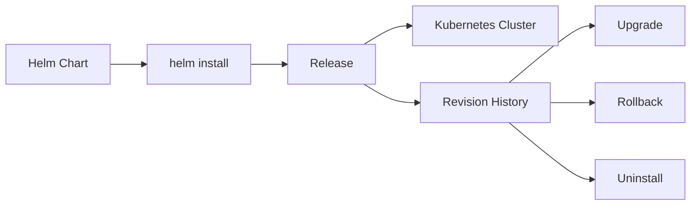
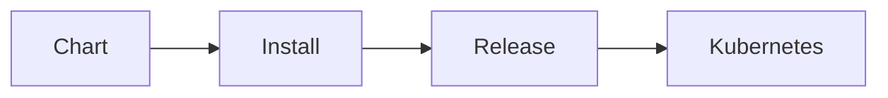
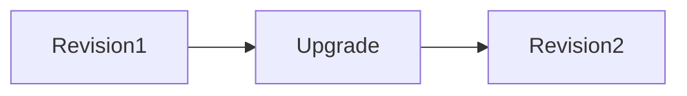
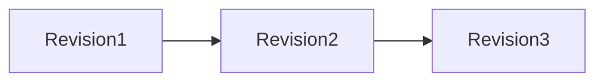
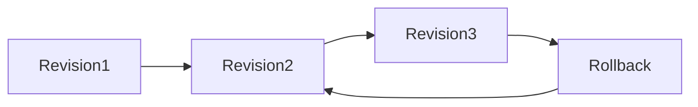
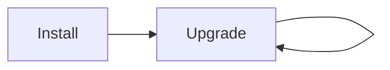
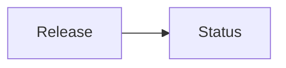
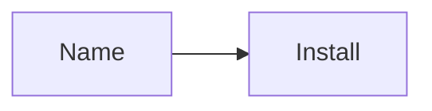

# Release Management

## Overview

Release Management in Helm refers to the process of installing, upgrading, rolling back, monitoring, and removing application deployments in a Kubernetes cluster.

A **Helm Release** is a running instance of a Helm Chart deployed to a Kubernetes cluster. Helm tracks every release and maintains its revision history, enabling easy upgrades and rollbacks.

> **Interview Tip**
>
> **Chart** = Deployment package/template  
> **Release** = Installed instance of that chart

---

## Why It Is Used

Release Management helps to:

- Deploy applications consistently
- Track deployment revisions
- Upgrade applications safely
- Roll back failed deployments
- Manage multiple environments
- Monitor deployment status
- Simplify application lifecycle management

---

## Architecture / Working



### Working Process

1. Install a Helm Chart.
2. Helm creates a Release.
3. Release metadata is stored.
4. Every upgrade creates a new revision.
5. Rollback restores an earlier revision.
6. Release can be deleted when no longer needed.

---

## Key Components

| Component | Purpose |
|-----------|----------|
| Release | Installed chart instance |
| Release Name | Unique deployment identifier |
| Revision | Version of a release |
| Release History | Stores previous revisions |
| Release Status | Current deployment state |

---

## Types (if applicable)

| Type | Description |
|------|-------------|
| New Release | Fresh installation |
| Upgraded Release | Existing release updated |
| Rolled Back Release | Previous revision restored |
| Deleted Release | Removed from cluster |

---

## Lifecycle / Workflow

```mermaid
flowchart LR

Install
   │
   ▼
Revision 1
   │
Upgrade
   │
   ▼
Revision 2
   │
Upgrade
   │
   ▼
Revision 3
   │
Rollback
   │
   ▼
Revision 2
   │
Uninstall
```

---

## Configuration / Syntax (if applicable)

Install

```bash
helm install myapp ./chart
```

Upgrade

```bash
helm upgrade myapp ./chart
```

Rollback

```bash
helm rollback myapp 2
```

---

## Important Commands (if applicable)

```bash
helm install

helm upgrade

helm rollback

helm uninstall

helm history

helm status

helm list
```

---

## Important Files (if applicable)

```
Chart.yaml

values.yaml

Chart.lock
```

---

## Real-World Use Cases

- Deploy applications
- Release new versions
- Roll back failed deployments
- Production upgrades
- CI/CD pipelines
- Blue/Green deployments
- Canary deployments

---

## Advantages

- Version-controlled deployments
- Easy rollback
- Revision tracking
- Automated upgrades
- Deployment consistency
- Simplified Kubernetes management

---

## Limitations

- Rollback depends on available revision history
- Stateful applications may require additional planning
- Failed upgrades may require manual intervention

---

## Common Interview Questions (Concept Only)

- What is a Helm Release?
- Difference between Chart and Release?
- What is a Release Revision?
- How does Helm rollback work?
- Where is release history stored?
- How do you check release status?
- How do you uninstall a release?

---

## Common Mistakes

- Using duplicate release names
- Skipping release validation before upgrades
- Forgetting to review release history
- Upgrading without backup
- Assuming uninstall removes all persistent data

---

## Troubleshooting

| Problem | Cause | Solution |
|----------|-------|----------|
| Release already exists | Duplicate name | Choose another release name |
| Upgrade failed | Invalid chart | Validate using `helm lint` |
| Rollback failed | Revision not available | Check release history |
| Release stuck | Kubernetes resource issue | Inspect pod events and logs |
| Release not found | Incorrect namespace | Specify the correct namespace |

---

## Summary

Helm Release Management provides a complete lifecycle for Kubernetes applications, including installation, upgrades, rollbacks, monitoring, and removal.

> **Interview Tip**
>
> Every successful upgrade creates a **new release revision**, making rollbacks simple and reliable.

---

# Install Releases

## Overview

Installing a release deploys a Helm Chart into a Kubernetes cluster and creates the first release revision.

---

## Why It Is Used

- Deploy applications
- Initialize release history
- Create Kubernetes resources

---

## Architecture / Working



---

## Key Components

- Release Name
- Chart
- Values

---

## Types (if applicable)

- New Installation

---

## Lifecycle / Workflow

```mermaid
flowchart LR

Install --> Revision 1
```

---

## Configuration / Syntax (if applicable)

```bash
helm install myapp ./chart

helm install myapp bitnami/nginx
```

Custom values

```bash
helm install myapp ./chart -f values-prod.yaml
```

---

## Important Commands (if applicable)

```bash
helm install
```

---

## Important Files (if applicable)

```
Chart.yaml

values.yaml
```

---

## Real-World Use Cases

- Deploy new applications
- CI/CD deployments

---

## Advantages

- Quick deployment
- Initializes release tracking

---

## Limitations

- Release name must be unique

---

## Common Interview Questions (Concept Only)

- What happens during `helm install`?

---

## Common Mistakes

- Duplicate release names

---

## Troubleshooting

Use

```bash
helm list
```

to verify existing releases.

---

## Summary

`helm install` creates the first revision of a Helm Release.

---

# Upgrade Releases

## Overview

Upgrading updates an existing release using a newer chart or updated configuration.

Every successful upgrade creates a new revision.

---

## Why It Is Used

- Deploy new application versions
- Modify configuration
- Apply chart changes

---

## Architecture / Working



---

## Key Components

- Existing release
- Updated chart
- New revision

---

## Types (if applicable)

Rolling upgrade

---

## Lifecycle / Workflow



---

## Configuration / Syntax (if applicable)

```bash
helm upgrade myapp ./chart
```

With values

```bash
helm upgrade myapp ./chart -f prod.yaml
```

---

## Important Commands (if applicable)

```bash
helm upgrade
```

---

## Important Files (if applicable)

```
Chart.yaml

values.yaml
```

---

## Real-World Use Cases

- Application updates
- Configuration changes

---

## Advantages

- No reinstall required

---

## Limitations

- Failed upgrades may require rollback

---

## Common Interview Questions (Concept Only)

- Does `helm upgrade` create a new revision?

---

## Common Mistakes

- Upgrading without testing

---

## Troubleshooting

Review release history.

---

## Summary

Every successful upgrade creates a new release revision.

---

# Rollback Releases

## Overview

Rollback restores a previous release revision after a failed deployment or configuration change.

---

## Why It Is Used

- Recover from failed upgrades
- Restore stable deployments

---

## Architecture / Working



---

## Key Components

- Revision History

---

## Types (if applicable)

Revision rollback

---

## Lifecycle / Workflow

```mermaid
flowchart LR

Current --> Previous Revision
```

---

## Configuration / Syntax (if applicable)

```bash
helm rollback myapp 2
```

---

## Important Commands (if applicable)

```bash
helm rollback
```

---

## Important Files (if applicable)

Release metadata

---

## Real-World Use Cases

- Recover production outage
- Restore previous configuration

---

## Advantages

- Fast recovery

---

## Limitations

- Older revisions must exist

---

## Common Interview Questions (Concept Only)

- How does rollback work?

---

## Common Mistakes

- Rolling back to incorrect revision

---

## Troubleshooting

Check revision history first.

---

## Summary

Rollback restores an earlier stable release revision.

---

# Uninstall Releases

## Overview

Uninstall removes a Helm Release and its managed Kubernetes resources.

---

## Why It Is Used

- Remove applications
- Clean unused deployments

---

## Architecture / Working

```mermaid
flowchart LR

Release --> Uninstall --> Resources Deleted
```

---

## Key Components

- Release

---

## Types (if applicable)

Release removal

---

## Lifecycle / Workflow


---

## Configuration / Syntax (if applicable)

```bash
helm uninstall myapp
```

---

## Important Commands (if applicable)

```bash
helm uninstall
```

---

## Important Files (if applicable)

Release metadata

---

## Real-World Use Cases

- Remove test environments
- Decommission applications

---

## Advantages

- Cleans deployment

---

## Limitations

- Persistent Volumes may remain depending on reclaim policy

---

## Common Interview Questions (Concept Only)

- Does uninstall remove PVCs?

---

## Common Mistakes

- Assuming all resources are deleted

---

## Troubleshooting

Inspect remaining Kubernetes resources.

---

## Summary

Uninstall removes the Helm Release from the cluster.

---

# Release History

## Overview

Release History records every revision of a Helm Release.

---

## Why It Is Used

Supports rollback and auditing.

---

## Architecture / Working


---

## Key Components

- Revision Number
- Deployment Time
- Status

---

## Types (if applicable)

Revision history

---

## Lifecycle / Workflow



---

## Configuration / Syntax (if applicable)

```bash
helm history myapp
```

---

## Important Commands (if applicable)

```bash
helm history
```

---

## Important Files (if applicable)

Release metadata

---

## Real-World Use Cases

- Audit deployments
- Rollback planning

---

## Advantages

- Deployment tracking

---

## Limitations

- Older revisions may be pruned if history limits are configured

---

## Common Interview Questions (Concept Only)

- What information is stored in release history?

---

## Common Mistakes

- Ignoring revision numbers

---

## Troubleshooting

Check release revisions.

---

## Summary

Release History stores all deployment revisions.

---

# Release Status

## Overview

Release Status shows the current state of a Helm Release.

---

## Why It Is Used

Monitor deployment health.

---

## Architecture / Working



---

## Key Components

Possible statuses include:

- deployed
- failed
- pending-install
- pending-upgrade
- pending-rollback
- uninstalling
- superseded
- uninstalled

---

## Types (if applicable)

Deployment status

---

## Lifecycle / Workflow


---

## Configuration / Syntax (if applicable)

```bash
helm status myapp
```

---

## Important Commands (if applicable)

```bash
helm status
```

---

## Important Files (if applicable)

Release metadata

---

## Real-World Use Cases

- Deployment monitoring

---

## Advantages

- Quick health check

---

## Limitations

- Does not replace Kubernetes health checks

---

## Common Interview Questions (Concept Only)

- How do you check release status?

---

## Common Mistakes

- Confusing Helm status with Pod status

---

## Troubleshooting

Inspect Kubernetes resources if status is failed.

---

## Summary

Release Status provides the current deployment state of a Helm Release.

---

# Release Naming

## Overview

Each Helm Release requires a unique name within a namespace.

The release name identifies an installed application.

---

## Why It Is Used

- Uniquely identify deployments
- Support multiple installations of the same chart

---

## Architecture / Working

```mermaid
flowchart LR

Release Name --> Helm Release
```

---

## Key Components

- Release Name
- Namespace

---

## Types (if applicable)

User-defined names

---

## Lifecycle / Workflow



---

## Configuration / Syntax (if applicable)

```bash
helm install myapp ./chart
```

Here:

```
myapp
```

is the release name.

Generate automatically:

```bash
helm install --generate-name ./chart
```

---

## Important Commands (if applicable)

```bash
helm install

helm list
```

---

## Important Files (if applicable)

Not applicable.

---

## Real-World Use Cases

- dev-app
- staging-app
- prod-app

---

## Advantages

- Easy identification
- Supports multiple deployments

---

## Limitations

- Must be unique within a namespace

---

## Common Interview Questions (Concept Only)

- Can two releases have the same name?
- What is a Helm Release Name?

---

## Common Mistakes

- Reusing an existing release name

---

## Troubleshooting

List releases before installing:

```bash
helm list
```

---

## Summary

Release names uniquely identify Helm deployments within a namespace.

---

# Interview Quick Revision

## Helm Release Lifecycle

```text
Install
   │
   ▼
Revision 1
   │
Upgrade
   │
   ▼
Revision 2
   │
Upgrade
   │
   ▼
Revision 3
   │
Rollback
   │
   ▼
Revision 2
   │
Uninstall
```

---

## Frequently Used Commands

| Command | Purpose |
|----------|---------|
| `helm install` | Install a new release |
| `helm upgrade` | Upgrade an existing release |
| `helm rollback` | Restore a previous revision |
| `helm uninstall` | Remove a release |
| `helm history` | View release revisions |
| `helm status` | Show current release status |
| `helm list` | List installed releases |

---

## Release Status Values

| Status | Meaning |
|--------|---------|
| `deployed` | Release is successfully deployed |
| `failed` | Deployment failed |
| `pending-install` | Installation in progress |
| `pending-upgrade` | Upgrade in progress |
| `pending-rollback` | Rollback in progress |
| `uninstalling` | Release is being removed |
| `superseded` | Replaced by a newer revision |
| `uninstalled` | Release has been removed |

---

## Production Best Practices

- Use meaningful release names (e.g., `frontend-prod`, `backend-dev`).
- Test upgrades in lower environments before production.
- Review release history before performing rollbacks.
- Monitor both Helm release status and Kubernetes resource health.
- Use version-controlled values files for repeatable deployments.
- Keep release revisions for audit and recovery purposes.
- Back up stateful application data before major upgrades or rollbacks.

---

## One-line Interview Answer

**Helm Release Management provides a complete lifecycle for Kubernetes applications by enabling installation, upgrades, rollback, status monitoring, revision tracking, and safe removal of deployments through versioned Helm Releases.**
