# Resource Management

## Overview

Resource Management in Helm refers to defining, templating, and managing Kubernetes resources using Helm Charts. Instead of writing static Kubernetes YAML files, Helm templates generate resources dynamically using values from `values.yaml`.

Helm can manage almost every Kubernetes resource, including Deployments, Services, ConfigMaps, Secrets, Persistent Volume Claims (PVCs), Ingresses, Jobs, and CronJobs.

> **Interview Tip**
>
> Helm does **not** introduce new Kubernetes resource types. It templates and manages **native Kubernetes resources**.

---

## Why It Is Used

Resource Management helps to:

- Deploy Kubernetes resources consistently
- Reuse deployment templates
- Separate configuration from templates
- Support multiple environments
- Simplify upgrades and rollbacks
- Automate Kubernetes deployments
- Reduce YAML duplication

---

## Architecture / Working

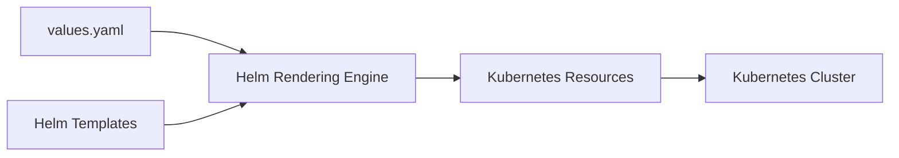

### Working Process

1. Helm reads chart templates.
2. Reads values from `values.yaml`.
3. Renders Kubernetes manifests.
4. Applies resources to the cluster.
5. Tracks resources as part of the Helm Release.

---

## Key Components

| Component | Purpose |
|-----------|----------|
| Deployment | Runs application Pods |
| Service | Exposes Pods |
| ConfigMap | Stores non-sensitive configuration |
| Secret | Stores sensitive data |
| PVC | Persistent storage |
| Ingress | External HTTP/HTTPS access |
| Job | One-time task |
| CronJob | Scheduled task |

---

## Types (if applicable)

| Resource Type | Purpose |
|--------------|----------|
| Workload | Deployment, Job, CronJob |
| Networking | Service, Ingress |
| Configuration | ConfigMap, Secret |
| Storage | PVC |

---

## Lifecycle / Workflow

```mermaid
flowchart LR

Templates
    │
    ▼
Render
    │
    ▼
Create Resources
    │
    ▼
Track Release
    │
    ▼
Upgrade/Rollback/Delete
```

---

## Configuration / Syntax (if applicable)

Example template

```yaml
apiVersion: apps/v1
kind: Deployment
metadata:
  name: {{ .Release.Name }}
```

---

## Important Commands (if applicable)

```bash
helm install

helm upgrade

helm template

helm get manifest

kubectl get all
```

---

## Important Files (if applicable)

```
templates/

values.yaml

Chart.yaml
```

---

## Real-World Use Cases

- Deploy web applications
- Configure databases
- Expose applications
- Store configuration
- Deploy scheduled jobs
- Manage persistent storage

---

## Advantages

- Reusable templates
- Environment-specific deployments
- Easy upgrades
- Easy rollback
- Reduced YAML duplication

---

## Limitations

- Requires Kubernetes knowledge
- Template debugging can be difficult
- Incorrect values can affect multiple resources

---

## Common Interview Questions (Concept Only)

- Which Kubernetes resources can Helm manage?
- Does Helm create custom resource types?
- How are resources updated during upgrades?
- What happens during rollback?
- Where are Kubernetes manifests stored?

---

## Common Mistakes

- Hardcoding resource names
- Using Secrets for non-sensitive data
- Incorrect resource dependencies
- Missing labels/selectors
- Incorrect indentation

---

## Troubleshooting

| Problem | Cause | Solution |
|----------|-------|----------|
| Resource not created | Template error | Run `helm template` |
| Service not working | Selector mismatch | Verify labels |
| Config not updated | Pod restart required | Restart Pods if necessary |
| PVC Pending | Storage class issue | Check StorageClass |
| Ingress inaccessible | Controller missing | Verify Ingress Controller |

---

## Summary

Helm Resource Management enables Kubernetes resources to be deployed, updated, and managed consistently through reusable templates.

> **Interview Tip**
>
> Helm manages Kubernetes resources as part of a **Release**, allowing upgrades and rollbacks to affect all managed resources together.

---

# Deployments

## Overview

A Deployment manages application Pods and ensures the desired number of replicas are running.

---

## Why It Is Used

- Deploy applications
- Rolling updates
- Self-healing
- Scaling

---

## Architecture / Working

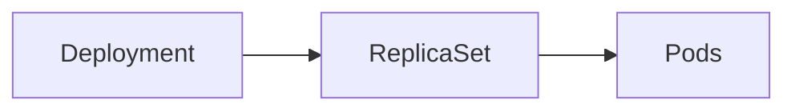

---

## Key Components

- ReplicaSet
- Pods
- Labels
- Selectors

---

## Types (if applicable)

- Stateless workloads

---

## Lifecycle / Workflow

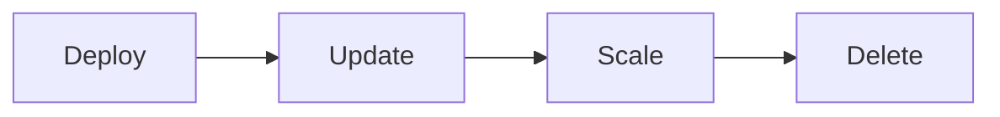

---

## Configuration / Syntax (if applicable)

```yaml
kind: Deployment
```

---

## Important Commands (if applicable)

```bash
kubectl get deployments

helm upgrade
```

---

## Important Files (if applicable)

```
templates/deployment.yaml
```

---

## Real-World Use Cases

- Web applications
- APIs
- Microservices

---

## Advantages

- Self-healing
- Rolling updates

---

## Limitations

- Not suitable for scheduled tasks

---

## Common Interview Questions (Concept Only)

- What is a Deployment?

---

## Common Mistakes

- Incorrect selectors

---

## Troubleshooting

Check ReplicaSet and Pods.

---

## Summary

Deployments manage stateless applications.

---

# Services

## Overview

A Service exposes Pods and provides stable networking.

---

## Why It Is Used

- Stable IP
- Load balancing
- Service discovery

---

## Architecture / Working

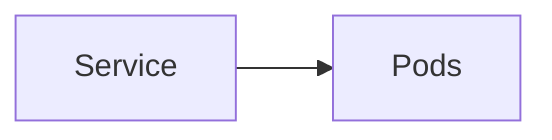

---

## Key Components

- Selector
- ClusterIP
- Ports

---

## Types (if applicable)

- ClusterIP
- NodePort
- LoadBalancer

---

## Lifecycle / Workflow

```mermaid
flowchart LR

Create --> Route Traffic
```

---

## Configuration / Syntax (if applicable)

```yaml
kind: Service
```

---

## Important Commands (if applicable)

```bash
kubectl get svc
```

---

## Important Files (if applicable)

```
templates/service.yaml
```

---

## Real-World Use Cases

- API exposure
- Internal communication

---

## Advantages

- Stable networking

---

## Limitations

- Requires correct selectors

---

## Common Interview Questions (Concept Only)

- Difference between ClusterIP and NodePort?

---

## Common Mistakes

- Wrong selectors

---

## Troubleshooting

Verify Pod labels.

---

## Summary

Services expose Pods consistently.

---

# ConfigMaps

## Overview

ConfigMaps store non-sensitive application configuration.

---

## Why It Is Used

- External configuration
- Environment-specific settings

---

## Architecture / Working

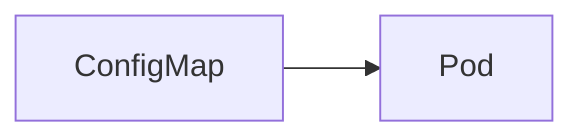

---

## Key Components

- Key-value pairs

---

## Types (if applicable)

Configuration

---

## Lifecycle / Workflow

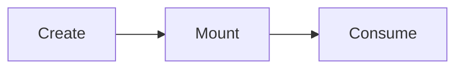

---

## Configuration / Syntax (if applicable)

```yaml
kind: ConfigMap
```

---

## Important Commands (if applicable)

```bash
kubectl get configmap
```

---

## Important Files (if applicable)

```
templates/configmap.yaml
```

---

## Real-World Use Cases

- Application settings
- Feature flags

---

## Advantages

- Easy configuration updates

---

## Limitations

- Not secure

---

## Common Interview Questions (Concept Only)

- ConfigMap vs Secret?

---

## Common Mistakes

- Storing passwords

---

## Troubleshooting

Verify mounted data.

---

## Summary

ConfigMaps store non-sensitive configuration.

---

# Secrets

## Overview

Secrets store sensitive information such as passwords, API keys, and certificates.

---

## Why It Is Used

Protect confidential information.

---

## Architecture / Working

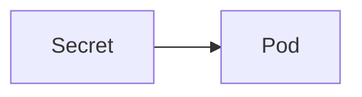

---

## Key Components

- Encoded data
- Kubernetes Secret

---

## Types (if applicable)

- Opaque
- TLS
- Docker Registry

---

## Lifecycle / Workflow

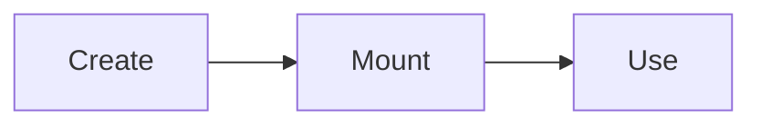

---

## Configuration / Syntax (if applicable)

```yaml
kind: Secret
```

---

## Important Commands (if applicable)

```bash
kubectl get secrets
```

---

## Important Files (if applicable)

```
templates/secret.yaml
```

---

## Real-World Use Cases

- Database passwords
- API tokens

---

## Advantages

- Secure storage

---

## Limitations

- Base64 encoding is **not encryption**

---

## Common Interview Questions (Concept Only)

- Are Kubernetes Secrets encrypted?

---

## Common Mistakes

- Hardcoding secrets

---

## Troubleshooting

Verify Secret references.

---

## Summary

Secrets securely store sensitive information.

---

# Persistent Volume Claims

## Overview

Persistent Volume Claims (PVCs) request persistent storage from Kubernetes.

---

## Why It Is Used

Store application data.

---

## Architecture / Working

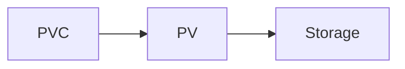

---

## Key Components

- PVC
- PV
- StorageClass

---

## Types (if applicable)

Persistent storage

---

## Lifecycle / Workflow

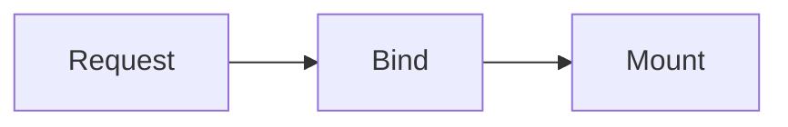

---

## Configuration / Syntax (if applicable)

```yaml
kind: PersistentVolumeClaim
```

---

## Important Commands (if applicable)

```bash
kubectl get pvc
```

---

## Important Files (if applicable)

```
templates/pvc.yaml
```

---

## Real-World Use Cases

- Databases
- Shared storage

---

## Advantages

- Persistent data

---

## Limitations

- Depends on StorageClass

---

## Common Interview Questions (Concept Only)

- PVC vs PV?

---

## Common Mistakes

- Incorrect storage class

---

## Troubleshooting

Check PVC status.

---

## Summary

PVCs provide persistent storage.

---

# Ingress

## Overview

Ingress routes HTTP/HTTPS traffic to Services.

---

## Why It Is Used

Expose applications externally.

---

## Architecture / Working

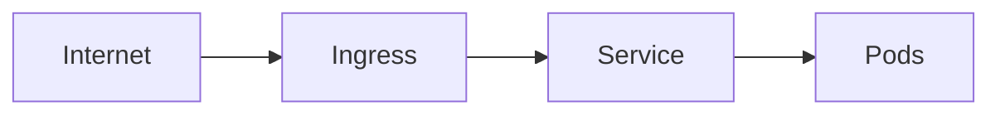

---

## Key Components

- Rules
- Host
- Paths

---

## Types (if applicable)

HTTP routing

---

## Lifecycle / Workflow

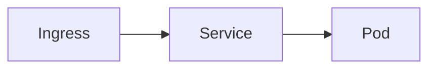

---

## Configuration / Syntax (if applicable)

```yaml
kind: Ingress
```

---

## Important Commands (if applicable)

```bash
kubectl get ingress
```

---

## Important Files (if applicable)

```
templates/ingress.yaml
```

---

## Real-World Use Cases

- Web applications
- API Gateway

---

## Advantages

- Centralized routing

---

## Limitations

- Requires Ingress Controller

---

## Common Interview Questions (Concept Only)

- Does Ingress work without an Ingress Controller?

---

## Common Mistakes

- Missing Ingress Controller

---

## Troubleshooting

Verify controller installation.

---

## Summary

Ingress exposes HTTP/HTTPS applications.

---

# Jobs

## Overview

Jobs run tasks once and exit successfully.

---

## Why It Is Used

- Database migration
- Backup
- Batch processing

---

## Architecture / Working

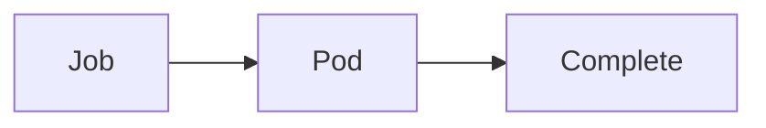

---

## Key Components

- Pod
- Completion

---

## Types (if applicable)

One-time execution

---

## Lifecycle / Workflow

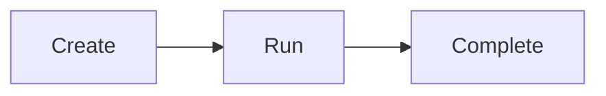

---

## Configuration / Syntax (if applicable)

```yaml
kind: Job
```

---

## Important Commands (if applicable)

```bash
kubectl get jobs
```

---

## Important Files (if applicable)

```
templates/job.yaml
```

---

## Real-World Use Cases

- Schema migration
- Import scripts

---

## Advantages

- Reliable execution

---

## Limitations

- Runs only once

---

## Common Interview Questions (Concept Only)

- Job vs Deployment?

---

## Common Mistakes

- Using Jobs for long-running services

---

## Troubleshooting

Inspect Job logs.

---

## Summary

Jobs execute one-time workloads.

---

# CronJobs

## Overview

CronJobs schedule Jobs using cron expressions.

---

## Why It Is Used

Automate recurring tasks.

---

## Architecture / Working

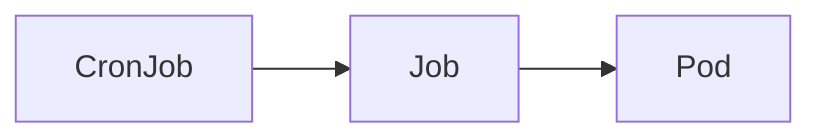

---

## Key Components

- Schedule
- Job

---

## Types (if applicable)

Scheduled execution

---

## Lifecycle / Workflow

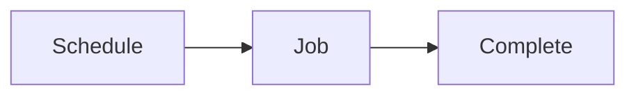

---

## Configuration / Syntax (if applicable)

```yaml
kind: CronJob
```

---

## Important Commands (if applicable)

```bash
kubectl get cronjobs
```

---

## Important Files (if applicable)

```
templates/cronjob.yaml
```

---

## Real-World Use Cases

- Backups
- Cleanup tasks
- Report generation

---

## Advantages

- Automated scheduling

---

## Limitations

- Depends on correct cron syntax

---

## Common Interview Questions (Concept Only)

- Job vs CronJob?

---

## Common Mistakes

- Incorrect cron schedule

---

## Troubleshooting

Verify schedule and Job history.

---

## Summary

CronJobs execute scheduled Kubernetes Jobs.

---

# Interview Quick Revision

## Kubernetes Resources Managed by Helm

| Resource | Purpose |
|----------|---------|
| Deployment | Run stateless applications |
| Service | Expose Pods |
| ConfigMap | Store non-sensitive configuration |
| Secret | Store sensitive configuration |
| PersistentVolumeClaim | Request persistent storage |
| Ingress | Route external HTTP/HTTPS traffic |
| Job | Execute one-time tasks |
| CronJob | Execute scheduled tasks |

---

## Common Commands

| Command | Purpose |
|----------|---------|
| `helm install` | Deploy all resources in a chart |
| `helm upgrade` | Update managed resources |
| `helm get manifest` | View rendered Kubernetes manifests |
| `helm template` | Render manifests locally |
| `kubectl get all` | View deployed resources |
| `kubectl describe <resource>` | Inspect resource details |
| `kubectl logs <pod>` | View application logs |

---

## Production Best Practices

- Parameterize resource names and configuration using `values.yaml`.
- Store non-sensitive settings in ConfigMaps and sensitive data in Secrets.
- Use resource requests and limits for Deployments.
- Define readiness and liveness probes for application Pods.
- Use PVCs for stateful workloads that require persistent storage.
- Ensure an Ingress Controller is installed before creating Ingress resources.
- Use Jobs for one-time operations and CronJobs for scheduled automation.
- Validate rendered manifests with `helm template` before deployment.

---

## One-line Interview Answer

**Helm Resource Management uses templates to create and manage Kubernetes resources such as Deployments, Services, ConfigMaps, Secrets, PVCs, Ingresses, Jobs, and CronJobs, enabling reusable, configurable, and version-controlled application deployments.**
