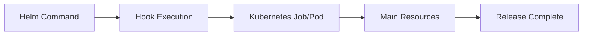
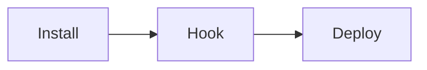
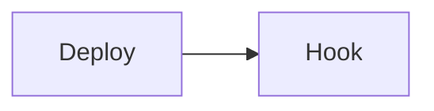
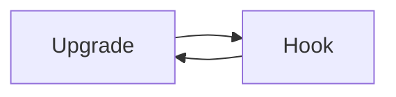
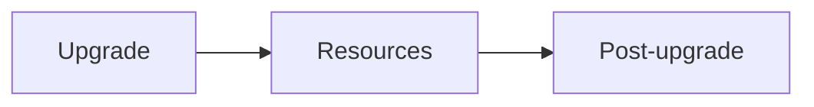
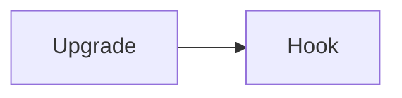
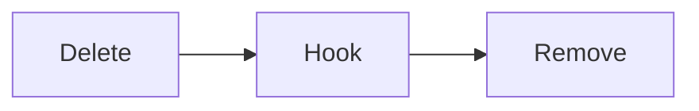
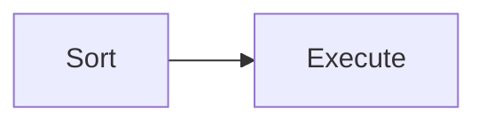
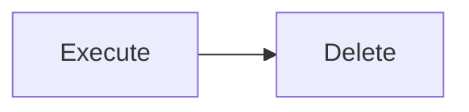

# Hooks

## Overview

Helm Hooks are special Kubernetes resources that execute at specific points in a Helm release lifecycle, such as before or after installing, upgrading, rolling back, or deleting a release.

Hooks allow you to perform operational tasks like database migrations, backups, validations, or cleanup automatically during the deployment process.

> **Interview Tip**
>
> Hooks are **not** part of the normal application deployment. They execute only during specific lifecycle events.

---

## Why It Is Used

Helm Hooks are used to:

- Perform database migrations
- Validate prerequisites before deployment
- Initialize application data
- Run smoke tests
- Backup databases before upgrades
- Clean up resources before uninstalling
- Automate operational tasks

---

## Architecture / Working



### Working Process

1. User runs a Helm command (`install`, `upgrade`, `delete`, etc.).
2. Helm checks for matching lifecycle hooks.
3. Hook resources are executed.
4. After successful completion (depending on hook type), Helm continues the release lifecycle.
5. The release is completed.

---

## Key Components

| Component | Purpose |
|-----------|----------|
| Hook Annotation | Defines when the hook runs |
| Hook Resource | Kubernetes resource executed as hook |
| Hook Weight | Controls execution order |
| Delete Policy | Removes hook resources after execution |
| Lifecycle Event | Install, Upgrade, Delete, Rollback, Test |

---

## Types (if applicable)

| Hook | Purpose |
|------|----------|
| pre-install | Runs before installation |
| post-install | Runs after installation |
| pre-upgrade | Runs before upgrade |
| post-upgrade | Runs after upgrade |
| pre-delete | Runs before uninstall |
| post-delete | Runs after uninstall |
| pre-rollback | Runs before rollback |
| post-rollback | Runs after rollback |
| test | Runs application tests |

> **Interview Tip**
>
> The most commonly asked hooks are:
>
> - pre-install
> - post-install
> - pre-upgrade
> - post-upgrade
> - pre-delete

---

## Lifecycle / Workflow

```mermaid
flowchart LR

Install Command
      │
      ▼
Pre-install Hook
      │
      ▼
Install Resources
      │
      ▼
Post-install Hook
      │
      ▼
Release Ready
```

---

## Configuration / Syntax (if applicable)

Basic hook annotation

```yaml
metadata:
  annotations:
    "helm.sh/hook": pre-install
```

Multiple hooks

```yaml
metadata:
  annotations:
    "helm.sh/hook": pre-install,pre-upgrade
```

Hook weight

```yaml
metadata:
  annotations:
    "helm.sh/hook-weight": "-5"
```

Delete policy

```yaml
metadata:
  annotations:
    "helm.sh/hook-delete-policy": hook-succeeded
```

---

## Important Commands (if applicable)

```bash
helm install

helm upgrade

helm uninstall

helm get hooks

helm history

kubectl get jobs

kubectl logs
```

---

## Important Files (if applicable)

```
templates/

templates/hooks/

Chart.yaml

values.yaml
```

---

## Real-World Use Cases

- Database schema migration
- Database backup before upgrade
- Application initialization
- Health validation
- Cleanup temporary resources
- Load sample data
- Smoke testing after deployment

---

## Advantages

- Automates deployment tasks
- Reduces manual intervention
- Improves deployment reliability
- Integrates operational tasks into Helm
- Supports complex deployment workflows

---

## Limitations

- Failed hooks may block deployments
- Difficult to debug if poorly designed
- Long-running hooks delay releases
- Improper cleanup leaves unused resources

---

## Common Interview Questions (Concept Only)

- What are Helm Hooks?
- Why are Hooks used?
- Difference between pre-install and post-install?
- What is Hook Weight?
- What is Hook Delete Policy?
- Can multiple hooks be defined?
- What happens if a Hook fails?
- Are Hooks executed during rollback?
- Which Kubernetes resources are commonly used as Hooks?
- How do you view executed Hooks?

---

## Common Mistakes

- Using Deployments instead of Jobs for hooks
- Forgetting Hook Delete Policies
- Long-running hook Jobs
- Incorrect Hook annotations
- Wrong execution order
- Not checking Hook logs
- Creating hooks for tasks better handled by the application itself

---

## Troubleshooting

| Problem | Cause | Solution |
|----------|-------|----------|
| Hook never executes | Missing annotation | Verify `helm.sh/hook` annotation |
| Installation hangs | Hook Job still running | Check Job status |
| Hook failed | Job error | Inspect Pod logs |
| Hook executes in wrong order | Incorrect weight | Adjust Hook Weight |
| Old Hook Jobs remain | Missing delete policy | Configure Hook Delete Policy |
| Upgrade fails | Pre-upgrade hook failed | Review Job logs and fix errors |

---

## Summary

Helm Hooks execute Kubernetes resources during specific release lifecycle events. They automate operational tasks such as database migrations, validation, backups, and cleanup.

> **Interview Tip**
>
> Hooks are usually implemented as **Kubernetes Jobs**, because Jobs execute tasks once and exit successfully.

---

# Pre-install Hooks

## Overview

Pre-install Hooks execute **before Helm installs application resources**.

---

## Why It Is Used

- Validate environment
- Create required resources
- Initialize databases
- Check prerequisites

---

## Architecture / Working

```mermaid
flowchart LR

Install Command
      │
      ▼
Pre-install Hook
      │
      ▼
Install Resources
```

---

## Key Components

- Job
- Validation
- Initialization

---

## Types (if applicable)

Installation lifecycle

---

## Lifecycle / Workflow



---

## Configuration / Syntax (if applicable)

```yaml
helm.sh/hook: pre-install
```

---

## Important Commands (if applicable)

```bash
helm install
```

---

## Important Files (if applicable)

```
templates/hooks/
```

---

## Real-World Use Cases

- Database migration
- Storage validation
- Secret generation

---

## Advantages

- Prevents invalid deployments

---

## Limitations

- Failure blocks installation

---

## Common Interview Questions (Concept Only)

- When does pre-install execute?

---

## Common Mistakes

- Long-running Jobs

---

## Troubleshooting

Inspect Job logs.

---

## Summary

Runs before application deployment.

---

# Post-install Hooks

## Overview

Post-install Hooks execute **after all application resources are installed**.

---

## Why It Is Used

- Smoke testing
- Notifications
- Data initialization

---

## Architecture / Working

```mermaid
flowchart LR

Install --> Resources --> Post-install Hook
```

---

## Key Components

- Validation
- Initialization

---

## Types (if applicable)

Installation lifecycle

---

## Lifecycle / Workflow



---

## Configuration / Syntax (if applicable)

```yaml
helm.sh/hook: post-install
```

---

## Important Commands (if applicable)

```bash
helm install
```

---

## Important Files (if applicable)

```
templates/hooks/
```

---

## Real-World Use Cases

- Smoke tests
- Notifications

---

## Advantages

- Confirms deployment success

---

## Limitations

- Hook failure marks release as failed

---

## Common Interview Questions (Concept Only)

- Why use post-install?

---

## Common Mistakes

- Running lengthy tests

---

## Troubleshooting

Review Job logs.

---

## Summary

Runs immediately after installation.

---

# Pre-upgrade Hooks

## Overview

Executed before upgrading an existing release.

---

## Why It Is Used

- Database backup
- Compatibility checks
- Validation

---

## Architecture / Working

```mermaid
flowchart LR

Upgrade --> Pre-upgrade --> Upgrade Resources
```

---

## Key Components

- Backup
- Validation

---

## Types (if applicable)

Upgrade lifecycle

---

## Lifecycle / Workflow



---

## Configuration / Syntax (if applicable)

```yaml
helm.sh/hook: pre-upgrade
```

---

## Important Commands (if applicable)

```bash
helm upgrade
```

---

## Important Files (if applicable)

```
templates/hooks/
```

---

## Real-World Use Cases

- Backup database
- Validate schema

---

## Advantages

- Safer upgrades

---

## Limitations

- Failed hook blocks upgrade

---

## Common Interview Questions (Concept Only)

- Why backup before upgrade?

---

## Common Mistakes

- Skipping validation

---

## Troubleshooting

Inspect Job logs.

---

## Summary

Runs before upgrading a release.

---

# Post-upgrade Hooks

## Overview

Runs after the release upgrade completes.

---

## Why It Is Used

- Smoke tests
- Cache refresh
- Notifications

---

## Architecture / Working



---

## Key Components

- Validation
- Testing

---

## Types (if applicable)

Upgrade lifecycle

---

## Lifecycle / Workflow



---

## Configuration / Syntax (if applicable)

```yaml
helm.sh/hook: post-upgrade
```

---

## Important Commands (if applicable)

```bash
helm upgrade
```

---

## Important Files (if applicable)

```
templates/hooks/
```

---

## Real-World Use Cases

- Smoke testing
- Cache refresh

---

## Advantages

- Validates successful upgrade

---

## Limitations

- Can increase deployment time

---

## Common Interview Questions (Concept Only)

- When is post-upgrade executed?

---

## Common Mistakes

- Long-running verification

---

## Troubleshooting

Inspect logs.

---

## Summary

Runs after upgrades complete.

---

# Pre-delete Hooks

## Overview

Executed before Helm removes release resources.

---

## Why It Is Used

- Database backup
- Resource cleanup
- Export logs

---

## Architecture / Working

```mermaid
flowchart LR

Delete --> Pre-delete --> Remove Resources
```

---

## Key Components

- Cleanup
- Backup

---

## Types (if applicable)

Deletion lifecycle

---

## Lifecycle / Workflow



---

## Configuration / Syntax (if applicable)

```yaml
helm.sh/hook: pre-delete
```

---

## Important Commands (if applicable)

```bash
helm uninstall
```

---

## Important Files (if applicable)

```
templates/hooks/
```

---

## Real-World Use Cases

- Backup data
- Remove external resources

---

## Advantages

- Prevents accidental data loss

---

## Limitations

- Failed hook blocks uninstall

---

## Common Interview Questions (Concept Only)

- Why use pre-delete?

---

## Common Mistakes

- Forgetting backups

---

## Troubleshooting

Inspect Job logs.

---

## Summary

Runs before uninstalling resources.

---

# Hook Weights

## Overview

Hook Weights determine the execution order when multiple hooks exist for the same lifecycle event.

Lower values execute first.

---

## Why It Is Used

Control execution sequence.

---

## Architecture / Working

```mermaid
flowchart LR

Weight -10 --> Weight 0 --> Weight 5
```

---

## Key Components

- Integer value

---

## Types (if applicable)

Negative, zero, positive

---

## Lifecycle / Workflow



---

## Configuration / Syntax (if applicable)

```yaml
helm.sh/hook-weight: "-10"
```

---

## Important Commands (if applicable)

```bash
helm get hooks
```

---

## Important Files (if applicable)

Hook templates

---

## Real-World Use Cases

- Ordered database migrations
- Sequential initialization

---

## Advantages

- Predictable execution order

---

## Limitations

- Incorrect ordering causes failures

---

## Common Interview Questions (Concept Only)

- Which hook executes first?

---

## Common Mistakes

- Duplicate weights

---

## Troubleshooting

Review hook order.

---

## Summary

Smaller weight executes before larger weight.

---

# Hook Delete Policies

## Overview

Hook Delete Policies determine when Helm deletes hook resources after execution.

---

## Why It Is Used

Prevent accumulation of completed Jobs and Pods.

---

## Architecture / Working

```mermaid
flowchart LR

Hook --> Execute --> Delete Policy
```

---

## Key Components

| Policy | Purpose |
|---------|----------|
| hook-succeeded | Delete after success |
| hook-failed | Delete after failure |
| before-hook-creation | Delete old hook before creating a new one |

---

## Types (if applicable)

- hook-succeeded
- hook-failed
- before-hook-creation

---

## Lifecycle / Workflow



---

## Configuration / Syntax (if applicable)

```yaml
helm.sh/hook-delete-policy: hook-succeeded
```

---

## Important Commands (if applicable)

```bash
helm get hooks

kubectl get jobs
```

---

## Important Files (if applicable)

Hook templates

---

## Real-World Use Cases

- Cleanup completed Jobs
- Prevent duplicate hooks

---

## Advantages

- Cleaner clusters
- Easier maintenance

---

## Limitations

- Deleted Jobs remove execution history

---

## Common Interview Questions (Concept Only)

- What are Hook Delete Policies?

---

## Common Mistakes

- Not configuring delete policies

---

## Troubleshooting

Verify annotation values.

---

## Summary

Delete Policies automatically clean up hook resources after execution.

---

# Interview Quick Revision

## Common Hook Types

| Hook | Executes |
|------|----------|
| pre-install | Before installation |
| post-install | After installation |
| pre-upgrade | Before upgrade |
| post-upgrade | After upgrade |
| pre-delete | Before uninstall |

---

## Hook Execution Order

```text
Lowest Weight
      ↓
-20
-10
0
5
10
      ↓
Highest Weight
```

---

## Common Delete Policies

| Policy | Purpose |
|---------|----------|
| hook-succeeded | Delete successful hook |
| hook-failed | Delete failed hook |
| before-hook-creation | Remove previous hook before creating a new one |

---

## Frequently Used Commands

| Command | Purpose |
|----------|---------|
| `helm install` | Install release |
| `helm upgrade` | Upgrade release |
| `helm uninstall` | Remove release |
| `helm get hooks` | View configured hooks |
| `helm history` | View release history |
| `kubectl get jobs` | View hook Jobs |
| `kubectl logs <pod>` | Inspect hook logs |

---

## Production Best Practices

- Implement hooks as Kubernetes **Jobs** rather than Deployments.
- Keep hook execution short to avoid delaying releases.
- Use **pre-install** for prerequisite validation and **pre-upgrade** for backups.
- Apply **Hook Weights** when multiple hooks depend on execution order.
- Configure **Hook Delete Policies** to clean up completed Jobs.
- Monitor hook logs during deployment failures.
- Use hooks only for lifecycle tasks, not long-running application logic.

---

## One-line Interview Answer

**Helm Hooks are lifecycle-based Kubernetes resources that execute before or after install, upgrade, rollback, or delete operations, enabling automated tasks such as validation, database migration, backup, testing, and cleanup during the release process.**
