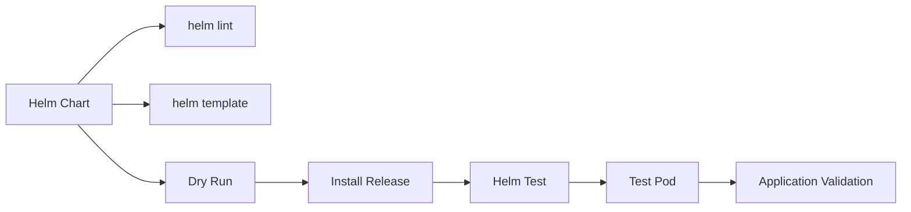
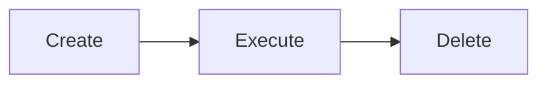
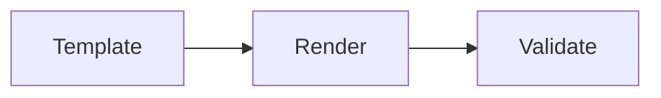
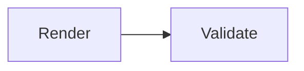
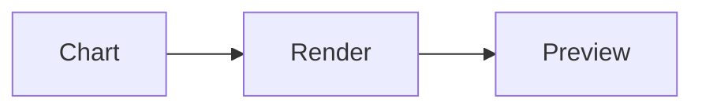

# Chart Testing

## Overview

Chart Testing is the process of validating a Helm Chart before and after deployment to ensure it is correctly structured, renders valid Kubernetes manifests, and deploys applications successfully.

Helm provides several built-in mechanisms for testing:

- Template Validation
- Dry Run
- Debug Mode
- Helm Test
- Test Pods

These features help identify issues early and improve deployment reliability.

> **Interview Tip**
>
> `helm lint`, `helm template`, `helm install --dry-run --debug`, and `helm test` are the four most commonly used commands for testing Helm Charts.

---

## Why It Is Used

Chart Testing helps to:

- Validate chart syntax
- Detect template errors
- Verify generated manifests
- Test application functionality
- Prevent deployment failures
- Improve CI/CD reliability
- Validate configuration changes before production deployment

---

## Architecture / Working



---

## Key Components

| Component | Purpose |
|-----------|----------|
| Helm Test | Executes application tests |
| Test Pod | Kubernetes Pod used for testing |
| Template Validation | Verifies rendered templates |
| Dry Run | Simulates deployment |
| Debug Mode | Displays detailed output |
| Helm Lint | Checks chart quality |

---

## Types (if applicable)

| Test Type | Purpose |
|-----------|----------|
| Lint Testing | Validate chart structure |
| Template Validation | Validate generated manifests |
| Dry Run | Simulate deployment |
| Functional Testing | Verify deployed application |
| Integration Testing | Test application connectivity |

---

## Lifecycle / Workflow

```mermaid
flowchart LR

Create Chart
      │
      ▼
helm lint
      │
      ▼
helm template
      │
      ▼
Dry Run
      │
      ▼
Install Release
      │
      ▼
Helm Test
      │
      ▼
Production
```

---

## Configuration / Syntax (if applicable)

Basic test annotation

```yaml
metadata:
  annotations:
    "helm.sh/hook": test
```

Example Test Pod

```yaml
apiVersion: v1
kind: Pod
metadata:
  annotations:
    "helm.sh/hook": test
```

---

## Important Commands (if applicable)

```bash
helm lint

helm template

helm install --dry-run

helm install --debug

helm install --dry-run --debug

helm test

helm get manifest

helm status
```

---

## Important Files (if applicable)

```
Chart.yaml

values.yaml

templates/

templates/tests/

tests/
```

---

## Real-World Use Cases

- Validate charts before deployment
- Verify Kubernetes manifests
- Test application availability
- CI/CD pipeline validation
- Smoke testing
- Upgrade verification

---

## Advantages

- Detects deployment issues early
- Prevents production failures
- Automates validation
- Improves deployment confidence
- Easy integration with CI/CD

---

## Limitations

- Functional tests require deployed resources
- Poor test coverage may miss issues
- Long-running tests delay deployments
- Helm Test does not replace application-level testing

---

## Common Interview Questions (Concept Only)

- What is Helm Test?
- Why use `helm lint`?
- Difference between Dry Run and Helm Test?
- What is a Test Pod?
- What does Debug Mode do?
- Does Dry Run create Kubernetes resources?
- What is Template Validation?
- Where are Helm Test definitions stored?
- Can Helm Tests run automatically?
- Which command validates generated manifests?

---

## Common Mistakes

- Skipping `helm lint`
- Testing directly in production
- Ignoring template rendering errors
- Not validating custom values
- Forgetting Test Pod annotations
- Running Helm Test before installation
- Assuming Dry Run validates application functionality

---

## Troubleshooting

| Problem | Cause | Solution |
|----------|-------|----------|
| Chart validation failed | YAML syntax error | Run `helm lint` |
| Template rendering failed | Invalid template | Run `helm template` |
| Dry Run failed | Incorrect values | Verify `values.yaml` |
| Helm Test failed | Test Pod failed | Inspect Pod logs |
| Invalid Kubernetes manifests | Template issue | Validate rendered YAML |
| Test Pod Pending | Cluster resource issue | Check node resources and scheduling |

---

## Summary

Chart Testing ensures Helm Charts are valid, deployable, and function correctly before production deployment. Using linting, template validation, dry runs, debug mode, and Helm Test helps identify configuration and deployment issues early.

> **Interview Tip**
>
> A typical validation sequence is:
>
> `helm lint` → `helm template` → `helm install --dry-run --debug` → `helm install` → `helm test`

---

# Helm Test

## Overview

`helm test` executes Kubernetes resources marked with the **test hook** after a Helm release is installed.

These resources are typically Kubernetes Jobs or Pods that verify whether the deployed application is functioning correctly.

---

## Why It Is Used

- Verify deployment success
- Perform smoke testing
- Validate connectivity
- Check application health

---

## Architecture / Working

```mermaid
flowchart LR

Release
    │
    ▼
Helm Test
    │
    ▼
Test Pod
    │
    ▼
Pass / Fail
```

---

## Key Components

- Test Hook
- Test Pod
- Test Job
- Test Result

---

## Types (if applicable)

- Smoke Test
- Connectivity Test
- Functional Test

---

## Lifecycle / Workflow

```mermaid
flowchart LR

Install
    │
    ▼
Run Tests
    │
    ▼
Success / Failure
```

---

## Configuration / Syntax (if applicable)

```yaml
annotations:
  helm.sh/hook: test
```

---

## Important Commands (if applicable)

```bash
helm test RELEASE_NAME
```

---

## Important Files (if applicable)

```
templates/tests/
```

---

## Real-World Use Cases

- Verify API availability
- Database connectivity
- Application readiness

---

## Advantages

- Automated validation
- Easy integration

---

## Limitations

- Requires deployed application

---

## Common Interview Questions (Concept Only)

- What does `helm test` do?
- When should Helm Test be executed?

---

## Common Mistakes

- Forgetting hook annotation

---

## Troubleshooting

Check Test Pod logs.

---

## Summary

Helm Test validates deployed applications using Kubernetes test resources.

---

# Test Pods

## Overview

A Test Pod is a Kubernetes Pod executed by `helm test` to verify application functionality.

---

## Why It Is Used

- Health validation
- Connectivity testing
- Smoke testing

---

## Architecture / Working

```mermaid
flowchart LR

Helm Test --> Test Pod --> Application
```

---

## Key Components

- Pod
- Test Hook

---

## Types (if applicable)

Pod-based testing

---

## Lifecycle / Workflow



---

## Configuration / Syntax (if applicable)

```yaml
kind: Pod
```

---

## Important Commands (if applicable)

```bash
kubectl logs
```

---

## Important Files (if applicable)

```
templates/tests/
```

---

## Real-World Use Cases

- Ping application
- HTTP request validation

---

## Advantages

- Simple
- Lightweight

---

## Limitations

- Limited testing capability

---

## Common Interview Questions (Concept Only)

- What is a Test Pod?

---

## Common Mistakes

- Missing annotations

---

## Troubleshooting

Review Pod logs.

---

## Summary

Test Pods execute automated application validation.

---

# Template Validation

## Overview

Template Validation ensures Helm templates generate valid Kubernetes manifests before deployment.

---

## Why It Is Used

- Detect syntax errors
- Validate templates
- Verify generated YAML

---

## Architecture / Working



---

## Key Components

- Templates
- Values
- Rendered YAML

---

## Types (if applicable)

Static validation

---

## Lifecycle / Workflow



---

## Configuration / Syntax (if applicable)

```bash
helm template
```

---

## Important Commands (if applicable)

```bash
helm template

helm lint
```

---

## Important Files (if applicable)

```
templates/
```

---

## Real-World Use Cases

- CI validation
- YAML verification

---

## Advantages

- No cluster required
- Fast execution

---

## Limitations

- Does not deploy resources

---

## Common Interview Questions (Concept Only)

- What does `helm template` do?

---

## Common Mistakes

- Ignoring rendered manifests

---

## Troubleshooting

Inspect generated YAML.

---

## Summary

Template Validation verifies generated Kubernetes manifests.

---

# Dry Run

## Overview

Dry Run simulates installation without creating Kubernetes resources.

---

## Why It Is Used

- Preview deployment
- Validate values
- Detect errors

---

## Architecture / Working



---

## Key Components

- Rendered YAML
- Validation

---

## Types (if applicable)

Simulation

---

## Lifecycle / Workflow


---

## Configuration / Syntax (if applicable)

```bash
helm install myapp . --dry-run
```

---

## Important Commands (if applicable)

```bash
helm install --dry-run
```

---

## Important Files (if applicable)

Chart templates

---

## Real-World Use Cases

- Production validation
- CI pipelines

---

## Advantages

- Safe testing
- No resource creation

---

## Limitations

- Cannot validate runtime behavior

---

## Common Interview Questions (Concept Only)

- Does Dry Run deploy resources?

---

## Common Mistakes

- Assuming application is tested

---

## Troubleshooting

Review rendered output.

---

## Summary

Dry Run previews deployments without modifying the cluster.

---

# Debug Mode

## Overview

Debug Mode provides detailed diagnostic information during Helm operations.

---

## Why It Is Used

- Troubleshoot templates
- View rendered manifests
- Debug installation issues

---

## Architecture / Working

```mermaid
flowchart LR

Command --> Debug Output
```

---

## Key Components

- Rendered manifests
- Errors
- Values

---

## Types (if applicable)

Diagnostic mode

---

## Lifecycle / Workflow

```mermaid
flowchart LR

Execute --> Detailed Output
```

---

## Configuration / Syntax (if applicable)

```bash
helm install myapp . --debug
```

---

## Important Commands (if applicable)

```bash
helm install --debug

helm upgrade --debug

helm install --dry-run --debug
```

---

## Important Files (if applicable)

Templates

---

## Real-World Use Cases

- CI troubleshooting
- Deployment debugging

---

## Advantages

- Detailed diagnostics
- Faster troubleshooting

---

## Limitations

- Verbose output

---

## Common Interview Questions (Concept Only)

- Why use Debug Mode?

---

## Common Mistakes

- Ignoring debug output

---

## Troubleshooting

Review rendered manifests and stack traces.

---

## Summary

Debug Mode provides detailed deployment information for troubleshooting.

---

# Interview Quick Revision

## Chart Validation Workflow

```text
helm lint
      ↓
helm template
      ↓
helm install --dry-run --debug
      ↓
helm install
      ↓
helm test
```

---

## Testing Commands

| Command | Purpose |
|----------|---------|
| `helm lint` | Validate chart syntax |
| `helm template` | Render manifests locally |
| `helm install --dry-run` | Simulate installation |
| `helm install --debug` | Display detailed output |
| `helm install --dry-run --debug` | Preview installation with diagnostics |
| `helm test RELEASE_NAME` | Execute Test Pods |
| `helm status` | View release status |

---

## Dry Run vs Helm Test

| Dry Run | Helm Test |
|----------|-----------|
| No deployment | Requires deployed release |
| Validates templates | Validates application |
| No Kubernetes resources created | Executes Test Pods or Jobs |
| Static validation | Runtime validation |

---

## Template Validation vs Helm Test

| Template Validation | Helm Test |
|---------------------|-----------|
| Checks generated YAML | Checks deployed application |
| No cluster changes | Uses Kubernetes resources |
| Fast execution | Runtime execution |

---

## Production Best Practices

- Always run `helm lint` before packaging or deploying charts.
- Use `helm template` to review rendered manifests.
- Validate deployments with `helm install --dry-run --debug` before applying changes to production.
- Create lightweight Test Pods for smoke and connectivity tests.
- Integrate chart testing into CI/CD pipelines to catch issues early.
- Keep test resources independent of application logic.
- Review debug output and rendered manifests when troubleshooting deployment failures.

---

## One-line Interview Answer

**Helm Chart Testing combines linting, template validation, dry-run simulation, debug mode, and Helm Test to verify that a chart is syntactically correct, renders valid Kubernetes manifests, and deploys a functional application before production use.**
