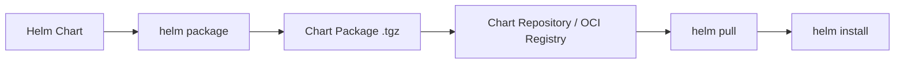
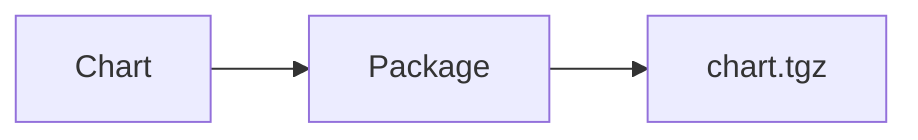
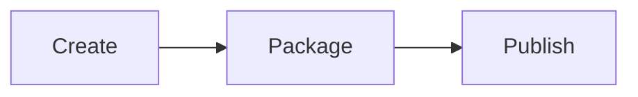
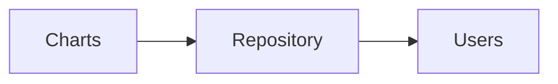
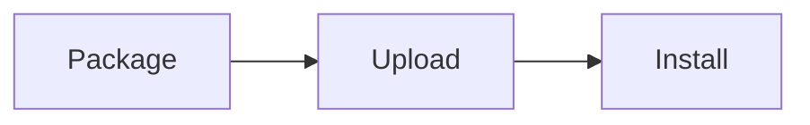
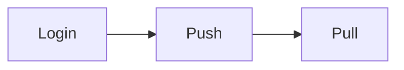
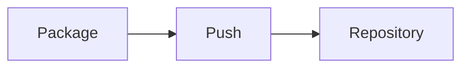
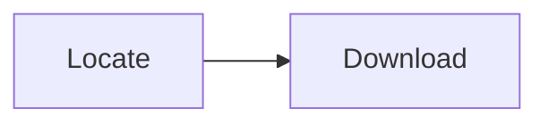

# Chart Publishing

## Overview

Chart Publishing is the process of packaging, versioning, storing, and distributing Helm Charts so they can be reused across teams and environments.

A published chart can be stored in:

- Helm Chart Repository (HTTP/HTTPS)
- OCI (Open Container Initiative) Registry
- Private Artifact Repository

Publishing enables developers and DevOps teams to share version-controlled application packages.

> **Interview Tip**
>
> Since Helm v3.8+, **OCI Registry support is GA (Generally Available)** and is increasingly preferred over traditional chart repositories.

---

## Why It Is Used

Chart Publishing helps to:

- Share reusable Helm Charts
- Version application deployments
- Centralize chart management
- Support CI/CD pipelines
- Maintain release history
- Simplify deployments across environments
- Secure chart distribution

---

## Architecture / Working



### Working Process

1. Develop a Helm Chart.
2. Package the chart into a `.tgz` archive.
3. Publish it to a repository or OCI registry.
4. Users pull the chart.
5. Deploy using `helm install`.

---

## Key Components

| Component | Purpose |
|-----------|----------|
| Chart Package | Compressed Helm Chart |
| Chart Repository | Stores published charts |
| OCI Registry | Container registry supporting Helm Charts |
| Chart Version | Identifies chart release |
| Index File | Lists charts in a repository |

---

## Types (if applicable)

| Repository Type | Purpose |
|-----------------|----------|
| Public Repository | Community charts |
| Private Repository | Internal organization charts |
| OCI Registry | Modern Helm chart storage |
| Artifact Repository | Enterprise chart hosting |

---

## Lifecycle / Workflow

```mermaid
flowchart LR

Develop Chart
      │
      ▼
Package
      │
      ▼
Publish
      │
      ▼
Pull
      │
      ▼
Install
      │
      ▼
Upgrade
```

---

## Configuration / Syntax (if applicable)

Package chart

```bash
helm package mychart
```

Push to OCI

```bash
helm push mychart-1.0.0.tgz oci://registry.example.com/charts
```

Pull chart

```bash
helm pull oci://registry.example.com/charts/mychart
```

---

## Important Commands (if applicable)

```bash
helm package

helm push

helm pull

helm repo add

helm repo update

helm search repo

helm registry login
```

---

## Important Files (if applicable)

```
Chart.yaml

values.yaml

index.yaml

Chart.lock

charts/
```

---

## Real-World Use Cases

- Internal application catalog
- Enterprise CI/CD
- Shared platform services
- Multi-team deployments
- Kubernetes platform engineering

---

## Advantages

- Centralized chart management
- Version-controlled deployments
- Easy distribution
- Reusable application packages
- Supports automation

---

## Limitations

- Requires repository management
- Version conflicts can occur
- Private repositories require authentication

---

## Common Interview Questions (Concept Only)

- What is Chart Publishing?
- What is an OCI Registry?
- Difference between Chart Repository and OCI Registry?
- How do you package a chart?
- How do you publish a chart?
- How are chart versions managed?
- Why is OCI becoming popular?
- Where is chart metadata stored?
- What is `index.yaml`?
- Can Helm use Docker registries?

---

## Common Mistakes

- Publishing without version updates
- Forgetting repository authentication
- Using duplicate chart versions
- Missing `Chart.yaml`
- Not updating repository index
- Confusing application version with chart version

---

## Troubleshooting

| Problem | Cause | Solution |
|----------|-------|----------|
| Package failed | Invalid Chart.yaml | Validate chart metadata |
| Push failed | Authentication issue | Login to repository |
| Chart not found | Repository not updated | Run `helm repo update` |
| Version conflict | Duplicate version | Increment chart version |
| Pull failed | Incorrect repository | Verify repository URL |
| OCI push denied | Missing permissions | Authenticate to registry |

---

## Summary

Chart Publishing packages, versions, and distributes Helm Charts through repositories or OCI registries, enabling reusable, version-controlled deployments.

> **Interview Tip**
>
> OCI Registry support is the modern standard for storing Helm Charts because it leverages existing container registry infrastructure.

---

# Package Charts

## Overview

Packaging converts a Helm Chart into a compressed `.tgz` archive that can be distributed or published.

---

## Why It Is Used

- Distribution
- Versioning
- Publishing

---

## Architecture / Working



---

## Key Components

- Chart Directory
- `.tgz` Package

---

## Types (if applicable)

Compressed package

---

## Lifecycle / Workflow



---

## Configuration / Syntax (if applicable)

```bash
helm package mychart
```

---

## Important Commands (if applicable)

```bash
helm package
```

---

## Important Files (if applicable)

```
Chart.yaml
```

---

## Real-World Use Cases

- Release packaging
- CI/CD

---

## Advantages

- Easy distribution

---

## Limitations

- Requires valid chart

---

## Common Interview Questions (Concept Only)

- What does `helm package` do?

---

## Common Mistakes

- Packaging invalid charts

---

## Troubleshooting

Run `helm lint`.

---

## Summary

Packaging creates deployable Helm Chart archives.

---

# Chart Repositories

## Overview

A Chart Repository is an HTTP/HTTPS server that stores packaged Helm Charts and an `index.yaml` file.

---

## Why It Is Used

- Share charts
- Version management
- Team collaboration

---

## Architecture / Working



---

## Key Components

- index.yaml
- Chart packages

---

## Types (if applicable)

- Public
- Private

---

## Lifecycle / Workflow



---

## Configuration / Syntax (if applicable)

```bash
helm repo add
```

---

## Important Commands (if applicable)

```bash
helm repo add

helm repo update

helm search repo
```

---

## Important Files (if applicable)

```
index.yaml
```

---

## Real-World Use Cases

- Organization repositories

---

## Advantages

- Central management

---

## Limitations

- Repository maintenance

---

## Common Interview Questions (Concept Only)

- What is a Helm Repository?

---

## Common Mistakes

- Forgetting repository update

---

## Troubleshooting

Refresh repository cache.

---

## Summary

Repositories store packaged Helm Charts.

---

# OCI Registry

## Overview

OCI Registry stores Helm Charts using the OCI (Open Container Initiative) specification.

Helm Charts are stored similarly to container images.

---

## Why It Is Used

- Modern storage
- Existing registry infrastructure
- Better security

---

## Architecture / Working

```mermaid
flowchart LR

Helm Chart --> OCI Registry
```

---

## Key Components

- OCI Registry
- Registry Authentication

---

## Types (if applicable)

OCI compliant registry

---

## Lifecycle / Workflow



---

## Configuration / Syntax (if applicable)

```bash
helm registry login
```

---

## Important Commands (if applicable)

```bash
helm registry login

helm push

helm pull
```

---

## Important Files (if applicable)

Chart package

---

## Real-World Use Cases

- Azure Container Registry
- Amazon ECR
- Harbor
- Docker Hub (OCI support)

---

## Advantages

- Secure
- Reuses container registry

---

## Limitations

- Requires OCI-compatible registry

---

## Common Interview Questions (Concept Only)

- What is OCI Registry?

---

## Common Mistakes

- Not authenticating

---

## Troubleshooting

Verify registry credentials.

---

## Summary

OCI Registry is the recommended modern storage backend for Helm Charts.

---

# Push Charts

## Overview

Push uploads packaged Helm Charts to a repository or OCI Registry.

---

## Why It Is Used

- Publish charts
- Share releases

---

## Architecture / Working



---

## Key Components

- Package
- Repository

---

## Types (if applicable)

Repository upload

---

## Lifecycle / Workflow


---

## Configuration / Syntax (if applicable)

```bash
helm push
```

---

## Important Commands (if applicable)

```bash
helm push
```

---

## Important Files (if applicable)

Chart package

---

## Real-World Use Cases

- Release publishing

---

## Advantages

- Central distribution

---

## Limitations

- Requires authentication

---

## Common Interview Questions (Concept Only)

- How do you publish a chart?

---

## Common Mistakes

- Wrong repository URL

---

## Troubleshooting

Verify permissions.

---

## Summary

Push uploads charts for distribution.

---

# Pull Charts

## Overview

Pull downloads packaged Helm Charts from a repository or OCI Registry.

---

## Why It Is Used

- Local deployment
- Offline installation

---

## Architecture / Working

```mermaid
flowchart LR

Repository --> Pull --> Local Chart
```

---

## Key Components

- Repository
- Package

---

## Types (if applicable)

Download

---

## Lifecycle / Workflow



---

## Configuration / Syntax (if applicable)

```bash
helm pull
```

---

## Important Commands (if applicable)

```bash
helm pull
```

---

## Important Files (if applicable)

Downloaded `.tgz`

---

## Real-World Use Cases

- Production deployment
- CI/CD

---

## Advantages

- Offline installation

---

## Limitations

- Requires repository access

---

## Common Interview Questions (Concept Only)

- What does `helm pull` do?

---

## Common Mistakes

- Wrong chart version

---

## Troubleshooting

Verify repository and version.

---

## Summary

Pull downloads published Helm Charts.

---

# Chart Version Management

## Overview

Chart Version Management tracks changes to Helm Charts using version numbers defined in `Chart.yaml`.

Helm distinguishes between:

- Chart Version
- Application Version

---

## Why It Is Used

- Release management
- Upgrades
- Rollbacks

---

## Architecture / Working

```mermaid
flowchart LR

Update Chart --> New Version --> Publish
```

---

## Key Components

| Field | Purpose |
|---------|----------|
| version | Chart version |
| appVersion | Application version |

---

## Types (if applicable)

Semantic Versioning

---

## Lifecycle / Workflow


---

## Configuration / Syntax (if applicable)

```yaml
version: 1.2.0

appVersion: "3.4.1"
```

---

## Important Commands (if applicable)

```bash
helm search repo

helm history
```

---

## Important Files (if applicable)

```
Chart.yaml
```

---

## Real-World Use Cases

- Production releases
- Rollbacks

---

## Advantages

- Controlled upgrades

---

## Limitations

- Requires disciplined versioning

---

## Common Interview Questions (Concept Only)

- Difference between `version` and `appVersion`?

---

## Common Mistakes

- Updating only appVersion
- Reusing chart versions

---

## Troubleshooting

Verify Chart.yaml.

---

## Summary

Chart Version Management enables controlled releases and upgrades.

---

# Interview Quick Revision

## Chart Publishing Workflow

```text
Create Chart
      ↓
helm lint
      ↓
helm package
      ↓
Push to Repository / OCI Registry
      ↓
helm pull
      ↓
helm install
```

---

## Traditional Repository vs OCI Registry

| Chart Repository | OCI Registry |
|------------------|--------------|
| HTTP/HTTPS server | OCI-compliant registry |
| Uses `index.yaml` | No `index.yaml` required |
| Separate infrastructure | Reuses container registries |
| Older approach | Modern, recommended approach |

---

## Chart Version vs Application Version

| Chart Version | Application Version |
|---------------|---------------------|
| Version of the Helm Chart | Version of the application being deployed |
| Used by Helm for upgrades | Informational metadata |
| Stored in `version` | Stored in `appVersion` |

---

## Frequently Used Commands

| Command | Purpose |
|----------|---------|
| `helm package` | Package a chart into `.tgz` |
| `helm repo add` | Add a chart repository |
| `helm repo update` | Refresh repository index |
| `helm search repo` | Search available charts |
| `helm registry login` | Authenticate to OCI registry |
| `helm push` | Publish a chart |
| `helm pull` | Download a chart |
| `helm install` | Deploy a chart |

---

## Production Best Practices

- Use semantic versioning for both chart and application releases.
- Increment the chart `version` whenever chart templates or metadata change.
- Update `appVersion` when the application version changes.
- Run `helm lint` before packaging charts.
- Prefer OCI registries for new deployments due to improved security and compatibility.
- Protect private repositories with authentication and role-based access control.
- Automate packaging and publishing through CI/CD pipelines.

---

## One-line Interview Answer

**Chart Publishing is the process of packaging, versioning, storing, and distributing Helm Charts through chart repositories or OCI registries, enabling reusable, version-controlled, and easily deployable Kubernetes application packages.**
