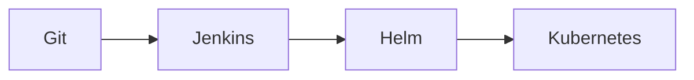
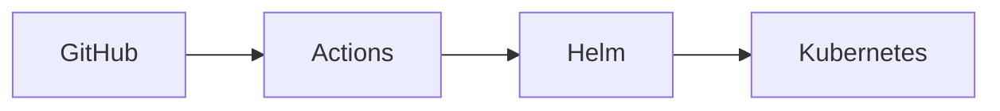

# CI/CD Integration

## Overview

CI/CD Integration with Helm automates the packaging, validation, testing, deployment, and lifecycle management of Kubernetes applications.

Helm integrates seamlessly with popular CI/CD platforms such as:

- Jenkins
- Azure DevOps
- GitHub Actions
- GitLab CI
- Argo CD

Using Helm in CI/CD pipelines ensures consistent, repeatable, and version-controlled deployments across development, testing, staging, and production environments.

> **Interview Tip**
>
> Helm is commonly used as the deployment tool in Kubernetes-based CI/CD pipelines, while tools like Jenkins, GitHub Actions, Azure DevOps, and GitLab CI orchestrate the pipeline.

---

## Why It Is Used

CI/CD integration with Helm helps to:

- Automate Kubernetes deployments
- Standardize deployments across environments
- Version application releases
- Reduce manual deployment errors
- Support automated rollbacks
- Enable GitOps workflows
- Improve deployment consistency

---

## Architecture / Working

```mermaid
flowchart LR

Developer
      │
      ▼
Git Repository
      │
      ▼
CI Pipeline
(Build/Test/Lint)
      │
      ▼
Helm Package
      │
      ▼
Container Registry
      │
      ▼
CD Pipeline
      │
      ▼
Helm Deploy
      │
      ▼
Kubernetes Cluster
```

### Working Process

1. Developer pushes code.
2. CI pipeline builds and tests the application.
3. Docker image is created and pushed.
4. Helm chart is validated.
5. Helm package is generated.
6. Deployment is executed using Helm.
7. Kubernetes updates the application.

---

## Key Components

| Component | Purpose |
|-----------|----------|
| Git Repository | Stores source code |
| CI Pipeline | Build and validation |
| Helm Chart | Kubernetes package |
| Container Registry | Stores images |
| Kubernetes Cluster | Deployment target |
| Helm CLI | Deployment tool |

---

## Types (if applicable)

| Integration | Purpose |
|-------------|----------|
| Jenkins | Pipeline automation |
| Azure DevOps | Microsoft CI/CD |
| GitHub Actions | GitHub-native CI/CD |
| GitLab CI | GitLab pipelines |
| Argo CD | GitOps Continuous Delivery |

---

## Lifecycle / Workflow

```mermaid
flowchart LR

Code Commit
      │
      ▼
Build
      │
      ▼
Test
      │
      ▼
Docker Build
      │
      ▼
Push Image
      │
      ▼
Helm Upgrade
      │
      ▼
Kubernetes
```

---

## Configuration / Syntax (if applicable)

Typical deployment

```bash
helm upgrade --install myapp ./chart
```

Dry run

```bash
helm upgrade --install myapp ./chart --dry-run
```

Lint

```bash
helm lint
```

---

## Important Commands (if applicable)

```bash
helm lint

helm template

helm package

helm install

helm upgrade

helm rollback

helm test
```

---

## Important Files (if applicable)

```
Chart.yaml

values.yaml

values-dev.yaml

values-prod.yaml

templates/

Jenkinsfile

azure-pipelines.yml

.github/workflows/

.gitlab-ci.yml
```

---

## Real-World Use Cases

- Automated Kubernetes deployments
- Multi-environment deployment
- Blue-Green deployments
- Canary releases
- Production rollouts
- GitOps workflows

---

## Advantages

- Automated deployments
- Consistent environments
- Easy rollback
- Faster releases
- Version-controlled deployments
- Reduced human errors

---

## Limitations

- Requires Kubernetes knowledge
- Incorrect values may cause deployment failures
- Pipeline permissions must be configured properly
- Requires secure secret management

---

## Common Interview Questions (Concept Only)

- Why is Helm used in CI/CD?
- Which Helm command is commonly used for deployment?
- Why use `helm upgrade --install`?
- What should be validated before deployment?
- How do Helm and Docker work together?
- Which CI/CD tools support Helm?
- Can Helm perform rollbacks automatically?
- How does Helm fit into GitOps?
- Why use separate values files?
- Where should Helm secrets be stored?

---

## Common Mistakes

- Deploying without linting
- Skipping template validation
- Hardcoding secrets
- Using production values in development
- Forgetting rollback strategy
- Deploying without image version updates

---

## Troubleshooting

| Problem | Cause | Solution |
|----------|-------|----------|
| Deployment failed | Invalid chart | Run `helm lint` |
| Upgrade failed | Incorrect values | Validate values files |
| Image not updated | Old image tag | Use unique image tags |
| Rollback unavailable | No revision history | Check `helm history` |
| Kubernetes error | Resource conflict | Inspect Kubernetes events |
| CI pipeline failed | Authentication issue | Verify cluster credentials |

---

## Summary

Helm integrates with modern CI/CD platforms to automate Kubernetes application deployments, providing version-controlled, repeatable, and reliable release management.

> **Interview Tip**
>
> In production, the most common deployment command is:

```bash
helm upgrade --install
```

It installs a release if it doesn't exist or upgrades it if it already exists.

---

# Helm in Jenkins

## Overview

Jenkins uses Helm to deploy Kubernetes applications after building and testing the application.

---

## Why It Is Used

- Automated deployments
- CI/CD pipelines
- Kubernetes releases

---

## Architecture / Working



---

## Key Components

- Jenkinsfile
- Helm CLI
- Kubernetes Cluster

---

## Types (if applicable)

Pipeline deployment

---

## Lifecycle / Workflow

```mermaid
flowchart LR

Build --> Test --> Helm Deploy
```

---

## Configuration / Syntax (if applicable)

```bash
helm upgrade --install myapp ./chart
```

---

## Important Commands (if applicable)

```bash
helm install

helm upgrade
```

---

## Important Files (if applicable)

```
Jenkinsfile
```

---

## Real-World Use Cases

- Enterprise CI/CD

---

## Advantages

- Highly customizable

---

## Limitations

- Requires Jenkins maintenance

---

## Common Interview Questions (Concept Only)

- How is Helm used in Jenkins?

---

## Common Mistakes

- Missing Kubernetes credentials

---

## Troubleshooting

Verify kubeconfig.

---

## Summary

Jenkins executes Helm deployments as part of CI/CD pipelines.

---

# Helm in Azure DevOps

## Overview

Azure DevOps integrates Helm through Azure Pipelines to automate Kubernetes deployments.

---

## Why It Is Used

- AKS deployments
- Enterprise automation

---

## Architecture / Working

```mermaid
flowchart LR

Azure Repo --> Azure Pipeline --> Helm --> AKS
```

---

## Key Components

- Azure Pipelines
- Service Connection
- Helm

---

## Types (if applicable)

Cloud-native deployment

---

## Lifecycle / Workflow

```mermaid
flowchart LR

Build --> Release --> Helm Deploy
```

---

## Configuration / Syntax (if applicable)

```bash
helm upgrade --install
```

---

## Important Commands (if applicable)

```bash
helm upgrade
```

---

## Important Files (if applicable)

```
azure-pipelines.yml
```

---

## Real-World Use Cases

- Azure Kubernetes Service

---

## Advantages

- Native Azure integration

---

## Limitations

- Azure configuration required

---

## Common Interview Questions (Concept Only)

- How is Helm used in Azure DevOps?

---

## Common Mistakes

- Incorrect service connections

---

## Troubleshooting

Verify Azure authentication.

---

## Summary

Azure DevOps automates AKS deployments using Helm.

---

# Helm in GitHub Actions

## Overview

GitHub Actions automates Helm deployments using workflow files stored in the repository.

---

## Why It Is Used

- GitHub-native CI/CD
- Kubernetes automation

---

## Architecture / Working



---

## Key Components

- Workflow
- Helm
- Kubernetes

---

## Types (if applicable)

GitHub automation

---

## Lifecycle / Workflow


---

## Configuration / Syntax (if applicable)

```bash
helm upgrade --install
```

---

## Important Commands (if applicable)

```bash
helm upgrade
```

---

## Important Files (if applicable)

```
.github/workflows/deploy.yml
```

---

## Real-World Use Cases

- GitHub-hosted projects

---

## Advantages

- Simple integration

---

## Limitations

- GitHub permissions required

---

## Common Interview Questions (Concept Only)

- How does GitHub Actions deploy Helm charts?

---

## Common Mistakes

- Missing Kubernetes secrets

---

## Troubleshooting

Verify GitHub Secrets.

---

## Summary

GitHub Actions uses Helm for Kubernetes deployments.

---

# Helm in GitLab CI

## Overview

GitLab CI automates Kubernetes deployments using GitLab pipelines and Helm.

---

## Why It Is Used

- Automated releases
- GitLab DevOps platform

---

## Architecture / Working

```mermaid
flowchart LR

GitLab --> GitLab CI --> Helm --> Kubernetes
```

---

## Key Components

- GitLab Runner
- Helm
- Kubernetes

---

## Types (if applicable)

GitLab deployment

---

## Lifecycle / Workflow

```mermaid
flowchart LR

Commit --> Pipeline --> Helm Deploy
```

---

## Configuration / Syntax (if applicable)

```bash
helm upgrade --install
```

---

## Important Commands (if applicable)

```bash
helm upgrade
```

---

## Important Files (if applicable)

```
.gitlab-ci.yml
```

---

## Real-World Use Cases

- GitLab-hosted environments

---

## Advantages

- Integrated DevOps platform

---

## Limitations

- Runner configuration required

---

## Common Interview Questions (Concept Only)

- How does GitLab CI use Helm?

---

## Common Mistakes

- Missing cluster authentication

---

## Troubleshooting

Verify GitLab Runner permissions.

---

## Summary

GitLab CI automates Helm deployments through pipeline stages.

---

# Helm with Argo CD

## Overview

Argo CD is a GitOps Continuous Delivery tool that deploys Helm Charts directly from Git repositories.

Unlike Jenkins or GitHub Actions, Argo CD continuously monitors Git repositories and automatically synchronizes Kubernetes clusters.

> **Interview Tip**
>
> Argo CD does **not** replace Helm. It **uses Helm as a rendering engine** while Git remains the source of truth.

---

## Why It Is Used

- GitOps deployments
- Continuous synchronization
- Automatic drift correction
- Self-healing applications

---

## Architecture / Working

```mermaid
flowchart LR

Git Repository
      │
      ▼
Argo CD
      │
      ▼
Helm Template Rendering
      │
      ▼
Kubernetes Cluster
```

---

## Key Components

- Git Repository
- Helm Chart
- Argo CD
- Kubernetes Cluster

---

## Types (if applicable)

GitOps deployment

---

## Lifecycle / Workflow

```mermaid
flowchart LR

Git Commit
      │
      ▼
Argo CD Detects Change
      │
      ▼
Helm Rendering
      │
      ▼
Sync
      │
      ▼
Kubernetes
```

---

## Configuration / Syntax (if applicable)

Helm Charts are referenced in the Argo CD Application manifest.

---

## Important Commands (if applicable)

```bash
argocd app sync

argocd app get
```

---

## Important Files (if applicable)

```
Application.yaml

Chart.yaml

values.yaml
```

---

## Real-World Use Cases

- GitOps
- Multi-cluster deployment
- Automated synchronization

---

## Advantages

- Continuous deployment
- Self-healing
- Drift detection
- Git as source of truth

---

## Limitations

- Requires GitOps workflow
- Additional Argo CD components

---

## Common Interview Questions (Concept Only)

- Does Argo CD replace Helm?
- How does Argo CD use Helm?
- What is GitOps?

---

## Common Mistakes

- Editing resources manually
- Ignoring Git as source of truth

---

## Troubleshooting

Verify repository synchronization.

---

## Summary

Argo CD uses Helm to render Kubernetes manifests while continuously synchronizing the cluster with the desired state stored in Git.

---

# Interview Quick Revision

## CI/CD Deployment Workflow

```text
Developer Commit
        ↓
CI Pipeline
(Build → Test → Docker Build)
        ↓
Push Docker Image
        ↓
helm lint
        ↓
helm template
        ↓
helm upgrade --install
        ↓
Kubernetes Deployment
        ↓
helm test
```

---

## CI/CD Tool Comparison

| Tool | Role | Uses Helm? |
|------|------|------------|
| Jenkins | CI/CD Automation | ✅ Yes |
| Azure DevOps | CI/CD | ✅ Yes |
| GitHub Actions | CI/CD | ✅ Yes |
| GitLab CI | CI/CD | ✅ Yes |
| Argo CD | GitOps Continuous Delivery | ✅ Yes |

---

## Frequently Used Helm Commands in CI/CD

| Command | Purpose |
|----------|---------|
| `helm lint` | Validate chart |
| `helm template` | Render manifests locally |
| `helm package` | Package chart |
| `helm install` | Install release |
| `helm upgrade --install` | Install or upgrade release |
| `helm rollback` | Restore previous release |
| `helm test` | Run post-deployment tests |

---

## CI/CD vs GitOps

| CI/CD | GitOps |
|--------|--------|
| Pipeline triggers deployment | Git repository triggers deployment |
| Push-based deployment | Pull-based deployment |
| Jenkins, GitHub Actions, Azure DevOps | Argo CD, Flux CD |
| Executes deployment commands | Continuously synchronizes cluster state |

---

## Production Best Practices

- Always run `helm lint` and `helm template` before deployment.
- Use `helm upgrade --install` to simplify deployment logic in pipelines.
- Store environment-specific configuration in separate values files.
- Avoid hardcoding secrets; use Kubernetes Secrets or external secret managers.
- Tag Docker images with immutable versions and reference those tags in Helm values.
- Enable automated rollback or monitor deployment health after upgrades.
- In GitOps workflows, treat Git as the single source of truth and avoid manual changes in the cluster.

---

## One-line Interview Answer

**Helm integrates with CI/CD platforms such as Jenkins, Azure DevOps, GitHub Actions, GitLab CI, and Argo CD to automate the packaging, validation, deployment, upgrade, and rollback of Kubernetes applications, enabling consistent, repeatable, and production-ready releases.**
