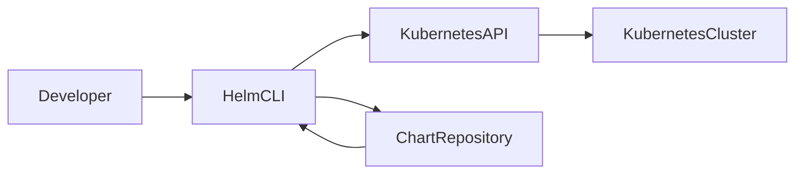
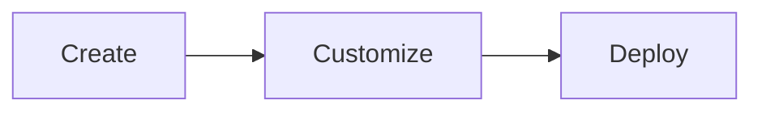
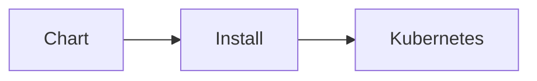
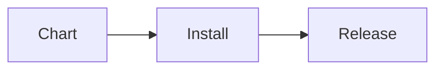
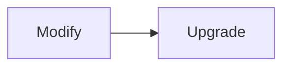
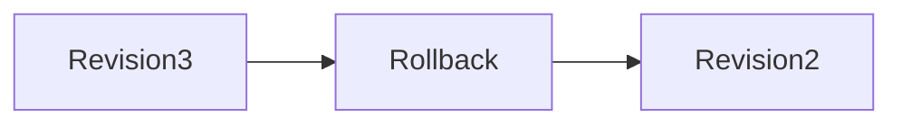
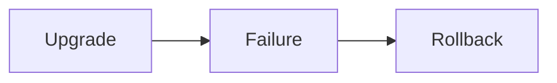

# Helm CLI

## Overview

The Helm Command Line Interface (CLI) is the primary tool used to create, package, deploy, manage, troubleshoot, and remove Kubernetes applications using Helm Charts.

Almost every Helm operation—such as creating charts, installing applications, upgrading releases, or rolling back deployments—is performed using the Helm CLI.

> **Interview Tip**
>
> Helm CLI is one of the most frequently tested Helm topics. You should know the purpose of the commonly used commands, their syntax, and when they are used in real-world CI/CD pipelines.

---

## Why It Is Used

The Helm CLI is used to:

- Create Helm Charts
- Deploy applications to Kubernetes
- Upgrade existing deployments
- Roll back failed deployments
- Manage release history
- Validate charts before deployment
- Package charts for distribution
- Manage repositories
- Troubleshoot deployments

---

## Architecture / Working



### Working Process

1. Developer executes a Helm command.
2. Helm reads the chart.
3. Helm renders Kubernetes manifests.
4. Helm communicates with the Kubernetes API Server.
5. Kubernetes creates or updates resources.
6. Helm stores release metadata.

---

## Key Components

| Component | Purpose |
|-----------|----------|
| Helm CLI | Executes Helm commands |
| Chart | Application package |
| Release | Running deployment |
| Repository | Stores Helm Charts |
| Kubernetes Cluster | Deployment target |

---

## Types (if applicable)

Helm CLI commands are commonly grouped into:

| Category | Examples |
|-----------|-----------|
| Chart Management | create, package, lint |
| Deployment | install, upgrade, rollback, uninstall |
| Repository | repo, search |
| Dependency | dependency |
| Information | status, history, get, show, list |
| Debugging | template, lint, test |

---

## Lifecycle / Workflow

```mermaid
flowchart LR

Create Chart
      ↓
Lint Chart
      ↓
Package Chart
      ↓
Install
      ↓
Upgrade
      ↓
Test
      ↓
Rollback
      ↓
Uninstall
```

---

## Configuration / Syntax (if applicable)

General syntax

```bash
helm <command> [options]
```

Example

```bash
helm install myapp ./mychart
```

---

## Important Commands (if applicable)

| Command | Purpose |
|----------|---------|
| helm create | Create a new chart |
| helm install | Install a release |
| helm upgrade | Upgrade a release |
| helm rollback | Roll back a release |
| helm uninstall | Remove a release |
| helm list | List releases |
| helm status | Show release status |
| helm history | Show release history |
| helm template | Render manifests locally |
| helm lint | Validate chart |
| helm package | Package chart |
| helm repo | Manage repositories |
| helm dependency | Manage dependencies |
| helm search | Search charts |
| helm show | Show chart information |
| helm get | Get release information |
| helm test | Execute release tests |

---

## Important Files (if applicable)

```
Chart.yaml

values.yaml

Chart.lock

charts/

templates/
```

---

## Real-World Use Cases

- CI/CD deployments
- Kubernetes application upgrades
- Rollback failed deployments
- Package internal charts
- Validate charts before production deployment
- Enterprise application lifecycle management

---

## Advantages

- Easy Kubernetes deployments
- Version-controlled releases
- Built-in rollback capability
- Simple application packaging
- Supports automation

---

## Limitations

- Requires Kubernetes access
- Requires properly structured charts
- Does not replace Kubernetes knowledge

---

## Common Interview Questions (Concept Only)

- What is the Helm CLI?
- Which Helm command installs an application?
- Difference between install and upgrade?
- Difference between template and install?
- What does helm lint do?
- What is helm rollback?
- How do you package a chart?
- What is helm test?
- What does helm get retrieve?
- How do you search Helm repositories?

---

## Common Mistakes

- Installing without validating charts
- Forgetting to update repositories
- Hardcoding values
- Upgrading without checking release history
- Ignoring rollback capability
- Deploying without testing templates

---

## Troubleshooting

| Problem | Cause | Solution |
|----------|-------|----------|
| Install failed | Invalid chart | Run `helm lint` |
| Upgrade failed | Invalid values | Validate values file |
| Rollback failed | Revision missing | Check `helm history` |
| Chart not found | Repository outdated | Run `helm repo update` |
| Template error | Invalid syntax | Run `helm template` |
| Dependency missing | Dependencies not downloaded | Run `helm dependency update` |

---

## Summary

The Helm CLI is the primary interface for developing, deploying, upgrading, testing, troubleshooting, and managing Kubernetes applications using Helm Charts.

> **Interview Tip**
>
> The commands **install**, **upgrade**, **rollback**, **template**, **lint**, **package**, **repo**, **history**, and **status** are among the most frequently asked in DevOps interviews.

---

# helm create

## Overview

Creates a new Helm Chart with the standard directory structure.

---

## Why It Is Used

- Bootstrap a new project
- Generate chart templates
- Follow Helm best practices

---

## Architecture / Working

```mermaid
flowchart LR

helm create --> ChartDirectory
```

---

## Key Components

- Chart.yaml
- values.yaml
- templates/
- charts/

---

## Types (if applicable)

Standard chart creation

---

## Lifecycle / Workflow



---

## Configuration / Syntax (if applicable)

```bash
helm create mychart
```

---

## Important Commands (if applicable)

```bash
helm create
```

---

## Important Files (if applicable)

```
Chart.yaml
values.yaml
templates/
```

---

## Real-World Use Cases

- Creating reusable application templates

---

## Advantages

- Generates recommended structure

---

## Limitations

- Requires customization

---

## Common Interview Questions (Concept Only)

- What does `helm create` generate?

---

## Common Mistakes

- Leaving unused default templates

---

## Troubleshooting

Remove unnecessary generated resources.

---

## Summary

Creates a new Helm Chart skeleton.

---

# helm install

## Overview

Deploys a Helm Chart as a new release.

---

## Why It Is Used

- Deploy applications
- Install services

---

## Architecture / Working



---

## Key Components

- Release
- Values

---

## Types (if applicable)

Fresh deployment

---

## Lifecycle / Workflow



---

## Configuration / Syntax (if applicable)

```bash
helm install myapp ./chart
```

---

## Important Commands (if applicable)

```bash
helm install
```

---

## Important Files (if applicable)

```
values.yaml
```

---

## Real-World Use Cases

- Initial deployment

---

## Advantages

- Easy deployment

---

## Limitations

- Release name must be unique

---

## Common Interview Questions (Concept Only)

- What is a Helm release?

---

## Common Mistakes

- Duplicate release names

---

## Troubleshooting

Check release existence.

---

## Summary

Installs a new application release.

---

# helm upgrade

## Overview

Updates an existing release with a new chart or configuration.

---

## Why It Is Used

- Application updates
- Configuration changes

---

## Architecture / Working

```mermaid
flowchart LR

Old Release --> Upgrade --> New Release
```

---

## Key Components

- Existing release

---

## Types (if applicable)

Rolling update

---

## Lifecycle / Workflow



---

## Configuration / Syntax (if applicable)

```bash
helm upgrade myapp ./chart
```

---

## Important Commands (if applicable)

```bash
helm upgrade
```

---

## Important Files (if applicable)

```
values.yaml
```

---

## Real-World Use Cases

- CI/CD

---

## Advantages

- Zero recreation

---

## Limitations

- Failed upgrades may require rollback

---

## Common Interview Questions (Concept Only)

- Difference between install and upgrade?

---

## Common Mistakes

- Forgetting values overrides

---

## Troubleshooting

Use `--dry-run`.

---

## Summary

Updates deployed applications.

---

# helm rollback

## Overview

Restores a release to a previous revision.

---

## Why It Is Used

- Recover failed deployments

---

## Architecture / Working



---

## Key Components

- Revision history

---

## Types (if applicable)

Rollback

---

## Lifecycle / Workflow



---

## Configuration / Syntax (if applicable)

```bash
helm rollback myapp 2
```

---

## Important Commands (if applicable)

```bash
helm rollback
```

---

## Important Files (if applicable)

Release metadata

---

## Real-World Use Cases

- Production recovery

---

## Advantages

- Fast recovery

---

## Limitations

- Requires revision history

---

## Common Interview Questions (Concept Only)

- How does rollback work?

---

## Common Mistakes

- Rolling back wrong revision

---

## Troubleshooting

Run `helm history`.

---

## Summary

Returns application to previous version.

---

# helm uninstall

## Overview

Removes a release and its Kubernetes resources.

---

## Configuration / Syntax

```bash
helm uninstall myapp
```

---

## Summary

Deletes deployed releases.

---

# helm list

## Overview

Displays installed releases.

---

## Configuration / Syntax

```bash
helm list
```

---

## Summary

Lists Helm releases.

---

# helm status

## Overview

Shows current release status.

---

## Configuration / Syntax

```bash
helm status myapp
```

---

## Summary

Displays deployment status.

---

# helm history

## Overview

Displays release revision history.

---

## Configuration /Syntax

```bash
helm history myapp
```

---

## Summary

Shows deployment revisions.

---

# helm template

## Overview

Renders Kubernetes manifests locally without deploying.

---

## Why It Is Used

- Debug templates
- Validate rendering

---

## Configuration / Syntax

```bash
helm template myapp ./chart
```

---

## Summary

Generates manifests for review.

---

# helm lint

## Overview

Checks a chart for errors and best practices.

---

## Configuration / Syntax

```bash
helm lint ./chart
```

---

## Summary

Validates Helm Charts.

---

# helm package

## Overview

Packages a chart into a `.tgz` archive.

---

## Configuration / Syntax

```bash
helm package ./chart
```

---

## Summary

Creates distributable chart packages.

---

# helm repo

## Overview

Manages chart repositories.

---

## Important Commands

```bash
helm repo add

helm repo update

helm repo list

helm repo remove
```

---

## Summary

Manages Helm repositories.

---

# helm dependency

## Overview

Downloads and manages chart dependencies.

---

## Important Commands

```bash
helm dependency update

helm dependency build

helm dependency list
```

---

## Summary

Handles chart dependencies.

---

# helm search

## Overview

Searches available Helm Charts.

---

## Configuration / Syntax

```bash
helm search repo nginx
```

---

## Summary

Finds charts in repositories.

---

# helm show

## Overview

Displays chart metadata without installing.

---

## Configuration / Syntax

```bash
helm show chart nginx
```

---

## Summary

Displays chart information.

---

# helm get

## Overview

Retrieves release information.

---

## Configuration / Syntax

```bash
helm get values myapp

helm get manifest myapp

helm get notes myapp
```

---

## Summary

Retrieves deployed release information.

---

# helm test

## Overview

Runs test Pods defined within the Helm Chart after deployment.

Tests verify whether the deployed application is functioning correctly.

---

## Why It Is Used

- Validate deployment
- Smoke testing
- CI/CD verification

---

## Architecture / Working

```mermaid
flowchart LR

Release --> Test Pods --> Pass/Fail
```

---

## Configuration / Syntax

```bash
helm test myapp
```

---

## Important Commands

```bash
helm test
```

---

## Real-World Use Cases

- Post-deployment validation
- Production smoke testing

---

## Advantages

- Built-in testing
- Automated verification

---

## Limitations

- Requires test Pods

---

## Common Interview Questions (Concept Only)

- What does `helm test` do?

---

## Common Mistakes

- Forgetting to define test resources

---

## Troubleshooting

Inspect test Pod logs.

---

## Summary

Runs automated tests after deployment.

---

# Interview Quick Revision

## Most Frequently Used Helm Commands

| Command | Purpose |
|----------|---------|
| `helm create` | Create chart |
| `helm install` | Install release |
| `helm upgrade` | Upgrade release |
| `helm rollback` | Roll back release |
| `helm uninstall` | Remove release |
| `helm list` | List releases |
| `helm status` | View release status |
| `helm history` | View release revisions |
| `helm template` | Render manifests locally |
| `helm lint` | Validate chart |
| `helm package` | Package chart |
| `helm repo` | Manage repositories |
| `helm dependency` | Manage dependencies |
| `helm search` | Search charts |
| `helm show` | Display chart metadata |
| `helm get` | Retrieve release information |
| `helm test` | Execute deployment tests |

---

## Typical Helm Deployment Workflow

```text
helm create
      ↓
Edit Chart
      ↓
helm lint
      ↓
helm template
      ↓
helm package
      ↓
helm install
      ↓
helm status
      ↓
helm test
      ↓
helm upgrade
      ↓
helm history
      ↓
helm rollback (if required)
      ↓
helm uninstall
```

---

## Frequently Asked Interview Differences

| Command | Purpose |
|----------|---------|
| `helm install` | Creates a new release |
| `helm upgrade` | Updates an existing release |
| `helm template` | Renders manifests locally without deploying |
| `helm lint` | Checks chart syntax and best practices |
| `helm package` | Creates a distributable `.tgz` archive |
| `helm get` | Retrieves information from an installed release |
| `helm show` | Displays metadata from a chart package or repository |
| `helm rollback` | Restores a previous release revision |

---

## Production Best Practices

- Run `helm lint` before every deployment.
- Use `helm template` or `--dry-run` to validate rendered manifests.
- Store configuration in environment-specific values files rather than editing templates.
- Review `helm history` before performing rollbacks.
- Use `helm test` for post-deployment validation in CI/CD pipelines.
- Package and version charts consistently before publishing.
- Manage repositories and dependencies regularly using `helm repo update` and `helm dependency update`.

---

## One-line Interview Answer

**The Helm CLI is the primary interface for creating, validating, packaging, deploying, upgrading, testing, troubleshooting, and managing Kubernetes applications using Helm Charts throughout their complete lifecycle.**
