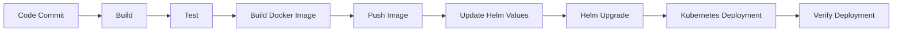
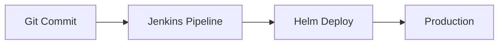
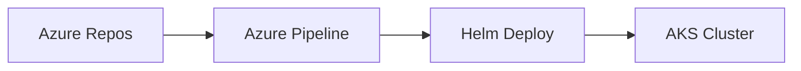
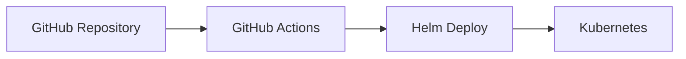
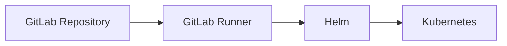
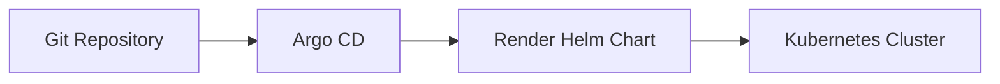
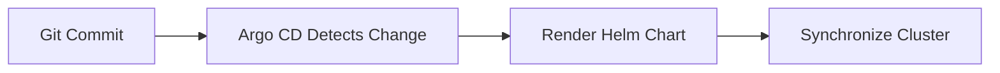

# CI/CD Integration

## Overview

CI/CD Integration with Helm automates the packaging, deployment, upgrade, and rollback of Kubernetes applications within Continuous Integration and Continuous Delivery (CI/CD) pipelines.

Helm is commonly integrated with CI/CD tools such as:

- Jenkins
- Azure DevOps
- GitHub Actions
- GitLab CI
- Argo CD (GitOps)

Helm enables consistent deployments across multiple Kubernetes environments using reusable charts and environment-specific configuration.

> **Interview Tip**
>
> CI/CD tools execute Helm commands to deploy applications, while GitOps tools like Argo CD continuously synchronize Kubernetes clusters using Helm charts stored in Git.

---

## Why It Is Used

Helm integration with CI/CD helps to:

- Automate Kubernetes deployments
- Standardize deployments across environments
- Reduce manual intervention
- Enable version-controlled releases
- Support automated rollbacks
- Improve deployment consistency
- Simplify application upgrades

---

## Architecture / Working


---

## Key Components

| Component | Purpose |
|-----------|----------|
| Source Repository | Stores application code and Helm charts |
| CI/CD Pipeline | Automates build and deployment |
| Docker Registry | Stores application images |
| Helm | Deploys Kubernetes resources |
| Kubernetes Cluster | Runs applications |
| Values Files | Environment-specific configuration |

---

## Types (if applicable)

| Integration | Purpose |
|-------------|----------|
| Helm + Jenkins | CI/CD automation |
| Helm + Azure DevOps | Azure Kubernetes deployments |
| Helm + GitHub Actions | GitHub-based automation |
| Helm + GitLab CI | GitLab pipelines |
| Helm + Argo CD | GitOps Continuous Delivery |

---

## Lifecycle / Workflow



---

## Configuration / Syntax (if applicable)

Typical deployment command

```bash
helm upgrade --install myapp ./chart \
-f values-prod.yaml
```

Dry run

```bash
helm upgrade --install myapp ./chart \
--dry-run --debug
```

---

## Important Commands (if applicable)

```bash
helm install

helm upgrade

helm rollback

helm lint

helm template

helm package

helm dependency update

helm history

helm status

helm test
```

---

## Important Files (if applicable)

```
Chart.yaml

values.yaml

values-dev.yaml

values-stage.yaml

values-prod.yaml

templates/

Chart.lock

.github/workflows/

azure-pipelines.yml

.gitlab-ci.yml

Jenkinsfile
```

---

## Real-World Use Cases

- Automated Kubernetes deployments
- Enterprise CI/CD pipelines
- Blue-Green deployments
- Rolling updates
- Multi-environment deployments
- Automated release management

---

## Advantages

- Fully automated deployments
- Consistent Kubernetes releases
- Version-controlled infrastructure
- Supports rollback
- Environment-specific configuration
- Easy integration with popular CI/CD platforms

---

## Limitations

- Requires Kubernetes knowledge
- Incorrect values files can impact deployments
- Runtime application issues cannot be detected by Helm alone
- Additional tooling required for GitOps workflows

---

## Common Interview Questions (Concept Only)

- Why is Helm used in CI/CD?
- How does Helm integrate with Jenkins?
- What is the role of Helm in GitHub Actions?
- How do Azure DevOps pipelines deploy Helm charts?
- What is the difference between CI/CD and GitOps?
- Why use `helm upgrade --install`?
- How are values files used in CI/CD?
- How does Helm support rollback?
- What artifacts are produced during CI/CD?
- What are common Helm deployment stages?

---

## Common Mistakes

- Deploying without running `helm lint`
- Using the `latest` image tag
- Hardcoding production values
- Skipping deployment validation
- Not versioning Helm charts
- Ignoring release history

---

## Troubleshooting

| Problem | Cause | Solution |
|----------|-------|----------|
| Deployment failed | Invalid chart | Run `helm lint` |
| Upgrade failed | Invalid values | Validate values files |
| Image not found | Incorrect image tag | Verify image repository |
| Kubernetes validation failed | Invalid manifests | Run `helm template` |
| Release failed | Cluster issue | Check Kubernetes events |
| Rollback required | Failed deployment | Use `helm rollback` |

---

## Summary

Helm integrates seamlessly with modern CI/CD platforms to automate Kubernetes deployments, manage application releases, support environment-specific configurations, and provide reliable rollback capabilities.

> **Interview Tip**
>
> Helm is the deployment tool inside the CI/CD pipeline. The pipeline builds the application, while Helm deploys it to Kubernetes.

---

# Helm in Jenkins

## Overview

Jenkins integrates with Helm to automate Kubernetes deployments after successful builds.

The typical Jenkins pipeline:

1. Pull source code
2. Build application
3. Build Docker image
4. Push image
5. Deploy using Helm

---

## Why It Is Used

- Automate Kubernetes deployments
- Reduce manual releases
- Continuous Delivery

---

## Architecture / Working


---

## Key Components

- Jenkins
- Jenkinsfile
- Helm
- Kubernetes
- Docker Registry

---

## Types (if applicable)

Pipeline-based deployment

---

## Lifecycle / Workflow



---

## Configuration / Syntax (if applicable)

Typical Jenkins stage

```groovy
sh 'helm upgrade --install myapp ./chart'
```

---

## Important Commands (if applicable)

```bash
helm upgrade

helm lint

helm test
```

---

## Important Files (if applicable)

```
Jenkinsfile

Chart.yaml

values.yaml
```

---

## Real-World Use Cases

- Enterprise CI/CD
- Automated production deployments

---

## Advantages

- Mature CI/CD platform
- Easy pipeline customization

---

## Limitations

- Requires Jenkins infrastructure

---

## Common Interview Questions (Concept Only)

- How is Helm used in Jenkins?
- Where are Helm commands executed?

---

## Common Mistakes

- Missing Kubernetes credentials

---

## Troubleshooting

Verify Jenkins Kubernetes credentials and Helm installation.

---

## Summary

Jenkins executes Helm commands as part of automated deployment pipelines.

---

# Helm in Azure DevOps

## Overview

Azure DevOps integrates Helm into Azure Pipelines to deploy applications to AKS or other Kubernetes clusters.

---

## Why It Is Used

- Azure-native CI/CD
- AKS deployments
- Automated upgrades

---

## Architecture / Working



---

## Key Components

- Azure Pipelines
- Helm
- AKS

---

## Types (if applicable)

Azure Pipeline deployment

---

## Lifecycle / Workflow


---

## Configuration / Syntax (if applicable)

```yaml
- script: helm upgrade --install myapp ./chart
```

---

## Important Commands (if applicable)

```bash
helm upgrade

helm lint
```

---

## Important Files (if applicable)

```
azure-pipelines.yml
```

---

## Real-World Use Cases

- AKS deployments

---

## Advantages

- Native Azure integration

---

## Limitations

- Azure DevOps configuration required

---

## Common Interview Questions (Concept Only)

- How does Azure DevOps deploy Helm charts?

---

## Common Mistakes

- Missing AKS service connection

---

## Troubleshooting

Validate Azure service connection and Kubernetes context.

---

## Summary

Azure DevOps automates Helm deployments to Kubernetes through Azure Pipelines.

---

# Helm in GitHub Actions

## Overview

GitHub Actions automates Helm deployments using workflow files stored in the repository.

---

## Why It Is Used

- Native GitHub CI/CD
- Kubernetes automation

---

## Architecture / Working



---

## Key Components

- Workflow
- Helm
- Kubernetes

---

## Types (if applicable)

Workflow automation

---

## Lifecycle / Workflow


---

## Configuration / Syntax (if applicable)

```yaml
- run: helm upgrade --install myapp ./chart
```

---

## Important Commands (if applicable)

```bash
helm install

helm upgrade
```

---

## Important Files (if applicable)

```
.github/workflows/deploy.yml
```

---

## Real-World Use Cases

- Kubernetes deployments

---

## Advantages

- Native GitHub integration

---

## Limitations

- Requires GitHub secrets

---

## Common Interview Questions (Concept Only)

- How does GitHub Actions use Helm?

---

## Common Mistakes

- Missing kubeconfig

---

## Troubleshooting

Verify workflow secrets and Kubernetes authentication.

---

## Summary

GitHub Actions executes Helm commands as part of automated workflows.

---

# Helm in GitLab CI

## Overview

GitLab CI/CD pipelines deploy Helm charts to Kubernetes clusters after successful builds.

---

## Why It Is Used

- Integrated GitLab automation
- Kubernetes deployments

---

## Architecture / Working



---

## Key Components

- GitLab Runner
- Helm
- Kubernetes

---

## Types (if applicable)

Pipeline deployment

---

## Lifecycle / Workflow


---

## Configuration / Syntax (if applicable)

```yaml
script:
  - helm upgrade --install myapp ./chart
```

---

## Important Commands (if applicable)

```bash
helm upgrade
```

---

## Important Files (if applicable)

```
.gitlab-ci.yml
```

---

## Real-World Use Cases

- GitLab-based Kubernetes deployments

---

## Advantages

- Built-in CI/CD

---

## Limitations

- Runner configuration required

---

## Common Interview Questions (Concept Only)

- How is Helm used in GitLab CI?

---

## Common Mistakes

- Missing Kubernetes credentials

---

## Troubleshooting

Verify GitLab Runner permissions and cluster connectivity.

---

## Summary

GitLab CI automates Helm deployments using pipeline jobs.

---

# Helm with Argo CD

## Overview

Argo CD uses Helm charts as an application source for GitOps-based Continuous Delivery.

Unlike Jenkins or GitHub Actions, Argo CD continuously monitors Git and synchronizes Kubernetes clusters automatically.

> **Important Interview Point**
>
> Argo CD uses Helm to render templates but does **not** manage Helm releases using `helm install` or `helm upgrade`.

---

## Why It Is Used

- GitOps deployments
- Continuous synchronization
- Drift detection
- Self-healing

---

## Architecture / Working



---

## Key Components

- Git Repository
- Argo CD
- Helm Chart
- Kubernetes Cluster

---

## Types (if applicable)

GitOps Continuous Delivery

---

## Lifecycle / Workflow



---

## Configuration / Syntax (if applicable)

Argo CD references the Helm chart within an `Application` resource.

---

## Important Commands (if applicable)

```bash
argocd app sync

argocd app get
```

---

## Important Files (if applicable)

```
Application.yaml

Chart.yaml

values.yaml
```

---

## Real-World Use Cases

- Enterprise GitOps
- Multi-cluster deployments
- Automated Kubernetes synchronization

---

## Advantages

- Git as the source of truth
- Automated synchronization
- Drift detection
- Self-healing

---

## Limitations

- Requires Argo CD installation
- Relies on Git repository availability

---

## Common Interview Questions (Concept Only)

- How does Argo CD use Helm?
- Does Argo CD run `helm install`?
- What is the difference between Helm CLI and Argo CD?

---

## Common Mistakes

- Treating Argo CD as a Helm release manager
- Making manual cluster changes outside Git

---

## Troubleshooting

Verify application synchronization status, Git repository connectivity, and rendered manifests.

---

## Summary

Argo CD integrates with Helm by rendering Helm charts from Git repositories and continuously synchronizing Kubernetes clusters using GitOps principles.

---

# Interview Quick Revision

## CI/CD Pipeline with Helm


---

## CI/CD vs GitOps

| CI/CD | GitOps |
|--------|--------|
| Push-based deployment | Pull-based deployment |
| Pipeline triggers deployment | GitOps controller synchronizes cluster |
| Jenkins, Azure DevOps, GitHub Actions, GitLab CI | Argo CD, Flux |
| Executes Helm CLI commands | Uses Helm charts as deployment source |

---

## CI/CD Tool Comparison

| Tool | Helm Support | Primary Use |
|------|--------------|-------------|
| Jenkins | Executes Helm CLI | Enterprise CI/CD |
| Azure DevOps | Azure Pipelines | AKS deployments |
| GitHub Actions | Workflow automation | GitHub-based CI/CD |
| GitLab CI | Pipeline automation | GitLab-native CI/CD |
| Argo CD | GitOps with Helm charts | Continuous Delivery |

---

## Production Best Practices

- Run `helm lint` before every deployment.
- Validate rendered manifests using `helm template`.
- Use `helm upgrade --install` for idempotent deployments.
- Store Kubernetes credentials securely using CI/CD secrets.
- Use separate values files for development, staging, and production.
- Version Helm charts and application images independently.
- Avoid using mutable image tags such as `latest`.
- Monitor deployment health and maintain rollback procedures.

---

## One-line Interview Answer

**Helm integrates with CI/CD platforms such as Jenkins, Azure DevOps, GitHub Actions, and GitLab CI to automate Kubernetes deployments, while GitOps tools like Argo CD use Helm charts stored in Git to continuously synchronize the cluster with the desired state.**
