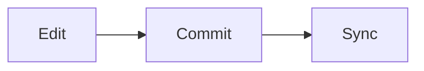

# GitOps Integration

## Overview

GitOps Integration with Helm combines **Helm's package management** capabilities with **GitOps principles** to automate Kubernetes deployments.

In a GitOps workflow:

- Git stores the desired state.
- Helm packages and templates Kubernetes applications.
- GitOps tools (such as Argo CD and Flux) continuously monitor Git repositories.
- Changes committed to Git are automatically synchronized with Kubernetes clusters.

Unlike traditional CI/CD, GitOps uses a **pull-based deployment model**, where the cluster continuously pulls changes from Git instead of receiving push-based deployments.

> **Interview Tip**
>
> Helm **does not perform GitOps by itself**. It works together with GitOps tools like **Argo CD** and **Flux**, which use Helm Charts as deployment sources.

---

## Why It Is Used

GitOps Integration helps to:

- Automate Kubernetes deployments
- Keep Git as the single source of truth
- Enable version-controlled infrastructure
- Detect configuration drift
- Automatically synchronize clusters
- Support self-healing deployments
- Improve deployment consistency
- Simplify rollback and auditing

---

## Architecture / Working

```mermaid
flowchart LR

Developer
      │
      ▼
Git Repository
      │
      ▼
GitOps Controller
(Argo CD / Flux)
      │
      ▼
Helm Chart Rendering
      │
      ▼
Kubernetes API Server
      │
      ▼
Kubernetes Cluster
```

### Working Process

1. Developer modifies a Helm Chart or values file.
2. Changes are committed to Git.
3. GitOps controller detects the change.
4. Helm renders Kubernetes manifests.
5. Kubernetes resources are synchronized.
6. Cluster state matches the Git repository.
7. Any manual changes (drift) are corrected automatically.

---

## Key Components

| Component | Purpose |
|-----------|----------|
| Git Repository | Stores desired state |
| Helm Chart | Application package |
| Values Files | Environment configuration |
| GitOps Controller | Watches Git repository |
| Kubernetes Cluster | Deployment target |
| Git | Source of Truth |

---

## Types (if applicable)

| Integration | Purpose |
|-------------|----------|
| Helm + Argo CD | GitOps Continuous Delivery |
| Helm + Flux | Kubernetes GitOps |
| Declarative Deployment | Desired-state deployment |
| Pull-Based Deployment | Automatic synchronization |

---

## Lifecycle / Workflow

```mermaid
flowchart LR

Code Change
      │
      ▼
Git Commit
      │
      ▼
GitOps Controller
      │
      ▼
Helm Template Rendering
      │
      ▼
Cluster Synchronization
      │
      ▼
Application Running
```

---

## Configuration / Syntax (if applicable)

Typical Helm deployment used by GitOps tools:

```bash
helm template
```

Argo CD and Flux internally render Helm Charts before applying them to Kubernetes.

---

## Important Commands (if applicable)

```bash
helm template

helm lint

helm package

helm dependency update

argocd app sync

flux reconcile
```

---

## Important Files (if applicable)

```
Chart.yaml

values.yaml

values-dev.yaml

values-prod.yaml

Application.yaml

HelmRelease.yaml

Git Repository

templates/
```

---

## Real-World Use Cases

- Kubernetes GitOps
- Production deployments
- Multi-cluster management
- Automated synchronization
- Continuous Delivery
- Infrastructure as Code
- Disaster recovery

---

## Advantages

- Git as the single source of truth
- Fully automated deployments
- Version-controlled infrastructure
- Easy rollback using Git history
- Drift detection
- Self-healing deployments
- Improved auditing

---

## Limitations

- Requires GitOps tooling
- Learning curve for GitOps workflows
- Manual cluster changes are overwritten
- Repository organization is critical

---

## Common Interview Questions (Concept Only)

- What is GitOps?
- How does Helm support GitOps?
- Does Helm perform GitOps by itself?
- Difference between CI/CD and GitOps?
- Why is Git the source of truth?
- What is a pull-based deployment?
- How is configuration drift detected?
- What is declarative deployment?
- Difference between Argo CD and Flux?
- Why use Helm with GitOps?

---

## Common Mistakes

- Editing Kubernetes resources manually
- Treating Helm as a GitOps controller
- Storing production secrets in Git
- Using mutable image tags like `latest`
- Ignoring synchronization failures
- Mixing imperative and declarative deployments

---

## Troubleshooting

| Problem | Cause | Solution |
|----------|-------|----------|
| Application OutOfSync | Git differs from cluster | Synchronize application |
| Sync failed | Invalid Helm Chart | Run `helm lint` |
| Template error | Invalid values | Validate values files |
| Image not updated | Cached image tag | Use immutable version tags |
| Drift detected | Manual cluster change | Update Git repository instead |
| Deployment failed | Kubernetes validation error | Check rendered manifests and cluster events |

---

## Summary

GitOps Integration combines Helm with GitOps controllers like Argo CD and Flux to provide automated, declarative, pull-based Kubernetes deployments using Git as the single source of truth.

> **Interview Tip**
>
> **Helm packages applications, while GitOps tools continuously deploy and synchronize them.**

---

# Helm with Argo CD

## Overview

Argo CD is a GitOps Continuous Delivery tool that deploys Helm Charts directly from Git repositories.

It continuously monitors Git and automatically synchronizes Kubernetes clusters.

> **Important Interview Point**
>
> Argo CD **uses Helm as a template engine**. It does **not** execute `helm install` or manage Helm releases like the Helm CLI.

---

## Why It Is Used

- GitOps deployments
- Continuous synchronization
- Drift detection
- Self-healing
- Multi-cluster deployments

---

## Architecture / Working

```mermaid
flowchart LR

Git Repository
      │
      ▼
Argo CD
      │
      ▼
Helm Template Rendering
      │
      ▼
Kubernetes Cluster
```

---

## Key Components

- Git Repository
- Helm Chart
- Application CR
- Argo CD Controller

---

## Types (if applicable)

GitOps Continuous Delivery

---

## Lifecycle / Workflow

```mermaid
flowchart LR

Commit
      │
      ▼
Argo CD Detects Change
      │
      ▼
Render Helm Chart
      │
      ▼
Sync Cluster
```

---

## Configuration / Syntax (if applicable)

Argo CD references Helm Charts in the `Application` resource.

---

## Important Commands (if applicable)

```bash
argocd app sync

argocd app get
```

---

## Important Files (if applicable)

```
Application.yaml

Chart.yaml

values.yaml
```

---

## Real-World Use Cases

- AKS
- EKS
- GKE
- Multi-cluster GitOps

---

## Advantages

- Self-healing
- Drift detection
- Git-based deployments

---

## Limitations

- Requires Argo CD installation

---

## Common Interview Questions (Concept Only)

- Does Argo CD execute Helm commands?
- How does Argo CD use Helm?

---

## Common Mistakes

- Editing resources manually

---

## Troubleshooting

Verify synchronization status.

---

## Summary

Argo CD renders Helm Charts from Git and continuously synchronizes Kubernetes clusters.

---

# Helm with Flux

## Overview

Flux is a GitOps Continuous Delivery tool that supports Helm through the **Helm Controller**.

Flux manages Helm releases declaratively using Kubernetes custom resources.

> **Interview Tip**
>
> Flux uses the **HelmRelease** custom resource instead of executing Helm commands manually.

---

## Why It Is Used

- GitOps automation
- Kubernetes-native deployments
- Helm release management

---

## Architecture / Working

```mermaid
flowchart LR

Git Repository
      │
      ▼
Flux Source Controller
      │
      ▼
Helm Controller
      │
      ▼
Kubernetes
```

---

## Key Components

- Source Controller
- Helm Controller
- HelmRelease
- Git Repository

---

## Types (if applicable)

GitOps deployment

---

## Lifecycle / Workflow

```mermaid
flowchart LR

Git Commit
      │
      ▼
Flux Detects Change
      │
      ▼
HelmRelease
      │
      ▼
Deploy
```

---

## Configuration / Syntax (if applicable)

Flux manages deployments using:

```
HelmRelease.yaml
```

---

## Important Commands (if applicable)

```bash
flux reconcile

flux get helmreleases
```

---

## Important Files (if applicable)

```
HelmRelease.yaml
```

---

## Real-World Use Cases

- Kubernetes automation
- Continuous deployment

---

## Advantages

- Kubernetes-native
- Automated synchronization

---

## Limitations

- Flux components required

---

## Common Interview Questions (Concept Only)

- What is HelmRelease?
- How does Flux deploy Helm Charts?

---

## Common Mistakes

- Manual cluster modifications

---

## Troubleshooting

Verify HelmRelease status.

---

## Summary

Flux manages Helm deployments declaratively using the Helm Controller.

---

# Declarative Deployments

## Overview

Declarative Deployment means describing the **desired state** of an application instead of manually executing deployment steps.

Helm Charts define Kubernetes resources declaratively using YAML templates.

GitOps tools continuously ensure that the cluster matches the declared state.

---

## Why It Is Used

- Predictable deployments
- Version control
- Automation
- Easy rollback

---

## Architecture / Working

```mermaid
flowchart LR

Desired State --> Git --> Kubernetes
```

---

## Key Components

- YAML
- Helm Charts
- Git

---

## Types (if applicable)

Desired-state deployment

---

## Lifecycle / Workflow



---

## Configuration / Syntax (if applicable)

Helm templates generate declarative Kubernetes manifests.

---

## Important Commands (if applicable)

```bash
helm template
```

---

## Important Files (if applicable)

```
Chart.yaml

values.yaml
```

---

## Real-World Use Cases

- Infrastructure as Code
- Kubernetes deployments

---

## Advantages

- Repeatable deployments

---

## Limitations

- Requires proper Git management

---

## Common Interview Questions (Concept Only)

- What is declarative deployment?

---

## Common Mistakes

- Mixing imperative commands

---

## Troubleshooting

Compare Git with cluster state.

---

## Summary

Declarative deployments define the desired Kubernetes state in version-controlled files.

---

# Helm in GitOps Workflows

## Overview

Helm serves as the packaging and templating layer within GitOps workflows.

GitOps controllers monitor Git repositories, render Helm Charts, and synchronize Kubernetes clusters.

---

## Why It Is Used

- Automated deployments
- Continuous synchronization
- Version control

---

## Architecture / Working

```mermaid
flowchart LR

Git --> GitOps Controller --> Helm --> Kubernetes
```

---

## Key Components

- Git
- Helm
- GitOps Controller
- Kubernetes

---

## Types (if applicable)

Pull-based deployment

---

## Lifecycle / Workflow


---

## Configuration / Syntax (if applicable)

Helm Charts are referenced by GitOps controllers.

---

## Important Commands (if applicable)

```bash
helm template

argocd app sync

flux reconcile
```

---

## Important Files (if applicable)

```
Chart.yaml

values.yaml

Application.yaml

HelmRelease.yaml
```

---

## Real-World Use Cases

- Enterprise GitOps
- Multi-cluster deployments
- Platform engineering

---

## Advantages

- Automated synchronization
- Git-based auditing
- Self-healing

---

## Limitations

- Requires Git discipline

---

## Common Interview Questions (Concept Only)

- Where does Helm fit into GitOps?
- Why combine Helm with Argo CD or Flux?

---

## Common Mistakes

- Treating Git as backup instead of source of truth

---

## Troubleshooting

Verify Git repository synchronization and rendered manifests.

---

## Summary

Helm provides reusable application packaging, while GitOps tools automate deployment and continuously enforce the desired state stored in Git.

---

# Interview Quick Revision

## GitOps Deployment Workflow

```text
Developer
      ↓
Git Commit
      ↓
Git Repository
      ↓
Argo CD / Flux
      ↓
Helm Template Rendering
      ↓
Kubernetes API
      ↓
Cluster Synchronization
```

---

## CI/CD vs GitOps

| CI/CD | GitOps |
|--------|--------|
| Push-based deployment | Pull-based deployment |
| Pipeline executes deployment | GitOps controller synchronizes cluster |
| Deployment triggered by pipeline | Deployment triggered by Git changes |
| Jenkins, GitHub Actions, Azure DevOps | Argo CD, Flux |

---

## Helm + GitOps Responsibilities

| Component | Responsibility |
|-----------|----------------|
| Helm | Package and render Kubernetes manifests |
| Git | Store desired state |
| Argo CD | Synchronize cluster using Git |
| Flux | Manage Helm releases declaratively |
| Kubernetes | Execute desired state |

---

## Argo CD vs Flux

| Argo CD | Flux |
|----------|------|
| Uses Application CR | Uses HelmRelease CR |
| Rich web UI | CLI-first approach |
| Uses Helm as a rendering engine | Uses Helm Controller to manage releases |
| Strong visualization and sync status | Kubernetes-native GitOps toolkit |

---

## Production Best Practices

- Treat Git as the single source of truth; never make permanent manual changes directly in the cluster.
- Validate Helm charts with `helm lint` and `helm template` before committing changes.
- Use immutable image tags instead of `latest`.
- Store secrets outside Git using Kubernetes Secrets or external secret management solutions.
- Keep separate values files for development, staging, and production environments.
- Enable automatic synchronization and self-healing only after validating deployment behavior.
- Monitor synchronization status and resolve drift by updating Git rather than modifying cluster resources.

---

## One-line Interview Answer

**GitOps Integration combines Helm with GitOps tools such as Argo CD and Flux to provide declarative, pull-based Kubernetes deployments where Git is the single source of truth, Helm renders application manifests, and GitOps controllers continuously synchronize the cluster with the desired state.**
