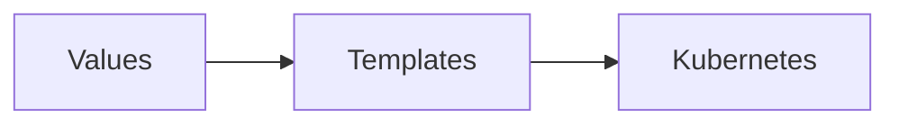
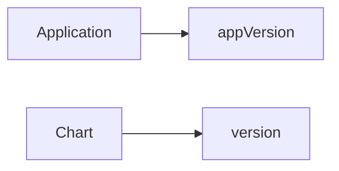
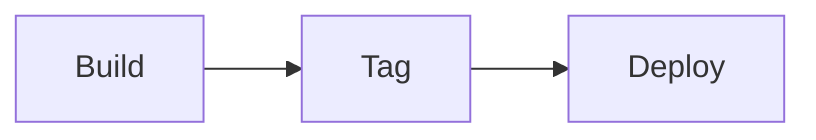
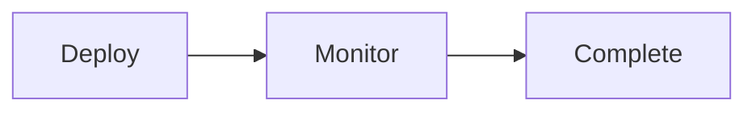
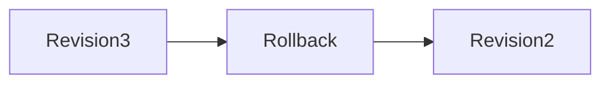
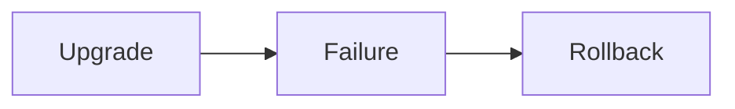

# Production Deployments

## Overview

Production Deployments in Helm involve deploying Kubernetes applications safely, consistently, and with minimal downtime. Helm simplifies production deployments through versioned releases, environment-specific configurations, automated upgrades, and rollback capabilities.

A production-ready Helm deployment should ensure:

- High availability
- Repeatable deployments
- Configuration consistency
- Safe upgrades
- Quick recovery from failures
- Minimal downtime

> **Interview Tip**
>
> Helm itself is **not a deployment strategy**. It provides the tools to implement strategies such as Rolling Updates, Blue-Green, and Canary deployments using Kubernetes resources.

---

## Why It Is Used

Production deployments help to:

- Deploy applications safely
- Reduce deployment failures
- Maintain application availability
- Support multiple environments
- Automate upgrades
- Simplify rollbacks
- Improve release reliability

---

## Architecture / Working

```mermaid
flowchart LR

Developer
      │
      ▼
Git Repository
      │
      ▼
CI/CD Pipeline
      │
      ▼
Helm Chart
      │
      ▼
Environment Values
      │
      ▼
Kubernetes Cluster
      │
      ▼
Application Release
```

### Working Process

1. Application code is committed.
2. CI pipeline builds and tests the application.
3. Docker image is pushed.
4. Helm Chart is updated.
5. Environment-specific values are applied.
6. Helm upgrades the release.
7. Kubernetes performs a rolling update.
8. If deployment fails, Helm rolls back.

---

## Key Components

| Component | Purpose |
|-----------|----------|
| Helm Chart | Packages application |
| Release | Running deployment |
| Values Files | Environment configuration |
| Kubernetes Deployment | Rolling updates |
| Docker Image | Application artifact |
| Release History | Rollback support |

---

## Types (if applicable)

| Deployment Type | Purpose |
|-----------------|----------|
| Development | Testing features |
| Staging | Pre-production validation |
| Production | Live environment |

---

## Lifecycle / Workflow

```mermaid
flowchart LR

Develop
      │
      ▼
Build
      │
      ▼
Test
      │
      ▼
Package
      │
      ▼
Deploy
      │
      ▼
Upgrade
      │
      ▼
Monitor
      │
      ▼
Rollback (If Needed)
```

---

## Configuration / Syntax (if applicable)

Deploy

```bash
helm upgrade --install myapp ./chart
```

Production values

```bash
helm upgrade --install myapp ./chart \
-f values-prod.yaml
```

Dry run

```bash
helm upgrade --dry-run
```

---

## Important Commands (if applicable)

```bash
helm install

helm upgrade

helm rollback

helm history

helm status

helm get values

helm lint

helm template

helm test
```

---

## Important Files (if applicable)

```
Chart.yaml

values.yaml

values-dev.yaml

values-stage.yaml

values-prod.yaml

templates/

Chart.lock
```

---

## Real-World Use Cases

- Production Kubernetes deployments
- Enterprise application releases
- Multi-environment deployments
- Zero-downtime upgrades
- Automated rollback
- CI/CD pipelines

---

## Advantages

- Repeatable deployments
- Easy rollback
- Version-controlled releases
- Environment isolation
- Supports CI/CD automation
- Reduces deployment risk

---

## Limitations

- Requires Kubernetes knowledge
- Incorrect values can affect production
- Helm cannot prevent application bugs
- Poor chart design affects deployment quality

---

## Common Interview Questions (Concept Only)

- Why use Helm in production?
- How are production deployments managed?
- What is `helm upgrade --install`?
- How do you perform production rollbacks?
- Why separate environment values?
- How does Helm support zero downtime?
- How is release history maintained?
- Difference between chart version and application version?
- Which deployment strategy is most common?
- How do you validate a production deployment?

---

## Common Mistakes

- Using `latest` Docker images
- Hardcoding production values
- Deploying without testing
- Skipping rollback planning
- Using identical values for all environments
- Ignoring release history

---

## Troubleshooting

| Problem | Cause | Solution |
|----------|-------|----------|
| Deployment failed | Invalid chart | Run `helm lint` |
| Wrong configuration | Incorrect values file | Validate environment values |
| Application unavailable | Failed rollout | Check Deployment events |
| Rollback unavailable | Missing history | Use `helm history` |
| Incorrect image | Wrong tag | Verify image version |
| Upgrade stuck | Kubernetes issue | Inspect Pods and Events |

---

## Summary

Production deployments with Helm provide reliable, version-controlled, automated Kubernetes application management through configuration management, environment isolation, rolling upgrades, and rollback capabilities.

> **Interview Tip**
>
> A typical production deployment command is:

```bash
helm upgrade --install myapp ./chart -f values-prod.yaml
```

---

# Environment-Specific Values

## Overview

Environment-specific values allow the same Helm Chart to be deployed across different environments using different configuration files.

Typical environments include:

- Development
- Testing
- Staging
- Production

Instead of modifying templates, configuration differences are stored in separate values files.

---

## Why It Is Used

- Separate configurations
- Reuse the same chart
- Environment isolation
- Easier maintenance

---

## Architecture / Working

```mermaid
flowchart LR

Helm Chart
      │
      ├── values-dev.yaml
      ├── values-stage.yaml
      └── values-prod.yaml
              │
              ▼
      Kubernetes Cluster
```

---

## Key Components

- values.yaml
- values-dev.yaml
- values-stage.yaml
- values-prod.yaml

---

## Types (if applicable)

| Environment | Purpose |
|-------------|----------|
| Development | Feature testing |
| Staging | Production validation |
| Production | Live application |

---

## Lifecycle / Workflow

```mermaid
flowchart LR

Chart --> Select Values File --> Deploy
```

---

## Configuration / Syntax (if applicable)

```bash
helm upgrade \
-f values-prod.yaml
```

---

## Important Commands (if applicable)

```bash
helm install

helm upgrade
```

---

## Important Files (if applicable)

```
values.yaml

values-dev.yaml

values-stage.yaml

values-prod.yaml
```

---

## Real-World Use Cases

- Different replica counts
- Environment URLs
- Database endpoints

---

## Advantages

- Reusable charts
- Cleaner configuration

---

## Limitations

- Multiple files to manage

---

## Common Interview Questions (Concept Only)

- Why use multiple values files?

---

## Common Mistakes

- Editing templates for each environment

---

## Troubleshooting

Verify selected values file.

---

## Summary

Environment-specific values enable reusable Helm Charts across multiple environments.

---

# Configuration Management

## Overview

Configuration Management in Helm separates application configuration from application templates using values files.

---

## Why It Is Used

- Flexible deployments
- Easier maintenance
- Environment customization

---

## Architecture / Working



---

## Key Components

- Values
- Templates

---

## Types (if applicable)

Declarative configuration

---

## Lifecycle / Workflow

```mermaid
flowchart LR

Update Values --> Deploy
```

---

## Configuration / Syntax (if applicable)

```yaml
replicaCount: 3
```

---

## Important Commands (if applicable)

```bash
helm get values
```

---

## Important Files (if applicable)

```
values.yaml
```

---

## Real-World Use Cases

- Image tags
- Resource limits
- Hostnames

---

## Advantages

- Configuration reuse

---

## Limitations

- Incorrect values cause deployment failures

---

## Common Interview Questions (Concept Only)

- What is values.yaml?

---

## Common Mistakes

- Hardcoding values

---

## Troubleshooting

Validate rendered manifests.

---

## Summary

Configuration Management separates deployment configuration from application templates.

---

# Application Versioning

## Overview

Application Versioning tracks the version of the deployed application independently from the Helm Chart version.

Helm maintains two different versions:

- Chart Version
- Application Version

---

## Why It Is Used

- Track releases
- Upgrade applications
- Maintain release history

---

## Architecture / Working



---

## Key Components

| Field | Purpose |
|---------|----------|
| version | Helm Chart version |
| appVersion | Application version |

---

## Types (if applicable)

Semantic Versioning

---

## Lifecycle / Workflow



---

## Configuration / Syntax (if applicable)

```yaml
version: 2.1.0

appVersion: "5.3.1"
```

---

## Important Commands (if applicable)

```bash
helm show chart
```

---

## Important Files (if applicable)

```
Chart.yaml
```

---

## Real-World Use Cases

- Release tracking

---

## Advantages

- Clear version management

---

## Limitations

- Requires manual updates

---

## Common Interview Questions (Concept Only)

- Difference between version and appVersion?

---

## Common Mistakes

- Updating only one version

---

## Troubleshooting

Review Chart.yaml.

---

## Summary

Application Versioning separates application releases from chart releases.

---

# Release Strategies

## Overview

Release Strategies define how new application versions are introduced into production while minimizing downtime and risk.

Helm works with Kubernetes deployment strategies.

---

## Why It Is Used

- Reduce deployment risk
- Improve availability
- Support gradual rollouts

---

## Architecture / Working

```mermaid
flowchart LR

Old Version --> Rolling Update --> New Version
```

---

## Key Components

- Deployment
- ReplicaSet
- Pods

---

## Types (if applicable)

| Strategy | Description |
|-----------|-------------|
| Rolling Update | Replace Pods gradually |
| Blue-Green | Two production environments |
| Canary | Small percentage rollout |
| Recreate | Stop old before new |

---

## Lifecycle / Workflow



---

## Configuration / Syntax (if applicable)

Deployment strategy is configured in Kubernetes manifests.

---

## Important Commands (if applicable)

```bash
helm upgrade
```

---

## Important Files (if applicable)

```
deployment.yaml
```

---

## Real-World Use Cases

- Production upgrades

---

## Advantages

- Reduced downtime

---

## Limitations

- Some strategies require additional infrastructure

---

## Common Interview Questions (Concept Only)

- Which deployment strategy is default?

---

## Common Mistakes

- Choosing incorrect strategy

---

## Troubleshooting

Inspect Deployment rollout.

---

## Summary

Helm supports Kubernetes deployment strategies for safer releases.

---

# Rollback Strategy

## Overview

Rollback Strategy restores a previous working release if an upgrade fails.

Helm maintains release history, making rollbacks straightforward.

---

## Why It Is Used

- Recover failed deployments
- Minimize downtime

---

## Architecture / Working



---

## Key Components

- Revision
- Release History

---

## Types (if applicable)

Automatic or manual rollback

---

## Lifecycle / Workflow



---

## Configuration / Syntax (if applicable)

```bash
helm rollback myapp 2
```

---

## Important Commands (if applicable)

```bash
helm rollback

helm history
```

---

## Important Files (if applicable)

Release metadata

---

## Real-World Use Cases

- Production recovery

---

## Advantages

- Fast recovery

---

## Limitations

- Cannot fix application bugs automatically

---

## Common Interview Questions (Concept Only)

- How does Helm rollback work?

---

## Common Mistakes

- Rolling back incorrect revision

---

## Troubleshooting

Check release history.

---

## Summary

Rollback quickly restores previous stable releases.

---

# Zero-Downtime Upgrades

## Overview

Zero-Downtime Upgrades update applications while keeping them available to users.

Helm relies on Kubernetes Rolling Updates to achieve this.

---

## Why It Is Used

- Maintain application availability
- Avoid service interruption

---

## Architecture / Working

```mermaid
flowchart LR

Old Pods --> New Pods --> Remove Old Pods
```

---

## Key Components

- Rolling Update
- Readiness Probe
- ReplicaSet

---

## Types (if applicable)

Rolling Update

---

## Lifecycle / Workflow

```mermaid
flowchart LR

New Pod Ready --> Remove Old Pod
```

---

## Configuration / Syntax (if applicable)

Helm upgrades Kubernetes Deployments that use RollingUpdate strategy.

---

## Important Commands (if applicable)

```bash
helm upgrade
```

---

## Important Files (if applicable)

```
deployment.yaml
```

---

## Real-World Use Cases

- SaaS applications
- Enterprise services

---

## Advantages

- High availability
- Minimal downtime

---

## Limitations

- Requires multiple replicas
- Poor readiness probes can still cause downtime

---

## Common Interview Questions (Concept Only)

- How does Helm achieve zero downtime?
- Does Helm perform rolling updates?

---

## Common Mistakes

- Deploying with one replica
- Missing readiness probes

---

## Troubleshooting

Verify Deployment rollout status and readiness probes.

---

## Summary

Zero-downtime upgrades are achieved by combining Helm upgrades with Kubernetes RollingUpdate deployments and properly configured readiness and liveness probes.

---

# Interview Quick Revision

## Production Deployment Workflow

```text
Developer Commit
        ↓
CI/CD Pipeline
        ↓
Build Docker Image
        ↓
Push Image
        ↓
helm lint
        ↓
helm template
        ↓
helm upgrade --install
        ↓
Rolling Update
        ↓
Monitor Health
        ↓
Rollback (If Required)
```

---

## Environment Values

| File | Purpose |
|------|---------|
| `values.yaml` | Default configuration |
| `values-dev.yaml` | Development |
| `values-stage.yaml` | Staging |
| `values-prod.yaml` | Production |

---

## Chart Version vs Application Version

| Chart Version | Application Version |
|---------------|---------------------|
| Helm package version | Deployed application version |
| `version` field | `appVersion` field |
| Used by Helm for chart lifecycle | Informational metadata |

---

## Common Release Strategies

| Strategy | Downtime | Use Case |
|----------|----------|----------|
| Rolling Update | Minimal | Default Kubernetes deployment |
| Blue-Green | None (with traffic switch) | Critical production releases |
| Canary | Minimal | Gradual rollout and testing |
| Recreate | Yes | Applications that cannot run multiple versions simultaneously |

---

## Frequently Used Production Commands

| Command | Purpose |
|----------|---------|
| `helm upgrade --install` | Install or upgrade release |
| `helm rollback` | Restore previous revision |
| `helm history` | View release revisions |
| `helm status` | Check deployment status |
| `helm get values` | Display active configuration |
| `helm lint` | Validate chart |
| `helm template` | Render manifests locally |
| `helm test` | Execute post-deployment tests |

---

## Production Best Practices

- Use separate values files for each environment (development, staging, production).
- Always validate charts with `helm lint` and `helm template` before deploying.
- Use immutable Docker image tags instead of `latest`.
- Maintain separate chart and application versions in `Chart.yaml`.
- Use `helm upgrade --install` for idempotent deployments.
- Configure Kubernetes readiness and liveness probes to support zero-downtime upgrades.
- Keep at least two replicas in production to enable rolling updates without service interruption.
- Monitor deployment health after upgrades and maintain rollback procedures using `helm history` and `helm rollback`.

---

## One-line Interview Answer

**Helm enables production-ready Kubernetes deployments by combining environment-specific configuration, version-controlled releases, automated upgrades, Kubernetes deployment strategies, and built-in rollback capabilities to deliver reliable, repeatable, and minimal-downtime application releases.**
