# Production Deployments

## Overview

Production deployments with Helm focus on delivering applications to Kubernetes in a **safe, repeatable, and reliable** manner. Helm simplifies deployment management by using reusable charts, environment-specific configurations, release versioning, and rollback capabilities.

A production deployment should ensure:

- High availability
- Minimal downtime
- Easy rollback
- Consistent configuration
- Version-controlled releases
- Automated deployment through CI/CD or GitOps

> **Interview Tip**
>
> Production deployments should always be **automated, repeatable, and version-controlled**.

---

## Why It Is Used

Production deployment practices help organizations:

- Reduce deployment failures
- Maintain application availability
- Simplify upgrades
- Standardize deployments
- Support disaster recovery
- Enable quick rollbacks
- Improve release confidence

---

## Architecture / Working

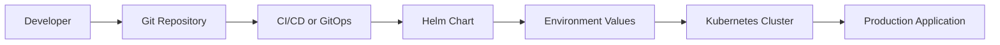

---

## Key Components

| Component | Purpose |
|-----------|----------|
| Helm Chart | Application package |
| values.yaml | Default configuration |
| Environment Values | Environment-specific configuration |
| Kubernetes Cluster | Production runtime |
| CI/CD Pipeline | Automated deployment |
| Git Repository | Source of truth |
| Release History | Deployment tracking |

---

## Types (if applicable)

| Deployment Type | Description |
|-----------------|-------------|
| Development | Testing new features |
| Staging | Production-like validation |
| Production | Live application deployment |

---

## Lifecycle / Workflow

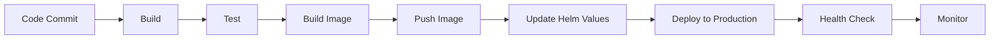

---

## Configuration / Syntax (if applicable)

Deploy using production values:

```bash
helm upgrade --install myapp ./chart \
-f values-prod.yaml
```

Preview deployment:

```bash
helm upgrade --install myapp ./chart \
-f values-prod.yaml \
--dry-run \
--debug
```

---

## Important Commands (if applicable)

```bash
helm install

helm upgrade

helm rollback

helm history

helm status

helm lint

helm template

helm test
```

---

## Important Files (if applicable)

```
Chart.yaml

values.yaml

values-dev.yaml

values-stage.yaml

values-prod.yaml

templates/

Chart.lock
```

---

## Real-World Use Cases

- Enterprise Kubernetes deployments
- Multi-environment deployments
- SaaS applications
- Banking applications
- E-commerce platforms
- Production AKS/EKS/GKE deployments

---

## Advantages

- Consistent deployments
- Easy rollback
- Version-controlled releases
- Environment-specific configuration
- Supports automation
- Simplifies upgrades

---

## Limitations

- Incorrect values can impact production
- Helm cannot detect application-level issues
- Requires Kubernetes knowledge
- Configuration management becomes complex for large applications

---

## Common Interview Questions (Concept Only)

- Why is Helm suitable for production deployments?
- What makes a deployment production-ready?
- How do you deploy to multiple environments?
- Why should production deployments be automated?
- What is the role of values files?
- How do you validate a Helm deployment before production?

---

## Common Mistakes

- Deploying directly without testing
- Using the `latest` image tag
- Hardcoding production configuration
- Skipping `helm lint`
- Ignoring release history
- Not testing rollback

---

## Troubleshooting

| Problem | Cause | Solution |
|----------|-------|----------|
| Deployment failed | Invalid chart | Run `helm lint` |
| Application unavailable | Wrong configuration | Verify values files |
| Upgrade failed | Invalid manifests | Run `helm template` |
| Rollback failed | Missing release history | Check `helm history` |
| Pods failing | Application issue | Inspect pod logs and events |

---

## Summary

Production deployments with Helm provide reliable, automated, and version-controlled application releases while supporting upgrades, rollbacks, and environment-specific configurations.

---

# Environment-Specific Values

## Overview

Different environments require different configurations. Helm supports this using **multiple values files**, allowing the same chart to be deployed with environment-specific settings.

Typical environments:

- Development
- Testing
- Staging
- Production

---

## Why It Is Used

- Avoid duplicate charts
- Customize deployments
- Separate environment configuration
- Improve maintainability

---

## Architecture / Working

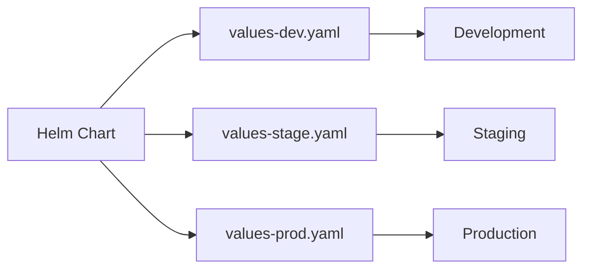

---

## Key Components

| Component | Purpose |
|-----------|----------|
| values.yaml | Default values |
| values-dev.yaml | Development configuration |
| values-stage.yaml | Staging configuration |
| values-prod.yaml | Production configuration |

---

## Types (if applicable)

| File | Environment |
|------|-------------|
| values-dev.yaml | Development |
| values-stage.yaml | Staging |
| values-prod.yaml | Production |

---

## Lifecycle / Workflow

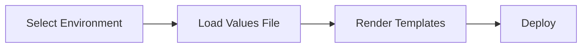

---

## Configuration / Syntax (if applicable)

```bash
helm upgrade --install myapp ./chart \
-f values-prod.yaml
```

---

## Important Commands (if applicable)

```bash
helm install

helm upgrade
```

---

## Important Files (if applicable)

```
values.yaml

values-dev.yaml

values-stage.yaml

values-prod.yaml
```

---

## Real-World Use Cases

- Different replica counts
- Different database endpoints
- Different resource limits
- Different image tags

---

## Advantages

- Reusable charts
- Easy configuration management
- Environment isolation

---

## Limitations

- Multiple values files require maintenance

---

## Common Interview Questions (Concept Only)

- Why use multiple values files?
- Which values file overrides another?

---

## Common Mistakes

- Editing the wrong environment file
- Duplicating configuration

---

## Troubleshooting

Verify the correct values file is supplied during deployment.

---

## Summary

Environment-specific values allow one Helm chart to support multiple deployment environments.

---

# Configuration Management

## Overview

Configuration management separates application configuration from application code.

Helm manages configuration using values files and templates.

---

## Why It Is Used

- Centralized configuration
- Easy updates
- Environment customization
- Better maintainability

---

## Architecture / Working

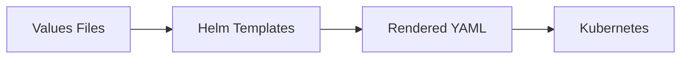

---

## Key Components

| Component | Purpose |
|-----------|----------|
| values.yaml | Configuration |
| Templates | Resource generation |
| ConfigMaps | Non-sensitive configuration |
| Secrets | Sensitive configuration |

---

## Types (if applicable)

- Static configuration
- Dynamic configuration

---

## Lifecycle / Workflow

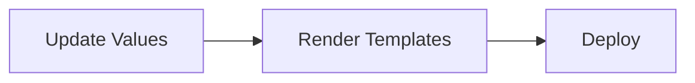

---

## Configuration / Syntax (if applicable)

Configuration values are referenced in templates.

---

## Important Commands (if applicable)

```bash
helm template

helm upgrade
```

---

## Important Files (if applicable)

```
values.yaml

templates/
```

---

## Real-World Use Cases

- Database configuration
- Resource limits
- Feature flags

---

## Advantages

- Centralized configuration
- Easy maintenance

---

## Limitations

- Complex applications require many values

---

## Common Interview Questions (Concept Only)

- How does Helm manage configuration?
- Why separate configuration from code?

---

## Common Mistakes

- Hardcoding values

---

## Troubleshooting

Validate rendered manifests before deployment.

---

## Summary

Helm simplifies configuration management through reusable templates and values files.

---

# Application Versioning

## Overview

Application versioning tracks both the Helm chart version and the application version.

> **Interview Tip**
>
> Helm tracks **Chart Version** and **Application Version** separately.

---

## Why It Is Used

- Trace releases
- Rollback easily
- Maintain compatibility

---

## Architecture / Working

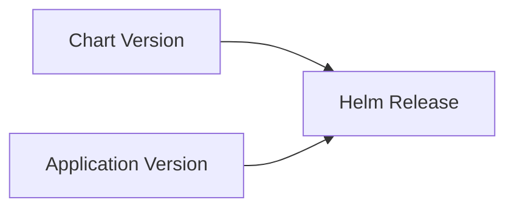

---

## Key Components

| Component | Purpose |
|-----------|----------|
| version | Helm chart version |
| appVersion | Application version |

---

## Types (if applicable)

- Chart Version
- Application Version

---

## Lifecycle / Workflow


---

## Configuration / Syntax (if applicable)

Defined in:

```
Chart.yaml
```

---

## Important Commands (if applicable)

```bash
helm package

helm history
```

---

## Important Files (if applicable)

```
Chart.yaml
```

---

## Real-World Use Cases

- Production releases
- Release auditing

---

## Advantages

- Easy tracking
- Better rollback

---

## Limitations

- Requires version discipline

---

## Common Interview Questions (Concept Only)

- Difference between version and appVersion?
- Why maintain chart versions?

---

## Common Mistakes

- Updating only one version

---

## Troubleshooting

Verify release history.

---

## Summary

Helm separates application and chart versions for better release management.

---

# Release Strategies

## Overview

Release strategies define how application updates are delivered with minimal risk.

Common strategies include:

- Rolling Update
- Blue-Green Deployment
- Canary Deployment

Helm supports these strategies through Kubernetes manifests.

---

## Why It Is Used

- Reduce deployment risk
- Improve availability
- Enable safer upgrades

---

## Architecture / Working

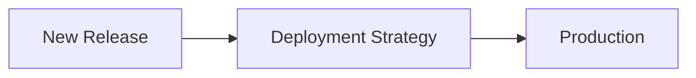

---

## Key Components

- Deployment
- Service
- Helm
- Kubernetes

---

## Types (if applicable)

| Strategy | Description |
|----------|-------------|
| Rolling Update | Replace pods gradually |
| Blue-Green | Two production environments |
| Canary | Deploy to small percentage of users |

---

## Lifecycle / Workflow

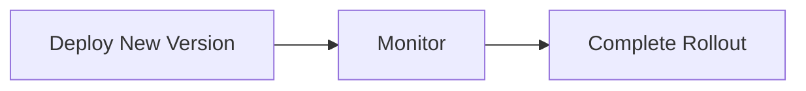

---

## Configuration / Syntax (if applicable)

Configured in Kubernetes Deployment resources.

---

## Important Commands (if applicable)

```bash
helm upgrade
```

---

## Important Files (if applicable)

```
templates/deployment.yaml
```

---

## Real-World Use Cases

- Zero-downtime upgrades
- Enterprise releases

---

## Advantages

- Reduced downtime
- Safer deployments

---

## Limitations

- Requires Kubernetes support

---

## Common Interview Questions (Concept Only)

- What is a rolling update?
- Difference between Blue-Green and Canary?

---

## Common Mistakes

- Large production updates without testing

---

## Troubleshooting

Monitor rollout status and pod health.

---

## Summary

Helm supports modern Kubernetes deployment strategies through declarative manifests.

---

# Rollback Strategy

## Overview

Rollback restores a previous working release when a deployment fails.

Helm maintains release history, enabling quick recovery.

---

## Why It Is Used

- Recover from failed deployments
- Reduce downtime
- Improve reliability

---

## Architecture / Working

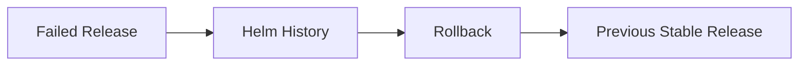

---

## Key Components

- Release history
- Rollback command
- Kubernetes resources

---

## Types (if applicable)

- Manual rollback
- Automated rollback

---

## Lifecycle / Workflow

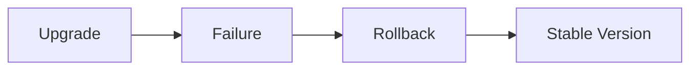

---

## Configuration / Syntax (if applicable)

```bash
helm rollback myapp 2
```

---

## Important Commands (if applicable)

```bash
helm rollback

helm history

helm status
```

---

## Important Files (if applicable)

No dedicated files.

---

## Real-World Use Cases

- Failed upgrades
- Emergency recovery

---

## Advantages

- Fast recovery
- Minimal downtime

---

## Limitations

- Previous release must exist

---

## Common Interview Questions (Concept Only)

- How does Helm rollback work?
- Where is release history stored?

---

## Common Mistakes

- Not testing rollback

---

## Troubleshooting

Check release history before rollback.

---

## Summary

Rollback is one of Helm's most valuable production features for recovering from failed deployments.

---

# Zero-Downtime Upgrades

## Overview

Zero-downtime upgrades allow applications to be updated without interrupting user access.

Helm relies on Kubernetes rolling updates to achieve this.

---

## Why It Is Used

- Maintain availability
- Improve user experience
- Continuous deployment

---

## Architecture / Working

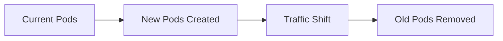

---

## Key Components

- Deployment
- Readiness Probe
- Liveness Probe
- Rolling Update

---

## Types (if applicable)

- Rolling Update
- Blue-Green
- Canary

---

## Lifecycle / Workflow

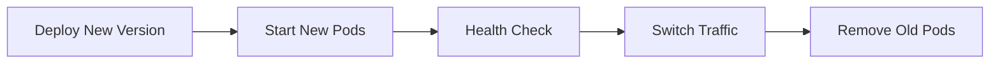

---

## Configuration / Syntax (if applicable)

Configured within the Kubernetes Deployment manifest.

---

## Important Commands (if applicable)

```bash
helm upgrade

kubectl rollout status
```

---

## Important Files (if applicable)

```
templates/deployment.yaml
```

---

## Real-World Use Cases

- Banking applications
- SaaS platforms
- E-commerce systems

---

## Advantages

- No service interruption
- Improved reliability
- Better customer experience

---

## Limitations

- Requires multiple replicas
- Application must support rolling updates

---

## Common Interview Questions (Concept Only)

- How does Helm achieve zero-downtime upgrades?
- What Kubernetes features enable rolling updates?
- Why are readiness probes important?

---

## Common Mistakes

- Single replica deployments
- Missing readiness probes
- Using mutable image tags

---

## Troubleshooting

| Problem | Cause | Solution |
|----------|-------|----------|
| Downtime during upgrade | Single replica | Increase replica count |
| Traffic sent to unhealthy pods | Missing readiness probe | Configure readiness probe |
| Upgrade stalls | Failed pod startup | Check pod logs and rollout status |
| Old pods not terminated | Rolling update configuration | Verify Deployment strategy |

---

## Summary

Zero-downtime upgrades are achieved by combining Helm with Kubernetes rolling update strategies, readiness probes, and multiple application replicas.

---

# Interview Quick Revision

## Production Deployment Workflow

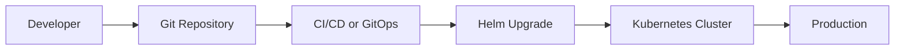

---

## Environment Values

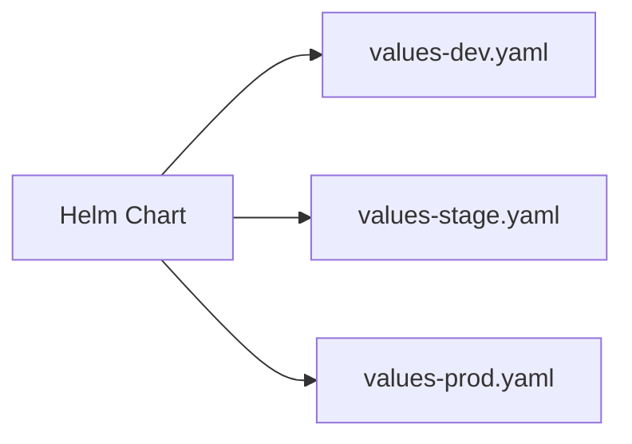

---

## Rollback Workflow

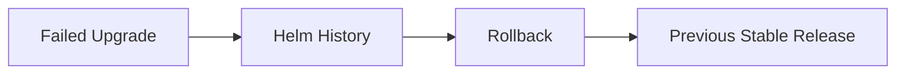

---

## Release Strategy Comparison

| Strategy | Downtime | Risk | Common Usage |
|----------|----------|------|--------------|
| Rolling Update | None | Low | Default Kubernetes deployment |
| Blue-Green | Minimal | Very Low | Critical production applications |
| Canary | None | Very Low | Progressive releases |

---

## Production Best Practices

- Use separate values files for each environment.
- Never use the `latest` image tag in production.
- Validate charts with `helm lint` before deployment.
- Preview manifests using `helm template` or `--dry-run`.
- Store configuration separately from application code.
- Maintain chart and application versions independently.
- Test rollback procedures regularly.
- Use readiness and liveness probes for safe upgrades.
- Deploy through CI/CD or GitOps instead of manually.
- Monitor deployment health after every release.

---

## One-line Interview Answer

**Production deployments with Helm use version-controlled charts, environment-specific values, automated CI/CD or GitOps pipelines, Kubernetes rolling updates, and built-in rollback capabilities to deliver reliable, repeatable, and zero-downtime application releases.**
