# Best Practices

## Overview

Helm best practices are a collection of recommended guidelines for creating, managing, and deploying Helm charts in production Kubernetes environments.

Following these practices improves:

- Maintainability
- Reusability
- Security
- Scalability
- Deployment reliability
- Team collaboration

> **Interview Tip**
>
> A well-designed Helm chart should be **modular, reusable, version-controlled, secure, and environment-independent.**

---

## Why It Is Used

Helm best practices help teams:

- Standardize deployments
- Reduce deployment failures
- Improve chart maintainability
- Support multiple environments
- Simplify upgrades and rollbacks
- Enhance security
- Enable CI/CD and GitOps workflows

---

## Architecture / Working

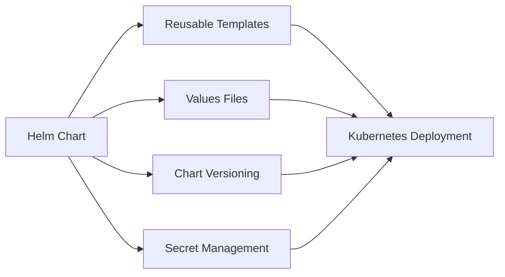

---

## Key Components

| Component | Purpose |
|-----------|----------|
| Chart Organization | Maintainable project structure |
| Naming Conventions | Consistent resource naming |
| Values Files | Environment-specific configuration |
| Templates | Reusable Kubernetes manifests |
| Versioning | Track chart and application releases |
| Secret Management | Secure sensitive information |

---

## Types (if applicable)

| Practice | Purpose |
|----------|---------|
| Chart Organization | Maintainability |
| Naming Convention | Consistency |
| Configuration Management | Environment separation |
| Versioning | Release management |
| Secret Handling | Security |

---

## Lifecycle / Workflow

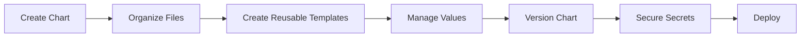

---

## Configuration / Syntax (if applicable)

Typical production deployment

```bash
helm upgrade --install myapp ./chart \
-f values-prod.yaml
```

---

## Important Commands (if applicable)

```bash
helm lint

helm template

helm package

helm dependency update

helm upgrade

helm rollback
```

---

## Important Files (if applicable)

```
Chart.yaml

values.yaml

values-dev.yaml

values-stage.yaml

values-prod.yaml

templates/

templates/_helpers.tpl

charts/

.helmignore

Chart.lock

README.md
```

---

## Real-World Use Cases

- Enterprise Kubernetes deployments
- Multi-team platform engineering
- CI/CD pipelines
- GitOps deployments
- SaaS platforms
- Production microservices

---

## Advantages

- Easier maintenance
- Improved consistency
- Better collaboration
- Secure deployments
- Reusable charts
- Simplified upgrades
- Cleaner Git repositories

---

## Limitations

- Requires disciplined development practices
- More planning during chart creation
- Large projects require good organization

---

## Common Interview Questions (Concept Only)

- What are Helm best practices?
- Why separate configuration from templates?
- Why should Helm charts be reusable?
- Why maintain chart versions?
- How should secrets be managed?
- Why avoid hardcoding values?
- What should be stored in values.yaml?
- Why use helper templates?

---

## Common Mistakes

- Hardcoding values
- Storing secrets in Git
- Using the `latest` image tag
- Creating duplicate templates
- Ignoring version updates
- Poor chart structure
- Not validating charts before deployment

---

## Troubleshooting

| Problem | Cause | Solution |
|----------|-------|----------|
| Duplicate templates | Repeated code | Use helper templates |
| Wrong environment configuration | Incorrect values file | Verify deployment values |
| Version confusion | Poor versioning | Maintain semantic versioning |
| Secret exposure | Secrets stored in Git | Use Kubernetes Secrets or external secret managers |
| Deployment inconsistency | Hardcoded values | Use values files |

---

## Summary

Following Helm best practices ensures charts are reusable, maintainable, secure, and production-ready while supporting CI/CD and GitOps workflows.

---

# Chart Organization

## Overview

A well-organized Helm chart is easier to maintain, troubleshoot, and reuse.

A standard Helm chart structure should separate:

- Metadata
- Configuration
- Templates
- Dependencies
- Documentation

---

## Why It Is Used

- Improve readability
- Simplify maintenance
- Enable collaboration
- Reduce deployment errors

---

## Architecture / Working

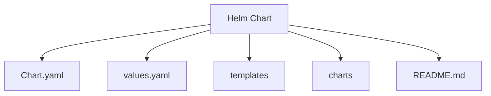

---

## Key Components

| Directory/File | Purpose |
|----------------|----------|
| Chart.yaml | Chart metadata |
| values.yaml | Default configuration |
| templates/ | Kubernetes templates |
| charts/ | Dependencies |
| README.md | Documentation |

---

## Types (if applicable)

- Standard chart layout

---

## Lifecycle / Workflow

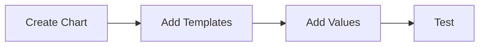

---

## Configuration / Syntax (if applicable)

Use:

```bash
helm create mychart
```

---

## Important Commands (if applicable)

```bash
helm create
```

---

## Important Files (if applicable)

```
Chart.yaml

values.yaml

templates/

charts/
```

---

## Real-World Use Cases

- Enterprise chart repositories
- Shared platform charts

---

## Advantages

- Easy maintenance
- Standard structure

---

## Limitations

- Requires consistent organization

---

## Common Interview Questions (Concept Only)

- What is the recommended Helm chart structure?
- Why separate templates from configuration?

---

## Common Mistakes

- Storing configuration inside templates

---

## Troubleshooting

Validate chart structure before packaging.

---

## Summary

Organized charts simplify long-term maintenance and collaboration.

---

# Naming Conventions

## Overview

Consistent naming improves readability and prevents Kubernetes resource conflicts.

---

## Why It Is Used

- Standardization
- Easier troubleshooting
- Predictable deployments

---

## Architecture / Working

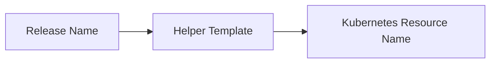

---

## Key Components

| Component | Purpose |
|-----------|----------|
| Release Name | Unique deployment |
| Helper Templates | Standardized names |
| Labels | Resource identification |

---

## Types (if applicable)

- Release names
- Resource names
- Labels

---

## Lifecycle / Workflow


---

## Configuration / Syntax (if applicable)

Use helper templates instead of hardcoded names.

---

## Important Commands (if applicable)

Not applicable.

---

## Important Files (if applicable)

```
templates/_helpers.tpl
```

---

## Real-World Use Cases

- Shared clusters
- Multi-team deployments

---

## Advantages

- Prevents naming conflicts
- Improves consistency

---

## Limitations

- Requires planning

---

## Common Interview Questions (Concept Only)

- Why use helper templates for naming?

---

## Common Mistakes

- Hardcoded resource names

---

## Troubleshooting

Verify rendered resource names.

---

## Summary

Consistent naming improves maintainability and avoids deployment conflicts.

---

# Values File Management

## Overview

Values files separate configuration from templates, enabling environment-specific deployments.

---

## Why It Is Used

- Configuration reuse
- Environment separation
- Easy customization

---

## Architecture / Working

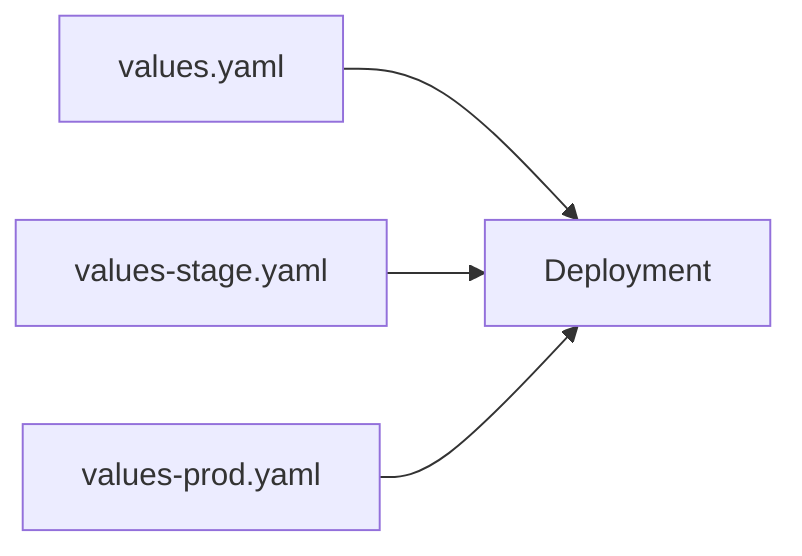

---

## Key Components

| File | Purpose |
|------|----------|
| values.yaml | Default values |
| values-dev.yaml | Development |
| values-stage.yaml | Staging |
| values-prod.yaml | Production |

---

## Types (if applicable)

- Default values
- Environment values

---

## Lifecycle / Workflow


---

## Configuration / Syntax (if applicable)

```bash
helm install myapp ./chart -f values-prod.yaml
```

---

## Important Commands (if applicable)

```bash
helm install

helm upgrade
```

---

## Important Files (if applicable)

```
values.yaml

values-dev.yaml

values-stage.yaml

values-prod.yaml
```

---

## Real-World Use Cases

- Multi-environment deployments

---

## Advantages

- Flexible configuration

---

## Limitations

- Multiple files require maintenance

---

## Common Interview Questions (Concept Only)

- Why use multiple values files?

---

## Common Mistakes

- Editing the wrong environment file

---

## Troubleshooting

Verify selected values file.

---

## Summary

Separate values files simplify environment management.

---

# Reusable Templates

## Overview

Reusable templates eliminate duplicate code by defining common template logic in helper files.

---

## Why It Is Used

- Reduce duplication
- Improve consistency
- Simplify maintenance

---

## Architecture / Working

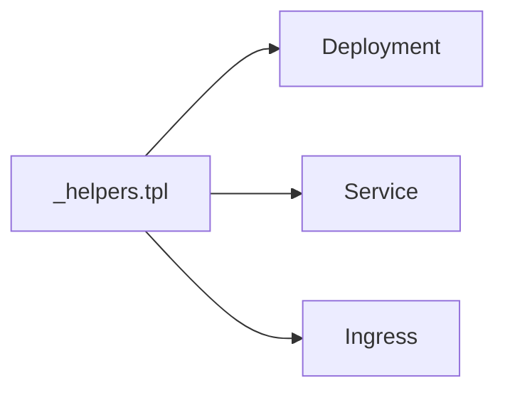

---

## Key Components

| Component | Purpose |
|-----------|----------|
| Helper Template | Shared logic |
| Include Function | Reuse template |

---

## Types (if applicable)

- Named templates
- Helper templates

---

## Lifecycle / Workflow

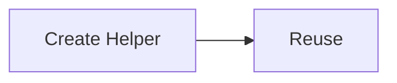

---

## Configuration / Syntax (if applicable)

Reusable helper templates are stored in:

```
templates/_helpers.tpl
```

---

## Important Commands (if applicable)

```bash
helm template
```

---

## Important Files (if applicable)

```
templates/_helpers.tpl
```

---

## Real-World Use Cases

- Labels
- Names
- Common metadata

---

## Advantages

- Less duplication
- Easier maintenance

---

## Limitations

- Large helper files become difficult to manage

---

## Common Interview Questions (Concept Only)

- Why use helper templates?

---

## Common Mistakes

- Copying template code

---

## Troubleshooting

Render templates to verify helper output.

---

## Summary

Reusable templates improve consistency and reduce maintenance effort.

---

# Versioning Strategy

## Overview

Helm maintains separate versions for:

- Chart
- Application

Semantic Versioning (SemVer) is the recommended approach.

---

## Why It Is Used

- Release tracking
- Upgrade management
- Rollback support

---

## Architecture / Working

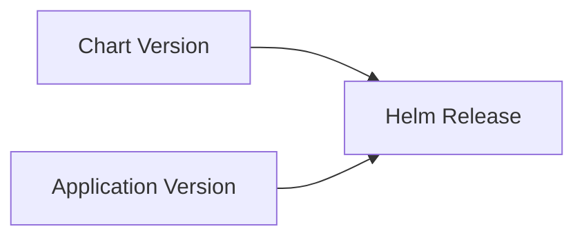

---

## Key Components

| Field | Purpose |
|-------|----------|
| version | Chart version |
| appVersion | Application version |

---

## Types (if applicable)

- Major
- Minor
- Patch

---

## Lifecycle / Workflow

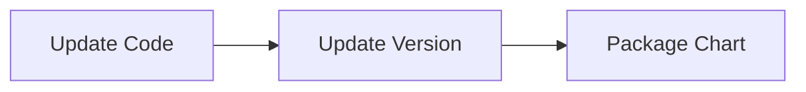

---

## Configuration / Syntax (if applicable)

Defined in:

```
Chart.yaml
```

---

## Important Commands (if applicable)

```bash
helm package
```

---

## Important Files (if applicable)

```
Chart.yaml
```

---

## Real-World Use Cases

- Enterprise release management

---

## Advantages

- Easy release tracking

---

## Limitations

- Requires version discipline

---

## Common Interview Questions (Concept Only)

- Difference between version and appVersion?

---

## Common Mistakes

- Forgetting to update versions

---

## Troubleshooting

Verify release history.

---

## Summary

Proper versioning simplifies upgrades, rollbacks, and release management.

---

# Secure Secret Handling

## Overview

Sensitive data should **never** be stored directly inside Helm charts or Git repositories.

Use Kubernetes Secrets or external secret management solutions instead.

> **Interview Tip**
>
> **Never commit passwords, API keys, or certificates to Git.**

---

## Why It Is Used

- Protect sensitive information
- Meet security compliance
- Reduce credential exposure

---

## Architecture / Working

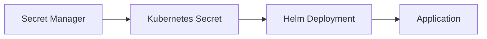

---

## Key Components

| Component | Purpose |
|-----------|----------|
| Kubernetes Secret | Store sensitive data |
| External Secret Manager | Centralized secret management |
| Helm Chart | Reference secrets |

---

## Types (if applicable)

- Kubernetes Secrets
- Azure Key Vault
- AWS Secrets Manager
- HashiCorp Vault

---

## Lifecycle / Workflow

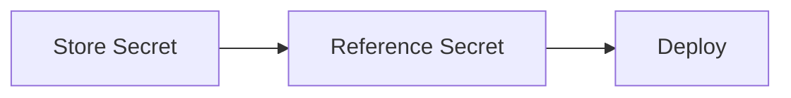

---

## Configuration / Syntax (if applicable)

Reference existing Kubernetes Secrets instead of embedding credentials in values files.

---

## Important Commands (if applicable)

```bash
kubectl create secret
```

---

## Important Files (if applicable)

```
templates/secret.yaml
```

---

## Real-World Use Cases

- Database passwords
- API keys
- TLS certificates
- Cloud credentials

---

## Advantages

- Improved security
- Centralized credential management
- Compliance support

---

## Limitations

- Additional infrastructure for external secret managers

---

## Common Interview Questions (Concept Only)

- Where should Helm secrets be stored?
- Why shouldn't secrets be committed to Git?
- What secret management solutions are commonly used?

---

## Common Mistakes

- Storing passwords in `values.yaml`
- Committing secrets to Git
- Sharing secret files

---

## Troubleshooting

Verify Secret existence, namespace, RBAC permissions, and application access.

---

## Summary

Secure secret handling is a critical production best practice. Store secrets outside Git, reference them securely in Helm charts, and use dedicated secret management solutions whenever possible.

---

# Interview Quick Revision

## Helm Best Practices Workflow

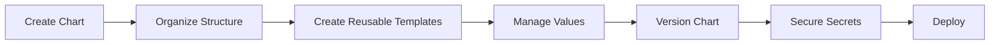

---

## Chart Organization


---

## Secret Management

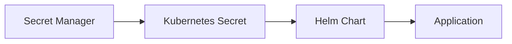

---

## Production Best Practices

- Organize charts using the standard Helm directory structure.
- Keep templates modular and reusable.
- Use helper templates for naming and labels.
- Store configuration in values files instead of templates.
- Maintain separate values files for each environment.
- Follow Semantic Versioning for chart and application versions.
- Never commit secrets to Git repositories.
- Validate charts with `helm lint` before deployment.
- Test rendered manifests using `helm template`.
- Automate deployments through CI/CD or GitOps pipelines.

---

## One-line Interview Answer

**Helm best practices focus on creating reusable, well-organized, version-controlled, and secure charts by separating configuration from templates, following consistent naming conventions, managing versions properly, and protecting sensitive data using Kubernetes Secrets or external secret management solutions.**
