# Advanced Helm Features

## Overview

Advanced Helm features help build **modular, reusable, and production-ready Kubernetes applications**. These features improve chart maintainability, support complex deployments, and enable integration with enterprise CI/CD and GitOps workflows.

Some of the most commonly used advanced Helm features are:

- Library Charts
- Subcharts
- Global Values
- Conditional Resources
- Dynamic Templates
- Lookup Function
- Post Renderers
- OCI-Based Chart Distribution
- Custom Resource Definitions (CRDs)

> **Interview Tip**
>
> These features are commonly used in enterprise Kubernetes environments, but interviewers usually focus on understanding **what they are, when to use them, and their advantages**, rather than implementation details.

---

## Why It Is Used

Advanced Helm features help to:

- Promote chart reuse
- Simplify multi-service deployments
- Share configuration across charts
- Support dynamic Kubernetes resources
- Extend Helm functionality
- Improve deployment flexibility
- Manage CRDs safely
- Distribute charts securely using OCI registries

---

## Architecture / Working

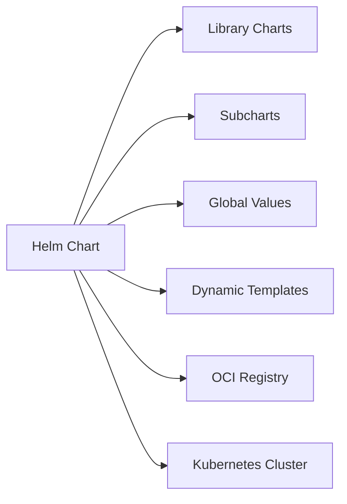

---

## Key Components

| Component | Purpose |
|-----------|----------|
| Library Charts | Share reusable templates |
| Subcharts | Package dependent applications |
| Global Values | Share configuration across charts |
| Conditional Resources | Deploy resources conditionally |
| Dynamic Templates | Generate manifests dynamically |
| Lookup Function | Read existing Kubernetes resources |
| Post Renderer | Modify rendered manifests |
| OCI Registry | Store and distribute Helm charts |
| CRDs | Extend Kubernetes APIs |

---

## Types (if applicable)

| Feature | Purpose |
|----------|---------|
| Library Charts | Template reuse |
| Subcharts | Dependencies |
| Global Values | Shared configuration |
| Conditional Resources | Optional deployments |
| Dynamic Templates | Dynamic manifest generation |
| Lookup | Query cluster resources |
| Post Renderer | Manifest customization |
| OCI Distribution | Registry-based chart storage |
| CRDs | Kubernetes API extensions |

---

## Lifecycle / Workflow

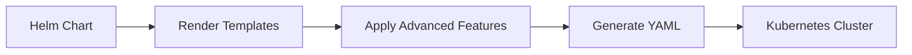

---

## Configuration / Syntax (if applicable)

Advanced features are configured inside:

- `Chart.yaml`
- `values.yaml`
- `templates/`
- `charts/`
- `crds/`

---

## Important Commands (if applicable)

```bash
helm dependency update

helm dependency build

helm package

helm push

helm pull

helm template

helm install

helm upgrade
```

---

## Important Files (if applicable)

```
Chart.yaml

values.yaml

charts/

templates/

crds/

Chart.lock
```

---

## Real-World Use Cases

- Enterprise platform engineering
- Shared Kubernetes platform
- Microservice deployments
- GitOps
- Multi-team chart repositories
- Cloud-native platforms

---

## Advantages

- Reusable components
- Better maintainability
- Flexible deployments
- Easier upgrades
- Shared configuration
- Supports enterprise deployments

---

## Limitations

- Increased complexity
- More difficult debugging
- Requires understanding Helm internals

---

## Common Interview Questions (Concept Only)

- What are Library Charts?
- What is the difference between Library Charts and Subcharts?
- What are Global Values?
- What are Conditional Resources?
- What is the Lookup function?
- What are Post Renderers?
- Why use OCI registries?
- What are CRDs?
- When should CRDs be installed?
- What are Dynamic Templates?

---

## Common Mistakes

- Duplicating reusable templates
- Misusing global values
- Hardcoding configurations
- Ignoring chart dependencies
- Storing CRDs in templates
- Forgetting dependency updates

---

## Troubleshooting

| Problem | Cause | Solution |
|----------|-------|----------|
| Missing dependency | Subchart missing | Run `helm dependency update` |
| Global values ignored | Incorrect value hierarchy | Verify values structure |
| Conditional resource missing | Condition evaluates to false | Check values file |
| OCI push failed | Authentication issue | Verify registry credentials |
| CRD installation failed | Existing CRD conflict | Install or upgrade CRDs carefully |

---

## Summary

Advanced Helm features improve chart modularity, flexibility, and scalability, making Helm suitable for large-scale enterprise Kubernetes deployments.

---

# Library Charts

## Overview

Library Charts contain **reusable template logic** but **cannot be installed directly**.

They provide common helper templates that multiple application charts can share.

> **Interview Tip**
>
> A Library Chart contains **only reusable templates** and **does not create Kubernetes resources**.

---

## Why It Is Used

- Reduce duplicate code
- Share helper templates
- Standardize deployments

---

## Architecture / Working

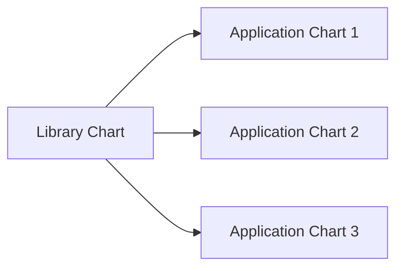

---

## Key Components

- Helper templates
- Named templates
- Shared functions

---

## Types (if applicable)

- Reusable chart

---

## Lifecycle / Workflow

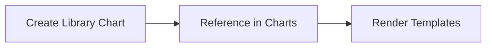

---

## Configuration / Syntax (if applicable)

Defined in `Chart.yaml`

```yaml
type: library
```

---

## Important Commands (if applicable)

```bash
helm dependency update
```

---

## Important Files (if applicable)

```
Chart.yaml

templates/
```

---

## Real-World Use Cases

- Shared labels
- Standard resource naming
- Common annotations

---

## Advantages

- Reusable
- Easy maintenance

---

## Limitations

- Cannot be installed directly

---

## Common Interview Questions (Concept Only)

- What is a Library Chart?
- Can Library Charts deploy resources?

---

## Common Mistakes

- Treating Library Charts like application charts

---

## Troubleshooting

Verify chart type is `library`.

---

## Summary

Library Charts provide reusable templates for multiple Helm charts.

---

# Subcharts

## Overview

Subcharts are Helm charts packaged as dependencies within another chart.

---

## Why It Is Used

- Modular applications
- Dependency management
- Reusable services

---

## Architecture / Working

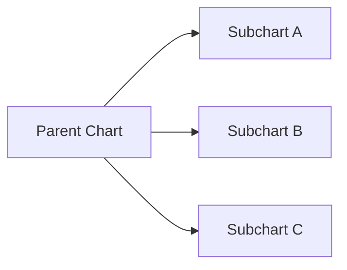

---

## Key Components

- Parent chart
- Child chart
- Dependency management

---

## Types (if applicable)

- Dependency chart

---

## Lifecycle / Workflow

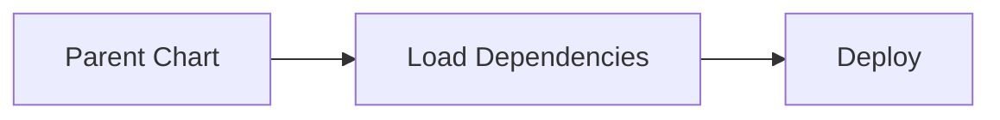

---

## Configuration / Syntax (if applicable)

Dependencies are defined in:

```
Chart.yaml
```

---

## Important Commands (if applicable)

```bash
helm dependency update
```

---

## Important Files (if applicable)

```
charts/

Chart.yaml
```

---

## Real-World Use Cases

- Database dependency
- Monitoring stack
- Logging stack

---

## Advantages

- Modular architecture

---

## Limitations

- Dependency management required

---

## Common Interview Questions (Concept Only)

- What are Subcharts?
- Difference between Library Charts and Subcharts?

---

## Common Mistakes

- Forgetting dependency updates

---

## Troubleshooting

Verify dependency versions.

---

## Summary

Subcharts package dependent applications inside parent charts.

---

# Global Values

## Overview

Global Values share configuration across parent charts and subcharts.

---

## Why It Is Used

- Shared configuration
- Reduce duplication

---

## Architecture / Working

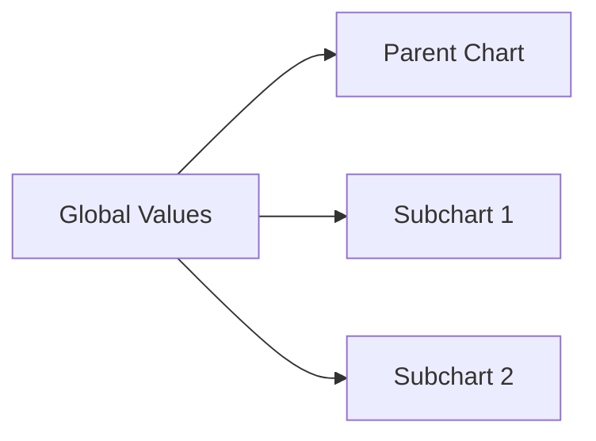

---

## Key Components

- Shared values
- Parent chart
- Subcharts

---

## Types (if applicable)

- Global configuration

---

## Lifecycle / Workflow

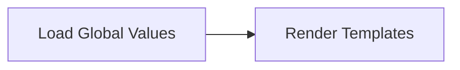

---

## Configuration / Syntax (if applicable)

Stored under:

```yaml
global:
```

---

## Important Commands (if applicable)

None.

---

## Important Files (if applicable)

```
values.yaml
```

---

## Real-World Use Cases

- Image registry
- Domain name
- Labels

---

## Advantages

- Shared configuration

---

## Limitations

- Overuse creates coupling

---

## Common Interview Questions (Concept Only)

- What are Global Values?

---

## Common Mistakes

- Excessive global configuration

---

## Troubleshooting

Verify value hierarchy.

---

## Summary

Global Values simplify configuration sharing across multiple charts.

---

# Conditional Resources

## Overview

Conditional Resources deploy Kubernetes objects only when specific conditions are true.

---

## Why It Is Used

- Optional deployments
- Feature toggles

---

## Architecture / Working

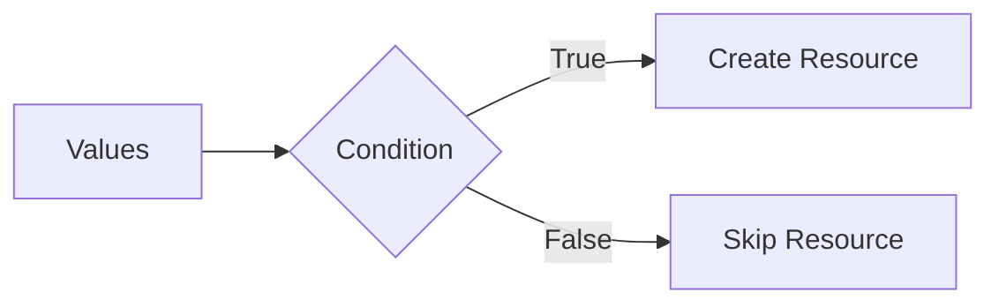

---

## Key Components

- Values
- Condition
- Template

---

## Types (if applicable)

- Optional resources

---

## Lifecycle /Workflow

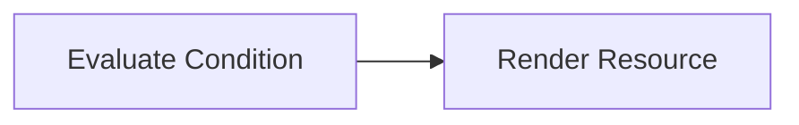

---

## Configuration / Syntax (if applicable)

Uses Helm template conditions.

---

## Important Commands (if applicable)

```bash
helm template
```

---

## Important Files (if applicable)

```
templates/
```

---

## Real-World Use Cases

- Optional Ingress
- Monitoring
- Autoscaling

---

## Advantages

- Flexible deployments

---

## Limitations

- Complex logic

---

## Common Interview Questions (Concept Only)

- Why use conditional resources?

---

## Common Mistakes

- Incorrect conditions

---

## Troubleshooting

Render templates before deployment.

---

## Summary

Conditional Resources enable optional Kubernetes objects.

---

# Dynamic Templates

## Overview

Dynamic Templates generate Kubernetes manifests using variables and template functions.

---

## Why It Is Used

- Flexible deployments
- Dynamic configuration

---

## Architecture / Working

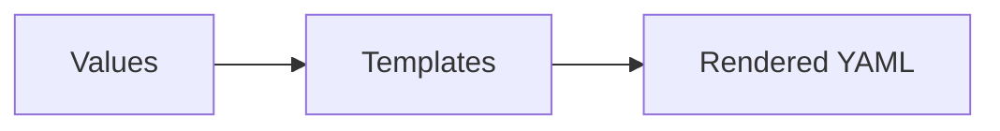

---

## Key Components

- Variables
- Functions
- Templates

---

## Types (if applicable)

- Dynamic rendering

---

## Lifecycle / Workflow

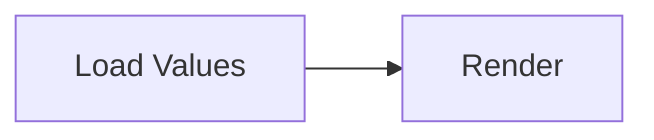

---

## Configuration / Syntax (if applicable)

Uses Go templates.

---

## Important Commands (if applicable)

```bash
helm template
```

---

## Important Files (if applicable)

```
templates/
```

---

## Real-World Use Cases

- Dynamic resource names
- Labels
- Metadata

---

## Advantages

- Flexible

---

## Limitations

- More complex debugging

---

## Common Interview Questions (Concept Only)

- What are dynamic templates?

---

## Common Mistakes

- Excessive template logic

---

## Troubleshooting

Use `helm template`.

---

## Summary

Dynamic templates make Helm charts flexible and reusable.

---

# Lookup Function

## Overview

The `lookup` function retrieves existing Kubernetes resources during template rendering.

> **Interview Tip**
>
> `lookup` queries the **live Kubernetes cluster**, unlike `.Values`, which only uses chart configuration.

---

## Why It Is Used

- Read existing resources
- Reuse cluster information

---

## Architecture / Working

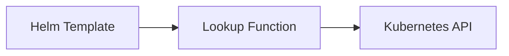

---

## Key Components

- Helm
- Kubernetes API

---

## Types (if applicable)

- Runtime lookup

---

## Lifecycle / Workflow

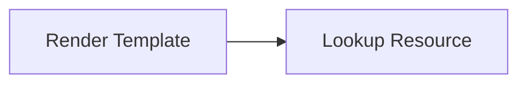

---

## Configuration / Syntax (if applicable)

Uses Helm `lookup` function.

---

## Important Commands (if applicable)

```bash
helm template
```

---

## Important Files (if applicable)

```
templates/
```

---

## Real-World Use Cases

- Existing Secrets
- Existing ConfigMaps

---

## Advantages

- Dynamic deployment

---

## Limitations

- Requires cluster access

---

## Common Interview Questions (Concept Only)

- What is the lookup function?

---

## Common Mistakes

- Using lookup during offline rendering

---

## Troubleshooting

Verify cluster connectivity.

---

## Summary

Lookup enables Helm templates to access existing Kubernetes resources.

---

# Post Renderers

## Overview

Post Renderers modify rendered Kubernetes manifests before they are applied to the cluster.

---

## Why It Is Used

- Apply custom modifications
- Integrate external tools

---

## Architecture / Working

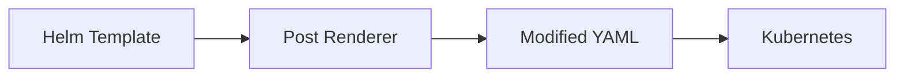

---

## Key Components

- Helm
- Renderer
- Kubernetes

---

## Types (if applicable)

- Manifest modification

---

## Lifecycle / Workflow

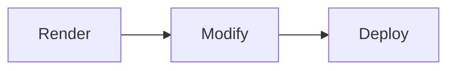

---

## Configuration / Syntax (if applicable)

Configured using Helm CLI.

---

## Important Commands (if applicable)

```bash
helm install --post-renderer
```

---

## Important Files (if applicable)

External renderer script.

---

## Real-World Use Cases

- Policy injection
- Label addition

---

## Advantages

- Flexible customization

---

## Limitations

- More deployment complexity

---

## Common Interview Questions (Concept Only)

- What is a post renderer?

---

## Common Mistakes

- Overusing custom renderers

---

## Troubleshooting

Verify rendered manifests.

---

## Summary

Post Renderers customize Kubernetes manifests before deployment.

---

# OCI-Based Chart Distribution

## Overview

OCI (Open Container Initiative) registries allow Helm charts to be stored and distributed like container images.

Common registries:

- Azure Container Registry (ACR)
- Amazon Elastic Container Registry (ECR)
- Google Artifact Registry
- Harbor

---

## Why It Is Used

- Secure chart storage
- Versioned distribution
- Enterprise registry support

---

## Architecture / Working

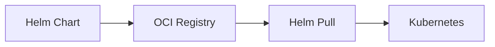

---

## Key Components

- OCI Registry
- Helm
- Chart

---

## Types (if applicable)

- Registry-based distribution

---

## Lifecycle / Workflow

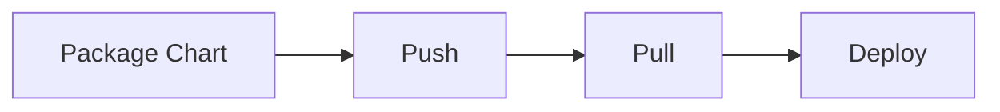

---

## Configuration / Syntax (if applicable)

OCI registry URLs are used instead of traditional chart repositories.

---

## Important Commands (if applicable)

```bash
helm push

helm pull
```

---

## Important Files (if applicable)

Packaged `.tgz` chart.

---

## Real-World Use Cases

- Enterprise registries
- Secure distribution

---

## Advantages

- Unified registry
- Better security

---

## Limitations

- Registry authentication required

---

## Common Interview Questions (Concept Only)

- What is OCI support in Helm?

---

## Common Mistakes

- Incorrect registry authentication

---

## Troubleshooting

Verify registry credentials.

---

## Summary

OCI enables secure enterprise chart storage and distribution.

---

# Custom Resource Definitions (CRDs)

## Overview

CRDs extend Kubernetes with custom resource types.

Helm supports installing CRDs stored in the `crds/` directory.

---

## Why It Is Used

- Extend Kubernetes APIs
- Install operators
- Support custom resources

---

## Architecture / Working

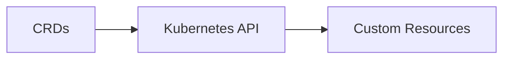

---

## Key Components

- CRDs
- Kubernetes API
- Custom Resources

---

## Types (if applicable)

- Cluster-wide resources

---

## Lifecycle / Workflow

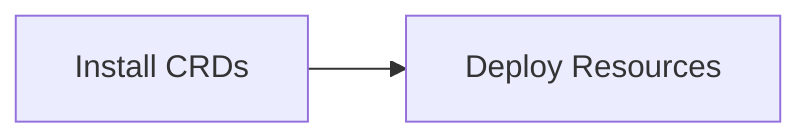

---

## Configuration / Syntax (if applicable)

CRDs are stored in:

```
crds/
```

---

## Important Commands (if applicable)

```bash
helm install
```

---

## Important Files (if applicable)

```
crds/
```

---

## Real-World Use Cases

- Prometheus Operator
- Cert-Manager
- Argo CD
- Istio

---

## Advantages

- Extend Kubernetes functionality

---

## Limitations

- CRD upgrades require careful planning

---

## Common Interview Questions (Concept Only)

- What are CRDs?
- Why are CRDs stored in the `crds/` directory?
- Does Helm upgrade CRDs automatically?

---

## Common Mistakes

- Treating CRDs as normal resources
- Expecting Helm to fully manage CRD upgrades

---

## Troubleshooting

Verify CRD installation before deploying dependent resources.

---

## Summary

CRDs extend Kubernetes with custom APIs and should be managed carefully during Helm installations and upgrades.

---

# Interview Quick Revision

## Advanced Helm Features Overview

```mermaid
flowchart LR

A[Advanced Helm Features]
A --> B[Library Charts]
A --> C[Subcharts]
A --> D[Global Values]
A --> E[Conditional Resources]
A --> F[Dynamic Templates]
A --> G[Lookup Function]
A --> H[Post Renderers]
A --> I[OCI Registry]
A --> J[CRDs]
```

---

## Library Charts vs Subcharts

| Feature | Library Charts | Subcharts |
|---------|----------------|-----------|
| Deploy Kubernetes Resources | ❌ No | ✅ Yes |
| Reusable Templates | ✅ Yes | Limited |
| Installed Independently | ❌ No | Usually as a dependency |
| Purpose | Share template logic | Package dependent applications |

---

## OCI vs Traditional Chart Repository

| Traditional Repository | OCI Registry |
|------------------------|--------------|
| index.yaml | OCI artifact index |
| HTTP server | Container registry |
| Helm repository | OCI registry (ACR, ECR, Harbor, etc.) |
| Separate infrastructure | Shared with container images |

---

## Production Best Practices

- Use Library Charts for reusable template logic.
- Use Subcharts to manage application dependencies.
- Keep Global Values limited to truly shared configuration.
- Use Conditional Resources for optional Kubernetes objects.
- Avoid excessive template logic in Dynamic Templates.
- Use the `lookup` function only when cluster information is required.
- Validate Post Renderer output before deployment.
- Store charts in OCI registries for enterprise environments.
- Install CRDs before deploying dependent custom resources.
- Test advanced chart behavior in a staging environment before production.

---

## One-line Interview Answer

**Advanced Helm features such as Library Charts, Subcharts, Global Values, Conditional Resources, Dynamic Templates, Lookup Functions, Post Renderers, OCI registries, and CRDs enable modular, reusable, secure, and enterprise-ready Kubernetes deployments while improving chart maintainability and deployment flexibility.**
